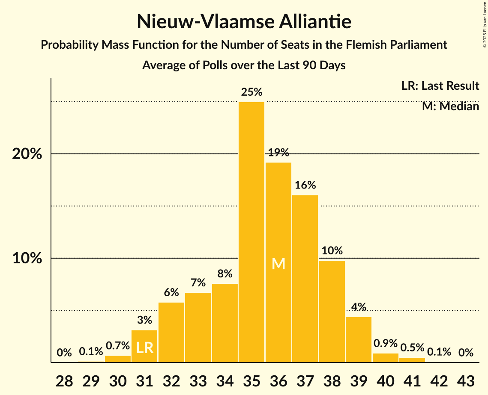

# Poll Average

<a href="#voting-intentions">Voting Intentions</a> | <a href="#seats">Seats</a> | <a href="#coalitions">Coalitions</a> | <a href="#technical-information">Technical Information</a>

## Summary

The table below lists the polls on which the average is based. They are the most recent polls (less than 90 days old) registered and analyzed so far.

| Period     | Polling firm/Commissioner(s) | N-VA | VB | CD&V | VLD | VOORUIT | GROEN | PVDA |
|:----------:|:----------------------------:|:--:|:--:|:--:|:--:|:--:|:--:|:--:|
| 26 May 2019 | General Election | 24.8%   35 | 18.5%   23 | 15.4%   19 | 13.1%   16 | 10.1%   12 | 10.1%   14 | 5.3%   4 |
| N/A | Poll Average | 18–25%   24–33 | 22–28%   27–37 | 8–14%   8–17 | 8–15%   8–19 | 13–18%   16–25 | 6–13%   6–18 | 4–10%   1–12 |
| [20–27 March 2023](2023-03-27-Ipsos.html) | Ipsos   Het Laatste Nieuws, Le Soir, RTL TVi and VTM | 19–24%   26–33 | 22–28%   29–37 | 10–14%   11–17 | 8–11%   8–13 | 13–18%   17–25 | 6–9%   5–13 | 6–10%   6–13 |
| [16–29 January 2023](2023-01-29-Kantar.html) | Kantar   La Libre Belgique and RTBf | 18–25%   22–33 | 21–29%   26–38 | 7–12%   6–14 | 10–15%   11–19 | 12–19%   15–25 | 8–13%   10–19 | 4–8%   0–8 |
| 26 May 2019 | General Election | 24.8%   35 | 18.5%   23 | 15.4%   19 | 13.1%   16 | 10.1%   12 | 10.1%   14 | 5.3%   4 |

Only polls for which at least the sample size has been published are included in the table above.

**Legend:**
+ **Top half of each row:** Voting intentions (95% confidence interval)
+ **Bottom half of each row:** Seat projections for the Flemish Parliament (95% confidence interval)
+ **N-VA:** Nieuw-Vlaamse Alliantie
+ **VB:** Vlaams Belang
+ **CD&V:** Christen-Democratisch en Vlaams
+ **VLD:** Open Vlaamse Liberalen en Democraten
+ **VOORUIT:** Vooruit
+ **GROEN:** Groen
+ **PVDA:** Partij van de Arbeid van België
+ **N/A (single party):** Party not included the published results
+ **N/A (entire row):** Calculation for this opinion poll not started yet

## Voting Intentions

### Confidence Intervals

| Party | Last Result | Median | 80% Confidence Interval | 90% Confidence Interval | 95% Confidence Interval | 99% Confidence Interval |
|:-----:|:-----------:|:------:|:-----------------------:|:-----------------------:|:-----------------------:|:-----------------------:|
| <a href="#nieuw-vlaamse-alliantie">Nieuw-Vlaamse Alliantie</a> | 24.8% | 21.6% | 19.6–23.6% |19.0–24.2% | 18.5–24.8% | 17.5–25.9% |
| <a href="#vlaams-belang">Vlaams Belang</a> | 18.5% | 24.9% | 22.8–27.0% |22.2–27.7% | 21.7–28.2% | 20.5–29.4% |
| <a href="#christen-democratisch-en-vlaams">Christen-Democratisch en Vlaams</a> | 15.4% | 10.9% | 8.6–12.8% |8.1–13.2% | 7.6–13.6% | 6.9–14.4% |
| <a href="#open-vlaamse-liberalen-en-democraten">Open Vlaamse Liberalen en Democraten</a> | 13.1% | 10.4% | 8.5–13.4% |8.1–14.1% | 7.8–14.7% | 7.3–15.8% |
| <a href="#vooruit">Vooruit</a> | 10.1% | 15.4% | 13.7–17.2% |13.2–17.7% | 12.7–18.2% | 11.8–19.3% |
| <a href="#groen">Groen</a> | 10.1% | 8.6% | 6.8–11.6% |6.4–12.2% | 6.2–12.8% | 5.7–13.8% |
| <a href="#partij-van-de-arbeid-van-belgië">Partij van de Arbeid van België</a> | 5.3% | 7.1% | 4.9–8.8% |4.5–9.2% | 4.2–9.5% | 3.7–10.2% |

### Nieuw-Vlaamse Alliantie

*For a full overview of the results for this party, see the [Nieuw-Vlaamse Alliantie](party-nieuw-vlaamsealliantie.html) page.*

| Voting Intentions | Probability | Accumulated | Special Marks |
|:-----------------:|:-----------:|:-----------:|:-------------:|
| 14.5–15.5% | 0% | 100% |  |
| 15.5–16.5% | 0.1% | 100% |  |
| 16.5–17.5% | 0.5% | 99.9% |  |
| 17.5–18.5% | 2% | 99.4% |  |
| 18.5–19.5% | 7% | 97% |  |
| 19.5–20.5% | 16% | 91% |  |
| 20.5–21.5% | 25% | 75% |  |
| 21.5–22.5% | 25% | 50% | Median |
| 22.5–23.5% | 16% | 26% |  |
| 23.5–24.5% | 7% | 10% |  |
| 24.5–25.5% | 2% | 3% | Last Result |
| 25.5–26.5% | 0.7% | 0.9% |  |
| 26.5–27.5% | 0.2% | 0.2% |  |
| 27.5–28.5% | 0% | 0% |  |

### Vlaams Belang

*For a full overview of the results for this party, see the [Vlaams Belang](party-vlaamsbelang.html) page.*

| Voting Intentions | Probability | Accumulated | Special Marks |
|:-----------------:|:-----------:|:-----------:|:-------------:|
| 17.5–18.5% | 0% | 100% |  |
| 18.5–19.5% | 0.1% | 100% | Last Result |
| 19.5–20.5% | 0.4% | 99.9% |  |
| 20.5–21.5% | 2% | 99.5% |  |
| 21.5–22.5% | 5% | 98% |  |
| 22.5–23.5% | 12% | 93% |  |
| 23.5–24.5% | 21% | 80% |  |
| 24.5–25.5% | 24% | 59% | Median |
| 25.5–26.5% | 19% | 35% |  |
| 26.5–27.5% | 10% | 16% |  |
| 27.5–28.5% | 4% | 6% |  |
| 28.5–29.5% | 1.2% | 2% |  |
| 29.5–30.5% | 0.3% | 0.4% |  |
| 30.5–31.5% | 0.1% | 0.1% |  |
| 31.5–32.5% | 0% | 0% |  |

### Christen-Democratisch en Vlaams

*For a full overview of the results for this party, see the [Christen-Democratisch en Vlaams](party-christen-democratischenvlaams.html) page.*

| Voting Intentions | Probability | Accumulated | Special Marks |
|:-----------------:|:-----------:|:-----------:|:-------------:|
| 4.5–5.5% | 0% | 100% |  |
| 5.5–6.5% | 0.2% | 100% |  |
| 6.5–7.5% | 2% | 99.8% |  |
| 7.5–8.5% | 8% | 98% |  |
| 8.5–9.5% | 15% | 90% |  |
| 9.5–10.5% | 18% | 76% |  |
| 10.5–11.5% | 23% | 58% | Median |
| 11.5–12.5% | 21% | 35% |  |
| 12.5–13.5% | 11% | 14% |  |
| 13.5–14.5% | 3% | 3% |  |
| 14.5–15.5% | 0.3% | 0.3% | Last Result |
| 15.5–16.5% | 0% | 0% |  |

### Open Vlaamse Liberalen en Democraten

*For a full overview of the results for this party, see the [Open Vlaamse Liberalen en Democraten](party-openvlaamseliberalenendemocraten.html) page.*

| Voting Intentions | Probability | Accumulated | Special Marks |
|:-----------------:|:-----------:|:-----------:|:-------------:|
| 5.5–6.5% | 0% | 100% |  |
| 6.5–7.5% | 1.2% | 100% |  |
| 7.5–8.5% | 10% | 98.8% |  |
| 8.5–9.5% | 22% | 89% |  |
| 9.5–10.5% | 19% | 67% | Median |
| 10.5–11.5% | 15% | 48% |  |
| 11.5–12.5% | 14% | 34% |  |
| 12.5–13.5% | 11% | 20% | Last Result |
| 13.5–14.5% | 6% | 9% |  |
| 14.5–15.5% | 2% | 3% |  |
| 15.5–16.5% | 0.6% | 0.7% |  |
| 16.5–17.5% | 0.1% | 0.1% |  |
| 17.5–18.5% | 0% | 0% |  |

### Vooruit

*For a full overview of the results for this party, see the [Vooruit](party-vooruit.html) page.*

| Voting Intentions | Probability | Accumulated | Special Marks |
|:-----------------:|:-----------:|:-----------:|:-------------:|
| 9.5–10.5% | 0% | 100% | Last Result |
| 10.5–11.5% | 0.3% | 100% |  |
| 11.5–12.5% | 2% | 99.7% |  |
| 12.5–13.5% | 6% | 98% |  |
| 13.5–14.5% | 17% | 92% |  |
| 14.5–15.5% | 28% | 74% | Median |
| 15.5–16.5% | 26% | 46% |  |
| 16.5–17.5% | 14% | 20% |  |
| 17.5–18.5% | 5% | 6% |  |
| 18.5–19.5% | 1.2% | 2% |  |
| 19.5–20.5% | 0.3% | 0.3% |  |
| 20.5–21.5% | 0% | 0.1% |  |
| 21.5–22.5% | 0% | 0% |  |

### Groen

*For a full overview of the results for this party, see the [Groen](party-groen.html) page.*

| Voting Intentions | Probability | Accumulated | Special Marks |
|:-----------------:|:-----------:|:-----------:|:-------------:|
| 3.5–4.5% | 0% | 100% |  |
| 4.5–5.5% | 0.3% | 100% |  |
| 5.5–6.5% | 6% | 99.7% |  |
| 6.5–7.5% | 21% | 94% |  |
| 7.5–8.5% | 21% | 72% |  |
| 8.5–9.5% | 14% | 52% | Median |
| 9.5–10.5% | 15% | 38% | Last Result |
| 10.5–11.5% | 13% | 23% |  |
| 11.5–12.5% | 7% | 10% |  |
| 12.5–13.5% | 3% | 3% |  |
| 13.5–14.5% | 0.6% | 0.8% |  |
| 14.5–15.5% | 0.1% | 0.1% |  |
| 15.5–16.5% | 0% | 0% |  |

### Partij van de Arbeid van België

*For a full overview of the results for this party, see the [Partij van de Arbeid van België](party-partijvandearbeidvanbelgië.html) page.*

| Voting Intentions | Probability | Accumulated | Special Marks |
|:-----------------:|:-----------:|:-----------:|:-------------:|
| 1.5–2.5% | 0% | 100% |  |
| 2.5–3.5% | 0.3% | 100% |  |
| 3.5–4.5% | 5% | 99.7% |  |
| 4.5–5.5% | 16% | 95% | Last Result |
| 5.5–6.5% | 19% | 79% |  |
| 6.5–7.5% | 21% | 60% | Median |
| 7.5–8.5% | 24% | 39% |  |
| 8.5–9.5% | 12% | 15% |  |
| 9.5–10.5% | 2% | 2% |  |
| 10.5–11.5% | 0.2% | 0.2% |  |
| 11.5–12.5% | 0% | 0% |  |

## Seats

### Confidence Intervals

| Party | Last Result | Median | 80% Confidence Interval | 90% Confidence Interval | 95% Confidence Interval | 99% Confidence Interval |
|:-----:|:-----------:|:------:|:-----------------------:|:-----------------------:|:-----------------------:|:-----------------------:|
| <a href="#nieuw-vlaamse-alliantie">Nieuw-Vlaamse Alliantie</a> | 35 | 29 | 26–31 |25–32 | 24–33 | 22–35 |
| <a href="#vlaams-belang">Vlaams Belang</a> | 23 | 33 | 29–36 |29–37 | 27–37 | 25–39 |
| <a href="#christen-democratisch-en-vlaams">Christen-Democratisch en Vlaams</a> | 19 | 12 | 10–15 |9–16 | 8–17 | 5–17 |
| <a href="#open-vlaamse-liberalen-en-democraten">Open Vlaamse Liberalen en Democraten</a> | 16 | 12 | 10–17 |9–19 | 8–19 | 8–19 |
| <a href="#vooruit">Vooruit</a> | 12 | 19 | 17–23 |16–25 | 16–25 | 14–25 |
| <a href="#groen">Groen</a> | 14 | 11 | 7–15 |7–16 | 6–18 | 5–19 |
| <a href="#partij-van-de-arbeid-van-belgië">Partij van de Arbeid van België</a> | 4 | 7 | 2–11 |2–11 | 1–12 | 0–13 |

### Nieuw-Vlaamse Alliantie

*For a full overview of the results for this party, see the [Nieuw-Vlaamse Alliantie](party-nieuw-vlaamsealliantie.html) page.*

| Number of Seats | Probability | Accumulated | Special Marks |
|:---------------:|:-----------:|:-----------:|:-------------:|
| 21 | 0.1% | 100% |  |
| 22 | 1.2% | 99.8% |  |
| 23 | 0.9% | 98.7% |  |
| 24 | 1.5% | 98% |  |
| 25 | 2% | 96% |  |
| 26 | 12% | 94% |  |
| 27 | 15% | 82% |  |
| 28 | 15% | 67% |  |
| 29 | 12% | 52% | Median |
| 30 | 22% | 39% |  |
| 31 | 9% | 17% |  |
| 32 | 5% | 9% |  |
| 33 | 2% | 4% |  |
| 34 | 1.3% | 2% |  |
| 35 | 0.3% | 0.7% | Last Result |
| 36 | 0.2% | 0.3% |  |
| 37 | 0.1% | 0.1% |  |
| 38 | 0% | 0% |  |

### Vlaams Belang

*For a full overview of the results for this party, see the [Vlaams Belang](party-vlaamsbelang.html) page.*

| Number of Seats | Probability | Accumulated | Special Marks |
|:---------------:|:-----------:|:-----------:|:-------------:|
| 23 | 0% | 100% | Last Result |
| 24 | 0.1% | 100% |  |
| 25 | 0.7% | 99.8% |  |
| 26 | 0.7% | 99.2% |  |
| 27 | 1.3% | 98% |  |
| 28 | 2% | 97% |  |
| 29 | 7% | 95% |  |
| 30 | 9% | 88% |  |
| 31 | 13% | 80% |  |
| 32 | 14% | 67% |  |
| 33 | 19% | 52% | Median |
| 34 | 12% | 33% |  |
| 35 | 10% | 21% |  |
| 36 | 5% | 11% |  |
| 37 | 4% | 6% |  |
| 38 | 1.4% | 2% |  |
| 39 | 0.3% | 0.6% |  |
| 40 | 0.1% | 0.3% |  |
| 41 | 0.1% | 0.1% |  |
| 42 | 0% | 0% |  |

### Christen-Democratisch en Vlaams

*For a full overview of the results for this party, see the [Christen-Democratisch en Vlaams](party-christen-democratischenvlaams.html) page.*

| Number of Seats | Probability | Accumulated | Special Marks |
|:---------------:|:-----------:|:-----------:|:-------------:|
| 5 | 0.6% | 100% |  |
| 6 | 0.9% | 99.4% |  |
| 7 | 0.8% | 98.5% |  |
| 8 | 2% | 98% |  |
| 9 | 5% | 96% |  |
| 10 | 7% | 91% |  |
| 11 | 29% | 84% |  |
| 12 | 10% | 55% | Median |
| 13 | 7% | 46% |  |
| 14 | 23% | 38% |  |
| 15 | 6% | 15% |  |
| 16 | 7% | 10% |  |
| 17 | 3% | 3% |  |
| 18 | 0.3% | 0.4% |  |
| 19 | 0.1% | 0.2% | Last Result |
| 20 | 0% | 0% |  |

### Open Vlaamse Liberalen en Democraten

*For a full overview of the results for this party, see the [Open Vlaamse Liberalen en Democraten](party-openvlaamseliberalenendemocraten.html) page.*

| Number of Seats | Probability | Accumulated | Special Marks |
|:---------------:|:-----------:|:-----------:|:-------------:|
| 7 | 0.1% | 100% |  |
| 8 | 4% | 99.8% |  |
| 9 | 6% | 96% |  |
| 10 | 11% | 91% |  |
| 11 | 15% | 80% |  |
| 12 | 18% | 65% | Median |
| 13 | 7% | 47% |  |
| 14 | 10% | 40% |  |
| 15 | 10% | 30% |  |
| 16 | 6% | 20% | Last Result |
| 17 | 7% | 15% |  |
| 18 | 2% | 8% |  |
| 19 | 5% | 6% |  |
| 20 | 0.2% | 0.4% |  |
| 21 | 0.1% | 0.2% |  |
| 22 | 0% | 0.1% |  |
| 23 | 0% | 0.1% |  |
| 24 | 0% | 0% |  |

### Vooruit

*For a full overview of the results for this party, see the [Vooruit](party-vooruit.html) page.*

| Number of Seats | Probability | Accumulated | Special Marks |
|:---------------:|:-----------:|:-----------:|:-------------:|
| 12 | 0% | 100% | Last Result |
| 13 | 0% | 100% |  |
| 14 | 0.8% | 99.9% |  |
| 15 | 1.3% | 99.1% |  |
| 16 | 4% | 98% |  |
| 17 | 7% | 94% |  |
| 18 | 10% | 87% |  |
| 19 | 37% | 77% | Median |
| 20 | 13% | 39% |  |
| 21 | 8% | 26% |  |
| 22 | 3% | 18% |  |
| 23 | 5% | 15% |  |
| 24 | 4% | 10% |  |
| 25 | 6% | 6% |  |
| 26 | 0.2% | 0.3% |  |
| 27 | 0.1% | 0.1% |  |
| 28 | 0% | 0.1% |  |
| 29 | 0% | 0% |  |

### Groen

*For a full overview of the results for this party, see the [Groen](party-groen.html) page.*

| Number of Seats | Probability | Accumulated | Special Marks |
|:---------------:|:-----------:|:-----------:|:-------------:|
| 5 | 2% | 100% |  |
| 6 | 2% | 98% |  |
| 7 | 10% | 96% |  |
| 8 | 4% | 85% |  |
| 9 | 8% | 81% |  |
| 10 | 10% | 73% |  |
| 11 | 23% | 64% | Median |
| 12 | 4% | 41% |  |
| 13 | 5% | 37% |  |
| 14 | 19% | 32% | Last Result |
| 15 | 5% | 13% |  |
| 16 | 3% | 7% |  |
| 17 | 1.4% | 4% |  |
| 18 | 1.3% | 3% |  |
| 19 | 2% | 2% |  |
| 20 | 0.1% | 0.1% |  |
| 21 | 0% | 0% |  |

### Partij van de Arbeid van België

*For a full overview of the results for this party, see the [Partij van de Arbeid van België](party-partijvandearbeidvanbelgië.html) page.*

| Number of Seats | Probability | Accumulated | Special Marks |
|:---------------:|:-----------:|:-----------:|:-------------:|
| 0 | 2% | 100% |  |
| 1 | 2% | 98% |  |
| 2 | 7% | 97% |  |
| 3 | 2% | 90% |  |
| 4 | 14% | 88% | Last Result |
| 5 | 12% | 74% |  |
| 6 | 3% | 62% |  |
| 7 | 27% | 59% | Median |
| 8 | 14% | 33% |  |
| 9 | 4% | 19% |  |
| 10 | 4% | 14% |  |
| 11 | 8% | 11% |  |
| 12 | 2% | 3% |  |
| 13 | 1.5% | 2% |  |
| 14 | 0.1% | 0.1% |  |
| 15 | 0% | 0% |  |

## Coalitions

### Confidence Intervals

| Coalition | Last Result | Median | Majority? | 80% Confidence Interval | 90% Confidence Interval | 95% Confidence Interval | 99% Confidence Interval |
|:---------:|:-----------:|:------:|:---------:|:-----------------------:|:-----------------------:|:-----------------------:|:-----------------------:|
| Nieuw-Vlaamse Alliantie – Christen-Democratisch en Vlaams – Open Vlaamse Liberalen en Democraten – Vooruit | 82 | 73 | 100% | 70–77 | 69–79 | 68–80 | 66–82 |
| Nieuw-Vlaamse Alliantie – Vlaams Belang – Christen-Democratisch en Vlaams | 77 | 74 | 99.7% | 68–78 | 67–79 | 65–79 | 63–80 |
| Nieuw-Vlaamse Alliantie – Open Vlaamse Liberalen en Democraten – Vooruit | 63 | 61 | 33% | 57–66 | 56–67 | 56–68 | 53–71 |
| Nieuw-Vlaamse Alliantie – Christen-Democratisch en Vlaams – Vooruit | 66 | 61 | 30% | 56–65 | 54–66 | 53–67 | 51–69 |
| Nieuw-Vlaamse Alliantie – Vlaams Belang | 58 | 61 | 33% | 57–65 | 56–66 | 55–66 | 52–68 |
| Christen-Democratisch en Vlaams – Open Vlaamse Liberalen en Democraten – Vooruit – Groen | 61 | 56 | 9% | 51–62 | 50–64 | 50–65 | 48–67 |
| Nieuw-Vlaamse Alliantie – Christen-Democratisch en Vlaams – Open Vlaamse Liberalen en Democraten | 70 | 54 | 0.3% | 50–58 | 49–59 | 48–60 | 47–62 |
| Christen-Democratisch en Vlaams – Vooruit – Groen – Partij van de Arbeid van België | 49 | 50 | 0% | 45–54 | 44–55 | 43–56 | 41–58 |
| Open Vlaamse Liberalen en Democraten – Vooruit – Groen | 42 | 44 | 0% | 37–51 | 36–53 | 36–54 | 34–57 |
| Christen-Democratisch en Vlaams – Open Vlaamse Liberalen en Democraten – Vooruit | 47 | 45 | 0% | 42–49 | 41–50 | 40–51 | 38–53 |
| Christen-Democratisch en Vlaams – Vooruit – Groen | 45 | 44 | 0% | 40–47 | 39–49 | 38–50 | 36–52 |
| Nieuw-Vlaamse Alliantie – Open Vlaamse Liberalen en Democraten | 51 | 41 | 0% | 37–46 | 37–47 | 36–48 | 34–51 |
| Nieuw-Vlaamse Alliantie – Christen-Democratisch en Vlaams | 54 | 41 | 0% | 37–45 | 35–46 | 34–47 | 32–49 |
| Christen-Democratisch en Vlaams – Open Vlaamse Liberalen en Democraten – Groen | 49 | 37 | 0% | 31–42 | 31–44 | 30–45 | 28–47 |
| Open Vlaamse Liberalen en Democraten – Vooruit | 28 | 32 | 0% | 29–37 | 28–39 | 28–40 | 26–43 |
| Christen-Democratisch en Vlaams – Vooruit | 31 | 32 | 0% | 28–36 | 27–37 | 26–38 | 24–40 |
| Christen-Democratisch en Vlaams – Open Vlaamse Liberalen en Democraten | 35 | 25 | 0% | 22–29 | 22–30 | 20–31 | 19–32 |

### Nieuw-Vlaamse Alliantie – Christen-Democratisch en Vlaams – Open Vlaamse Liberalen en Democraten – Vooruit

| Number of Seats | Probability | Accumulated | Special Marks |
|:---------------:|:-----------:|:-----------:|:-------------:|
| 64 | 0.1% | 100% |  |
| 65 | 0.3% | 99.9% |  |
| 66 | 0.7% | 99.6% |  |
| 67 | 0.8% | 98.9% |  |
| 68 | 2% | 98% |  |
| 69 | 3% | 96% |  |
| 70 | 7% | 93% |  |
| 71 | 10% | 86% |  |
| 72 | 10% | 75% | Median |
| 73 | 16% | 65% |  |
| 74 | 11% | 49% |  |
| 75 | 11% | 38% |  |
| 76 | 10% | 26% |  |
| 77 | 7% | 16% |  |
| 78 | 4% | 9% |  |
| 79 | 3% | 5% |  |
| 80 | 1.4% | 3% |  |
| 81 | 0.7% | 1.4% |  |
| 82 | 0.4% | 0.7% | Last Result |
| 83 | 0.1% | 0.2% |  |
| 84 | 0% | 0.1% |  |
| 85 | 0% | 0.1% |  |
| 86 | 0% | 0% |  |

### Nieuw-Vlaamse Alliantie – Vlaams Belang – Christen-Democratisch en Vlaams

| Number of Seats | Probability | Accumulated | Special Marks |
|:---------------:|:-----------:|:-----------:|:-------------:|
| 61 | 0.1% | 100% |  |
| 62 | 0.2% | 99.9% |  |
| 63 | 0.4% | 99.7% | Majority |
| 64 | 0.5% | 99.2% |  |
| 65 | 1.3% | 98.7% |  |
| 66 | 2% | 97% |  |
| 67 | 3% | 95% |  |
| 68 | 3% | 93% |  |
| 69 | 4% | 89% |  |
| 70 | 6% | 85% |  |
| 71 | 7% | 78% |  |
| 72 | 8% | 71% |  |
| 73 | 10% | 63% |  |
| 74 | 9% | 53% | Median |
| 75 | 11% | 44% |  |
| 76 | 8% | 33% |  |
| 77 | 12% | 24% | Last Result |
| 78 | 5% | 12% |  |
| 79 | 5% | 7% |  |
| 80 | 2% | 2% |  |
| 81 | 0.2% | 0.4% |  |
| 82 | 0.1% | 0.2% |  |
| 83 | 0% | 0% |  |

### Nieuw-Vlaamse Alliantie – Open Vlaamse Liberalen en Democraten – Vooruit

| Number of Seats | Probability | Accumulated | Special Marks |
|:---------------:|:-----------:|:-----------:|:-------------:|
| 52 | 0.3% | 100% |  |
| 53 | 0.2% | 99.7% |  |
| 54 | 0.7% | 99.5% |  |
| 55 | 1.1% | 98.8% |  |
| 56 | 5% | 98% |  |
| 57 | 6% | 93% |  |
| 58 | 8% | 87% |  |
| 59 | 12% | 79% |  |
| 60 | 9% | 66% | Median |
| 61 | 11% | 57% |  |
| 62 | 13% | 46% |  |
| 63 | 9% | 33% | Last Result, Majority |
| 64 | 6% | 24% |  |
| 65 | 7% | 19% |  |
| 66 | 5% | 12% |  |
| 67 | 3% | 7% |  |
| 68 | 2% | 4% |  |
| 69 | 1.0% | 2% |  |
| 70 | 0.6% | 1.3% |  |
| 71 | 0.4% | 0.7% |  |
| 72 | 0.2% | 0.3% |  |
| 73 | 0.1% | 0.1% |  |
| 74 | 0% | 0.1% |  |
| 75 | 0% | 0% |  |

### Nieuw-Vlaamse Alliantie – Christen-Democratisch en Vlaams – Vooruit

| Number of Seats | Probability | Accumulated | Special Marks |
|:---------------:|:-----------:|:-----------:|:-------------:|
| 48 | 0% | 100% |  |
| 49 | 0.1% | 99.9% |  |
| 50 | 0.2% | 99.9% |  |
| 51 | 0.4% | 99.6% |  |
| 52 | 1.0% | 99.2% |  |
| 53 | 1.4% | 98% |  |
| 54 | 2% | 97% |  |
| 55 | 3% | 95% |  |
| 56 | 5% | 92% |  |
| 57 | 7% | 86% |  |
| 58 | 7% | 80% |  |
| 59 | 8% | 72% |  |
| 60 | 10% | 64% | Median |
| 61 | 12% | 54% |  |
| 62 | 12% | 42% |  |
| 63 | 6% | 30% | Majority |
| 64 | 8% | 24% |  |
| 65 | 8% | 16% |  |
| 66 | 3% | 8% | Last Result |
| 67 | 3% | 5% |  |
| 68 | 0.9% | 2% |  |
| 69 | 0.8% | 1.1% |  |
| 70 | 0.3% | 0.3% |  |
| 71 | 0.1% | 0.1% |  |
| 72 | 0% | 0% |  |

### Nieuw-Vlaamse Alliantie – Vlaams Belang

| Number of Seats | Probability | Accumulated | Special Marks |
|:---------------:|:-----------:|:-----------:|:-------------:|
| 50 | 0% | 100% |  |
| 51 | 0.2% | 99.9% |  |
| 52 | 0.3% | 99.8% |  |
| 53 | 0.6% | 99.4% |  |
| 54 | 1.0% | 98.8% |  |
| 55 | 3% | 98% |  |
| 56 | 3% | 95% |  |
| 57 | 4% | 92% |  |
| 58 | 5% | 88% | Last Result |
| 59 | 9% | 83% |  |
| 60 | 14% | 74% |  |
| 61 | 17% | 61% |  |
| 62 | 12% | 44% | Median |
| 63 | 11% | 33% | Majority |
| 64 | 9% | 22% |  |
| 65 | 7% | 13% |  |
| 66 | 4% | 6% |  |
| 67 | 1.1% | 2% |  |
| 68 | 0.7% | 1.0% |  |
| 69 | 0.2% | 0.4% |  |
| 70 | 0.1% | 0.1% |  |
| 71 | 0% | 0.1% |  |
| 72 | 0% | 0% |  |

### Christen-Democratisch en Vlaams – Open Vlaamse Liberalen en Democraten – Vooruit – Groen

| Number of Seats | Probability | Accumulated | Special Marks |
|:---------------:|:-----------:|:-----------:|:-------------:|
| 46 | 0% | 100% |  |
| 47 | 0.2% | 99.9% |  |
| 48 | 0.6% | 99.7% |  |
| 49 | 1.1% | 99.0% |  |
| 50 | 5% | 98% |  |
| 51 | 7% | 93% |  |
| 52 | 4% | 86% |  |
| 53 | 9% | 82% |  |
| 54 | 7% | 73% | Median |
| 55 | 11% | 66% |  |
| 56 | 10% | 55% |  |
| 57 | 8% | 45% |  |
| 58 | 6% | 37% |  |
| 59 | 7% | 31% |  |
| 60 | 7% | 24% |  |
| 61 | 4% | 17% | Last Result |
| 62 | 4% | 13% |  |
| 63 | 3% | 9% | Majority |
| 64 | 2% | 6% |  |
| 65 | 2% | 4% |  |
| 66 | 0.8% | 2% |  |
| 67 | 0.5% | 0.9% |  |
| 68 | 0.2% | 0.4% |  |
| 69 | 0.2% | 0.2% |  |
| 70 | 0.1% | 0.1% |  |
| 71 | 0% | 0% |  |

### Nieuw-Vlaamse Alliantie – Christen-Democratisch en Vlaams – Open Vlaamse Liberalen en Democraten

| Number of Seats | Probability | Accumulated | Special Marks |
|:---------------:|:-----------:|:-----------:|:-------------:|
| 44 | 0.1% | 100% |  |
| 45 | 0.1% | 99.9% |  |
| 46 | 0.3% | 99.8% |  |
| 47 | 2% | 99.5% |  |
| 48 | 2% | 98% |  |
| 49 | 3% | 96% |  |
| 50 | 4% | 94% |  |
| 51 | 10% | 90% |  |
| 52 | 13% | 80% |  |
| 53 | 10% | 67% | Median |
| 54 | 16% | 57% |  |
| 55 | 10% | 41% |  |
| 56 | 12% | 31% |  |
| 57 | 8% | 19% |  |
| 58 | 6% | 11% |  |
| 59 | 2% | 5% |  |
| 60 | 2% | 3% |  |
| 61 | 0.6% | 1.2% |  |
| 62 | 0.3% | 0.6% |  |
| 63 | 0.2% | 0.3% | Majority |
| 64 | 0.1% | 0.1% |  |
| 65 | 0% | 0% |  |
| 66 | 0% | 0% |  |
| 67 | 0% | 0% |  |
| 68 | 0% | 0% |  |
| 69 | 0% | 0% |  |
| 70 | 0% | 0% | Last Result |

### Christen-Democratisch en Vlaams – Vooruit – Groen – Partij van de Arbeid van België

| Number of Seats | Probability | Accumulated | Special Marks |
|:---------------:|:-----------:|:-----------:|:-------------:|
| 38 | 0% | 100% |  |
| 39 | 0.1% | 99.9% |  |
| 40 | 0.3% | 99.8% |  |
| 41 | 0.5% | 99.6% |  |
| 42 | 0.8% | 99.1% |  |
| 43 | 2% | 98% |  |
| 44 | 2% | 97% |  |
| 45 | 5% | 94% |  |
| 46 | 5% | 90% |  |
| 47 | 7% | 85% |  |
| 48 | 13% | 78% |  |
| 49 | 10% | 65% | Last Result, Median |
| 50 | 11% | 55% |  |
| 51 | 11% | 44% |  |
| 52 | 9% | 32% |  |
| 53 | 8% | 24% |  |
| 54 | 6% | 15% |  |
| 55 | 5% | 9% |  |
| 56 | 2% | 4% |  |
| 57 | 0.9% | 2% |  |
| 58 | 0.5% | 0.6% |  |
| 59 | 0.1% | 0.2% |  |
| 60 | 0% | 0.1% |  |
| 61 | 0% | 0% |  |

### Open Vlaamse Liberalen en Democraten – Vooruit – Groen

| Number of Seats | Probability | Accumulated | Special Marks |
|:---------------:|:-----------:|:-----------:|:-------------:|
| 33 | 0% | 100% |  |
| 34 | 0.5% | 99.9% |  |
| 35 | 1.0% | 99.4% |  |
| 36 | 5% | 98% |  |
| 37 | 4% | 93% |  |
| 38 | 4% | 89% |  |
| 39 | 7% | 85% |  |
| 40 | 12% | 78% |  |
| 41 | 4% | 66% |  |
| 42 | 6% | 62% | Last Result, Median |
| 43 | 4% | 56% |  |
| 44 | 6% | 52% |  |
| 45 | 5% | 45% |  |
| 46 | 6% | 40% |  |
| 47 | 5% | 35% |  |
| 48 | 6% | 30% |  |
| 49 | 5% | 23% |  |
| 50 | 6% | 19% |  |
| 51 | 4% | 12% |  |
| 52 | 3% | 9% |  |
| 53 | 2% | 5% |  |
| 54 | 1.4% | 3% |  |
| 55 | 1.1% | 2% |  |
| 56 | 0.4% | 0.9% |  |
| 57 | 0.3% | 0.5% |  |
| 58 | 0.2% | 0.2% |  |
| 59 | 0% | 0.1% |  |
| 60 | 0% | 0% |  |

### Christen-Democratisch en Vlaams – Open Vlaamse Liberalen en Democraten – Vooruit

| Number of Seats | Probability | Accumulated | Special Marks |
|:---------------:|:-----------:|:-----------:|:-------------:|
| 36 | 0.1% | 100% |  |
| 37 | 0.2% | 99.9% |  |
| 38 | 0.5% | 99.7% |  |
| 39 | 0.8% | 99.2% |  |
| 40 | 2% | 98% |  |
| 41 | 4% | 97% |  |
| 42 | 15% | 93% |  |
| 43 | 11% | 78% | Median |
| 44 | 13% | 67% |  |
| 45 | 14% | 54% |  |
| 46 | 12% | 40% |  |
| 47 | 10% | 28% | Last Result |
| 48 | 6% | 18% |  |
| 49 | 5% | 13% |  |
| 50 | 3% | 8% |  |
| 51 | 2% | 4% |  |
| 52 | 1.0% | 2% |  |
| 53 | 0.6% | 1.1% |  |
| 54 | 0.2% | 0.5% |  |
| 55 | 0.2% | 0.2% |  |
| 56 | 0% | 0.1% |  |
| 57 | 0% | 0% |  |

### Christen-Democratisch en Vlaams – Vooruit – Groen

| Number of Seats | Probability | Accumulated | Special Marks |
|:---------------:|:-----------:|:-----------:|:-------------:|
| 34 | 0% | 100% |  |
| 35 | 0.1% | 99.9% |  |
| 36 | 0.5% | 99.8% |  |
| 37 | 1.1% | 99.3% |  |
| 38 | 2% | 98% |  |
| 39 | 6% | 96% |  |
| 40 | 10% | 90% |  |
| 41 | 10% | 81% |  |
| 42 | 10% | 71% | Median |
| 43 | 10% | 61% |  |
| 44 | 14% | 50% |  |
| 45 | 14% | 36% | Last Result |
| 46 | 7% | 22% |  |
| 47 | 5% | 15% |  |
| 48 | 5% | 10% |  |
| 49 | 2% | 5% |  |
| 50 | 2% | 3% |  |
| 51 | 0.8% | 1.4% |  |
| 52 | 0.3% | 0.7% |  |
| 53 | 0.2% | 0.3% |  |
| 54 | 0.1% | 0.1% |  |
| 55 | 0% | 0% |  |

### Nieuw-Vlaamse Alliantie – Open Vlaamse Liberalen en Democraten

| Number of Seats | Probability | Accumulated | Special Marks |
|:---------------:|:-----------:|:-----------:|:-------------:|
| 33 | 0.1% | 100% |  |
| 34 | 0.5% | 99.8% |  |
| 35 | 1.0% | 99.3% |  |
| 36 | 2% | 98% |  |
| 37 | 7% | 96% |  |
| 38 | 7% | 89% |  |
| 39 | 7% | 82% |  |
| 40 | 15% | 75% |  |
| 41 | 14% | 60% | Median |
| 42 | 10% | 47% |  |
| 43 | 9% | 36% |  |
| 44 | 8% | 28% |  |
| 45 | 7% | 19% |  |
| 46 | 5% | 13% |  |
| 47 | 3% | 7% |  |
| 48 | 2% | 4% |  |
| 49 | 1.1% | 2% |  |
| 50 | 0.5% | 1.0% |  |
| 51 | 0.3% | 0.5% | Last Result |
| 52 | 0.1% | 0.2% |  |
| 53 | 0.1% | 0.1% |  |
| 54 | 0% | 0% |  |

### Nieuw-Vlaamse Alliantie – Christen-Democratisch en Vlaams

| Number of Seats | Probability | Accumulated | Special Marks |
|:---------------:|:-----------:|:-----------:|:-------------:|
| 30 | 0% | 100% |  |
| 31 | 0.1% | 99.9% |  |
| 32 | 0.4% | 99.8% |  |
| 33 | 1.4% | 99.4% |  |
| 34 | 1.2% | 98% |  |
| 35 | 2% | 97% |  |
| 36 | 3% | 95% |  |
| 37 | 5% | 92% |  |
| 38 | 10% | 86% |  |
| 39 | 10% | 76% |  |
| 40 | 10% | 67% |  |
| 41 | 14% | 56% | Median |
| 42 | 10% | 43% |  |
| 43 | 8% | 33% |  |
| 44 | 10% | 25% |  |
| 45 | 7% | 15% |  |
| 46 | 5% | 8% |  |
| 47 | 2% | 3% |  |
| 48 | 0.3% | 1.0% |  |
| 49 | 0.6% | 0.7% |  |
| 50 | 0% | 0.1% |  |
| 51 | 0% | 0% |  |
| 52 | 0% | 0% |  |
| 53 | 0% | 0% |  |
| 54 | 0% | 0% | Last Result |

### Christen-Democratisch en Vlaams – Open Vlaamse Liberalen en Democraten – Groen

| Number of Seats | Probability | Accumulated | Special Marks |
|:---------------:|:-----------:|:-----------:|:-------------:|
| 26 | 0.2% | 100% |  |
| 27 | 0.1% | 99.8% |  |
| 28 | 0.5% | 99.7% |  |
| 29 | 0.8% | 99.2% |  |
| 30 | 3% | 98% |  |
| 31 | 7% | 96% |  |
| 32 | 11% | 88% |  |
| 33 | 5% | 77% |  |
| 34 | 5% | 72% |  |
| 35 | 5% | 68% | Median |
| 36 | 12% | 63% |  |
| 37 | 11% | 51% |  |
| 38 | 6% | 40% |  |
| 39 | 7% | 34% |  |
| 40 | 6% | 27% |  |
| 41 | 7% | 21% |  |
| 42 | 4% | 14% |  |
| 43 | 4% | 10% |  |
| 44 | 3% | 6% |  |
| 45 | 2% | 4% |  |
| 46 | 1.0% | 2% |  |
| 47 | 0.4% | 0.9% |  |
| 48 | 0.3% | 0.4% |  |
| 49 | 0.1% | 0.1% | Last Result |
| 50 | 0% | 0% |  |

### Open Vlaamse Liberalen en Democraten – Vooruit

| Number of Seats | Probability | Accumulated | Special Marks |
|:---------------:|:-----------:|:-----------:|:-------------:|
| 25 | 0.1% | 100% |  |
| 26 | 0.4% | 99.9% |  |
| 27 | 1.1% | 99.5% |  |
| 28 | 8% | 98% | Last Result |
| 29 | 12% | 90% |  |
| 30 | 6% | 78% |  |
| 31 | 14% | 72% | Median |
| 32 | 9% | 58% |  |
| 33 | 11% | 49% |  |
| 34 | 11% | 38% |  |
| 35 | 7% | 27% |  |
| 36 | 7% | 20% |  |
| 37 | 4% | 13% |  |
| 38 | 4% | 10% |  |
| 39 | 2% | 5% |  |
| 40 | 2% | 3% |  |
| 41 | 0.7% | 2% |  |
| 42 | 0.5% | 1.1% |  |
| 43 | 0.3% | 0.5% |  |
| 44 | 0.2% | 0.2% |  |
| 45 | 0% | 0% |  |

### Christen-Democratisch en Vlaams – Vooruit

| Number of Seats | Probability | Accumulated | Special Marks |
|:---------------:|:-----------:|:-----------:|:-------------:|
| 22 | 0.1% | 100% |  |
| 23 | 0.1% | 99.9% |  |
| 24 | 0.6% | 99.8% |  |
| 25 | 1.4% | 99.2% |  |
| 26 | 2% | 98% |  |
| 27 | 3% | 96% |  |
| 28 | 4% | 93% |  |
| 29 | 8% | 89% |  |
| 30 | 14% | 81% |  |
| 31 | 11% | 67% | Last Result, Median |
| 32 | 14% | 56% |  |
| 33 | 9% | 42% |  |
| 34 | 9% | 33% |  |
| 35 | 11% | 24% |  |
| 36 | 5% | 13% |  |
| 37 | 4% | 8% |  |
| 38 | 2% | 4% |  |
| 39 | 1.0% | 2% |  |
| 40 | 0.3% | 0.5% |  |
| 41 | 0.2% | 0.2% |  |
| 42 | 0% | 0% |  |

### Christen-Democratisch en Vlaams – Open Vlaamse Liberalen en Democraten

| Number of Seats | Probability | Accumulated | Special Marks |
|:---------------:|:-----------:|:-----------:|:-------------:|
| 17 | 0% | 100% |  |
| 18 | 0.2% | 99.9% |  |
| 19 | 0.4% | 99.8% |  |
| 20 | 2% | 99.4% |  |
| 21 | 2% | 97% |  |
| 22 | 8% | 96% |  |
| 23 | 13% | 87% |  |
| 24 | 13% | 75% | Median |
| 25 | 16% | 62% |  |
| 26 | 15% | 45% |  |
| 27 | 12% | 30% |  |
| 28 | 7% | 19% |  |
| 29 | 5% | 11% |  |
| 30 | 4% | 7% |  |
| 31 | 2% | 3% |  |
| 32 | 0.5% | 1.0% |  |
| 33 | 0.3% | 0.5% |  |
| 34 | 0.1% | 0.1% |  |
| 35 | 0% | 0% | Last Result |

## Technical Information

+ **Number of polls included in this average:** 2
+ **Lowest number of simulations done in a poll included in this average:** 131,072
+ **Total number of simulations done in the polls included in this average:** 1,179,648
+ **Error estimate:** 2.41%
