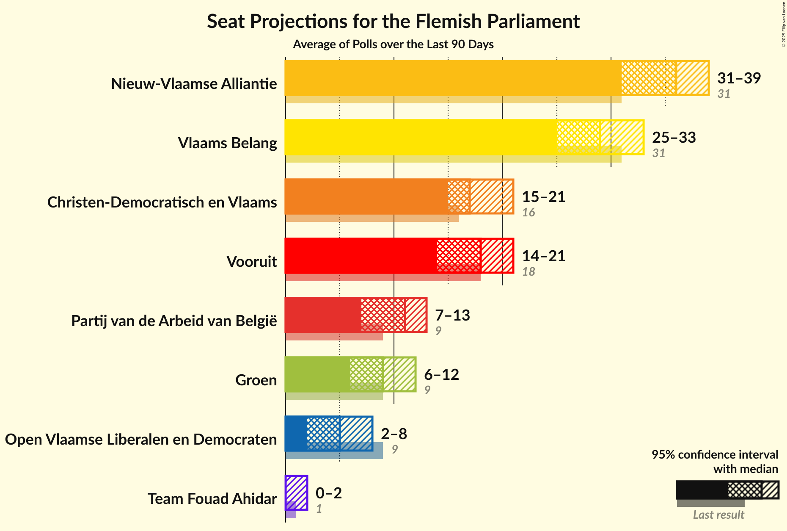

# Poll Average

<a href="#voting-intentions">Voting Intentions</a> | <a href="#seats">Seats</a> | <a href="#coalitions">Coalitions</a> | <a href="#technical-information">Technical Information</a>

The table below lists the polls on which the average is based. They are the most recent polls (less than 90 days old) registered and analyzed so far.

| Period     | Pollster/Media   | N-VA | CD&V | VLD | SP.A | GROEN | VB | PVDA | PIRAAT | LDD |
|:----------:|:----------------:|:--:|:--:|:--:|:--:|:--:|:--:|:--:|:--:|:--:|
| 25 May 2014 | General Election | 31.9%   43 | 20.5%   27 | 14.1%   19 | 14.0%   18 | 8.7%   10 | 5.9%   6 | 2.5%   0 | 0.6%   0 | 0.0%   0 |
| N/A | Poll Average | 30–40 | 18–27 | 12–22 | 8–19 | 14–23 | 6–18 | 0–10 | N/A | N/A |
| [23–27 June 2017](2017-06-27-Dedicated.html) | Dedicated   MR | 24–31%   30–41 | 14–20%   16–26 | 10–15%   12–20 | 7–12%   8–14 | 10–15%   13–21 | 9–14%   10–18 | 6–10%   4–11 | N/A   N/A | N/A   N/A |
| [27 March–11 April 2017](2017-04-11-TNS.html) | TNS   De Standaard–VRT | 24–29%   31–39 | 16–21%   20–27 | 12–17%   16–23 | 11–15%   14–19 | 13–17%   17–23 | 6–10%   6–11 | 3–6%   0–5 | N/A   N/A | N/A   N/A |
| 25 May 2014 | General Election | 31.9%   43 | 20.5%   27 | 14.1%   19 | 14.0%   18 | 8.7%   10 | 5.9%   6 | 2.5%   0 | 0.6%   0 | 0.0%   0 |

Only polls for which at least the sample size has been published are included in the table above.

**Legend:**
+ **Top half of each row:** Voting intentions (95% confidence interval)
+ **Bottom half of each row:** Seat projections for the Flemish Parliament (95% confidence interval)
+ **N-VA:** N-VA
+ **CD&V:** CD&V
+ **VLD:** Open Vld
+ **SP.A:** sp.a
+ **GROEN:** Groen
+ **VB:** Vlaams Belang
+ **PVDA:** PVDA
+ **PIRAAT:** Piratenpartij
+ **LDD:** Lijst Dedecker
+ **N/A (single party):** Party not included the published results
+ **N/A (entire row):** Calculation for this opinion poll not started yet

## Voting Intentions

## Seats

### Confidence Intervals

| Party | Last Result | Median | 80% Confidence Interval | 90% Confidence Interval | 95% Confidence Interval | 99% Confidence Interval |
|:-----:|:-----------:|:------:|:-----------------------:|:-----------------------:|:-----------------------:|:-----------------------:|
| <a href="#n-va">N-VA</a> | 43 | 35 | 32–38 |31–39 | 30–40 | 29–43 |
| <a href="#cd&v">CD&V</a> | 27 | 22 | 20–26 |20–26 | 18–27 | 16–28 |
| <a href="#open-vld">Open Vld</a> | 19 | 18 | 14–20 |13–21 | 12–22 | 12–23 |
| <a href="#sp.a">sp.a</a> | 18 | 14 | 9–19 |8–19 | 8–19 | 7–20 |
| <a href="#groen">Groen</a> | 10 | 18 | 15–22 |14–23 | 14–23 | 13–24 |
| <a href="#vlaams-belang">Vlaams Belang</a> | 6 | 11 | 8–17 |6–17 | 6–18 | 6–19 |
| <a href="#pvda">PVDA</a> | 0 | 4 | 2–9 |1–9 | 0–10 | 0–11 |
| <a href="#piratenpartij">Piratenpartij</a> | 0 | N/A | N/A |N/A | N/A | N/A |
| <a href="#lijst-dedecker">Lijst Dedecker</a> | 0 | N/A | N/A |N/A | N/A | N/A |

### N-VA

| Number of Seats | Probability | Accumulated | Special Marks |
|:---------------:|:-----------:|:-----------:|:-------------:|
| 28 | 0.2% | 100% |  |
| 29 | 0.4% | 99.8% |  |
| 30 | 3% | 99.5% |  |
| 31 | 3% | 97% |  |
| 32 | 5% | 93% |  |
| 33 | 8% | 88% |  |
| 34 | 22% | 80% |  |
| 35 | 13% | 58% | Median |
| 36 | 12% | 45% |  |
| 37 | 13% | 33% |  |
| 38 | 12% | 20% |  |
| 39 | 4% | 8% |  |
| 40 | 2% | 4% |  |
| 41 | 0.8% | 2% |  |
| 42 | 0.7% | 1.3% |  |
| 43 | 0.5% | 0.7% | Last Result |
| 44 | 0.1% | 0.2% |  |
| 45 | 0.1% | 0.1% |  |
| 46 | 0% | 0% |  |

### CD&V

| Number of Seats | Probability | Accumulated | Special Marks |
|:---------------:|:-----------:|:-----------:|:-------------:|
| 15 | 0.2% | 100% |  |
| 16 | 1.5% | 99.8% |  |
| 17 | 0.6% | 98% |  |
| 18 | 0.5% | 98% |  |
| 19 | 2% | 97% |  |
| 20 | 27% | 95% |  |
| 21 | 13% | 68% |  |
| 22 | 11% | 55% | Median |
| 23 | 7% | 44% |  |
| 24 | 14% | 37% |  |
| 25 | 11% | 23% |  |
| 26 | 8% | 12% |  |
| 27 | 3% | 4% | Last Result |
| 28 | 0.6% | 1.1% |  |
| 29 | 0.3% | 0.5% |  |
| 30 | 0.1% | 0.2% |  |
| 31 | 0% | 0.1% |  |
| 32 | 0% | 0% |  |

### Open Vld

| Number of Seats | Probability | Accumulated | Special Marks |
|:---------------:|:-----------:|:-----------:|:-------------:|
| 12 | 3% | 100% |  |
| 13 | 7% | 97% |  |
| 14 | 5% | 91% |  |
| 15 | 5% | 86% |  |
| 16 | 7% | 81% |  |
| 17 | 12% | 74% |  |
| 18 | 18% | 63% | Median |
| 19 | 23% | 44% | Last Result |
| 20 | 15% | 21% |  |
| 21 | 2% | 6% |  |
| 22 | 2% | 3% |  |
| 23 | 1.4% | 2% |  |
| 24 | 0.3% | 0.4% |  |
| 25 | 0.1% | 0.1% |  |
| 26 | 0% | 0% |  |

### sp.a

| Number of Seats | Probability | Accumulated | Special Marks |
|:---------------:|:-----------:|:-----------:|:-------------:|
| 4 | 0.1% | 100% |  |
| 5 | 0.1% | 99.9% |  |
| 6 | 0.1% | 99.9% |  |
| 7 | 0.7% | 99.8% |  |
| 8 | 4% | 99.1% |  |
| 9 | 6% | 95% |  |
| 10 | 11% | 88% |  |
| 11 | 3% | 77% |  |
| 12 | 4% | 74% |  |
| 13 | 10% | 70% |  |
| 14 | 18% | 60% | Median |
| 15 | 8% | 43% |  |
| 16 | 6% | 35% |  |
| 17 | 9% | 29% |  |
| 18 | 5% | 20% | Last Result |
| 19 | 14% | 15% |  |
| 20 | 0.4% | 0.6% |  |
| 21 | 0.1% | 0.2% |  |
| 22 | 0.1% | 0.1% |  |
| 23 | 0% | 0% |  |

### Groen

| Number of Seats | Probability | Accumulated | Special Marks |
|:---------------:|:-----------:|:-----------:|:-------------:|
| 10 | 0.1% | 100% | Last Result |
| 11 | 0.1% | 99.9% |  |
| 12 | 0.2% | 99.8% |  |
| 13 | 0.9% | 99.6% |  |
| 14 | 8% | 98.7% |  |
| 15 | 13% | 90% |  |
| 16 | 6% | 77% |  |
| 17 | 18% | 71% |  |
| 18 | 15% | 53% | Median |
| 19 | 9% | 38% |  |
| 20 | 6% | 29% |  |
| 21 | 6% | 22% |  |
| 22 | 7% | 16% |  |
| 23 | 8% | 9% |  |
| 24 | 0.8% | 1.0% |  |
| 25 | 0.1% | 0.1% |  |
| 26 | 0% | 0% |  |

### Vlaams Belang

| Number of Seats | Probability | Accumulated | Special Marks |
|:---------------:|:-----------:|:-----------:|:-------------:|
| 4 | 0.3% | 100% |  |
| 5 | 0.2% | 99.7% |  |
| 6 | 5% | 99.5% | Last Result |
| 7 | 2% | 94% |  |
| 8 | 36% | 92% |  |
| 9 | 3% | 57% |  |
| 10 | 4% | 54% |  |
| 11 | 5% | 50% | Median |
| 12 | 8% | 45% |  |
| 13 | 5% | 37% |  |
| 14 | 4% | 31% |  |
| 15 | 2% | 27% |  |
| 16 | 7% | 25% |  |
| 17 | 15% | 18% |  |
| 18 | 2% | 3% |  |
| 19 | 0.9% | 1.2% |  |
| 20 | 0.3% | 0.3% |  |
| 21 | 0% | 0% |  |

### PVDA

| Number of Seats | Probability | Accumulated | Special Marks |
|:---------------:|:-----------:|:-----------:|:-------------:|
| 0 | 3% | 100% | Last Result |
| 1 | 4% | 97% |  |
| 2 | 36% | 92% |  |
| 3 | 5% | 56% |  |
| 4 | 0.8% | 51% | Median |
| 5 | 16% | 50% |  |
| 6 | 2% | 34% |  |
| 7 | 4% | 32% |  |
| 8 | 2% | 28% |  |
| 9 | 21% | 26% |  |
| 10 | 3% | 5% |  |
| 11 | 1.3% | 2% |  |
| 12 | 0.4% | 0.5% |  |
| 13 | 0% | 0% |  |

## Coalitions

### Confidence Intervals

| Coalition | Last Result | Median | 80% Confidence Interval | 90% Confidence Interval | 95% Confidence Interval | 99% Confidence Interval |
|:---------:|:-----------:|:------:|:-----------------------:|:-----------------------:|:-----------------------:|:-----------------------:|
| CD&V – Open Vld – sp.a – Groen | 74 | 74 | 62–81 | 61–82 | 60–83 | 58–84 |
| N-VA – CD&V – Open Vld | 89 | 76 | 70–80 | 69–81 | 68–82 | 66–83 |
| N-VA – CD&V – sp.a | 88 | 73 | 65–77 | 63–79 | 63–80 | 61–81 |
| CD&V – sp.a – Groen – PVDA | 55 | 60 | 53–64 | 52–66 | 51–66 | 49–68 |
| N-VA – CD&V | 70 | 58 | 54–62 | 53–63 | 52–64 | 50–65 |
| CD&V – sp.a – Groen | 55 | 55 | 46–62 | 45–64 | 43–64 | 42–66 |
| CD&V – Open Vld – sp.a | 64 | 55 | 46–62 | 45–63 | 44–63 | 42–65 |
| Open Vld – sp.a – Groen | 47 | 51 | 41–58 | 40–59 | 39–60 | 37–61 |
| N-VA – Vlaams Belang | 49 | 46 | 41–53 | 40–54 | 39–55 | 38–57 |
| CD&V – Open Vld | 46 | 40 | 35–44 | 34–45 | 33–46 | 31–48 |
| CD&V – sp.a | 45 | 37 | 30–43 | 29–44 | 28–45 | 26–46 |
| Open Vld – sp.a | 37 | 32 | 25–38 | 24–39 | 23–39 | 21–41 |

### CD&V – Open Vld – sp.a – Groen

| Number of Seats | Probability | Accumulated | Special Marks |
|:---------------:|:-----------:|:-----------:|:-------------:|
| 56 | 0.1% | 100% |  |
| 57 | 0.2% | 99.9% |  |
| 58 | 0.5% | 99.8% |  |
| 59 | 1.2% | 99.3% |  |
| 60 | 3% | 98% |  |
| 61 | 3% | 95% |  |
| 62 | 3% | 93% |  |
| 63 | 5% | 89% | Majority |
| 64 | 6% | 84% |  |
| 65 | 5% | 78% |  |
| 66 | 6% | 73% |  |
| 67 | 4% | 68% |  |
| 68 | 5% | 64% |  |
| 69 | 3% | 58% |  |
| 70 | 2% | 55% |  |
| 71 | 1.3% | 53% |  |
| 72 | 1.1% | 52% | Median |
| 73 | 0.9% | 51% |  |
| 74 | 0.8% | 50% | Last Result |
| 75 | 2% | 49% |  |
| 76 | 4% | 48% |  |
| 77 | 6% | 43% |  |
| 78 | 7% | 37% |  |
| 79 | 9% | 30% |  |
| 80 | 9% | 21% |  |
| 81 | 5% | 12% |  |
| 82 | 4% | 7% |  |
| 83 | 2% | 3% |  |
| 84 | 0.8% | 1.2% |  |
| 85 | 0.3% | 0.4% |  |
| 86 | 0.1% | 0.1% |  |
| 87 | 0% | 0% |  |

### N-VA – CD&V – Open Vld

| Number of Seats | Probability | Accumulated | Special Marks |
|:---------------:|:-----------:|:-----------:|:-------------:|
| 64 | 0.1% | 100% |  |
| 65 | 0.2% | 99.9% |  |
| 66 | 0.9% | 99.7% |  |
| 67 | 0.9% | 98.8% |  |
| 68 | 3% | 98% |  |
| 69 | 3% | 95% |  |
| 70 | 5% | 93% |  |
| 71 | 4% | 88% |  |
| 72 | 7% | 84% |  |
| 73 | 8% | 77% |  |
| 74 | 8% | 69% |  |
| 75 | 10% | 61% | Median |
| 76 | 10% | 50% |  |
| 77 | 10% | 40% |  |
| 78 | 9% | 30% |  |
| 79 | 6% | 21% |  |
| 80 | 7% | 15% |  |
| 81 | 5% | 8% |  |
| 82 | 3% | 4% |  |
| 83 | 0.8% | 1.2% |  |
| 84 | 0.3% | 0.4% |  |
| 85 | 0.1% | 0.1% |  |
| 86 | 0% | 0% |  |
| 87 | 0% | 0% |  |
| 88 | 0% | 0% |  |
| 89 | 0% | 0% | Last Result |

### N-VA – CD&V – sp.a

| Number of Seats | Probability | Accumulated | Special Marks |
|:---------------:|:-----------:|:-----------:|:-------------:|
| 59 | 0% | 100% |  |
| 60 | 0.2% | 99.9% |  |
| 61 | 0.6% | 99.7% |  |
| 62 | 1.0% | 99.1% |  |
| 63 | 4% | 98% | Majority |
| 64 | 4% | 94% |  |
| 65 | 3% | 90% |  |
| 66 | 4% | 87% |  |
| 67 | 8% | 83% |  |
| 68 | 5% | 74% |  |
| 69 | 3% | 70% |  |
| 70 | 4% | 66% |  |
| 71 | 4% | 63% | Median |
| 72 | 8% | 59% |  |
| 73 | 10% | 51% |  |
| 74 | 10% | 41% |  |
| 75 | 8% | 32% |  |
| 76 | 6% | 24% |  |
| 77 | 7% | 17% |  |
| 78 | 4% | 10% |  |
| 79 | 3% | 6% |  |
| 80 | 2% | 3% |  |
| 81 | 0.7% | 1.0% |  |
| 82 | 0.2% | 0.3% |  |
| 83 | 0% | 0.1% |  |
| 84 | 0% | 0% |  |
| 85 | 0% | 0% |  |
| 86 | 0% | 0% |  |
| 87 | 0% | 0% |  |
| 88 | 0% | 0% | Last Result |

### CD&V – sp.a – Groen – PVDA

| Number of Seats | Probability | Accumulated | Special Marks |
|:---------------:|:-----------:|:-----------:|:-------------:|
| 47 | 0.1% | 100% |  |
| 48 | 0.2% | 99.9% |  |
| 49 | 0.4% | 99.7% |  |
| 50 | 0.7% | 99.3% |  |
| 51 | 1.3% | 98.6% |  |
| 52 | 3% | 97% |  |
| 53 | 5% | 94% |  |
| 54 | 5% | 90% |  |
| 55 | 6% | 85% | Last Result |
| 56 | 7% | 79% |  |
| 57 | 7% | 73% |  |
| 58 | 8% | 66% | Median |
| 59 | 8% | 59% |  |
| 60 | 10% | 51% |  |
| 61 | 9% | 41% |  |
| 62 | 9% | 31% |  |
| 63 | 8% | 22% | Majority |
| 64 | 5% | 14% |  |
| 65 | 3% | 9% |  |
| 66 | 3% | 5% |  |
| 67 | 1.4% | 2% |  |
| 68 | 0.8% | 1.1% |  |
| 69 | 0.2% | 0.3% |  |
| 70 | 0% | 0.1% |  |
| 71 | 0% | 0% |  |

### N-VA – CD&V

| Number of Seats | Probability | Accumulated | Special Marks |
|:---------------:|:-----------:|:-----------:|:-------------:|
| 48 | 0.1% | 100% |  |
| 49 | 0.3% | 99.9% |  |
| 50 | 0.7% | 99.6% |  |
| 51 | 1.2% | 98.9% |  |
| 52 | 1.5% | 98% |  |
| 53 | 3% | 96% |  |
| 54 | 12% | 94% |  |
| 55 | 8% | 82% |  |
| 56 | 9% | 74% |  |
| 57 | 12% | 65% | Median |
| 58 | 14% | 53% |  |
| 59 | 13% | 39% |  |
| 60 | 9% | 27% |  |
| 61 | 7% | 17% |  |
| 62 | 5% | 11% |  |
| 63 | 3% | 6% | Majority |
| 64 | 2% | 3% |  |
| 65 | 0.6% | 1.1% |  |
| 66 | 0.2% | 0.4% |  |
| 67 | 0.1% | 0.2% |  |
| 68 | 0% | 0.1% |  |
| 69 | 0% | 0% |  |
| 70 | 0% | 0% | Last Result |

### CD&V – sp.a – Groen

| Number of Seats | Probability | Accumulated | Special Marks |
|:---------------:|:-----------:|:-----------:|:-------------:|
| 40 | 0% | 100% |  |
| 41 | 0.3% | 99.9% |  |
| 42 | 0.8% | 99.6% |  |
| 43 | 1.4% | 98.9% |  |
| 44 | 2% | 97% |  |
| 45 | 4% | 95% |  |
| 46 | 4% | 91% |  |
| 47 | 6% | 87% |  |
| 48 | 5% | 82% |  |
| 49 | 5% | 77% |  |
| 50 | 6% | 71% |  |
| 51 | 5% | 65% |  |
| 52 | 4% | 60% |  |
| 53 | 2% | 56% |  |
| 54 | 2% | 54% | Median |
| 55 | 3% | 52% | Last Result |
| 56 | 3% | 50% |  |
| 57 | 4% | 46% |  |
| 58 | 6% | 42% |  |
| 59 | 7% | 36% |  |
| 60 | 8% | 29% |  |
| 61 | 7% | 21% |  |
| 62 | 5% | 14% |  |
| 63 | 3% | 8% | Majority |
| 64 | 3% | 6% |  |
| 65 | 1.2% | 2% |  |
| 66 | 0.9% | 1.2% |  |
| 67 | 0.2% | 0.3% |  |
| 68 | 0.1% | 0.1% |  |
| 69 | 0% | 0% |  |

### CD&V – Open Vld – sp.a

| Number of Seats | Probability | Accumulated | Special Marks |
|:---------------:|:-----------:|:-----------:|:-------------:|
| 39 | 0% | 100% |  |
| 40 | 0.1% | 99.9% |  |
| 41 | 0.3% | 99.8% |  |
| 42 | 0.8% | 99.6% |  |
| 43 | 0.8% | 98.8% |  |
| 44 | 2% | 98% |  |
| 45 | 4% | 96% |  |
| 46 | 4% | 92% |  |
| 47 | 5% | 88% |  |
| 48 | 6% | 82% |  |
| 49 | 5% | 76% |  |
| 50 | 5% | 71% |  |
| 51 | 4% | 66% |  |
| 52 | 5% | 62% |  |
| 53 | 4% | 57% |  |
| 54 | 3% | 54% | Median |
| 55 | 3% | 50% |  |
| 56 | 4% | 48% |  |
| 57 | 5% | 43% |  |
| 58 | 8% | 39% |  |
| 59 | 8% | 30% |  |
| 60 | 7% | 23% |  |
| 61 | 5% | 16% |  |
| 62 | 4% | 11% |  |
| 63 | 4% | 6% | Majority |
| 64 | 2% | 2% | Last Result |
| 65 | 0.4% | 0.7% |  |
| 66 | 0.1% | 0.2% |  |
| 67 | 0.1% | 0.1% |  |
| 68 | 0% | 0% |  |

### Open Vld – sp.a – Groen

| Number of Seats | Probability | Accumulated | Special Marks |
|:---------------:|:-----------:|:-----------:|:-------------:|
| 34 | 0.1% | 100% |  |
| 35 | 0.1% | 99.9% |  |
| 36 | 0.3% | 99.8% |  |
| 37 | 0.5% | 99.6% |  |
| 38 | 2% | 99.0% |  |
| 39 | 2% | 98% |  |
| 40 | 4% | 96% |  |
| 41 | 3% | 92% |  |
| 42 | 5% | 88% |  |
| 43 | 6% | 83% |  |
| 44 | 5% | 77% |  |
| 45 | 5% | 72% |  |
| 46 | 4% | 67% |  |
| 47 | 5% | 63% | Last Result |
| 48 | 4% | 58% |  |
| 49 | 2% | 54% |  |
| 50 | 2% | 52% | Median |
| 51 | 2% | 50% |  |
| 52 | 3% | 48% |  |
| 53 | 4% | 44% |  |
| 54 | 6% | 40% |  |
| 55 | 9% | 34% |  |
| 56 | 7% | 25% |  |
| 57 | 6% | 18% |  |
| 58 | 5% | 12% |  |
| 59 | 3% | 7% |  |
| 60 | 3% | 4% |  |
| 61 | 0.5% | 0.7% |  |
| 62 | 0.1% | 0.2% |  |
| 63 | 0% | 0.1% | Majority |
| 64 | 0% | 0% |  |

### N-VA – Vlaams Belang

| Number of Seats | Probability | Accumulated | Special Marks |
|:---------------:|:-----------:|:-----------:|:-------------:|
| 36 | 0.1% | 100% |  |
| 37 | 0.3% | 99.9% |  |
| 38 | 0.9% | 99.6% |  |
| 39 | 2% | 98.8% |  |
| 40 | 3% | 97% |  |
| 41 | 5% | 93% |  |
| 42 | 9% | 88% |  |
| 43 | 9% | 79% |  |
| 44 | 8% | 69% |  |
| 45 | 9% | 62% |  |
| 46 | 7% | 53% | Median |
| 47 | 4% | 46% |  |
| 48 | 5% | 42% |  |
| 49 | 4% | 37% | Last Result |
| 50 | 8% | 33% |  |
| 51 | 8% | 24% |  |
| 52 | 5% | 17% |  |
| 53 | 4% | 12% |  |
| 54 | 4% | 8% |  |
| 55 | 2% | 3% |  |
| 56 | 0.9% | 2% |  |
| 57 | 0.5% | 0.8% |  |
| 58 | 0.1% | 0.3% |  |
| 59 | 0.1% | 0.1% |  |
| 60 | 0% | 0% |  |

### CD&V – Open Vld

| Number of Seats | Probability | Accumulated | Special Marks |
|:---------------:|:-----------:|:-----------:|:-------------:|
| 29 | 0.1% | 100% |  |
| 30 | 0.2% | 99.8% |  |
| 31 | 0.3% | 99.7% |  |
| 32 | 1.2% | 99.4% |  |
| 33 | 2% | 98% |  |
| 34 | 4% | 96% |  |
| 35 | 4% | 91% |  |
| 36 | 5% | 87% |  |
| 37 | 6% | 82% |  |
| 38 | 9% | 76% |  |
| 39 | 13% | 67% |  |
| 40 | 8% | 54% | Median |
| 41 | 9% | 46% |  |
| 42 | 8% | 38% |  |
| 43 | 8% | 29% |  |
| 44 | 11% | 21% |  |
| 45 | 5% | 10% |  |
| 46 | 3% | 4% | Last Result |
| 47 | 1.0% | 2% |  |
| 48 | 0.4% | 0.7% |  |
| 49 | 0.3% | 0.3% |  |
| 50 | 0.1% | 0.1% |  |
| 51 | 0% | 0% |  |

### CD&V – sp.a

| Number of Seats | Probability | Accumulated | Special Marks |
|:---------------:|:-----------:|:-----------:|:-------------:|
| 24 | 0.1% | 100% |  |
| 25 | 0.3% | 99.9% |  |
| 26 | 0.4% | 99.6% |  |
| 27 | 0.5% | 99.2% |  |
| 28 | 2% | 98.7% |  |
| 29 | 5% | 97% |  |
| 30 | 6% | 91% |  |
| 31 | 4% | 85% |  |
| 32 | 5% | 81% |  |
| 33 | 7% | 76% |  |
| 34 | 9% | 69% |  |
| 35 | 5% | 61% |  |
| 36 | 4% | 56% | Median |
| 37 | 4% | 52% |  |
| 38 | 9% | 48% |  |
| 39 | 9% | 39% |  |
| 40 | 9% | 30% |  |
| 41 | 6% | 21% |  |
| 42 | 4% | 15% |  |
| 43 | 5% | 11% |  |
| 44 | 3% | 6% |  |
| 45 | 2% | 3% | Last Result |
| 46 | 0.6% | 0.8% |  |
| 47 | 0.1% | 0.2% |  |
| 48 | 0% | 0.1% |  |
| 49 | 0% | 0% |  |

### Open Vld – sp.a

| Number of Seats | Probability | Accumulated | Special Marks |
|:---------------:|:-----------:|:-----------:|:-------------:|
| 19 | 0.1% | 100% |  |
| 20 | 0.2% | 99.9% |  |
| 21 | 0.5% | 99.7% |  |
| 22 | 1.4% | 99.2% |  |
| 23 | 2% | 98% |  |
| 24 | 3% | 96% |  |
| 25 | 5% | 93% |  |
| 26 | 6% | 88% |  |
| 27 | 7% | 82% |  |
| 28 | 6% | 75% |  |
| 29 | 4% | 69% |  |
| 30 | 6% | 65% |  |
| 31 | 4% | 59% |  |
| 32 | 7% | 55% | Median |
| 33 | 7% | 48% |  |
| 34 | 7% | 42% |  |
| 35 | 7% | 35% |  |
| 36 | 6% | 28% |  |
| 37 | 9% | 22% | Last Result |
| 38 | 8% | 13% |  |
| 39 | 3% | 5% |  |
| 40 | 1.2% | 2% |  |
| 41 | 0.5% | 0.8% |  |
| 42 | 0.2% | 0.3% |  |
| 43 | 0.1% | 0.1% |  |
| 44 | 0% | 0% |  |

## Technical Information

