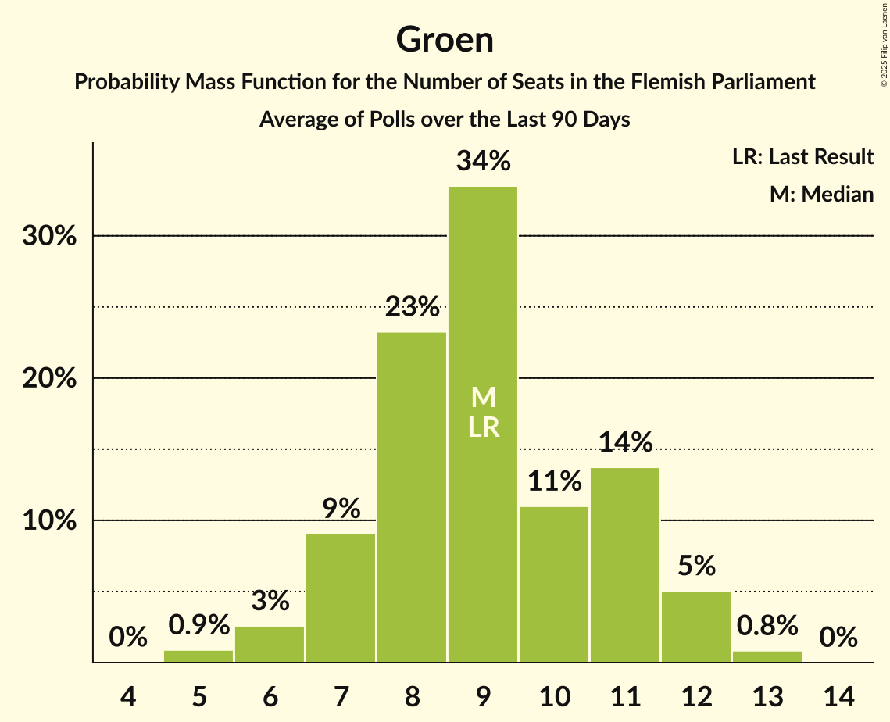

# Poll Average

<a href="#voting-intentions">Voting Intentions</a> | <a href="#seats">Seats</a> | <a href="#coalitions">Coalitions</a> | <a href="#technical-information">Technical Information</a>

## Summary

The table below lists the polls on which the average is based. They are the most recent polls (less than 90 days old) registered and analyzed so far.

| Period     | Polling firm/Commissioner(s) | N-VA | VB | CD&V | VLD | VOORUIT | GROEN | PVDA |
|:----------:|:----------------------------:|:--:|:--:|:--:|:--:|:--:|:--:|:--:|
| 26 May 2019 | General Election | 24.8%   35 | 18.5%   23 | 15.4%   19 | 13.1%   16 | 10.1%   12 | 10.1%   14 | 5.3%   4 |
| N/A | Poll Average | 18–24%   22–32 | 24–30%   31–39 | 9–15%   11–18 | 7–10%   6–12 | 10–16%   12–20 | 6–10%   7–14 | 8–12%   8–14 |
| [11–18 March 2024](2024-03-18-Ipsos.html) | Ipsos   Het Laatste Nieuws, Le Soir, RTL TVi and VTM | 18–23%   23–30 | 25–30%   32–41 | 11–15%   13–19 | 7–10%   7–12 | 10–14%   11–17 | 6–10%   6–13 | 8–11%   8–14 |
| [22 January–8 February 2024](2024-02-08-Kantar.html) | Kantar   Knack and Le Vif | 18–23%   24–30 | 23–28%   29–37 | 9–12%   10–14 | 7–10%   6–12 | 13–17%   15–23 | 7–11%   8–14 | 9–13%   11–16 |
| [9–22 January 2024](2024-01-22-iVOX.html) | iVOX   Vlaams & Neutraal Ziekenfonds | 21–25%   27–33 | 25–29%   32–38 | 11–14%   12–17 | 7–9%   6–11 | 11–14%   14–19 | 6–9%   6–11 | 8–11%   8–13 |
| [8–22 January 2024](2024-01-22-KantarandUniversiteitAntwerpen.html) | Kantar and Universiteit Antwerpen   De Standaard and VRT | 17–21%   21–27 | 26–30%   33–39 | 10–13%   11–14 | 8–10%   8–12 | 12–15%   15–19 | 7–10%   7–12 | 10–12%   11–14 |
| 26 May 2019 | General Election | 24.8%   35 | 18.5%   23 | 15.4%   19 | 13.1%   16 | 10.1%   12 | 10.1%   14 | 5.3%   4 |

Only polls for which at least the sample size has been published are included in the table above.

**Legend:**
+ **Top half of each row:** Voting intentions (95% confidence interval)
+ **Bottom half of each row:** Seat projections for the Flemish Parliament (95% confidence interval)
+ **N-VA:** Nieuw-Vlaamse Alliantie
+ **VB:** Vlaams Belang
+ **CD&V:** Christen-Democratisch en Vlaams
+ **VLD:** Open Vlaamse Liberalen en Democraten
+ **VOORUIT:** Vooruit
+ **GROEN:** Groen
+ **PVDA:** Partij van de Arbeid van België
+ **N/A (single party):** Party not included the published results
+ **N/A (entire row):** Calculation for this opinion poll not started yet

## Voting Intentions

### Confidence Intervals

| Party | Last Result | Median | 80% Confidence Interval | 90% Confidence Interval | 95% Confidence Interval | 99% Confidence Interval |
|:-----:|:-----------:|:------:|:-----------------------:|:-----------------------:|:-----------------------:|:-----------------------:|
| <a href="#nieuw-vlaamse-alliantie">Nieuw-Vlaamse Alliantie</a> | 24.8% | 20.6% | 18.5–23.1% |18.1–23.6% | 17.7–24.0% | 17.0–24.7% |
| <a href="#vlaams-belang">Vlaams Belang</a> | 18.5% | 26.9% | 24.9–28.7% |24.3–29.2% | 23.8–29.7% | 22.9–30.6% |
| <a href="#christen-democratisch-en-vlaams">Christen-Democratisch en Vlaams</a> | 15.4% | 11.8% | 10.2–13.6% |9.7–14.1% | 9.4–14.6% | 8.7–15.4% |
| <a href="#open-vlaamse-liberalen-en-democraten">Open Vlaamse Liberalen en Democraten</a> | 13.1% | 8.2% | 7.1–9.5% |6.9–9.8% | 6.7–10.1% | 6.2–10.6% |
| <a href="#vooruit">Vooruit</a> | 10.1% | 13.2% | 11.2–15.1% |10.6–15.7% | 10.2–16.1% | 9.5–17.0% |
| <a href="#groen">Groen</a> | 10.1% | 8.0% | 7.0–9.3% |6.7–9.7% | 6.5–10.0% | 6.1–10.7% |
| <a href="#partij-van-de-arbeid-van-belgië">Partij van de Arbeid van België</a> | 5.3% | 10.2% | 8.8–11.7% |8.5–12.0% | 8.2–12.4% | 7.7–13.0% |

### Nieuw-Vlaamse Alliantie

*For a full overview of the results for this party, see the [Nieuw-Vlaamse Alliantie](party-nieuw-vlaamsealliantie.html) page.*

| Voting Intentions | Probability | Accumulated | Special Marks |
|:-----------------:|:-----------:|:-----------:|:-------------:|
| 14.5–15.5% | 0% | 100% |  |
| 15.5–16.5% | 0.1% | 100% |  |
| 16.5–17.5% | 2% | 99.9% |  |
| 17.5–18.5% | 9% | 98% |  |
| 18.5–19.5% | 18% | 89% |  |
| 19.5–20.5% | 20% | 71% |  |
| 20.5–21.5% | 18% | 51% | Median |
| 21.5–22.5% | 16% | 33% |  |
| 22.5–23.5% | 12% | 17% |  |
| 23.5–24.5% | 5% | 5% |  |
| 24.5–25.5% | 0.7% | 0.7% | Last Result |
| 25.5–26.5% | 0% | 0% |  |
| 26.5–27.5% | 0% | 0% |  |

### Vlaams Belang

*For a full overview of the results for this party, see the [Vlaams Belang](party-vlaamsbelang.html) page.*

| Voting Intentions | Probability | Accumulated | Special Marks |
|:-----------------:|:-----------:|:-----------:|:-------------:|
| 18.5–19.5% | 0% | 100% | Last Result |
| 19.5–20.5% | 0% | 100% |  |
| 20.5–21.5% | 0% | 100% |  |
| 21.5–22.5% | 0.2% | 100% |  |
| 22.5–23.5% | 1.3% | 99.7% |  |
| 23.5–24.5% | 5% | 98% |  |
| 24.5–25.5% | 12% | 94% |  |
| 25.5–26.5% | 22% | 82% |  |
| 26.5–27.5% | 27% | 60% | Median |
| 27.5–28.5% | 20% | 33% |  |
| 28.5–29.5% | 10% | 13% |  |
| 29.5–30.5% | 3% | 3% |  |
| 30.5–31.5% | 0.5% | 0.5% |  |
| 31.5–32.5% | 0.1% | 0.1% |  |
| 32.5–33.5% | 0% | 0% |  |

### Christen-Democratisch en Vlaams

*For a full overview of the results for this party, see the [Christen-Democratisch en Vlaams](party-christen-democratischenvlaams.html) page.*

| Voting Intentions | Probability | Accumulated | Special Marks |
|:-----------------:|:-----------:|:-----------:|:-------------:|
| 6.5–7.5% | 0% | 100% |  |
| 7.5–8.5% | 0.3% | 100% |  |
| 8.5–9.5% | 3% | 99.7% |  |
| 9.5–10.5% | 13% | 96% |  |
| 10.5–11.5% | 26% | 84% |  |
| 11.5–12.5% | 29% | 58% | Median |
| 12.5–13.5% | 19% | 29% |  |
| 13.5–14.5% | 8% | 10% |  |
| 14.5–15.5% | 2% | 3% | Last Result |
| 15.5–16.5% | 0.4% | 0.4% |  |
| 16.5–17.5% | 0% | 0% |  |

### Open Vlaamse Liberalen en Democraten

*For a full overview of the results for this party, see the [Open Vlaamse Liberalen en Democraten](party-openvlaamseliberalenendemocraten.html) page.*

| Voting Intentions | Probability | Accumulated | Special Marks |
|:-----------------:|:-----------:|:-----------:|:-------------:|
| 4.5–5.5% | 0% | 100% |  |
| 5.5–6.5% | 2% | 100% |  |
| 6.5–7.5% | 21% | 98% |  |
| 7.5–8.5% | 40% | 78% | Median |
| 8.5–9.5% | 29% | 38% |  |
| 9.5–10.5% | 8% | 9% |  |
| 10.5–11.5% | 0.7% | 0.7% |  |
| 11.5–12.5% | 0% | 0% |  |
| 12.5–13.5% | 0% | 0% | Last Result |

### Vooruit

*For a full overview of the results for this party, see the [Vooruit](party-vooruit.html) page.*

| Voting Intentions | Probability | Accumulated | Special Marks |
|:-----------------:|:-----------:|:-----------:|:-------------:|
| 7.5–8.5% | 0% | 100% |  |
| 8.5–9.5% | 0.6% | 100% |  |
| 9.5–10.5% | 4% | 99.4% | Last Result |
| 10.5–11.5% | 10% | 96% |  |
| 11.5–12.5% | 18% | 85% |  |
| 12.5–13.5% | 26% | 68% | Median |
| 13.5–14.5% | 23% | 41% |  |
| 14.5–15.5% | 12% | 18% |  |
| 15.5–16.5% | 5% | 6% |  |
| 16.5–17.5% | 1.1% | 1.2% |  |
| 17.5–18.5% | 0.1% | 0.2% |  |
| 18.5–19.5% | 0% | 0% |  |

### Groen

*For a full overview of the results for this party, see the [Groen](party-groen.html) page.*

| Voting Intentions | Probability | Accumulated | Special Marks |
|:-----------------:|:-----------:|:-----------:|:-------------:|
| 4.5–5.5% | 0% | 100% |  |
| 5.5–6.5% | 3% | 100% |  |
| 6.5–7.5% | 26% | 97% |  |
| 7.5–8.5% | 43% | 72% | Median |
| 8.5–9.5% | 23% | 29% |  |
| 9.5–10.5% | 5% | 6% | Last Result |
| 10.5–11.5% | 0.7% | 0.7% |  |
| 11.5–12.5% | 0% | 0% |  |

### Partij van de Arbeid van België

*For a full overview of the results for this party, see the [Partij van de Arbeid van België](party-partijvandearbeidvanbelgië.html) page.*

| Voting Intentions | Probability | Accumulated | Special Marks |
|:-----------------:|:-----------:|:-----------:|:-------------:|
| 4.5–5.5% | 0% | 100% | Last Result |
| 5.5–6.5% | 0% | 100% |  |
| 6.5–7.5% | 0.3% | 100% |  |
| 7.5–8.5% | 6% | 99.7% |  |
| 8.5–9.5% | 25% | 94% |  |
| 9.5–10.5% | 31% | 69% | Median |
| 10.5–11.5% | 27% | 38% |  |
| 11.5–12.5% | 10% | 12% |  |
| 12.5–13.5% | 2% | 2% |  |
| 13.5–14.5% | 0.1% | 0.1% |  |
| 14.5–15.5% | 0% | 0% |  |

## Seats

### Confidence Intervals

| Party | Last Result | Median | 80% Confidence Interval | 90% Confidence Interval | 95% Confidence Interval | 99% Confidence Interval |
|:-----:|:-----------:|:------:|:-----------------------:|:-----------------------:|:-----------------------:|:-----------------------:|
| <a href="#nieuw-vlaamse-alliantie">Nieuw-Vlaamse Alliantie</a> | 35 | 27 | 24–30 |23–31 | 22–32 | 21–33 |
| <a href="#vlaams-belang">Vlaams Belang</a> | 23 | 36 | 32–38 |31–38 | 31–39 | 29–41 |
| <a href="#christen-democratisch-en-vlaams">Christen-Democratisch en Vlaams</a> | 19 | 14 | 11–17 |11–17 | 11–18 | 10–19 |
| <a href="#open-vlaamse-liberalen-en-democraten">Open Vlaamse Liberalen en Democraten</a> | 16 | 9 | 8–11 |7–12 | 6–12 | 5–13 |
| <a href="#vooruit">Vooruit</a> | 12 | 16 | 14–19 |13–19 | 12–20 | 11–23 |
| <a href="#groen">Groen</a> | 14 | 10 | 7–11 |7–13 | 7–14 | 5–14 |
| <a href="#partij-van-de-arbeid-van-belgië">Partij van de Arbeid van België</a> | 4 | 13 | 10–14 |9–14 | 8–14 | 7–17 |

### Nieuw-Vlaamse Alliantie

*For a full overview of the results for this party, see the [Nieuw-Vlaamse Alliantie](party-nieuw-vlaamsealliantie.html) page.*

| Number of Seats | Probability | Accumulated | Special Marks |
|:---------------:|:-----------:|:-----------:|:-------------:|
| 21 | 0.8% | 100% |  |
| 22 | 3% | 99.2% |  |
| 23 | 5% | 96% |  |
| 24 | 8% | 91% |  |
| 25 | 9% | 84% |  |
| 26 | 17% | 75% |  |
| 27 | 18% | 57% | Median |
| 28 | 9% | 39% |  |
| 29 | 6% | 30% |  |
| 30 | 15% | 23% |  |
| 31 | 6% | 8% |  |
| 32 | 2% | 3% |  |
| 33 | 0.4% | 0.7% |  |
| 34 | 0.2% | 0.3% |  |
| 35 | 0% | 0.1% | Last Result |
| 36 | 0% | 0% |  |

### Vlaams Belang

*For a full overview of the results for this party, see the [Vlaams Belang](party-vlaamsbelang.html) page.*

| Number of Seats | Probability | Accumulated | Special Marks |
|:---------------:|:-----------:|:-----------:|:-------------:|
| 23 | 0% | 100% | Last Result |
| 24 | 0% | 100% |  |
| 25 | 0% | 100% |  |
| 26 | 0% | 100% |  |
| 27 | 0% | 100% |  |
| 28 | 0.1% | 100% |  |
| 29 | 0.8% | 99.9% |  |
| 30 | 2% | 99.1% |  |
| 31 | 4% | 98% |  |
| 32 | 5% | 94% |  |
| 33 | 9% | 88% |  |
| 34 | 13% | 80% |  |
| 35 | 16% | 67% |  |
| 36 | 19% | 51% | Median |
| 37 | 21% | 32% |  |
| 38 | 7% | 11% |  |
| 39 | 2% | 4% |  |
| 40 | 0.9% | 2% |  |
| 41 | 0.7% | 1.0% |  |
| 42 | 0.3% | 0.3% |  |
| 43 | 0% | 0% |  |

### Christen-Democratisch en Vlaams

*For a full overview of the results for this party, see the [Christen-Democratisch en Vlaams](party-christen-democratischenvlaams.html) page.*

| Number of Seats | Probability | Accumulated | Special Marks |
|:---------------:|:-----------:|:-----------:|:-------------:|
| 9 | 0.4% | 100% |  |
| 10 | 0.5% | 99.6% |  |
| 11 | 15% | 99.0% |  |
| 12 | 14% | 84% |  |
| 13 | 9% | 70% |  |
| 14 | 32% | 61% | Median |
| 15 | 11% | 29% |  |
| 16 | 6% | 18% |  |
| 17 | 9% | 12% |  |
| 18 | 1.3% | 3% |  |
| 19 | 1.0% | 1.3% | Last Result |
| 20 | 0.2% | 0.3% |  |
| 21 | 0% | 0% |  |

### Open Vlaamse Liberalen en Democraten

*For a full overview of the results for this party, see the [Open Vlaamse Liberalen en Democraten](party-openvlaamseliberalenendemocraten.html) page.*

| Number of Seats | Probability | Accumulated | Special Marks |
|:---------------:|:-----------:|:-----------:|:-------------:|
| 4 | 0.2% | 100% |  |
| 5 | 0.5% | 99.8% |  |
| 6 | 2% | 99.3% |  |
| 7 | 7% | 97% |  |
| 8 | 34% | 91% |  |
| 9 | 15% | 56% | Median |
| 10 | 16% | 41% |  |
| 11 | 15% | 25% |  |
| 12 | 9% | 10% |  |
| 13 | 0.6% | 0.7% |  |
| 14 | 0.1% | 0.1% |  |
| 15 | 0% | 0% |  |
| 16 | 0% | 0% | Last Result |

### Vooruit

*For a full overview of the results for this party, see the [Vooruit](party-vooruit.html) page.*

| Number of Seats | Probability | Accumulated | Special Marks |
|:---------------:|:-----------:|:-----------:|:-------------:|
| 11 | 1.4% | 100% |  |
| 12 | 1.5% | 98.6% | Last Result |
| 13 | 3% | 97% |  |
| 14 | 14% | 94% |  |
| 15 | 10% | 80% |  |
| 16 | 23% | 70% | Median |
| 17 | 11% | 47% |  |
| 18 | 15% | 36% |  |
| 19 | 18% | 21% |  |
| 20 | 1.5% | 3% |  |
| 21 | 0.6% | 2% |  |
| 22 | 0.3% | 1.0% |  |
| 23 | 0.4% | 0.6% |  |
| 24 | 0.2% | 0.3% |  |
| 25 | 0.1% | 0.1% |  |
| 26 | 0% | 0% |  |

### Groen

*For a full overview of the results for this party, see the [Groen](party-groen.html) page.*

| Number of Seats | Probability | Accumulated | Special Marks |
|:---------------:|:-----------:|:-----------:|:-------------:|
| 5 | 0.7% | 100% |  |
| 6 | 0.8% | 99.3% |  |
| 7 | 10% | 98% |  |
| 8 | 9% | 89% |  |
| 9 | 15% | 80% |  |
| 10 | 22% | 65% | Median |
| 11 | 33% | 43% |  |
| 12 | 4% | 10% |  |
| 13 | 4% | 6% |  |
| 14 | 2% | 3% | Last Result |
| 15 | 0.1% | 0.1% |  |
| 16 | 0% | 0% |  |

### Partij van de Arbeid van België

*For a full overview of the results for this party, see the [Partij van de Arbeid van België](party-partijvandearbeidvanbelgië.html) page.*

| Number of Seats | Probability | Accumulated | Special Marks |
|:---------------:|:-----------:|:-----------:|:-------------:|
| 4 | 0% | 100% | Last Result |
| 5 | 0% | 100% |  |
| 6 | 0% | 100% |  |
| 7 | 0.7% | 100% |  |
| 8 | 2% | 99.3% |  |
| 9 | 5% | 97% |  |
| 10 | 6% | 92% |  |
| 11 | 16% | 86% |  |
| 12 | 16% | 70% |  |
| 13 | 30% | 55% | Median |
| 14 | 22% | 24% |  |
| 15 | 1.2% | 2% |  |
| 16 | 0.6% | 1.2% |  |
| 17 | 0.4% | 0.6% |  |
| 18 | 0.2% | 0.2% |  |
| 19 | 0% | 0% |  |

## Coalitions

### Confidence Intervals

| Coalition | Last Result | Median | Majority? | 80% Confidence Interval | 90% Confidence Interval | 95% Confidence Interval | 99% Confidence Interval |
|:---------:|:-----------:|:------:|:---------:|:-----------------------:|:-----------------------:|:-----------------------:|:-----------------------:|
| Nieuw-Vlaamse Alliantie – Vlaams Belang – Christen-Democratisch en Vlaams | 77 | 76 | 100% | 71–81 | 70–82 | 69–83 | 68–84 |
| Nieuw-Vlaamse Alliantie – Christen-Democratisch en Vlaams – Open Vlaamse Liberalen en Democraten – Vooruit | 82 | 66 | 95% | 63–70 | 62–71 | 62–72 | 60–73 |
| Nieuw-Vlaamse Alliantie – Vlaams Belang | 58 | 62 | 48% | 59–66 | 58–67 | 57–68 | 55–69 |
| Nieuw-Vlaamse Alliantie – Christen-Democratisch en Vlaams – Vooruit | 66 | 57 | 4% | 54–61 | 52–62 | 52–63 | 51–64 |
| Christen-Democratisch en Vlaams – Vooruit – Groen – Partij van de Arbeid van België | 49 | 52 | 0% | 49–56 | 48–57 | 47–58 | 46–60 |
| Nieuw-Vlaamse Alliantie – Open Vlaamse Liberalen en Democraten – Vooruit | 63 | 53 | 0% | 49–56 | 48–57 | 47–58 | 46–59 |
| Nieuw-Vlaamse Alliantie – Christen-Democratisch en Vlaams – Open Vlaamse Liberalen en Democraten | 70 | 50 | 0% | 46–54 | 45–55 | 44–56 | 43–58 |
| Christen-Democratisch en Vlaams – Open Vlaamse Liberalen en Democraten – Vooruit – Groen | 61 | 49 | 0% | 47–52 | 46–53 | 45–54 | 43–56 |
| Nieuw-Vlaamse Alliantie – Christen-Democratisch en Vlaams | 54 | 41 | 0% | 37–45 | 36–46 | 35–47 | 33–48 |
| Christen-Democratisch en Vlaams – Vooruit – Groen | 45 | 40 | 0% | 37–43 | 37–44 | 36–45 | 34–46 |
| Christen-Democratisch en Vlaams – Open Vlaamse Liberalen en Democraten – Vooruit | 47 | 40 | 0% | 37–42 | 36–43 | 35–44 | 34–45 |
| Nieuw-Vlaamse Alliantie – Open Vlaamse Liberalen en Democraten | 51 | 36 | 0% | 33–39 | 32–40 | 32–41 | 30–42 |
| Open Vlaamse Liberalen en Democraten – Vooruit – Groen | 42 | 36 | 0% | 32–40 | 31–41 | 30–41 | 29–43 |
| Christen-Democratisch en Vlaams – Open Vlaamse Liberalen en Democraten – Groen | 49 | 33 | 0% | 30–36 | 29–37 | 29–38 | 27–40 |
| Christen-Democratisch en Vlaams – Vooruit | 31 | 30 | 0% | 28–33 | 27–33 | 27–34 | 25–35 |
| Open Vlaamse Liberalen en Democraten – Vooruit | 28 | 26 | 0% | 22–29 | 22–30 | 21–31 | 20–32 |
| Christen-Democratisch en Vlaams – Open Vlaamse Liberalen en Democraten | 35 | 23 | 0% | 20–26 | 19–27 | 19–28 | 17–30 |

### Nieuw-Vlaamse Alliantie – Vlaams Belang – Christen-Democratisch en Vlaams

| Number of Seats | Probability | Accumulated | Special Marks |
|:---------------:|:-----------:|:-----------:|:-------------:|
| 66 | 0.1% | 100% |  |
| 67 | 0.3% | 99.9% |  |
| 68 | 0.9% | 99.6% |  |
| 69 | 2% | 98.7% |  |
| 70 | 4% | 97% |  |
| 71 | 5% | 93% |  |
| 72 | 8% | 88% |  |
| 73 | 8% | 80% |  |
| 74 | 10% | 72% |  |
| 75 | 10% | 62% |  |
| 76 | 5% | 52% |  |
| 77 | 7% | 47% | Last Result, Median |
| 78 | 8% | 40% |  |
| 79 | 9% | 32% |  |
| 80 | 9% | 22% |  |
| 81 | 6% | 14% |  |
| 82 | 4% | 7% |  |
| 83 | 2% | 3% |  |
| 84 | 0.8% | 1.2% |  |
| 85 | 0.3% | 0.4% |  |
| 86 | 0.1% | 0.1% |  |
| 87 | 0% | 0% |  |

### Nieuw-Vlaamse Alliantie – Christen-Democratisch en Vlaams – Open Vlaamse Liberalen en Democraten – Vooruit

| Number of Seats | Probability | Accumulated | Special Marks |
|:---------------:|:-----------:|:-----------:|:-------------:|
| 59 | 0.2% | 100% |  |
| 60 | 0.5% | 99.8% |  |
| 61 | 1.2% | 99.3% |  |
| 62 | 3% | 98% |  |
| 63 | 7% | 95% | Majority |
| 64 | 12% | 88% |  |
| 65 | 14% | 76% |  |
| 66 | 13% | 62% | Median |
| 67 | 12% | 48% |  |
| 68 | 12% | 36% |  |
| 69 | 10% | 24% |  |
| 70 | 7% | 14% |  |
| 71 | 4% | 7% |  |
| 72 | 2% | 3% |  |
| 73 | 0.8% | 1.1% |  |
| 74 | 0.2% | 0.3% |  |
| 75 | 0.1% | 0.1% |  |
| 76 | 0% | 0% |  |
| 77 | 0% | 0% |  |
| 78 | 0% | 0% |  |
| 79 | 0% | 0% |  |
| 80 | 0% | 0% |  |
| 81 | 0% | 0% |  |
| 82 | 0% | 0% | Last Result |

### Nieuw-Vlaamse Alliantie – Vlaams Belang

| Number of Seats | Probability | Accumulated | Special Marks |
|:---------------:|:-----------:|:-----------:|:-------------:|
| 53 | 0% | 100% |  |
| 54 | 0.1% | 99.9% |  |
| 55 | 0.5% | 99.8% |  |
| 56 | 1.1% | 99.3% |  |
| 57 | 2% | 98% |  |
| 58 | 5% | 96% | Last Result |
| 59 | 8% | 91% |  |
| 60 | 10% | 84% |  |
| 61 | 14% | 73% |  |
| 62 | 11% | 59% |  |
| 63 | 13% | 48% | Median, Majority |
| 64 | 12% | 35% |  |
| 65 | 9% | 23% |  |
| 66 | 6% | 14% |  |
| 67 | 4% | 7% |  |
| 68 | 2% | 3% |  |
| 69 | 0.8% | 1.1% |  |
| 70 | 0.2% | 0.3% |  |
| 71 | 0.1% | 0.1% |  |
| 72 | 0% | 0% |  |

### Nieuw-Vlaamse Alliantie – Christen-Democratisch en Vlaams – Vooruit

| Number of Seats | Probability | Accumulated | Special Marks |
|:---------------:|:-----------:|:-----------:|:-------------:|
| 49 | 0.1% | 100% |  |
| 50 | 0.3% | 99.9% |  |
| 51 | 1.2% | 99.6% |  |
| 52 | 4% | 98% |  |
| 53 | 5% | 95% |  |
| 54 | 8% | 90% |  |
| 55 | 8% | 82% |  |
| 56 | 14% | 74% |  |
| 57 | 15% | 60% | Median |
| 58 | 10% | 44% |  |
| 59 | 9% | 34% |  |
| 60 | 9% | 26% |  |
| 61 | 7% | 16% |  |
| 62 | 5% | 9% |  |
| 63 | 3% | 4% | Majority |
| 64 | 1.0% | 1.3% |  |
| 65 | 0.2% | 0.4% |  |
| 66 | 0.1% | 0.1% | Last Result |
| 67 | 0% | 0% |  |

### Christen-Democratisch en Vlaams – Vooruit – Groen – Partij van de Arbeid van België

| Number of Seats | Probability | Accumulated | Special Marks |
|:---------------:|:-----------:|:-----------:|:-------------:|
| 44 | 0.1% | 100% |  |
| 45 | 0.4% | 99.9% |  |
| 46 | 0.9% | 99.5% |  |
| 47 | 2% | 98.7% |  |
| 48 | 4% | 97% |  |
| 49 | 7% | 93% | Last Result |
| 50 | 9% | 86% |  |
| 51 | 12% | 77% |  |
| 52 | 16% | 65% |  |
| 53 | 15% | 49% | Median |
| 54 | 12% | 34% |  |
| 55 | 9% | 22% |  |
| 56 | 5% | 13% |  |
| 57 | 4% | 8% |  |
| 58 | 3% | 4% |  |
| 59 | 1.0% | 1.5% |  |
| 60 | 0.3% | 0.5% |  |
| 61 | 0.1% | 0.2% |  |
| 62 | 0% | 0.1% |  |
| 63 | 0% | 0% | Majority |

### Nieuw-Vlaamse Alliantie – Open Vlaamse Liberalen en Democraten – Vooruit

| Number of Seats | Probability | Accumulated | Special Marks |
|:---------------:|:-----------:|:-----------:|:-------------:|
| 44 | 0.1% | 100% |  |
| 45 | 0.2% | 99.9% |  |
| 46 | 0.5% | 99.7% |  |
| 47 | 2% | 99.1% |  |
| 48 | 3% | 97% |  |
| 49 | 6% | 94% |  |
| 50 | 10% | 89% |  |
| 51 | 10% | 79% |  |
| 52 | 14% | 69% | Median |
| 53 | 16% | 55% |  |
| 54 | 14% | 40% |  |
| 55 | 10% | 26% |  |
| 56 | 8% | 16% |  |
| 57 | 5% | 8% |  |
| 58 | 2% | 4% |  |
| 59 | 1.1% | 2% |  |
| 60 | 0.3% | 0.5% |  |
| 61 | 0.1% | 0.1% |  |
| 62 | 0% | 0% |  |
| 63 | 0% | 0% | Last Result, Majority |

### Nieuw-Vlaamse Alliantie – Christen-Democratisch en Vlaams – Open Vlaamse Liberalen en Democraten

| Number of Seats | Probability | Accumulated | Special Marks |
|:---------------:|:-----------:|:-----------:|:-------------:|
| 41 | 0.1% | 100% |  |
| 42 | 0.3% | 99.9% |  |
| 43 | 0.8% | 99.6% |  |
| 44 | 2% | 98.8% |  |
| 45 | 5% | 97% |  |
| 46 | 8% | 92% |  |
| 47 | 8% | 84% |  |
| 48 | 11% | 75% |  |
| 49 | 11% | 64% |  |
| 50 | 9% | 54% | Median |
| 51 | 9% | 45% |  |
| 52 | 10% | 36% |  |
| 53 | 9% | 25% |  |
| 54 | 7% | 16% |  |
| 55 | 5% | 9% |  |
| 56 | 2% | 4% |  |
| 57 | 1.1% | 2% |  |
| 58 | 0.4% | 0.6% |  |
| 59 | 0.1% | 0.2% |  |
| 60 | 0% | 0.1% |  |
| 61 | 0% | 0% |  |
| 62 | 0% | 0% |  |
| 63 | 0% | 0% | Majority |
| 64 | 0% | 0% |  |
| 65 | 0% | 0% |  |
| 66 | 0% | 0% |  |
| 67 | 0% | 0% |  |
| 68 | 0% | 0% |  |
| 69 | 0% | 0% |  |
| 70 | 0% | 0% | Last Result |

### Christen-Democratisch en Vlaams – Open Vlaamse Liberalen en Democraten – Vooruit – Groen

| Number of Seats | Probability | Accumulated | Special Marks |
|:---------------:|:-----------:|:-----------:|:-------------:|
| 42 | 0.1% | 100% |  |
| 43 | 0.4% | 99.8% |  |
| 44 | 1.1% | 99.5% |  |
| 45 | 3% | 98% |  |
| 46 | 5% | 96% |  |
| 47 | 13% | 90% |  |
| 48 | 13% | 77% |  |
| 49 | 15% | 64% | Median |
| 50 | 16% | 49% |  |
| 51 | 14% | 33% |  |
| 52 | 10% | 19% |  |
| 53 | 5% | 9% |  |
| 54 | 2% | 4% |  |
| 55 | 1.2% | 2% |  |
| 56 | 0.5% | 0.6% |  |
| 57 | 0.1% | 0.2% |  |
| 58 | 0% | 0.1% |  |
| 59 | 0% | 0% |  |
| 60 | 0% | 0% |  |
| 61 | 0% | 0% | Last Result |

### Nieuw-Vlaamse Alliantie – Christen-Democratisch en Vlaams

| Number of Seats | Probability | Accumulated | Special Marks |
|:---------------:|:-----------:|:-----------:|:-------------:|
| 32 | 0.1% | 100% |  |
| 33 | 0.8% | 99.8% |  |
| 34 | 1.3% | 99.1% |  |
| 35 | 2% | 98% |  |
| 36 | 5% | 96% |  |
| 37 | 7% | 91% |  |
| 38 | 15% | 83% |  |
| 39 | 8% | 68% |  |
| 40 | 7% | 59% |  |
| 41 | 9% | 53% | Median |
| 42 | 8% | 44% |  |
| 43 | 9% | 36% |  |
| 44 | 10% | 27% |  |
| 45 | 8% | 17% |  |
| 46 | 5% | 8% |  |
| 47 | 2% | 3% |  |
| 48 | 0.7% | 1.0% |  |
| 49 | 0.2% | 0.3% |  |
| 50 | 0.1% | 0.1% |  |
| 51 | 0% | 0% |  |
| 52 | 0% | 0% |  |
| 53 | 0% | 0% |  |
| 54 | 0% | 0% | Last Result |

### Christen-Democratisch en Vlaams – Vooruit – Groen

| Number of Seats | Probability | Accumulated | Special Marks |
|:---------------:|:-----------:|:-----------:|:-------------:|
| 32 | 0.1% | 100% |  |
| 33 | 0.2% | 99.9% |  |
| 34 | 0.4% | 99.8% |  |
| 35 | 1.2% | 99.3% |  |
| 36 | 3% | 98% |  |
| 37 | 6% | 95% |  |
| 38 | 11% | 89% |  |
| 39 | 17% | 79% |  |
| 40 | 18% | 62% | Median |
| 41 | 19% | 45% |  |
| 42 | 11% | 26% |  |
| 43 | 6% | 15% |  |
| 44 | 5% | 8% |  |
| 45 | 2% | 3% | Last Result |
| 46 | 0.6% | 1.0% |  |
| 47 | 0.3% | 0.4% |  |
| 48 | 0.1% | 0.2% |  |
| 49 | 0% | 0.1% |  |
| 50 | 0% | 0% |  |

### Christen-Democratisch en Vlaams – Open Vlaamse Liberalen en Democraten – Vooruit

| Number of Seats | Probability | Accumulated | Special Marks |
|:---------------:|:-----------:|:-----------:|:-------------:|
| 32 | 0% | 100% |  |
| 33 | 0.2% | 99.9% |  |
| 34 | 0.7% | 99.7% |  |
| 35 | 2% | 99.0% |  |
| 36 | 5% | 97% |  |
| 37 | 10% | 92% |  |
| 38 | 15% | 82% |  |
| 39 | 16% | 66% | Median |
| 40 | 20% | 51% |  |
| 41 | 14% | 31% |  |
| 42 | 9% | 17% |  |
| 43 | 5% | 8% |  |
| 44 | 2% | 3% |  |
| 45 | 0.9% | 1.2% |  |
| 46 | 0.2% | 0.3% |  |
| 47 | 0.1% | 0.1% | Last Result |
| 48 | 0% | 0% |  |

### Nieuw-Vlaamse Alliantie – Open Vlaamse Liberalen en Democraten

| Number of Seats | Probability | Accumulated | Special Marks |
|:---------------:|:-----------:|:-----------:|:-------------:|
| 29 | 0.1% | 100% |  |
| 30 | 0.5% | 99.9% |  |
| 31 | 1.4% | 99.4% |  |
| 32 | 3% | 98% |  |
| 33 | 7% | 95% |  |
| 34 | 12% | 88% |  |
| 35 | 15% | 76% |  |
| 36 | 14% | 61% | Median |
| 37 | 14% | 47% |  |
| 38 | 15% | 33% |  |
| 39 | 10% | 17% |  |
| 40 | 4% | 8% |  |
| 41 | 2% | 3% |  |
| 42 | 0.9% | 1.4% |  |
| 43 | 0.3% | 0.4% |  |
| 44 | 0.1% | 0.1% |  |
| 45 | 0% | 0% |  |
| 46 | 0% | 0% |  |
| 47 | 0% | 0% |  |
| 48 | 0% | 0% |  |
| 49 | 0% | 0% |  |
| 50 | 0% | 0% |  |
| 51 | 0% | 0% | Last Result |

### Open Vlaamse Liberalen en Democraten – Vooruit – Groen

| Number of Seats | Probability | Accumulated | Special Marks |
|:---------------:|:-----------:|:-----------:|:-------------:|
| 27 | 0.1% | 100% |  |
| 28 | 0.3% | 99.9% |  |
| 29 | 1.0% | 99.6% |  |
| 30 | 3% | 98.6% |  |
| 31 | 5% | 96% |  |
| 32 | 8% | 91% |  |
| 33 | 10% | 83% |  |
| 34 | 10% | 74% |  |
| 35 | 10% | 64% | Median |
| 36 | 13% | 53% |  |
| 37 | 12% | 40% |  |
| 38 | 10% | 28% |  |
| 39 | 7% | 18% |  |
| 40 | 6% | 11% |  |
| 41 | 3% | 5% |  |
| 42 | 1.5% | 2% | Last Result |
| 43 | 0.5% | 0.8% |  |
| 44 | 0.2% | 0.3% |  |
| 45 | 0.1% | 0.1% |  |
| 46 | 0% | 0% |  |

### Christen-Democratisch en Vlaams – Open Vlaamse Liberalen en Democraten – Groen

| Number of Seats | Probability | Accumulated | Special Marks |
|:---------------:|:-----------:|:-----------:|:-------------:|
| 26 | 0.2% | 100% |  |
| 27 | 0.5% | 99.8% |  |
| 28 | 2% | 99.3% |  |
| 29 | 4% | 98% |  |
| 30 | 9% | 94% |  |
| 31 | 13% | 85% |  |
| 32 | 19% | 71% |  |
| 33 | 17% | 53% | Median |
| 34 | 12% | 36% |  |
| 35 | 9% | 24% |  |
| 36 | 7% | 15% |  |
| 37 | 4% | 8% |  |
| 38 | 2% | 4% |  |
| 39 | 1.0% | 2% |  |
| 40 | 0.4% | 0.8% |  |
| 41 | 0.3% | 0.4% |  |
| 42 | 0.1% | 0.1% |  |
| 43 | 0% | 0% |  |
| 44 | 0% | 0% |  |
| 45 | 0% | 0% |  |
| 46 | 0% | 0% |  |
| 47 | 0% | 0% |  |
| 48 | 0% | 0% |  |
| 49 | 0% | 0% | Last Result |

### Christen-Democratisch en Vlaams – Vooruit

| Number of Seats | Probability | Accumulated | Special Marks |
|:---------------:|:-----------:|:-----------:|:-------------:|
| 24 | 0.1% | 100% |  |
| 25 | 0.6% | 99.9% |  |
| 26 | 1.4% | 99.4% |  |
| 27 | 4% | 98% |  |
| 28 | 8% | 94% |  |
| 29 | 15% | 86% |  |
| 30 | 30% | 72% | Median |
| 31 | 20% | 41% | Last Result |
| 32 | 11% | 21% |  |
| 33 | 6% | 10% |  |
| 34 | 2% | 4% |  |
| 35 | 0.8% | 1.3% |  |
| 36 | 0.3% | 0.5% |  |
| 37 | 0.1% | 0.1% |  |
| 38 | 0% | 0% |  |

### Open Vlaamse Liberalen en Democraten – Vooruit

| Number of Seats | Probability | Accumulated | Special Marks |
|:---------------:|:-----------:|:-----------:|:-------------:|
| 18 | 0.1% | 100% |  |
| 19 | 0.3% | 99.9% |  |
| 20 | 1.2% | 99.6% |  |
| 21 | 3% | 98% |  |
| 22 | 6% | 95% |  |
| 23 | 9% | 89% |  |
| 24 | 11% | 80% |  |
| 25 | 12% | 69% | Median |
| 26 | 18% | 57% |  |
| 27 | 17% | 39% |  |
| 28 | 10% | 22% | Last Result |
| 29 | 5% | 12% |  |
| 30 | 4% | 6% |  |
| 31 | 2% | 3% |  |
| 32 | 0.5% | 0.7% |  |
| 33 | 0.1% | 0.2% |  |
| 34 | 0% | 0.1% |  |
| 35 | 0% | 0% |  |

### Christen-Democratisch en Vlaams – Open Vlaamse Liberalen en Democraten

| Number of Seats | Probability | Accumulated | Special Marks |
|:---------------:|:-----------:|:-----------:|:-------------:|
| 15 | 0.1% | 100% |  |
| 16 | 0.2% | 99.9% |  |
| 17 | 0.5% | 99.7% |  |
| 18 | 2% | 99.2% |  |
| 19 | 5% | 98% |  |
| 20 | 9% | 93% |  |
| 21 | 11% | 84% |  |
| 22 | 21% | 73% |  |
| 23 | 13% | 52% | Median |
| 24 | 11% | 39% |  |
| 25 | 10% | 28% |  |
| 26 | 9% | 18% |  |
| 27 | 5% | 9% |  |
| 28 | 2% | 4% |  |
| 29 | 1.1% | 2% |  |
| 30 | 0.5% | 0.6% |  |
| 31 | 0.1% | 0.2% |  |
| 32 | 0% | 0% |  |
| 33 | 0% | 0% |  |
| 34 | 0% | 0% |  |
| 35 | 0% | 0% | Last Result |

## Technical Information

+ **Number of polls included in this average:** 4
+ **Lowest number of simulations done in a poll included in this average:** 1,048,576
+ **Total number of simulations done in the polls included in this average:** 4,194,304
+ **Error estimate:** 1.17%
