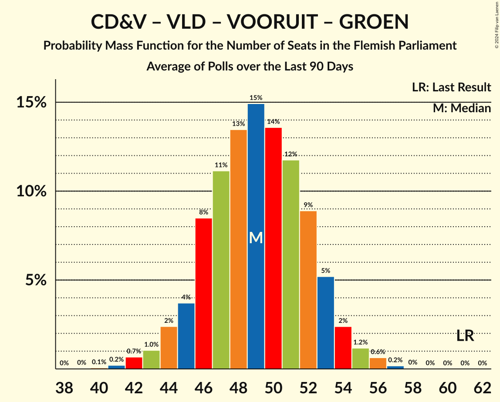

# Poll Average

<a href="#voting-intentions">Voting Intentions</a> | <a href="#seats">Seats</a> | <a href="#coalitions">Coalitions</a> | <a href="#technical-information">Technical Information</a>

## Summary

The table below lists the polls on which the average is based. They are the most recent polls (less than 90 days old) registered and analyzed so far.

| Period     | Polling firm/Commissioner(s) | N-VA | VB | CD&V | VLD | VOORUIT | GROEN | PVDA |
|:----------:|:----------------------------:|:--:|:--:|:--:|:--:|:--:|:--:|:--:|
| 26 May 2019 | General Election | 24.8%   35 | 18.5%   23 | 15.4%   19 | 13.1%   16 | 10.1%   12 | 10.1%   14 | 5.3%   4 |
| N/A | Poll Average | 20–24%   27–33 | 23–28%   30–38 | 8–12%   10–14 | 10–13%   12–16 | 11–14%   13–19 | 7–12%   8–16 | 6–9%   7–11 |
| [25 May–1 June 2021](2021-06-01-Ipsos.html) | Ipsos   Het Laatste Nieuws, Le Soir, RTL TVi and VTM | 19–24%   26–33 | 24–29%   30–39 | 8–12%   9–14 | 10–14%   11–17 | 11–15%   13–19 | 7–10%   7–14 | 6–10%   6–12 |
| [29 March–19 April 2021](2021-04-19-TNS.html) | TNS   De Standaard and VRT | 20–23%   27–31 | 23–27%   29–35 | 9–11%   10–13 | 10–13%   12–16 | 11–14%   13–18 | 10–12%   12–16 | 7–9%   7–10 |
| 26 May 2019 | General Election | 24.8%   35 | 18.5%   23 | 15.4%   19 | 13.1%   16 | 10.1%   12 | 10.1%   14 | 5.3%   4 |

Only polls for which at least the sample size has been published are included in the table above.

**Legend:**
+ **Top half of each row:** Voting intentions (95% confidence interval)
+ **Bottom half of each row:** Seat projections for the Flemish Parliament (95% confidence interval)
+ **N-VA:** Nieuw-Vlaamse Alliantie
+ **VB:** Vlaams Belang
+ **CD&V:** Christen-Democratisch en Vlaams
+ **VLD:** Open Vlaamse Liberalen en Democraten
+ **VOORUIT:** Vooruit
+ **GROEN:** Groen
+ **PVDA:** Partij van de Arbeid van België
+ **N/A (single party):** Party not included the published results
+ **N/A (entire row):** Calculation for this opinion poll not started yet

## Voting Intentions

### Confidence Intervals

| Party | Last Result | Median | 80% Confidence Interval | 90% Confidence Interval | 95% Confidence Interval | 99% Confidence Interval |
|:-----:|:-----------:|:------:|:-----------------------:|:-----------------------:|:-----------------------:|:-----------------------:|
| <a href="#nieuw-vlaamse-alliantie">Nieuw-Vlaamse Alliantie</a> | 24.8% | 21.7% | 20.3–23.2% |19.9–23.6% | 19.5–24.1% | 18.8–24.9% |
| <a href="#vlaams-belang">Vlaams Belang</a> | 18.5% | 25.4% | 23.8–27.4% |23.4–28.0% | 23.1–28.5% | 22.4–29.5% |
| <a href="#christen-democratisch-en-vlaams">Christen-Democratisch en Vlaams</a> | 15.4% | 10.0% | 9.0–11.1% |8.7–11.5% | 8.5–11.8% | 7.9–12.4% |
| <a href="#open-vlaamse-liberalen-en-democraten">Open Vlaamse Liberalen en Democraten</a> | 13.1% | 11.5% | 10.4–12.6% |10.1–13.0% | 9.8–13.3% | 9.2–13.9% |
| <a href="#vooruit">Vooruit</a> | 10.1% | 12.3% | 11.2–13.6% |10.9–14.0% | 10.6–14.4% | 10.1–15.2% |
| <a href="#groen">Groen</a> | 10.1% | 9.8% | 7.6–11.5% |7.3–11.9% | 7.0–12.1% | 6.5–12.7% |
| <a href="#partij-van-de-arbeid-van-belgië">Partij van de Arbeid van België</a> | 5.3% | 7.9% | 7.0–8.9% |6.7–9.2% | 6.5–9.4% | 6.0–10.0% |

### Nieuw-Vlaamse Alliantie

*For a full overview of the results for this party, see the [Nieuw-Vlaamse Alliantie](party-nieuw-vlaamsealliantie.html) page.*

| Voting Intentions | Probability | Accumulated | Special Marks |
|:-----------------:|:-----------:|:-----------:|:-------------:|
| 16.5–17.5% | 0% | 100% |  |
| 17.5–18.5% | 0.2% | 100% |  |
| 18.5–19.5% | 2% | 99.7% |  |
| 19.5–20.5% | 12% | 97% |  |
| 20.5–21.5% | 31% | 85% |  |
| 21.5–22.5% | 32% | 54% | Median |
| 22.5–23.5% | 16% | 21% |  |
| 23.5–24.5% | 5% | 6% |  |
| 24.5–25.5% | 0.9% | 1.0% | Last Result |
| 25.5–26.5% | 0.1% | 0.1% |  |
| 26.5–27.5% | 0% | 0% |  |

### Vlaams Belang

*For a full overview of the results for this party, see the [Vlaams Belang](party-vlaamsbelang.html) page.*

| Voting Intentions | Probability | Accumulated | Special Marks |
|:-----------------:|:-----------:|:-----------:|:-------------:|
| 18.5–19.5% | 0% | 100% | Last Result |
| 19.5–20.5% | 0% | 100% |  |
| 20.5–21.5% | 0% | 100% |  |
| 21.5–22.5% | 0.7% | 100% |  |
| 22.5–23.5% | 6% | 99.3% |  |
| 23.5–24.5% | 20% | 93% |  |
| 24.5–25.5% | 29% | 73% | Median |
| 25.5–26.5% | 23% | 45% |  |
| 26.5–27.5% | 13% | 22% |  |
| 27.5–28.5% | 6% | 8% |  |
| 28.5–29.5% | 2% | 2% |  |
| 29.5–30.5% | 0.4% | 0.4% |  |
| 30.5–31.5% | 0.1% | 0.1% |  |
| 31.5–32.5% | 0% | 0% |  |

### Christen-Democratisch en Vlaams

*For a full overview of the results for this party, see the [Christen-Democratisch en Vlaams](party-christen-democratischenvlaams.html) page.*

| Voting Intentions | Probability | Accumulated | Special Marks |
|:-----------------:|:-----------:|:-----------:|:-------------:|
| 5.5–6.5% | 0% | 100% |  |
| 6.5–7.5% | 0.1% | 100% |  |
| 7.5–8.5% | 3% | 99.9% |  |
| 8.5–9.5% | 24% | 97% |  |
| 9.5–10.5% | 46% | 73% | Median |
| 10.5–11.5% | 23% | 26% |  |
| 11.5–12.5% | 4% | 4% |  |
| 12.5–13.5% | 0.3% | 0.3% |  |
| 13.5–14.5% | 0% | 0% |  |
| 14.5–15.5% | 0% | 0% | Last Result |

### Open Vlaamse Liberalen en Democraten

*For a full overview of the results for this party, see the [Open Vlaamse Liberalen en Democraten](party-openvlaamseliberalenendemocraten.html) page.*

| Voting Intentions | Probability | Accumulated | Special Marks |
|:-----------------:|:-----------:|:-----------:|:-------------:|
| 7.5–8.5% | 0% | 100% |  |
| 8.5–9.5% | 1.3% | 100% |  |
| 9.5–10.5% | 12% | 98.7% |  |
| 10.5–11.5% | 39% | 87% | Median |
| 11.5–12.5% | 36% | 48% |  |
| 12.5–13.5% | 10% | 12% | Last Result |
| 13.5–14.5% | 1.2% | 1.3% |  |
| 14.5–15.5% | 0.1% | 0.1% |  |
| 15.5–16.5% | 0% | 0% |  |

### Vooruit

*For a full overview of the results for this party, see the [Vooruit](party-vooruit.html) page.*

| Voting Intentions | Probability | Accumulated | Special Marks |
|:-----------------:|:-----------:|:-----------:|:-------------:|
| 8.5–9.5% | 0% | 100% |  |
| 9.5–10.5% | 2% | 100% | Last Result |
| 10.5–11.5% | 18% | 98% |  |
| 11.5–12.5% | 41% | 80% | Median |
| 12.5–13.5% | 28% | 39% |  |
| 13.5–14.5% | 9% | 11% |  |
| 14.5–15.5% | 2% | 2% |  |
| 15.5–16.5% | 0.2% | 0.2% |  |
| 16.5–17.5% | 0% | 0% |  |

### Groen

*For a full overview of the results for this party, see the [Groen](party-groen.html) page.*

| Voting Intentions | Probability | Accumulated | Special Marks |
|:-----------------:|:-----------:|:-----------:|:-------------:|
| 4.5–5.5% | 0% | 100% |  |
| 5.5–6.5% | 0.7% | 100% |  |
| 6.5–7.5% | 8% | 99.3% |  |
| 7.5–8.5% | 21% | 91% |  |
| 8.5–9.5% | 17% | 70% |  |
| 9.5–10.5% | 18% | 53% | Last Result, Median |
| 10.5–11.5% | 26% | 36% |  |
| 11.5–12.5% | 9% | 10% |  |
| 12.5–13.5% | 0.7% | 0.7% |  |
| 13.5–14.5% | 0% | 0% |  |

### Partij van de Arbeid van België

*For a full overview of the results for this party, see the [Partij van de Arbeid van België](party-partijvandearbeidvanbelgië.html) page.*

| Voting Intentions | Probability | Accumulated | Special Marks |
|:-----------------:|:-----------:|:-----------:|:-------------:|
| 4.5–5.5% | 0.1% | 100% | Last Result |
| 5.5–6.5% | 3% | 99.9% |  |
| 6.5–7.5% | 28% | 97% |  |
| 7.5–8.5% | 50% | 69% | Median |
| 8.5–9.5% | 17% | 19% |  |
| 9.5–10.5% | 2% | 2% |  |
| 10.5–11.5% | 0.1% | 0.1% |  |
| 11.5–12.5% | 0% | 0% |  |

## Seats

### Confidence Intervals

| Party | Last Result | Median | 80% Confidence Interval | 90% Confidence Interval | 95% Confidence Interval | 99% Confidence Interval |
|:-----:|:-----------:|:------:|:-----------------------:|:-----------------------:|:-----------------------:|:-----------------------:|
| <a href="#nieuw-vlaamse-alliantie">Nieuw-Vlaamse Alliantie</a> | 35 | 28 | 27–31 |27–32 | 27–33 | 25–33 |
| <a href="#vlaams-belang">Vlaams Belang</a> | 23 | 34 | 31–36 |30–37 | 30–38 | 29–40 |
| <a href="#christen-democratisch-en-vlaams">Christen-Democratisch en Vlaams</a> | 19 | 12 | 10–13 |10–14 | 10–14 | 9–15 |
| <a href="#open-vlaamse-liberalen-en-democraten">Open Vlaamse Liberalen en Democraten</a> | 16 | 15 | 12–16 |12–16 | 12–16 | 11–18 |
| <a href="#vooruit">Vooruit</a> | 12 | 15 | 14–18 |14–18 | 13–19 | 13–19 |
| <a href="#groen">Groen</a> | 14 | 13 | 10–15 |9–15 | 8–16 | 7–17 |
| <a href="#partij-van-de-arbeid-van-belgië">Partij van de Arbeid van België</a> | 4 | 8 | 7–9 |7–10 | 7–11 | 5–13 |

### Nieuw-Vlaamse Alliantie

*For a full overview of the results for this party, see the [Nieuw-Vlaamse Alliantie](party-nieuw-vlaamsealliantie.html) page.*

| Number of Seats | Probability | Accumulated | Special Marks |
|:---------------:|:-----------:|:-----------:|:-------------:|
| 23 | 0.1% | 100% |  |
| 24 | 0.2% | 99.8% |  |
| 25 | 0.7% | 99.7% |  |
| 26 | 1.4% | 99.0% |  |
| 27 | 34% | 98% |  |
| 28 | 29% | 64% | Median |
| 29 | 15% | 35% |  |
| 30 | 9% | 20% |  |
| 31 | 4% | 10% |  |
| 32 | 3% | 6% |  |
| 33 | 3% | 3% |  |
| 34 | 0.2% | 0.2% |  |
| 35 | 0% | 0.1% | Last Result |
| 36 | 0% | 0% |  |

### Vlaams Belang

*For a full overview of the results for this party, see the [Vlaams Belang](party-vlaamsbelang.html) page.*

| Number of Seats | Probability | Accumulated | Special Marks |
|:---------------:|:-----------:|:-----------:|:-------------:|
| 23 | 0% | 100% | Last Result |
| 24 | 0% | 100% |  |
| 25 | 0% | 100% |  |
| 26 | 0% | 100% |  |
| 27 | 0.1% | 100% |  |
| 28 | 0.3% | 99.9% |  |
| 29 | 2% | 99.6% |  |
| 30 | 4% | 98% |  |
| 31 | 5% | 94% |  |
| 32 | 8% | 89% |  |
| 33 | 15% | 81% |  |
| 34 | 43% | 66% | Median |
| 35 | 13% | 23% |  |
| 36 | 4% | 10% |  |
| 37 | 3% | 6% |  |
| 38 | 1.1% | 3% |  |
| 39 | 1.2% | 2% |  |
| 40 | 0.8% | 1.0% |  |
| 41 | 0.1% | 0.2% |  |
| 42 | 0.1% | 0.1% |  |
| 43 | 0% | 0% |  |

### Christen-Democratisch en Vlaams

*For a full overview of the results for this party, see the [Christen-Democratisch en Vlaams](party-christen-democratischenvlaams.html) page.*

| Number of Seats | Probability | Accumulated | Special Marks |
|:---------------:|:-----------:|:-----------:|:-------------:|
| 7 | 0% | 100% |  |
| 8 | 0.1% | 99.9% |  |
| 9 | 2% | 99.8% |  |
| 10 | 12% | 98% |  |
| 11 | 27% | 86% |  |
| 12 | 48% | 60% | Median |
| 13 | 5% | 11% |  |
| 14 | 5% | 6% |  |
| 15 | 0.9% | 1.1% |  |
| 16 | 0.2% | 0.3% |  |
| 17 | 0% | 0% |  |
| 18 | 0% | 0% |  |
| 19 | 0% | 0% | Last Result |

### Open Vlaamse Liberalen en Democraten

*For a full overview of the results for this party, see the [Open Vlaamse Liberalen en Democraten](party-openvlaamseliberalenendemocraten.html) page.*

| Number of Seats | Probability | Accumulated | Special Marks |
|:---------------:|:-----------:|:-----------:|:-------------:|
| 11 | 2% | 100% |  |
| 12 | 9% | 98% |  |
| 13 | 10% | 89% |  |
| 14 | 26% | 79% |  |
| 15 | 27% | 53% | Median |
| 16 | 23% | 25% | Last Result |
| 17 | 1.5% | 2% |  |
| 18 | 0.3% | 0.7% |  |
| 19 | 0.4% | 0.4% |  |
| 20 | 0% | 0% |  |

### Vooruit

*For a full overview of the results for this party, see the [Vooruit](party-vooruit.html) page.*

| Number of Seats | Probability | Accumulated | Special Marks |
|:---------------:|:-----------:|:-----------:|:-------------:|
| 11 | 0.1% | 100% |  |
| 12 | 0.3% | 99.9% | Last Result |
| 13 | 3% | 99.6% |  |
| 14 | 30% | 96% |  |
| 15 | 28% | 66% | Median |
| 16 | 12% | 38% |  |
| 17 | 11% | 26% |  |
| 18 | 11% | 15% |  |
| 19 | 4% | 4% |  |
| 20 | 0.2% | 0.3% |  |
| 21 | 0% | 0.1% |  |
| 22 | 0% | 0% |  |

### Groen

*For a full overview of the results for this party, see the [Groen](party-groen.html) page.*

| Number of Seats | Probability | Accumulated | Special Marks |
|:---------------:|:-----------:|:-----------:|:-------------:|
| 5 | 0.3% | 100% |  |
| 6 | 0.1% | 99.7% |  |
| 7 | 2% | 99.6% |  |
| 8 | 2% | 98% |  |
| 9 | 2% | 96% |  |
| 10 | 10% | 93% |  |
| 11 | 29% | 84% |  |
| 12 | 3% | 55% |  |
| 13 | 4% | 52% | Median |
| 14 | 18% | 47% | Last Result |
| 15 | 26% | 30% |  |
| 16 | 3% | 4% |  |
| 17 | 0.7% | 1.2% |  |
| 18 | 0.4% | 0.5% |  |
| 19 | 0.1% | 0.1% |  |
| 20 | 0% | 0% |  |

### Partij van de Arbeid van België

*For a full overview of the results for this party, see the [Partij van de Arbeid van België](party-partijvandearbeidvanbelgië.html) page.*

| Number of Seats | Probability | Accumulated | Special Marks |
|:---------------:|:-----------:|:-----------:|:-------------:|
| 4 | 0.1% | 100% | Last Result |
| 5 | 0.9% | 99.9% |  |
| 6 | 1.4% | 99.0% |  |
| 7 | 41% | 98% |  |
| 8 | 43% | 57% | Median |
| 9 | 6% | 14% |  |
| 10 | 4% | 7% |  |
| 11 | 1.3% | 3% |  |
| 12 | 0.8% | 2% |  |
| 13 | 1.0% | 1.0% |  |
| 14 | 0% | 0% |  |

## Coalitions

### Confidence Intervals

| Coalition | Last Result | Median | Majority? | 80% Confidence Interval | 90% Confidence Interval | 95% Confidence Interval | 99% Confidence Interval |
|:---------:|:-----------:|:------:|:---------:|:-----------------------:|:-----------------------:|:-----------------------:|:-----------------------:|
| Nieuw-Vlaamse Alliantie – Vlaams Belang – Christen-Democratisch en Vlaams | 77 | 73 | 100% | 71–77 | 70–78 | 69–79 | 68–80 |
| Nieuw-Vlaamse Alliantie – Christen-Democratisch en Vlaams – Open Vlaamse Liberalen en Democraten – Vooruit | 82 | 70 | 100% | 67–73 | 67–73 | 66–74 | 65–76 |
| Nieuw-Vlaamse Alliantie – Vlaams Belang | 58 | 62 | 38% | 60–65 | 59–66 | 58–67 | 56–69 |
| Nieuw-Vlaamse Alliantie – Open Vlaamse Liberalen en Democraten – Vooruit | 63 | 58 | 3% | 56–61 | 56–62 | 55–63 | 53–65 |
| Nieuw-Vlaamse Alliantie – Christen-Democratisch en Vlaams – Vooruit | 66 | 55 | 0.3% | 53–58 | 52–59 | 52–60 | 51–62 |
| Nieuw-Vlaamse Alliantie – Christen-Democratisch en Vlaams – Open Vlaamse Liberalen en Democraten | 70 | 54 | 0% | 52–57 | 51–58 | 50–58 | 49–60 |
| Christen-Democratisch en Vlaams – Open Vlaamse Liberalen en Democraten – Vooruit – Groen | 61 | 55 | 0% | 51–57 | 50–57 | 49–58 | 47–60 |
| Christen-Democratisch en Vlaams – Vooruit – Groen – Partij van de Arbeid van België | 49 | 48 | 0% | 44–50 | 43–51 | 43–52 | 41–53 |
| Nieuw-Vlaamse Alliantie – Open Vlaamse Liberalen en Democraten | 51 | 43 | 0% | 41–45 | 40–46 | 39–47 | 38–49 |
| Open Vlaamse Liberalen en Democraten – Vooruit – Groen | 42 | 43 | 0% | 39–45 | 38–46 | 37–47 | 35–48 |
| Christen-Democratisch en Vlaams – Open Vlaamse Liberalen en Democraten – Vooruit | 47 | 41 | 0% | 39–44 | 38–45 | 38–46 | 36–47 |
| Nieuw-Vlaamse Alliantie – Christen-Democratisch en Vlaams | 54 | 40 | 0% | 38–42 | 37–44 | 37–44 | 36–46 |
| Christen-Democratisch en Vlaams – Vooruit – Groen | 45 | 40 | 0% | 36–42 | 36–43 | 35–44 | 33–45 |
| Christen-Democratisch en Vlaams – Open Vlaamse Liberalen en Democraten – Groen | 49 | 39 | 0% | 35–42 | 34–42 | 33–43 | 31–44 |
| Open Vlaamse Liberalen en Democraten – Vooruit | 28 | 30 | 0% | 28–32 | 27–33 | 26–34 | 25–35 |
| Christen-Democratisch en Vlaams – Vooruit | 31 | 27 | 0% | 25–30 | 25–31 | 24–31 | 23–32 |
| Christen-Democratisch en Vlaams – Open Vlaamse Liberalen en Democraten | 35 | 26 | 0% | 24–28 | 23–29 | 22–29 | 22–30 |

### Nieuw-Vlaamse Alliantie – Vlaams Belang – Christen-Democratisch en Vlaams

| Number of Seats | Probability | Accumulated | Special Marks |
|:---------------:|:-----------:|:-----------:|:-------------:|
| 66 | 0.1% | 100% |  |
| 67 | 0.3% | 99.9% |  |
| 68 | 0.6% | 99.6% |  |
| 69 | 2% | 98.9% |  |
| 70 | 4% | 97% |  |
| 71 | 8% | 93% |  |
| 72 | 19% | 85% |  |
| 73 | 17% | 67% |  |
| 74 | 16% | 50% | Median |
| 75 | 12% | 34% |  |
| 76 | 10% | 21% |  |
| 77 | 5% | 12% | Last Result |
| 78 | 3% | 7% |  |
| 79 | 2% | 4% |  |
| 80 | 1.0% | 1.5% |  |
| 81 | 0.4% | 0.5% |  |
| 82 | 0.1% | 0.1% |  |
| 83 | 0% | 0% |  |

### Nieuw-Vlaamse Alliantie – Christen-Democratisch en Vlaams – Open Vlaamse Liberalen en Democraten – Vooruit

| Number of Seats | Probability | Accumulated | Special Marks |
|:---------------:|:-----------:|:-----------:|:-------------:|
| 63 | 0.1% | 100% | Majority |
| 64 | 0.3% | 99.9% |  |
| 65 | 0.8% | 99.6% |  |
| 66 | 2% | 98.8% |  |
| 67 | 7% | 97% |  |
| 68 | 20% | 90% |  |
| 69 | 18% | 69% |  |
| 70 | 13% | 52% | Median |
| 71 | 15% | 39% |  |
| 72 | 13% | 24% |  |
| 73 | 6% | 11% |  |
| 74 | 3% | 5% |  |
| 75 | 1.3% | 2% |  |
| 76 | 0.5% | 0.9% |  |
| 77 | 0.2% | 0.3% |  |
| 78 | 0.1% | 0.1% |  |
| 79 | 0% | 0% |  |
| 80 | 0% | 0% |  |
| 81 | 0% | 0% |  |
| 82 | 0% | 0% | Last Result |

### Nieuw-Vlaamse Alliantie – Vlaams Belang

| Number of Seats | Probability | Accumulated | Special Marks |
|:---------------:|:-----------:|:-----------:|:-------------:|
| 55 | 0.1% | 100% |  |
| 56 | 0.5% | 99.9% |  |
| 57 | 1.1% | 99.4% |  |
| 58 | 3% | 98% | Last Result |
| 59 | 6% | 96% |  |
| 60 | 11% | 90% |  |
| 61 | 27% | 79% |  |
| 62 | 14% | 52% | Median |
| 63 | 13% | 38% | Majority |
| 64 | 11% | 25% |  |
| 65 | 6% | 14% |  |
| 66 | 3% | 8% |  |
| 67 | 3% | 5% |  |
| 68 | 1.2% | 2% |  |
| 69 | 0.4% | 0.7% |  |
| 70 | 0.2% | 0.2% |  |
| 71 | 0% | 0.1% |  |
| 72 | 0% | 0% |  |

### Nieuw-Vlaamse Alliantie – Open Vlaamse Liberalen en Democraten – Vooruit

| Number of Seats | Probability | Accumulated | Special Marks |
|:---------------:|:-----------:|:-----------:|:-------------:|
| 52 | 0.1% | 100% |  |
| 53 | 0.5% | 99.8% |  |
| 54 | 1.4% | 99.3% |  |
| 55 | 3% | 98% |  |
| 56 | 17% | 95% |  |
| 57 | 20% | 78% |  |
| 58 | 15% | 58% | Median |
| 59 | 13% | 43% |  |
| 60 | 16% | 29% |  |
| 61 | 7% | 13% |  |
| 62 | 3% | 6% |  |
| 63 | 2% | 3% | Last Result, Majority |
| 64 | 1.0% | 2% |  |
| 65 | 0.3% | 0.6% |  |
| 66 | 0.2% | 0.3% |  |
| 67 | 0.1% | 0.1% |  |
| 68 | 0% | 0% |  |

### Nieuw-Vlaamse Alliantie – Christen-Democratisch en Vlaams – Vooruit

| Number of Seats | Probability | Accumulated | Special Marks |
|:---------------:|:-----------:|:-----------:|:-------------:|
| 49 | 0.1% | 100% |  |
| 50 | 0.2% | 99.9% |  |
| 51 | 1.3% | 99.7% |  |
| 52 | 7% | 98% |  |
| 53 | 14% | 92% |  |
| 54 | 19% | 78% |  |
| 55 | 13% | 59% | Median |
| 56 | 15% | 46% |  |
| 57 | 10% | 31% |  |
| 58 | 12% | 21% |  |
| 59 | 4% | 9% |  |
| 60 | 2% | 4% |  |
| 61 | 1.2% | 2% |  |
| 62 | 0.4% | 0.7% |  |
| 63 | 0.2% | 0.3% | Majority |
| 64 | 0.1% | 0.1% |  |
| 65 | 0% | 0% |  |
| 66 | 0% | 0% | Last Result |

### Nieuw-Vlaamse Alliantie – Christen-Democratisch en Vlaams – Open Vlaamse Liberalen en Democraten

| Number of Seats | Probability | Accumulated | Special Marks |
|:---------------:|:-----------:|:-----------:|:-------------:|
| 48 | 0.1% | 100% |  |
| 49 | 0.5% | 99.8% |  |
| 50 | 2% | 99.3% |  |
| 51 | 3% | 97% |  |
| 52 | 7% | 94% |  |
| 53 | 19% | 87% |  |
| 54 | 21% | 68% |  |
| 55 | 21% | 47% | Median |
| 56 | 13% | 27% |  |
| 57 | 8% | 14% |  |
| 58 | 3% | 5% |  |
| 59 | 1.4% | 2% |  |
| 60 | 0.8% | 1.1% |  |
| 61 | 0.2% | 0.3% |  |
| 62 | 0.1% | 0.1% |  |
| 63 | 0% | 0% | Majority |
| 64 | 0% | 0% |  |
| 65 | 0% | 0% |  |
| 66 | 0% | 0% |  |
| 67 | 0% | 0% |  |
| 68 | 0% | 0% |  |
| 69 | 0% | 0% |  |
| 70 | 0% | 0% | Last Result |

### Christen-Democratisch en Vlaams – Open Vlaamse Liberalen en Democraten – Vooruit – Groen

| Number of Seats | Probability | Accumulated | Special Marks |
|:---------------:|:-----------:|:-----------:|:-------------:|
| 45 | 0.1% | 100% |  |
| 46 | 0.2% | 99.9% |  |
| 47 | 0.5% | 99.7% |  |
| 48 | 1.3% | 99.2% |  |
| 49 | 2% | 98% |  |
| 50 | 3% | 96% |  |
| 51 | 5% | 93% |  |
| 52 | 13% | 88% |  |
| 53 | 9% | 75% |  |
| 54 | 15% | 66% |  |
| 55 | 20% | 51% | Median |
| 56 | 20% | 31% |  |
| 57 | 6% | 11% |  |
| 58 | 3% | 5% |  |
| 59 | 1.1% | 2% |  |
| 60 | 0.5% | 0.6% |  |
| 61 | 0.1% | 0.1% | Last Result |
| 62 | 0% | 0% |  |

### Christen-Democratisch en Vlaams – Vooruit – Groen – Partij van de Arbeid van België

| Number of Seats | Probability | Accumulated | Special Marks |
|:---------------:|:-----------:|:-----------:|:-------------:|
| 39 | 0.1% | 100% |  |
| 40 | 0.2% | 99.9% |  |
| 41 | 0.4% | 99.7% |  |
| 42 | 1.2% | 99.3% |  |
| 43 | 3% | 98% |  |
| 44 | 7% | 95% |  |
| 45 | 9% | 88% |  |
| 46 | 9% | 79% |  |
| 47 | 16% | 71% |  |
| 48 | 18% | 55% | Median |
| 49 | 23% | 37% | Last Result |
| 50 | 7% | 14% |  |
| 51 | 4% | 7% |  |
| 52 | 2% | 3% |  |
| 53 | 0.7% | 1.0% |  |
| 54 | 0.2% | 0.3% |  |
| 55 | 0.1% | 0.1% |  |
| 56 | 0% | 0% |  |

### Nieuw-Vlaamse Alliantie – Open Vlaamse Liberalen en Democraten

| Number of Seats | Probability | Accumulated | Special Marks |
|:---------------:|:-----------:|:-----------:|:-------------:|
| 36 | 0% | 100% |  |
| 37 | 0.2% | 99.9% |  |
| 38 | 0.7% | 99.8% |  |
| 39 | 2% | 99.0% |  |
| 40 | 4% | 97% |  |
| 41 | 16% | 93% |  |
| 42 | 23% | 77% |  |
| 43 | 23% | 54% | Median |
| 44 | 16% | 32% |  |
| 45 | 8% | 15% |  |
| 46 | 4% | 7% |  |
| 47 | 2% | 3% |  |
| 48 | 1.0% | 2% |  |
| 49 | 0.5% | 0.6% |  |
| 50 | 0.1% | 0.1% |  |
| 51 | 0% | 0% | Last Result |

### Open Vlaamse Liberalen en Democraten – Vooruit – Groen

| Number of Seats | Probability | Accumulated | Special Marks |
|:---------------:|:-----------:|:-----------:|:-------------:|
| 33 | 0% | 100% |  |
| 34 | 0.1% | 99.9% |  |
| 35 | 0.4% | 99.8% |  |
| 36 | 0.7% | 99.5% |  |
| 37 | 2% | 98.8% |  |
| 38 | 3% | 97% |  |
| 39 | 3% | 93% |  |
| 40 | 9% | 90% |  |
| 41 | 11% | 81% |  |
| 42 | 14% | 69% | Last Result |
| 43 | 15% | 55% | Median |
| 44 | 24% | 40% |  |
| 45 | 9% | 16% |  |
| 46 | 5% | 7% |  |
| 47 | 2% | 3% |  |
| 48 | 0.6% | 1.0% |  |
| 49 | 0.3% | 0.3% |  |
| 50 | 0% | 0.1% |  |
| 51 | 0% | 0% |  |

### Christen-Democratisch en Vlaams – Open Vlaamse Liberalen en Democraten – Vooruit

| Number of Seats | Probability | Accumulated | Special Marks |
|:---------------:|:-----------:|:-----------:|:-------------:|
| 35 | 0.1% | 100% |  |
| 36 | 0.6% | 99.9% |  |
| 37 | 1.2% | 99.3% |  |
| 38 | 3% | 98% |  |
| 39 | 6% | 95% |  |
| 40 | 14% | 89% |  |
| 41 | 30% | 74% |  |
| 42 | 16% | 44% | Median |
| 43 | 13% | 28% |  |
| 44 | 6% | 15% |  |
| 45 | 5% | 8% |  |
| 46 | 2% | 3% |  |
| 47 | 0.7% | 0.9% | Last Result |
| 48 | 0.1% | 0.2% |  |
| 49 | 0% | 0.1% |  |
| 50 | 0% | 0% |  |

### Nieuw-Vlaamse Alliantie – Christen-Democratisch en Vlaams

| Number of Seats | Probability | Accumulated | Special Marks |
|:---------------:|:-----------:|:-----------:|:-------------:|
| 34 | 0.1% | 100% |  |
| 35 | 0.2% | 99.9% |  |
| 36 | 1.0% | 99.7% |  |
| 37 | 4% | 98.7% |  |
| 38 | 14% | 94% |  |
| 39 | 26% | 80% |  |
| 40 | 21% | 55% | Median |
| 41 | 15% | 34% |  |
| 42 | 10% | 18% |  |
| 43 | 3% | 8% |  |
| 44 | 3% | 5% |  |
| 45 | 1.4% | 2% |  |
| 46 | 0.4% | 0.7% |  |
| 47 | 0.2% | 0.2% |  |
| 48 | 0% | 0% |  |
| 49 | 0% | 0% |  |
| 50 | 0% | 0% |  |
| 51 | 0% | 0% |  |
| 52 | 0% | 0% |  |
| 53 | 0% | 0% |  |
| 54 | 0% | 0% | Last Result |

### Christen-Democratisch en Vlaams – Vooruit – Groen

| Number of Seats | Probability | Accumulated | Special Marks |
|:---------------:|:-----------:|:-----------:|:-------------:|
| 31 | 0.1% | 100% |  |
| 32 | 0.3% | 99.9% |  |
| 33 | 0.4% | 99.6% |  |
| 34 | 1.4% | 99.2% |  |
| 35 | 2% | 98% |  |
| 36 | 6% | 96% |  |
| 37 | 9% | 90% |  |
| 38 | 7% | 81% |  |
| 39 | 14% | 74% |  |
| 40 | 19% | 60% | Median |
| 41 | 21% | 41% |  |
| 42 | 13% | 20% |  |
| 43 | 4% | 6% |  |
| 44 | 2% | 3% |  |
| 45 | 0.6% | 0.8% | Last Result |
| 46 | 0.1% | 0.2% |  |
| 47 | 0% | 0% |  |

### Christen-Democratisch en Vlaams – Open Vlaamse Liberalen en Democraten – Groen

| Number of Seats | Probability | Accumulated | Special Marks |
|:---------------:|:-----------:|:-----------:|:-------------:|
| 29 | 0.1% | 100% |  |
| 30 | 0.2% | 99.9% |  |
| 31 | 0.4% | 99.8% |  |
| 32 | 0.9% | 99.3% |  |
| 33 | 3% | 98% |  |
| 34 | 3% | 95% |  |
| 35 | 3% | 93% |  |
| 36 | 9% | 89% |  |
| 37 | 18% | 81% |  |
| 38 | 12% | 63% |  |
| 39 | 7% | 51% |  |
| 40 | 13% | 44% | Median |
| 41 | 13% | 31% |  |
| 42 | 13% | 18% |  |
| 43 | 3% | 4% |  |
| 44 | 1.1% | 1.5% |  |
| 45 | 0.3% | 0.4% |  |
| 46 | 0.1% | 0.1% |  |
| 47 | 0% | 0% |  |
| 48 | 0% | 0% |  |
| 49 | 0% | 0% | Last Result |

### Open Vlaamse Liberalen en Democraten – Vooruit

| Number of Seats | Probability | Accumulated | Special Marks |
|:---------------:|:-----------:|:-----------:|:-------------:|
| 24 | 0.1% | 100% |  |
| 25 | 0.5% | 99.9% |  |
| 26 | 3% | 99.4% |  |
| 27 | 5% | 97% |  |
| 28 | 8% | 92% | Last Result |
| 29 | 28% | 84% |  |
| 30 | 24% | 56% | Median |
| 31 | 14% | 32% |  |
| 32 | 10% | 18% |  |
| 33 | 5% | 9% |  |
| 34 | 2% | 4% |  |
| 35 | 0.9% | 1.2% |  |
| 36 | 0.2% | 0.3% |  |
| 37 | 0% | 0.1% |  |
| 38 | 0% | 0% |  |

### Christen-Democratisch en Vlaams – Vooruit

| Number of Seats | Probability | Accumulated | Special Marks |
|:---------------:|:-----------:|:-----------:|:-------------:|
| 22 | 0.1% | 100% |  |
| 23 | 0.6% | 99.9% |  |
| 24 | 4% | 99.3% |  |
| 25 | 13% | 95% |  |
| 26 | 26% | 83% |  |
| 27 | 24% | 57% | Median |
| 28 | 12% | 33% |  |
| 29 | 9% | 21% |  |
| 30 | 7% | 12% |  |
| 31 | 4% | 5% | Last Result |
| 32 | 0.7% | 1.0% |  |
| 33 | 0.2% | 0.3% |  |
| 34 | 0% | 0.1% |  |
| 35 | 0% | 0% |  |

### Christen-Democratisch en Vlaams – Open Vlaamse Liberalen en Democraten

| Number of Seats | Probability | Accumulated | Special Marks |
|:---------------:|:-----------:|:-----------:|:-------------:|
| 20 | 0% | 100% |  |
| 21 | 0.3% | 99.9% |  |
| 22 | 3% | 99.6% |  |
| 23 | 5% | 97% |  |
| 24 | 7% | 92% |  |
| 25 | 16% | 85% |  |
| 26 | 26% | 69% |  |
| 27 | 28% | 43% | Median |
| 28 | 10% | 15% |  |
| 29 | 3% | 5% |  |
| 30 | 2% | 2% |  |
| 31 | 0.3% | 0.4% |  |
| 32 | 0.1% | 0.1% |  |
| 33 | 0% | 0% |  |
| 34 | 0% | 0% |  |
| 35 | 0% | 0% | Last Result |

## Technical Information

+ **Number of polls included in this average:** 2
+ **Lowest number of simulations done in a poll included in this average:** 524,288
+ **Total number of simulations done in the polls included in this average:** 1,572,864
+ **Error estimate:** 1.34%
