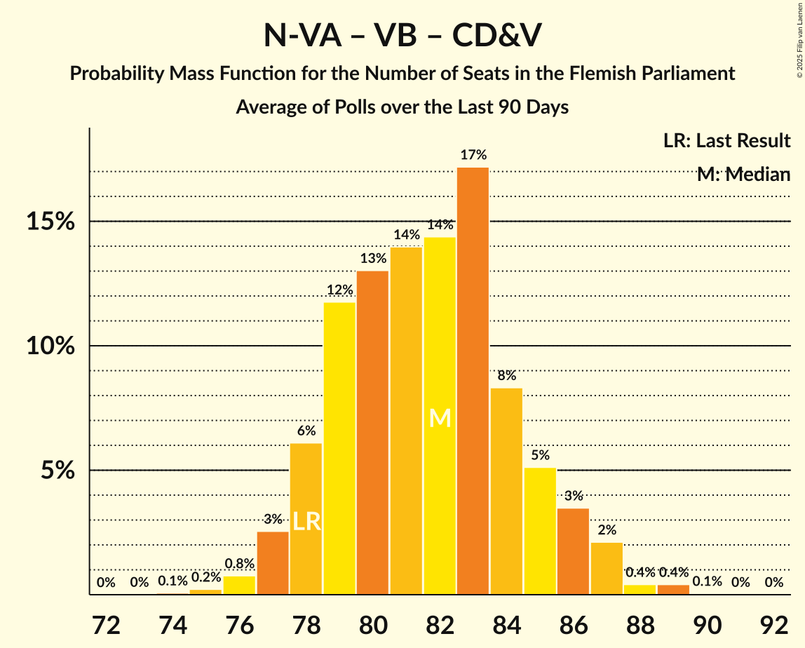
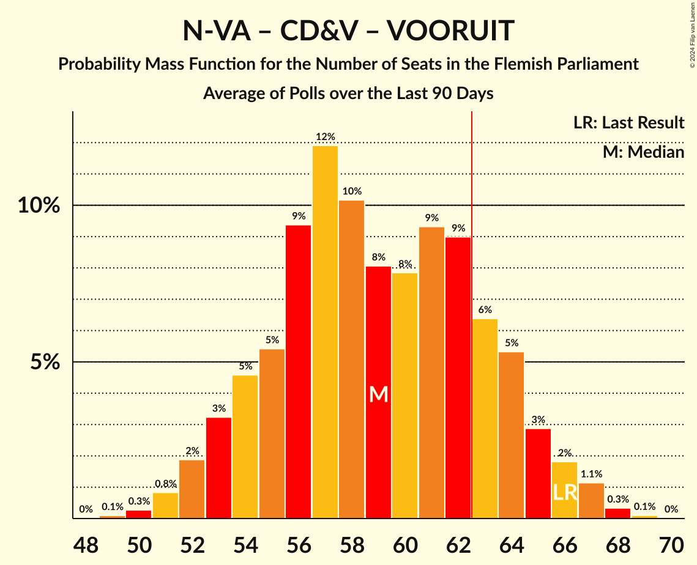

# Poll Average

<a href="#voting-intentions">Voting Intentions</a> | <a href="#seats">Seats</a> | <a href="#coalitions">Coalitions</a> | <a href="#technical-information">Technical Information</a>

## Summary

The table below lists the polls on which the average is based. They are the most recent polls (less than 90 days old) registered and analyzed so far.

| Period     | Polling firm/Commissioner(s) | N-VA | VB | CD&V | VLD | VOORUIT | GROEN | PVDA |
|:----------:|:----------------------------:|:--:|:--:|:--:|:--:|:--:|:--:|:--:|
| 26 May 2019 | General Election | 24.8%   35 | 18.5%   23 | 15.4%   19 | 13.1%   16 | 10.1%   12 | 10.1%   14 | 5.3%   4 |
| N/A | Poll Average | 20–25%   26–33 | 23–28%   29–37 | 8–12%   9–14 | 8–11%   8–14 | 14–18%   18–25 | 7–11%   7–14 | 6–9%   5–11 |
| [21–29 November 2022](2022-11-29-Ipsos.html) | Ipsos   Het Laatste Nieuws, Le Soir, RTL TVi and VTM | 20–25%   26–33 | 23–28%   29–37 | 8–12%   9–14 | 8–11%   8–14 | 14–19%   18–25 | 7–11%   7–14 | 6–9%   5–11 |
| 26 May 2019 | General Election | 24.8%   35 | 18.5%   23 | 15.4%   19 | 13.1%   16 | 10.1%   12 | 10.1%   14 | 5.3%   4 |

Only polls for which at least the sample size has been published are included in the table above.

**Legend:**
+ **Top half of each row:** Voting intentions (95% confidence interval)
+ **Bottom half of each row:** Seat projections for the Flemish Parliament (95% confidence interval)
+ **N-VA:** Nieuw-Vlaamse Alliantie
+ **VB:** Vlaams Belang
+ **CD&V:** Christen-Democratisch en Vlaams
+ **VLD:** Open Vlaamse Liberalen en Democraten
+ **VOORUIT:** Vooruit
+ **GROEN:** Groen
+ **PVDA:** Partij van de Arbeid van België
+ **N/A (single party):** Party not included the published results
+ **N/A (entire row):** Calculation for this opinion poll not started yet

## Voting Intentions

### Confidence Intervals

| Party | Last Result | Median | 80% Confidence Interval | 90% Confidence Interval | 95% Confidence Interval | 99% Confidence Interval |
|:-----:|:-----------:|:------:|:-----------------------:|:-----------------------:|:-----------------------:|:-----------------------:|
| <a href="#nieuw-vlaamse-alliantie">Nieuw-Vlaamse Alliantie</a> | 24.8% | 22.0% | 20.4–23.7% |19.9–24.2% | 19.5–24.7% | 18.8–25.5% |
| <a href="#vlaams-belang">Vlaams Belang</a> | 18.5% | 25.5% | 23.8–27.3% |23.3–27.8% | 22.9–28.3% | 22.1–29.1% |
| <a href="#christen-democratisch-en-vlaams">Christen-Democratisch en Vlaams</a> | 15.4% | 9.6% | 8.5–10.9% |8.2–11.3% | 7.9–11.6% | 7.4–12.2% |
| <a href="#open-vlaamse-liberalen-en-democraten">Open Vlaamse Liberalen en Democraten</a> | 13.1% | 9.4% | 8.2–10.6% |7.9–10.9% | 7.6–11.3% | 7.2–11.9% |
| <a href="#vooruit">Vooruit</a> | 10.1% | 16.1% | 14.7–17.7% |14.3–18.1% | 13.9–18.5% | 13.3–19.3% |
| <a href="#groen">Groen</a> | 10.1% | 8.7% | 7.6–9.9% |7.4–10.3% | 7.1–10.6% | 6.6–11.2% |
| <a href="#partij-van-de-arbeid-van-belgië">Partij van de Arbeid van België</a> | 5.3% | 7.4% | 6.4–8.6% |6.2–8.9% | 5.9–9.2% | 5.5–9.8% |

### Nieuw-Vlaamse Alliantie

*For a full overview of the results for this party, see the [Nieuw-Vlaamse Alliantie](party-nieuw-vlaamsealliantie.html) page.*

| Voting Intentions | Probability | Accumulated | Special Marks |
|:-----------------:|:-----------:|:-----------:|:-------------:|
| 16.5–17.5% | 0% | 100% |  |
| 17.5–18.5% | 0.3% | 100% |  |
| 18.5–19.5% | 2% | 99.7% |  |
| 19.5–20.5% | 10% | 97% |  |
| 20.5–21.5% | 23% | 87% |  |
| 21.5–22.5% | 30% | 64% | Median |
| 22.5–23.5% | 22% | 34% |  |
| 23.5–24.5% | 10% | 12% |  |
| 24.5–25.5% | 2% | 3% | Last Result |
| 25.5–26.5% | 0.4% | 0.5% |  |
| 26.5–27.5% | 0% | 0% |  |
| 27.5–28.5% | 0% | 0% |  |

### Vlaams Belang

*For a full overview of the results for this party, see the [Vlaams Belang](party-vlaamsbelang.html) page.*

| Voting Intentions | Probability | Accumulated | Special Marks |
|:-----------------:|:-----------:|:-----------:|:-------------:|
| 18.5–19.5% | 0% | 100% | Last Result |
| 19.5–20.5% | 0% | 100% |  |
| 20.5–21.5% | 0.1% | 100% |  |
| 21.5–22.5% | 1.2% | 99.9% |  |
| 22.5–23.5% | 6% | 98.6% |  |
| 23.5–24.5% | 17% | 93% |  |
| 24.5–25.5% | 27% | 76% |  |
| 25.5–26.5% | 26% | 49% | Median |
| 26.5–27.5% | 15% | 23% |  |
| 27.5–28.5% | 6% | 7% |  |
| 28.5–29.5% | 1.3% | 2% |  |
| 29.5–30.5% | 0.2% | 0.2% |  |
| 30.5–31.5% | 0% | 0% |  |

### Christen-Democratisch en Vlaams

*For a full overview of the results for this party, see the [Christen-Democratisch en Vlaams](party-christen-democratischenvlaams.html) page.*

| Voting Intentions | Probability | Accumulated | Special Marks |
|:-----------------:|:-----------:|:-----------:|:-------------:|
| 5.5–6.5% | 0% | 100% |  |
| 6.5–7.5% | 0.8% | 100% |  |
| 7.5–8.5% | 10% | 99.2% |  |
| 8.5–9.5% | 35% | 89% |  |
| 9.5–10.5% | 36% | 54% | Median |
| 10.5–11.5% | 15% | 17% |  |
| 11.5–12.5% | 2% | 3% |  |
| 12.5–13.5% | 0.2% | 0.2% |  |
| 13.5–14.5% | 0% | 0% |  |
| 14.5–15.5% | 0% | 0% | Last Result |

### Open Vlaamse Liberalen en Democraten

*For a full overview of the results for this party, see the [Open Vlaamse Liberalen en Democraten](party-openvlaamseliberalenendemocraten.html) page.*

| Voting Intentions | Probability | Accumulated | Special Marks |
|:-----------------:|:-----------:|:-----------:|:-------------:|
| 5.5–6.5% | 0% | 100% |  |
| 6.5–7.5% | 2% | 100% |  |
| 7.5–8.5% | 17% | 98% |  |
| 8.5–9.5% | 40% | 81% | Median |
| 9.5–10.5% | 31% | 41% |  |
| 10.5–11.5% | 9% | 10% |  |
| 11.5–12.5% | 1.1% | 1.2% |  |
| 12.5–13.5% | 0.1% | 0.1% | Last Result |
| 13.5–14.5% | 0% | 0% |  |

### Vooruit

*For a full overview of the results for this party, see the [Vooruit](party-vooruit.html) page.*

| Voting Intentions | Probability | Accumulated | Special Marks |
|:-----------------:|:-----------:|:-----------:|:-------------:|
| 9.5–10.5% | 0% | 100% | Last Result |
| 10.5–11.5% | 0% | 100% |  |
| 11.5–12.5% | 0% | 100% |  |
| 12.5–13.5% | 0.9% | 100% |  |
| 13.5–14.5% | 7% | 99.0% |  |
| 14.5–15.5% | 22% | 92% |  |
| 15.5–16.5% | 34% | 69% | Median |
| 16.5–17.5% | 24% | 36% |  |
| 17.5–18.5% | 9% | 12% |  |
| 18.5–19.5% | 2% | 2% |  |
| 19.5–20.5% | 0.2% | 0.3% |  |
| 20.5–21.5% | 0% | 0% |  |

### Groen

*For a full overview of the results for this party, see the [Groen](party-groen.html) page.*

| Voting Intentions | Probability | Accumulated | Special Marks |
|:-----------------:|:-----------:|:-----------:|:-------------:|
| 4.5–5.5% | 0% | 100% |  |
| 5.5–6.5% | 0.4% | 100% |  |
| 6.5–7.5% | 8% | 99.6% |  |
| 7.5–8.5% | 33% | 92% |  |
| 8.5–9.5% | 40% | 59% | Median |
| 9.5–10.5% | 16% | 19% | Last Result |
| 10.5–11.5% | 3% | 3% |  |
| 11.5–12.5% | 0.2% | 0.2% |  |
| 12.5–13.5% | 0% | 0% |  |

### Partij van de Arbeid van België

*For a full overview of the results for this party, see the [Partij van de Arbeid van België](party-partijvandearbeidvanbelgië.html) page.*

| Voting Intentions | Probability | Accumulated | Special Marks |
|:-----------------:|:-----------:|:-----------:|:-------------:|
| 3.5–4.5% | 0% | 100% |  |
| 4.5–5.5% | 0.6% | 100% | Last Result |
| 5.5–6.5% | 12% | 99.4% |  |
| 6.5–7.5% | 41% | 87% | Median |
| 7.5–8.5% | 35% | 45% |  |
| 8.5–9.5% | 9% | 10% |  |
| 9.5–10.5% | 0.9% | 0.9% |  |
| 10.5–11.5% | 0% | 0% |  |

## Seats

### Confidence Intervals

| Party | Last Result | Median | 80% Confidence Interval | 90% Confidence Interval | 95% Confidence Interval | 99% Confidence Interval |
|:-----:|:-----------:|:------:|:-----------------------:|:-----------------------:|:-----------------------:|:-----------------------:|
| <a href="#nieuw-vlaamse-alliantie">Nieuw-Vlaamse Alliantie</a> | 35 | 29 | 27–31 |26–32 | 26–33 | 25–34 |
| <a href="#vlaams-belang">Vlaams Belang</a> | 23 | 34 | 30–36 |29–37 | 29–37 | 28–38 |
| <a href="#christen-democratisch-en-vlaams">Christen-Democratisch en Vlaams</a> | 19 | 11 | 10–12 |9–13 | 9–14 | 7–14 |
| <a href="#open-vlaamse-liberalen-en-democraten">Open Vlaamse Liberalen en Democraten</a> | 16 | 11 | 9–13 |8–13 | 8–14 | 8–15 |
| <a href="#vooruit">Vooruit</a> | 12 | 20 | 19–24 |18–25 | 18–25 | 17–25 |
| <a href="#groen">Groen</a> | 14 | 11 | 9–14 |8–14 | 7–14 | 7–15 |
| <a href="#partij-van-de-arbeid-van-belgië">Partij van de Arbeid van België</a> | 4 | 7 | 6–9 |5–10 | 5–11 | 4–12 |

### Nieuw-Vlaamse Alliantie

*For a full overview of the results for this party, see the [Nieuw-Vlaamse Alliantie](party-nieuw-vlaamsealliantie.html) page.*

| Number of Seats | Probability | Accumulated | Special Marks |
|:---------------:|:-----------:|:-----------:|:-------------:|
| 22 | 0.1% | 100% |  |
| 23 | 0.1% | 99.9% |  |
| 24 | 0.2% | 99.8% |  |
| 25 | 0.4% | 99.6% |  |
| 26 | 9% | 99.2% |  |
| 27 | 13% | 91% |  |
| 28 | 18% | 78% |  |
| 29 | 16% | 60% | Median |
| 30 | 28% | 44% |  |
| 31 | 10% | 17% |  |
| 32 | 4% | 7% |  |
| 33 | 2% | 3% |  |
| 34 | 0.7% | 1.1% |  |
| 35 | 0.3% | 0.5% | Last Result |
| 36 | 0.1% | 0.2% |  |
| 37 | 0% | 0% |  |

### Vlaams Belang

*For a full overview of the results for this party, see the [Vlaams Belang](party-vlaamsbelang.html) page.*

| Number of Seats | Probability | Accumulated | Special Marks |
|:---------------:|:-----------:|:-----------:|:-------------:|
| 23 | 0% | 100% | Last Result |
| 24 | 0% | 100% |  |
| 25 | 0% | 100% |  |
| 26 | 0.1% | 100% |  |
| 27 | 0.1% | 99.9% |  |
| 28 | 0.6% | 99.8% |  |
| 29 | 4% | 99.2% |  |
| 30 | 5% | 95% |  |
| 31 | 6% | 90% |  |
| 32 | 15% | 84% |  |
| 33 | 17% | 69% |  |
| 34 | 20% | 52% | Median |
| 35 | 12% | 32% |  |
| 36 | 11% | 20% |  |
| 37 | 8% | 9% |  |
| 38 | 1.3% | 2% |  |
| 39 | 0.2% | 0.4% |  |
| 40 | 0.1% | 0.1% |  |
| 41 | 0% | 0% |  |

### Christen-Democratisch en Vlaams

*For a full overview of the results for this party, see the [Christen-Democratisch en Vlaams](party-christen-democratischenvlaams.html) page.*

| Number of Seats | Probability | Accumulated | Special Marks |
|:---------------:|:-----------:|:-----------:|:-------------:|
| 5 | 0.1% | 100% |  |
| 6 | 0.3% | 99.9% |  |
| 7 | 0.4% | 99.6% |  |
| 8 | 1.2% | 99.2% |  |
| 9 | 8% | 98% |  |
| 10 | 10% | 90% |  |
| 11 | 61% | 80% | Median |
| 12 | 10% | 19% |  |
| 13 | 4% | 9% |  |
| 14 | 4% | 4% |  |
| 15 | 0.1% | 0.2% |  |
| 16 | 0% | 0% |  |
| 17 | 0% | 0% |  |
| 18 | 0% | 0% |  |
| 19 | 0% | 0% | Last Result |

### Open Vlaamse Liberalen en Democraten

*For a full overview of the results for this party, see the [Open Vlaamse Liberalen en Democraten](party-openvlaamseliberalenendemocraten.html) page.*

| Number of Seats | Probability | Accumulated | Special Marks |
|:---------------:|:-----------:|:-----------:|:-------------:|
| 7 | 0.3% | 100% |  |
| 8 | 8% | 99.6% |  |
| 9 | 7% | 92% |  |
| 10 | 9% | 85% |  |
| 11 | 33% | 76% | Median |
| 12 | 32% | 44% |  |
| 13 | 8% | 12% |  |
| 14 | 3% | 4% |  |
| 15 | 0.8% | 0.9% |  |
| 16 | 0.1% | 0.1% | Last Result |
| 17 | 0% | 0% |  |

### Vooruit

*For a full overview of the results for this party, see the [Vooruit](party-vooruit.html) page.*

| Number of Seats | Probability | Accumulated | Special Marks |
|:---------------:|:-----------:|:-----------:|:-------------:|
| 12 | 0% | 100% | Last Result |
| 13 | 0% | 100% |  |
| 14 | 0% | 100% |  |
| 15 | 0% | 100% |  |
| 16 | 0.3% | 100% |  |
| 17 | 1.3% | 99.6% |  |
| 18 | 3% | 98% |  |
| 19 | 40% | 95% |  |
| 20 | 11% | 55% | Median |
| 21 | 8% | 44% |  |
| 22 | 10% | 36% |  |
| 23 | 8% | 26% |  |
| 24 | 10% | 18% |  |
| 25 | 8% | 9% |  |
| 26 | 0.1% | 0.2% |  |
| 27 | 0% | 0.1% |  |
| 28 | 0% | 0% |  |

### Groen

*For a full overview of the results for this party, see the [Groen](party-groen.html) page.*

| Number of Seats | Probability | Accumulated | Special Marks |
|:---------------:|:-----------:|:-----------:|:-------------:|
| 5 | 0.1% | 100% |  |
| 6 | 0.1% | 99.9% |  |
| 7 | 3% | 99.8% |  |
| 8 | 2% | 97% |  |
| 9 | 5% | 95% |  |
| 10 | 10% | 89% |  |
| 11 | 52% | 80% | Median |
| 12 | 9% | 28% |  |
| 13 | 8% | 18% |  |
| 14 | 10% | 11% | Last Result |
| 15 | 0.4% | 0.5% |  |
| 16 | 0.2% | 0.2% |  |
| 17 | 0% | 0% |  |

### Partij van de Arbeid van België

*For a full overview of the results for this party, see the [Partij van de Arbeid van België](party-partijvandearbeidvanbelgië.html) page.*

| Number of Seats | Probability | Accumulated | Special Marks |
|:---------------:|:-----------:|:-----------:|:-------------:|
| 4 | 1.1% | 100% | Last Result |
| 5 | 6% | 98.9% |  |
| 6 | 4% | 92% |  |
| 7 | 54% | 89% | Median |
| 8 | 24% | 35% |  |
| 9 | 4% | 11% |  |
| 10 | 4% | 7% |  |
| 11 | 2% | 3% |  |
| 12 | 0.7% | 1.0% |  |
| 13 | 0.4% | 0.4% |  |
| 14 | 0% | 0% |  |

## Coalitions

### Confidence Intervals

| Coalition | Last Result | Median | Majority? | 80% Confidence Interval | 90% Confidence Interval | 95% Confidence Interval | 99% Confidence Interval |
|:---------:|:-----------:|:------:|:---------:|:-----------------------:|:-----------------------:|:-----------------------:|:-----------------------:|
| Nieuw-Vlaamse Alliantie – Vlaams Belang – Christen-Democratisch en Vlaams | 77 | 74 | 100% | 70–76 | 69–77 | 68–78 | 67–79 |
| Nieuw-Vlaamse Alliantie – Christen-Democratisch en Vlaams – Open Vlaamse Liberalen en Democraten – Vooruit | 82 | 72 | 100% | 69–75 | 68–76 | 67–77 | 66–78 |
| Nieuw-Vlaamse Alliantie – Vlaams Belang | 58 | 63 | 55% | 59–65 | 58–66 | 57–67 | 56–68 |
| Nieuw-Vlaamse Alliantie – Christen-Democratisch en Vlaams – Vooruit | 66 | 60 | 25% | 58–64 | 57–65 | 56–66 | 55–67 |
| Nieuw-Vlaamse Alliantie – Open Vlaamse Liberalen en Democraten – Vooruit | 63 | 61 | 25% | 58–64 | 57–65 | 56–66 | 55–68 |
| Christen-Democratisch en Vlaams – Open Vlaamse Liberalen en Democraten – Vooruit – Groen | 61 | 54 | 0% | 51–57 | 51–59 | 50–59 | 48–61 |
| Christen-Democratisch en Vlaams – Vooruit – Groen – Partij van de Arbeid van België | 49 | 50 | 0% | 48–54 | 47–55 | 46–56 | 44–57 |
| Nieuw-Vlaamse Alliantie – Christen-Democratisch en Vlaams – Open Vlaamse Liberalen en Democraten | 70 | 51 | 0% | 48–54 | 47–55 | 46–56 | 45–57 |
| Christen-Democratisch en Vlaams – Vooruit – Groen | 45 | 43 | 0% | 40–46 | 39–47 | 39–48 | 37–50 |
| Christen-Democratisch en Vlaams – Open Vlaamse Liberalen en Democraten – Vooruit | 47 | 42 | 0% | 40–47 | 40–47 | 39–48 | 37–50 |
| Open Vlaamse Liberalen en Democraten – Vooruit – Groen | 42 | 43 | 0% | 40–46 | 40–48 | 39–48 | 37–50 |
| Nieuw-Vlaamse Alliantie – Christen-Democratisch en Vlaams | 54 | 40 | 0% | 37–42 | 37–43 | 36–44 | 35–46 |
| Nieuw-Vlaamse Alliantie – Open Vlaamse Liberalen en Democraten | 51 | 40 | 0% | 37–43 | 37–44 | 35–44 | 34–46 |
| Christen-Democratisch en Vlaams – Open Vlaamse Liberalen en Democraten – Groen | 49 | 33 | 0% | 30–36 | 29–37 | 29–37 | 28–39 |
| Open Vlaamse Liberalen en Democraten – Vooruit | 28 | 31 | 0% | 29–35 | 29–37 | 28–37 | 27–38 |
| Christen-Democratisch en Vlaams – Vooruit | 31 | 31 | 0% | 29–35 | 29–36 | 28–36 | 27–38 |
| Christen-Democratisch en Vlaams – Open Vlaamse Liberalen en Democraten | 35 | 22 | 0% | 20–24 | 19–25 | 18–26 | 17–27 |

### Nieuw-Vlaamse Alliantie – Vlaams Belang – Christen-Democratisch en Vlaams

| Number of Seats | Probability | Accumulated | Special Marks |
|:---------------:|:-----------:|:-----------:|:-------------:|
| 65 | 0.1% | 100% |  |
| 66 | 0.4% | 99.9% |  |
| 67 | 0.6% | 99.5% |  |
| 68 | 2% | 98.9% |  |
| 69 | 4% | 97% |  |
| 70 | 6% | 93% |  |
| 71 | 9% | 87% |  |
| 72 | 10% | 78% |  |
| 73 | 12% | 68% |  |
| 74 | 19% | 57% | Median |
| 75 | 19% | 38% |  |
| 76 | 10% | 19% |  |
| 77 | 5% | 9% | Last Result |
| 78 | 2% | 4% |  |
| 79 | 0.8% | 1.1% |  |
| 80 | 0.3% | 0.4% |  |
| 81 | 0.1% | 0.1% |  |
| 82 | 0% | 0% |  |

### Nieuw-Vlaamse Alliantie – Christen-Democratisch en Vlaams – Open Vlaamse Liberalen en Democraten – Vooruit

| Number of Seats | Probability | Accumulated | Special Marks |
|:---------------:|:-----------:|:-----------:|:-------------:|
| 64 | 0.1% | 100% |  |
| 65 | 0.3% | 99.9% |  |
| 66 | 0.7% | 99.6% |  |
| 67 | 2% | 98.9% |  |
| 68 | 4% | 97% |  |
| 69 | 9% | 93% |  |
| 70 | 13% | 83% |  |
| 71 | 16% | 71% | Median |
| 72 | 16% | 54% |  |
| 73 | 13% | 38% |  |
| 74 | 10% | 26% |  |
| 75 | 6% | 16% |  |
| 76 | 6% | 10% |  |
| 77 | 3% | 4% |  |
| 78 | 0.8% | 1.2% |  |
| 79 | 0.3% | 0.4% |  |
| 80 | 0.1% | 0.1% |  |
| 81 | 0% | 0% |  |
| 82 | 0% | 0% | Last Result |

### Nieuw-Vlaamse Alliantie – Vlaams Belang

| Number of Seats | Probability | Accumulated | Special Marks |
|:---------------:|:-----------:|:-----------:|:-------------:|
| 55 | 0.4% | 100% |  |
| 56 | 0.7% | 99.6% |  |
| 57 | 2% | 98.8% |  |
| 58 | 4% | 97% | Last Result |
| 59 | 6% | 94% |  |
| 60 | 9% | 88% |  |
| 61 | 11% | 79% |  |
| 62 | 13% | 68% |  |
| 63 | 18% | 55% | Median, Majority |
| 64 | 18% | 38% |  |
| 65 | 11% | 20% |  |
| 66 | 5% | 9% |  |
| 67 | 3% | 4% |  |
| 68 | 0.6% | 1.1% |  |
| 69 | 0.3% | 0.4% |  |
| 70 | 0.1% | 0.1% |  |
| 71 | 0% | 0% |  |

### Nieuw-Vlaamse Alliantie – Christen-Democratisch en Vlaams – Vooruit

| Number of Seats | Probability | Accumulated | Special Marks |
|:---------------:|:-----------:|:-----------:|:-------------:|
| 53 | 0.1% | 100% |  |
| 54 | 0.2% | 99.9% |  |
| 55 | 0.7% | 99.7% |  |
| 56 | 3% | 99.0% |  |
| 57 | 6% | 96% |  |
| 58 | 10% | 91% |  |
| 59 | 10% | 80% |  |
| 60 | 21% | 70% | Median |
| 61 | 11% | 49% |  |
| 62 | 12% | 38% |  |
| 63 | 9% | 25% | Majority |
| 64 | 7% | 17% |  |
| 65 | 6% | 9% |  |
| 66 | 2% | 4% | Last Result |
| 67 | 0.9% | 1.3% |  |
| 68 | 0.3% | 0.4% |  |
| 69 | 0.1% | 0.1% |  |
| 70 | 0% | 0% |  |

### Nieuw-Vlaamse Alliantie – Open Vlaamse Liberalen en Democraten – Vooruit

| Number of Seats | Probability | Accumulated | Special Marks |
|:---------------:|:-----------:|:-----------:|:-------------:|
| 53 | 0.1% | 100% |  |
| 54 | 0.3% | 99.9% |  |
| 55 | 0.7% | 99.6% |  |
| 56 | 2% | 99.0% |  |
| 57 | 5% | 97% |  |
| 58 | 9% | 92% |  |
| 59 | 14% | 83% |  |
| 60 | 11% | 69% | Median |
| 61 | 19% | 57% |  |
| 62 | 13% | 39% |  |
| 63 | 9% | 25% | Last Result, Majority |
| 64 | 6% | 16% |  |
| 65 | 5% | 10% |  |
| 66 | 3% | 5% |  |
| 67 | 1.3% | 2% |  |
| 68 | 0.5% | 0.6% |  |
| 69 | 0.1% | 0.1% |  |
| 70 | 0% | 0.1% |  |
| 71 | 0% | 0% |  |

### Christen-Democratisch en Vlaams – Open Vlaamse Liberalen en Democraten – Vooruit – Groen

| Number of Seats | Probability | Accumulated | Special Marks |
|:---------------:|:-----------:|:-----------:|:-------------:|
| 46 | 0% | 100% |  |
| 47 | 0.2% | 99.9% |  |
| 48 | 0.4% | 99.7% |  |
| 49 | 1.3% | 99.3% |  |
| 50 | 3% | 98% |  |
| 51 | 7% | 95% |  |
| 52 | 13% | 88% |  |
| 53 | 21% | 76% | Median |
| 54 | 14% | 54% |  |
| 55 | 14% | 40% |  |
| 56 | 10% | 26% |  |
| 57 | 7% | 16% |  |
| 58 | 4% | 9% |  |
| 59 | 3% | 5% |  |
| 60 | 1.3% | 2% |  |
| 61 | 0.8% | 1.0% | Last Result |
| 62 | 0.1% | 0.2% |  |
| 63 | 0% | 0% | Majority |

### Christen-Democratisch en Vlaams – Vooruit – Groen – Partij van de Arbeid van België

| Number of Seats | Probability | Accumulated | Special Marks |
|:---------------:|:-----------:|:-----------:|:-------------:|
| 43 | 0.1% | 100% |  |
| 44 | 0.4% | 99.8% |  |
| 45 | 1.2% | 99.5% |  |
| 46 | 3% | 98% |  |
| 47 | 5% | 95% |  |
| 48 | 16% | 90% |  |
| 49 | 16% | 74% | Last Result, Median |
| 50 | 13% | 57% |  |
| 51 | 12% | 45% |  |
| 52 | 13% | 33% |  |
| 53 | 9% | 20% |  |
| 54 | 5% | 11% |  |
| 55 | 3% | 6% |  |
| 56 | 2% | 3% |  |
| 57 | 0.6% | 1.0% |  |
| 58 | 0.4% | 0.5% |  |
| 59 | 0.1% | 0.1% |  |
| 60 | 0% | 0% |  |

### Nieuw-Vlaamse Alliantie – Christen-Democratisch en Vlaams – Open Vlaamse Liberalen en Democraten

| Number of Seats | Probability | Accumulated | Special Marks |
|:---------------:|:-----------:|:-----------:|:-------------:|
| 43 | 0.1% | 100% |  |
| 44 | 0.3% | 99.9% |  |
| 45 | 0.6% | 99.6% |  |
| 46 | 2% | 99.0% |  |
| 47 | 3% | 97% |  |
| 48 | 7% | 94% |  |
| 49 | 10% | 87% |  |
| 50 | 14% | 77% |  |
| 51 | 21% | 63% | Median |
| 52 | 15% | 43% |  |
| 53 | 13% | 28% |  |
| 54 | 8% | 15% |  |
| 55 | 4% | 7% |  |
| 56 | 2% | 3% |  |
| 57 | 0.8% | 1.1% |  |
| 58 | 0.3% | 0.4% |  |
| 59 | 0% | 0.1% |  |
| 60 | 0% | 0% |  |
| 61 | 0% | 0% |  |
| 62 | 0% | 0% |  |
| 63 | 0% | 0% | Majority |
| 64 | 0% | 0% |  |
| 65 | 0% | 0% |  |
| 66 | 0% | 0% |  |
| 67 | 0% | 0% |  |
| 68 | 0% | 0% |  |
| 69 | 0% | 0% |  |
| 70 | 0% | 0% | Last Result |

### Christen-Democratisch en Vlaams – Vooruit – Groen

| Number of Seats | Probability | Accumulated | Special Marks |
|:---------------:|:-----------:|:-----------:|:-------------:|
| 35 | 0% | 100% |  |
| 36 | 0.1% | 99.9% |  |
| 37 | 0.5% | 99.8% |  |
| 38 | 1.2% | 99.3% |  |
| 39 | 3% | 98% |  |
| 40 | 5% | 95% |  |
| 41 | 25% | 90% |  |
| 42 | 13% | 65% | Median |
| 43 | 12% | 52% |  |
| 44 | 13% | 40% |  |
| 45 | 11% | 27% | Last Result |
| 46 | 8% | 16% |  |
| 47 | 4% | 9% |  |
| 48 | 2% | 4% |  |
| 49 | 2% | 2% |  |
| 50 | 0.5% | 0.7% |  |
| 51 | 0.2% | 0.2% |  |
| 52 | 0% | 0% |  |

### Christen-Democratisch en Vlaams – Open Vlaamse Liberalen en Democraten – Vooruit

| Number of Seats | Probability | Accumulated | Special Marks |
|:---------------:|:-----------:|:-----------:|:-------------:|
| 36 | 0.2% | 100% |  |
| 37 | 0.5% | 99.8% |  |
| 38 | 1.1% | 99.2% |  |
| 39 | 2% | 98% |  |
| 40 | 8% | 96% |  |
| 41 | 19% | 88% |  |
| 42 | 20% | 69% | Median |
| 43 | 13% | 49% |  |
| 44 | 12% | 36% |  |
| 45 | 8% | 25% |  |
| 46 | 7% | 17% |  |
| 47 | 5% | 10% | Last Result |
| 48 | 3% | 5% |  |
| 49 | 0.8% | 1.4% |  |
| 50 | 0.4% | 0.5% |  |
| 51 | 0.1% | 0.1% |  |
| 52 | 0% | 0% |  |

### Open Vlaamse Liberalen en Democraten – Vooruit – Groen

| Number of Seats | Probability | Accumulated | Special Marks |
|:---------------:|:-----------:|:-----------:|:-------------:|
| 35 | 0% | 100% |  |
| 36 | 0.1% | 99.9% |  |
| 37 | 0.5% | 99.8% |  |
| 38 | 1.2% | 99.3% |  |
| 39 | 3% | 98% |  |
| 40 | 7% | 96% |  |
| 41 | 12% | 89% |  |
| 42 | 23% | 77% | Last Result, Median |
| 43 | 15% | 54% |  |
| 44 | 13% | 39% |  |
| 45 | 10% | 26% |  |
| 46 | 7% | 16% |  |
| 47 | 4% | 9% |  |
| 48 | 3% | 5% |  |
| 49 | 1.0% | 2% |  |
| 50 | 0.6% | 0.9% |  |
| 51 | 0.3% | 0.3% |  |
| 52 | 0% | 0% |  |

### Nieuw-Vlaamse Alliantie – Christen-Democratisch en Vlaams

| Number of Seats | Probability | Accumulated | Special Marks |
|:---------------:|:-----------:|:-----------:|:-------------:|
| 33 | 0.1% | 100% |  |
| 34 | 0.2% | 99.8% |  |
| 35 | 1.2% | 99.6% |  |
| 36 | 2% | 98% |  |
| 37 | 7% | 96% |  |
| 38 | 13% | 90% |  |
| 39 | 18% | 77% |  |
| 40 | 17% | 59% | Median |
| 41 | 20% | 42% |  |
| 42 | 12% | 22% |  |
| 43 | 5% | 9% |  |
| 44 | 3% | 4% |  |
| 45 | 0.7% | 1.3% |  |
| 46 | 0.4% | 0.6% |  |
| 47 | 0.1% | 0.2% |  |
| 48 | 0% | 0.1% |  |
| 49 | 0% | 0% |  |
| 50 | 0% | 0% |  |
| 51 | 0% | 0% |  |
| 52 | 0% | 0% |  |
| 53 | 0% | 0% |  |
| 54 | 0% | 0% | Last Result |

### Nieuw-Vlaamse Alliantie – Open Vlaamse Liberalen en Democraten

| Number of Seats | Probability | Accumulated | Special Marks |
|:---------------:|:-----------:|:-----------:|:-------------:|
| 33 | 0.1% | 100% |  |
| 34 | 0.5% | 99.9% |  |
| 35 | 2% | 99.4% |  |
| 36 | 2% | 97% |  |
| 37 | 7% | 95% |  |
| 38 | 11% | 89% |  |
| 39 | 15% | 78% |  |
| 40 | 21% | 63% | Median |
| 41 | 14% | 42% |  |
| 42 | 14% | 28% |  |
| 43 | 9% | 14% |  |
| 44 | 3% | 6% |  |
| 45 | 1.5% | 2% |  |
| 46 | 0.6% | 0.8% |  |
| 47 | 0.1% | 0.2% |  |
| 48 | 0.1% | 0.1% |  |
| 49 | 0% | 0% |  |
| 50 | 0% | 0% |  |
| 51 | 0% | 0% | Last Result |

### Christen-Democratisch en Vlaams – Open Vlaamse Liberalen en Democraten – Groen

| Number of Seats | Probability | Accumulated | Special Marks |
|:---------------:|:-----------:|:-----------:|:-------------:|
| 25 | 0% | 100% |  |
| 26 | 0.1% | 99.9% |  |
| 27 | 0.3% | 99.9% |  |
| 28 | 1.1% | 99.5% |  |
| 29 | 4% | 98% |  |
| 30 | 6% | 95% |  |
| 31 | 8% | 88% |  |
| 32 | 13% | 80% |  |
| 33 | 19% | 67% | Median |
| 34 | 21% | 48% |  |
| 35 | 9% | 27% |  |
| 36 | 9% | 17% |  |
| 37 | 6% | 8% |  |
| 38 | 1.2% | 2% |  |
| 39 | 0.6% | 0.8% |  |
| 40 | 0.2% | 0.2% |  |
| 41 | 0% | 0.1% |  |
| 42 | 0% | 0% |  |
| 43 | 0% | 0% |  |
| 44 | 0% | 0% |  |
| 45 | 0% | 0% |  |
| 46 | 0% | 0% |  |
| 47 | 0% | 0% |  |
| 48 | 0% | 0% |  |
| 49 | 0% | 0% | Last Result |

### Open Vlaamse Liberalen en Democraten – Vooruit

| Number of Seats | Probability | Accumulated | Special Marks |
|:---------------:|:-----------:|:-----------:|:-------------:|
| 26 | 0.3% | 100% |  |
| 27 | 1.2% | 99.7% |  |
| 28 | 3% | 98% | Last Result |
| 29 | 7% | 96% |  |
| 30 | 17% | 89% |  |
| 31 | 24% | 72% | Median |
| 32 | 11% | 47% |  |
| 33 | 12% | 36% |  |
| 34 | 8% | 24% |  |
| 35 | 6% | 16% |  |
| 36 | 5% | 10% |  |
| 37 | 4% | 5% |  |
| 38 | 0.6% | 0.9% |  |
| 39 | 0.2% | 0.3% |  |
| 40 | 0% | 0% |  |

### Christen-Democratisch en Vlaams – Vooruit

| Number of Seats | Probability | Accumulated | Special Marks |
|:---------------:|:-----------:|:-----------:|:-------------:|
| 25 | 0.1% | 100% |  |
| 26 | 0.3% | 99.9% |  |
| 27 | 0.7% | 99.6% |  |
| 28 | 3% | 98.9% |  |
| 29 | 7% | 96% |  |
| 30 | 31% | 90% |  |
| 31 | 13% | 58% | Last Result, Median |
| 32 | 9% | 45% |  |
| 33 | 9% | 36% |  |
| 34 | 8% | 27% |  |
| 35 | 9% | 18% |  |
| 36 | 7% | 9% |  |
| 37 | 1.2% | 2% |  |
| 38 | 0.4% | 0.6% |  |
| 39 | 0.2% | 0.2% |  |
| 40 | 0% | 0% |  |

### Christen-Democratisch en Vlaams – Open Vlaamse Liberalen en Democraten

| Number of Seats | Probability | Accumulated | Special Marks |
|:---------------:|:-----------:|:-----------:|:-------------:|
| 15 | 0% | 100% |  |
| 16 | 0.1% | 99.9% |  |
| 17 | 1.0% | 99.8% |  |
| 18 | 2% | 98.8% |  |
| 19 | 6% | 97% |  |
| 20 | 8% | 92% |  |
| 21 | 14% | 83% |  |
| 22 | 28% | 70% | Median |
| 23 | 24% | 42% |  |
| 24 | 9% | 18% |  |
| 25 | 5% | 9% |  |
| 26 | 3% | 4% |  |
| 27 | 0.6% | 0.7% |  |
| 28 | 0.1% | 0.2% |  |
| 29 | 0% | 0% |  |
| 30 | 0% | 0% |  |
| 31 | 0% | 0% |  |
| 32 | 0% | 0% |  |
| 33 | 0% | 0% |  |
| 34 | 0% | 0% |  |
| 35 | 0% | 0% | Last Result |

## Technical Information

+ **Number of polls included in this average:** 1
+ **Lowest number of simulations done in a poll included in this average:** 1,048,576
+ **Total number of simulations done in the polls included in this average:** 1,048,576
+ **Error estimate:** 1.71%
