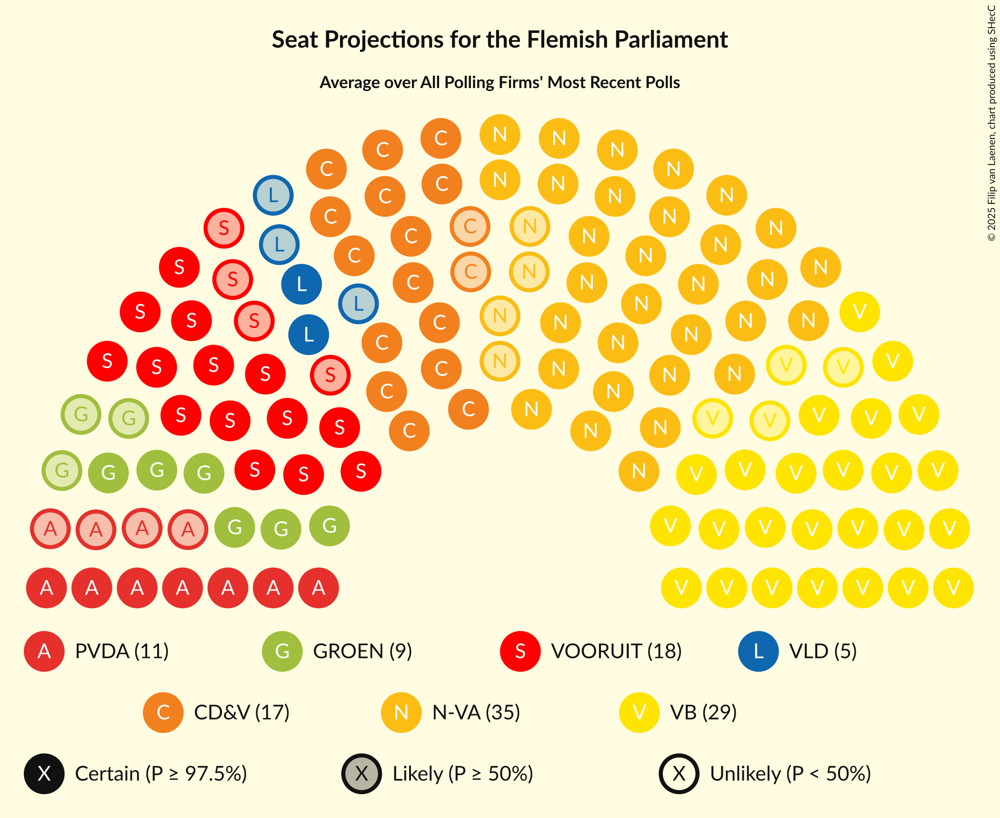

# Poll Average

<a href="#voting-intentions">Voting Intentions</a> | <a href="#seats">Seats</a> | <a href="#coalitions">Coalitions</a> | <a href="#technical-information">Technical Information</a>

## Summary

The table below lists the polls on which the average is based. They are the most recent polls (less than 90 days old) registered and analyzed so far.

| Period     | Polling firm/Commissioner(s) | N-VA | VB | CD&V | VLD | VOORUIT | GROEN | PVDA |
|:----------:|:----------------------------:|:--:|:--:|:--:|:--:|:--:|:--:|:--:|
| 26 May 2019 | General Election | 24.8%   35 | 18.5%   23 | 15.4%   19 | 13.1%   16 | 10.1%   12 | 10.1%   14 | 5.3%   4 |
| N/A | Poll Average | 19–24%   24–32 | 23–30%   30–39 | 9–15%   11–17 | 6–10%   5–12 | 12–16%   14–21 | 6–11%   5–14 | 7–12%   7–15 |
| [22 January–8 February 2024](2024-02-08-Kantar.html) | Kantar   Knack and Le Vif | 18–23%   24–30 | 23–28%   29–37 | 9–12%   10–14 | 7–10%   6–12 | 13–17%   15–23 | 7–11%   8–14 | 9–13%   11–16 |
| [4–11 December 2023](2023-12-11-Ipsos.html) | Ipsos   Het Laatste Nieuws, Le Soir, RTL TVi and VTM | 20–25%   26–32 | 23–28%   29–37 | 10–14%   11–17 | 6–9%   4–11 | 12–16%   14–20 | 8–11%   9–15 | 8–12%   8–14 |
| [23–28 November 2023](2023-11-28-iVOX.html) | iVOX   Gazet van Antwerpen | 19–24%   25–32 | 25–30%   33–41 | 11–15%   12–18 | 7–11%   8–13 | 11–15%   14–20 | 5–9%   5–11 | 7–10%   7–13 |
| 26 May 2019 | General Election | 24.8%   35 | 18.5%   23 | 15.4%   19 | 13.1%   16 | 10.1%   12 | 10.1%   14 | 5.3%   4 |

Only polls for which at least the sample size has been published are included in the table above.

**Legend:**
+ **Top half of each row:** Voting intentions (95% confidence interval)
+ **Bottom half of each row:** Seat projections for the Flemish Parliament (95% confidence interval)
+ **N-VA:** Nieuw-Vlaamse Alliantie
+ **VB:** Vlaams Belang
+ **CD&V:** Christen-Democratisch en Vlaams
+ **VLD:** Open Vlaamse Liberalen en Democraten
+ **VOORUIT:** Vooruit
+ **GROEN:** Groen
+ **PVDA:** Partij van de Arbeid van België
+ **N/A (single party):** Party not included the published results
+ **N/A (entire row):** Calculation for this opinion poll not started yet

## Voting Intentions

### Confidence Intervals

| Party | Last Result | Median | 80% Confidence Interval | 90% Confidence Interval | 95% Confidence Interval | 99% Confidence Interval |
|:-----:|:-----------:|:------:|:-----------------------:|:-----------------------:|:-----------------------:|:-----------------------:|
| <a href="#nieuw-vlaamse-alliantie">Nieuw-Vlaamse Alliantie</a> | 24.8% | 21.3% | 19.6–23.2% |19.1–23.7% | 18.7–24.2% | 17.9–25.1% |
| <a href="#vlaams-belang">Vlaams Belang</a> | 18.5% | 26.0% | 23.9–28.4% |23.4–29.1% | 23.0–29.6% | 22.1–30.7% |
| <a href="#christen-democratisch-en-vlaams">Christen-Democratisch en Vlaams</a> | 15.4% | 11.7% | 10.0–13.6% |9.5–14.1% | 9.2–14.6% | 8.6–15.4% |
| <a href="#open-vlaamse-liberalen-en-democraten">Open Vlaamse Liberalen en Democraten</a> | 13.1% | 8.0% | 6.6–9.4% |6.3–9.8% | 6.0–10.2% | 5.5–10.8% |
| <a href="#vooruit">Vooruit</a> | 10.1% | 13.9% | 12.4–15.6% |12.0–16.0% | 11.6–16.4% | 11.0–17.2% |
| <a href="#groen">Groen</a> | 10.1% | 8.5% | 6.5–10.0% |6.1–10.4% | 5.9–10.8% | 5.3–11.4% |
| <a href="#partij-van-de-arbeid-van-belgië">Partij van de Arbeid van België</a> | 5.3% | 9.7% | 8.0–11.5% |7.6–12.0% | 7.3–12.4% | 6.8–13.1% |

### Nieuw-Vlaamse Alliantie

*For a full overview of the results for this party, see the [Nieuw-Vlaamse Alliantie](party-nieuw-vlaamsealliantie.html) page.*

| Voting Intentions | Probability | Accumulated | Special Marks |
|:-----------------:|:-----------:|:-----------:|:-------------:|
| 15.5–16.5% | 0% | 100% |  |
| 16.5–17.5% | 0.2% | 100% |  |
| 17.5–18.5% | 2% | 99.8% |  |
| 18.5–19.5% | 8% | 98% |  |
| 19.5–20.5% | 19% | 90% |  |
| 20.5–21.5% | 28% | 71% | Median |
| 21.5–22.5% | 24% | 44% |  |
| 22.5–23.5% | 13% | 20% |  |
| 23.5–24.5% | 5% | 6% |  |
| 24.5–25.5% | 1.1% | 1.3% | Last Result |
| 25.5–26.5% | 0.2% | 0.2% |  |
| 26.5–27.5% | 0% | 0% |  |

### Vlaams Belang

*For a full overview of the results for this party, see the [Vlaams Belang](party-vlaamsbelang.html) page.*

| Voting Intentions | Probability | Accumulated | Special Marks |
|:-----------------:|:-----------:|:-----------:|:-------------:|
| 18.5–19.5% | 0% | 100% | Last Result |
| 19.5–20.5% | 0% | 100% |  |
| 20.5–21.5% | 0.1% | 100% |  |
| 21.5–22.5% | 1.1% | 99.9% |  |
| 22.5–23.5% | 5% | 98.8% |  |
| 23.5–24.5% | 13% | 94% |  |
| 24.5–25.5% | 21% | 81% |  |
| 25.5–26.5% | 22% | 60% | Median |
| 26.5–27.5% | 18% | 38% |  |
| 27.5–28.5% | 11% | 20% |  |
| 28.5–29.5% | 6% | 9% |  |
| 29.5–30.5% | 2% | 3% |  |
| 30.5–31.5% | 0.5% | 0.6% |  |
| 31.5–32.5% | 0.1% | 0.1% |  |
| 32.5–33.5% | 0% | 0% |  |

### Christen-Democratisch en Vlaams

*For a full overview of the results for this party, see the [Christen-Democratisch en Vlaams](party-christen-democratischenvlaams.html) page.*

| Voting Intentions | Probability | Accumulated | Special Marks |
|:-----------------:|:-----------:|:-----------:|:-------------:|
| 6.5–7.5% | 0% | 100% |  |
| 7.5–8.5% | 0.4% | 100% |  |
| 8.5–9.5% | 5% | 99.6% |  |
| 9.5–10.5% | 16% | 95% |  |
| 10.5–11.5% | 25% | 79% |  |
| 11.5–12.5% | 25% | 55% | Median |
| 12.5–13.5% | 19% | 30% |  |
| 13.5–14.5% | 9% | 11% |  |
| 14.5–15.5% | 2% | 3% | Last Result |
| 15.5–16.5% | 0.3% | 0.3% |  |
| 16.5–17.5% | 0% | 0% |  |

### Open Vlaamse Liberalen en Democraten

*For a full overview of the results for this party, see the [Open Vlaamse Liberalen en Democraten](party-openvlaamseliberalenendemocraten.html) page.*

| Voting Intentions | Probability | Accumulated | Special Marks |
|:-----------------:|:-----------:|:-----------:|:-------------:|
| 3.5–4.5% | 0% | 100% |  |
| 4.5–5.5% | 0.6% | 100% |  |
| 5.5–6.5% | 8% | 99.4% |  |
| 6.5–7.5% | 26% | 91% |  |
| 7.5–8.5% | 35% | 66% | Median |
| 8.5–9.5% | 23% | 31% |  |
| 9.5–10.5% | 7% | 8% |  |
| 10.5–11.5% | 1.0% | 1.1% |  |
| 11.5–12.5% | 0.1% | 0.1% |  |
| 12.5–13.5% | 0% | 0% | Last Result |

### Vooruit

*For a full overview of the results for this party, see the [Vooruit](party-vooruit.html) page.*

| Voting Intentions | Probability | Accumulated | Special Marks |
|:-----------------:|:-----------:|:-----------:|:-------------:|
| 8.5–9.5% | 0% | 100% |  |
| 9.5–10.5% | 0.1% | 100% | Last Result |
| 10.5–11.5% | 2% | 99.9% |  |
| 11.5–12.5% | 10% | 98% |  |
| 12.5–13.5% | 25% | 87% |  |
| 13.5–14.5% | 31% | 62% | Median |
| 14.5–15.5% | 21% | 31% |  |
| 15.5–16.5% | 8% | 10% |  |
| 16.5–17.5% | 2% | 2% |  |
| 17.5–18.5% | 0.2% | 0.2% |  |
| 18.5–19.5% | 0% | 0% |  |

### Groen

*For a full overview of the results for this party, see the [Groen](party-groen.html) page.*

| Voting Intentions | Probability | Accumulated | Special Marks |
|:-----------------:|:-----------:|:-----------:|:-------------:|
| 3.5–4.5% | 0% | 100% |  |
| 4.5–5.5% | 1.0% | 100% |  |
| 5.5–6.5% | 9% | 99.0% |  |
| 6.5–7.5% | 18% | 90% |  |
| 7.5–8.5% | 24% | 72% | Median |
| 8.5–9.5% | 29% | 47% |  |
| 9.5–10.5% | 15% | 19% | Last Result |
| 10.5–11.5% | 3% | 4% |  |
| 11.5–12.5% | 0.3% | 0.4% |  |
| 12.5–13.5% | 0% | 0% |  |

### Partij van de Arbeid van België

*For a full overview of the results for this party, see the [Partij van de Arbeid van België](party-partijvandearbeidvanbelgië.html) page.*

| Voting Intentions | Probability | Accumulated | Special Marks |
|:-----------------:|:-----------:|:-----------:|:-------------:|
| 4.5–5.5% | 0% | 100% | Last Result |
| 5.5–6.5% | 0.2% | 100% |  |
| 6.5–7.5% | 4% | 99.8% |  |
| 7.5–8.5% | 16% | 96% |  |
| 8.5–9.5% | 25% | 80% |  |
| 9.5–10.5% | 26% | 55% | Median |
| 10.5–11.5% | 19% | 29% |  |
| 11.5–12.5% | 8% | 10% |  |
| 12.5–13.5% | 2% | 2% |  |
| 13.5–14.5% | 0.1% | 0.2% |  |
| 14.5–15.5% | 0% | 0% |  |

## Seats

### Confidence Intervals

| Party | Last Result | Median | 80% Confidence Interval | 90% Confidence Interval | 95% Confidence Interval | 99% Confidence Interval |
|:-----:|:-----------:|:------:|:-----------------------:|:-----------------------:|:-----------------------:|:-----------------------:|
| <a href="#nieuw-vlaamse-alliantie">Nieuw-Vlaamse Alliantie</a> | 35 | 28 | 26–30 |25–31 | 24–32 | 23–33 |
| <a href="#vlaams-belang">Vlaams Belang</a> | 23 | 34 | 31–37 |30–38 | 30–39 | 28–41 |
| <a href="#christen-democratisch-en-vlaams">Christen-Democratisch en Vlaams</a> | 19 | 14 | 11–17 |11–17 | 11–17 | 9–19 |
| <a href="#open-vlaamse-liberalen-en-democraten">Open Vlaamse Liberalen en Democraten</a> | 16 | 8 | 6–11 |5–12 | 5–12 | 4–13 |
| <a href="#vooruit">Vooruit</a> | 12 | 18 | 15–19 |15–20 | 14–21 | 14–23 |
| <a href="#groen">Groen</a> | 14 | 11 | 7–14 |5–14 | 5–14 | 5–15 |
| <a href="#partij-van-de-arbeid-van-belgië">Partij van de Arbeid van België</a> | 4 | 12 | 8–14 |7–14 | 7–15 | 7–17 |

### Nieuw-Vlaamse Alliantie

*For a full overview of the results for this party, see the [Nieuw-Vlaamse Alliantie](party-nieuw-vlaamsealliantie.html) page.*

| Number of Seats | Probability | Accumulated | Special Marks |
|:---------------:|:-----------:|:-----------:|:-------------:|
| 21 | 0.1% | 100% |  |
| 22 | 0.4% | 99.9% |  |
| 23 | 0.7% | 99.5% |  |
| 24 | 2% | 98.9% |  |
| 25 | 4% | 97% |  |
| 26 | 15% | 93% |  |
| 27 | 26% | 78% |  |
| 28 | 15% | 52% | Median |
| 29 | 13% | 38% |  |
| 30 | 15% | 25% |  |
| 31 | 6% | 10% |  |
| 32 | 3% | 4% |  |
| 33 | 0.6% | 1.0% |  |
| 34 | 0.2% | 0.4% |  |
| 35 | 0.1% | 0.2% | Last Result |
| 36 | 0.1% | 0.1% |  |
| 37 | 0% | 0% |  |

### Vlaams Belang

*For a full overview of the results for this party, see the [Vlaams Belang](party-vlaamsbelang.html) page.*

| Number of Seats | Probability | Accumulated | Special Marks |
|:---------------:|:-----------:|:-----------:|:-------------:|
| 23 | 0% | 100% | Last Result |
| 24 | 0% | 100% |  |
| 25 | 0% | 100% |  |
| 26 | 0% | 100% |  |
| 27 | 0.1% | 100% |  |
| 28 | 0.3% | 99.8% |  |
| 29 | 2% | 99.5% |  |
| 30 | 6% | 98% |  |
| 31 | 9% | 92% |  |
| 32 | 10% | 83% |  |
| 33 | 14% | 73% |  |
| 34 | 13% | 58% | Median |
| 35 | 11% | 45% |  |
| 36 | 12% | 35% |  |
| 37 | 13% | 23% |  |
| 38 | 5% | 9% |  |
| 39 | 2% | 4% |  |
| 40 | 1.0% | 2% |  |
| 41 | 0.7% | 1.1% |  |
| 42 | 0.4% | 0.4% |  |
| 43 | 0% | 0% |  |

### Christen-Democratisch en Vlaams

*For a full overview of the results for this party, see the [Christen-Democratisch en Vlaams](party-christen-democratischenvlaams.html) page.*

| Number of Seats | Probability | Accumulated | Special Marks |
|:---------------:|:-----------:|:-----------:|:-------------:|
| 9 | 0.5% | 100% |  |
| 10 | 0.8% | 99.4% |  |
| 11 | 17% | 98.7% |  |
| 12 | 16% | 82% |  |
| 13 | 8% | 66% |  |
| 14 | 29% | 58% | Median |
| 15 | 10% | 29% |  |
| 16 | 5% | 18% |  |
| 17 | 11% | 13% |  |
| 18 | 2% | 2% |  |
| 19 | 0.7% | 0.8% | Last Result |
| 20 | 0.1% | 0.2% |  |
| 21 | 0% | 0% |  |

### Open Vlaamse Liberalen en Democraten

*For a full overview of the results for this party, see the [Open Vlaamse Liberalen en Democraten](party-openvlaamseliberalenendemocraten.html) page.*

| Number of Seats | Probability | Accumulated | Special Marks |
|:---------------:|:-----------:|:-----------:|:-------------:|
| 2 | 0.2% | 100% |  |
| 3 | 0.2% | 99.8% |  |
| 4 | 2% | 99.6% |  |
| 5 | 3% | 98% |  |
| 6 | 5% | 95% |  |
| 7 | 10% | 89% |  |
| 8 | 30% | 79% | Median |
| 9 | 14% | 49% |  |
| 10 | 11% | 36% |  |
| 11 | 15% | 24% |  |
| 12 | 8% | 9% |  |
| 13 | 1.1% | 1.4% |  |
| 14 | 0.2% | 0.3% |  |
| 15 | 0.1% | 0.1% |  |
| 16 | 0% | 0% | Last Result |

### Vooruit

*For a full overview of the results for this party, see the [Vooruit](party-vooruit.html) page.*

| Number of Seats | Probability | Accumulated | Special Marks |
|:---------------:|:-----------:|:-----------:|:-------------:|
| 12 | 0.1% | 100% | Last Result |
| 13 | 0.2% | 99.9% |  |
| 14 | 4% | 99.7% |  |
| 15 | 6% | 96% |  |
| 16 | 18% | 90% |  |
| 17 | 13% | 72% |  |
| 18 | 21% | 59% | Median |
| 19 | 31% | 38% |  |
| 20 | 4% | 7% |  |
| 21 | 1.3% | 3% |  |
| 22 | 0.6% | 2% |  |
| 23 | 0.6% | 1.0% |  |
| 24 | 0.3% | 0.4% |  |
| 25 | 0.1% | 0.1% |  |
| 26 | 0% | 0% |  |

### Groen

*For a full overview of the results for this party, see the [Groen](party-groen.html) page.*

| Number of Seats | Probability | Accumulated | Special Marks |
|:---------------:|:-----------:|:-----------:|:-------------:|
| 4 | 0% | 100% |  |
| 5 | 5% | 99.9% |  |
| 6 | 3% | 95% |  |
| 7 | 13% | 92% |  |
| 8 | 6% | 78% |  |
| 9 | 4% | 72% |  |
| 10 | 12% | 68% |  |
| 11 | 30% | 56% | Median |
| 12 | 6% | 26% |  |
| 13 | 10% | 20% |  |
| 14 | 10% | 11% | Last Result |
| 15 | 0.7% | 1.0% |  |
| 16 | 0.2% | 0.2% |  |
| 17 | 0% | 0% |  |

### Partij van de Arbeid van België

*For a full overview of the results for this party, see the [Partij van de Arbeid van België](party-partijvandearbeidvanbelgië.html) page.*

| Number of Seats | Probability | Accumulated | Special Marks |
|:---------------:|:-----------:|:-----------:|:-------------:|
| 4 | 0% | 100% | Last Result |
| 5 | 0.1% | 100% |  |
| 6 | 0.1% | 99.9% |  |
| 7 | 8% | 99.8% |  |
| 8 | 4% | 92% |  |
| 9 | 9% | 88% |  |
| 10 | 6% | 79% |  |
| 11 | 18% | 73% |  |
| 12 | 16% | 55% | Median |
| 13 | 20% | 39% |  |
| 14 | 17% | 19% |  |
| 15 | 1.2% | 3% |  |
| 16 | 0.7% | 1.4% |  |
| 17 | 0.5% | 0.8% |  |
| 18 | 0.3% | 0.3% |  |
| 19 | 0% | 0% |  |

## Coalitions

### Confidence Intervals

| Coalition | Last Result | Median | Majority? | 80% Confidence Interval | 90% Confidence Interval | 95% Confidence Interval | 99% Confidence Interval |
|:---------:|:-----------:|:------:|:---------:|:-----------------------:|:-----------------------:|:-----------------------:|:-----------------------:|
| Nieuw-Vlaamse Alliantie – Vlaams Belang – Christen-Democratisch en Vlaams | 77 | 75 | 100% | 71–81 | 70–82 | 69–83 | 67–85 |
| Nieuw-Vlaamse Alliantie – Christen-Democratisch en Vlaams – Open Vlaamse Liberalen en Democraten – Vooruit | 82 | 68 | 98% | 64–72 | 64–73 | 63–74 | 61–76 |
| Nieuw-Vlaamse Alliantie – Vlaams Belang | 58 | 62 | 45% | 58–66 | 57–67 | 57–68 | 55–69 |
| Nieuw-Vlaamse Alliantie – Christen-Democratisch en Vlaams – Vooruit | 66 | 59 | 10% | 56–63 | 55–64 | 54–65 | 53–66 |
| Nieuw-Vlaamse Alliantie – Open Vlaamse Liberalen en Democraten – Vooruit | 63 | 54 | 0.1% | 51–57 | 50–58 | 50–59 | 48–61 |
| Christen-Democratisch en Vlaams – Vooruit – Groen – Partij van de Arbeid van België | 49 | 53 | 0.1% | 48–57 | 46–58 | 46–59 | 44–61 |
| Nieuw-Vlaamse Alliantie – Christen-Democratisch en Vlaams – Open Vlaamse Liberalen en Democraten | 70 | 50 | 0% | 46–55 | 45–56 | 45–57 | 43–59 |
| Christen-Democratisch en Vlaams – Open Vlaamse Liberalen en Democraten – Vooruit – Groen | 61 | 50 | 0% | 47–53 | 46–54 | 46–55 | 44–57 |
| Christen-Democratisch en Vlaams – Vooruit – Groen | 45 | 41 | 0% | 38–45 | 37–46 | 36–47 | 35–48 |
| Nieuw-Vlaamse Alliantie – Christen-Democratisch en Vlaams | 54 | 42 | 0% | 38–45 | 37–46 | 36–47 | 35–48 |
| Christen-Democratisch en Vlaams – Open Vlaamse Liberalen en Democraten – Vooruit | 47 | 40 | 0% | 37–44 | 35–45 | 35–46 | 33–47 |
| Nieuw-Vlaamse Alliantie – Open Vlaamse Liberalen en Democraten | 51 | 37 | 0% | 34–40 | 33–41 | 32–42 | 30–44 |
| Open Vlaamse Liberalen en Democraten – Vooruit – Groen | 42 | 37 | 0% | 33–40 | 32–41 | 31–42 | 30–44 |
| Christen-Democratisch en Vlaams – Open Vlaamse Liberalen en Democraten – Groen | 49 | 33 | 0% | 30–36 | 29–37 | 28–38 | 27–39 |
| Christen-Democratisch en Vlaams – Vooruit | 31 | 31 | 0% | 29–34 | 28–35 | 27–36 | 26–37 |
| Open Vlaamse Liberalen en Democraten – Vooruit | 28 | 27 | 0% | 23–29 | 22–30 | 21–31 | 20–32 |
| Christen-Democratisch en Vlaams – Open Vlaamse Liberalen en Democraten | 35 | 22 | 0% | 19–27 | 18–28 | 17–29 | 16–30 |

### Nieuw-Vlaamse Alliantie – Vlaams Belang – Christen-Democratisch en Vlaams

| Number of Seats | Probability | Accumulated | Special Marks |
|:---------------:|:-----------:|:-----------:|:-------------:|
| 65 | 0% | 100% |  |
| 66 | 0.1% | 99.9% |  |
| 67 | 0.4% | 99.8% |  |
| 68 | 1.2% | 99.4% |  |
| 69 | 2% | 98% |  |
| 70 | 4% | 96% |  |
| 71 | 6% | 92% |  |
| 72 | 7% | 86% |  |
| 73 | 8% | 79% |  |
| 74 | 10% | 71% |  |
| 75 | 11% | 61% |  |
| 76 | 8% | 50% | Median |
| 77 | 8% | 42% | Last Result |
| 78 | 6% | 34% |  |
| 79 | 7% | 28% |  |
| 80 | 8% | 21% |  |
| 81 | 4% | 13% |  |
| 82 | 5% | 9% |  |
| 83 | 2% | 4% |  |
| 84 | 0.8% | 1.4% |  |
| 85 | 0.3% | 0.6% |  |
| 86 | 0.2% | 0.3% |  |
| 87 | 0.1% | 0.1% |  |
| 88 | 0% | 0% |  |

### Nieuw-Vlaamse Alliantie – Christen-Democratisch en Vlaams – Open Vlaamse Liberalen en Democraten – Vooruit

| Number of Seats | Probability | Accumulated | Special Marks |
|:---------------:|:-----------:|:-----------:|:-------------:|
| 59 | 0.1% | 100% |  |
| 60 | 0.3% | 99.9% |  |
| 61 | 0.5% | 99.7% |  |
| 62 | 1.3% | 99.2% |  |
| 63 | 3% | 98% | Majority |
| 64 | 8% | 95% |  |
| 65 | 10% | 87% |  |
| 66 | 11% | 78% |  |
| 67 | 12% | 67% |  |
| 68 | 11% | 55% | Median |
| 69 | 11% | 44% |  |
| 70 | 10% | 33% |  |
| 71 | 9% | 23% |  |
| 72 | 6% | 14% |  |
| 73 | 4% | 8% |  |
| 74 | 2% | 4% |  |
| 75 | 1.3% | 2% |  |
| 76 | 0.4% | 0.6% |  |
| 77 | 0.1% | 0.1% |  |
| 78 | 0% | 0.1% |  |
| 79 | 0% | 0% |  |
| 80 | 0% | 0% |  |
| 81 | 0% | 0% |  |
| 82 | 0% | 0% | Last Result |

### Nieuw-Vlaamse Alliantie – Vlaams Belang

| Number of Seats | Probability | Accumulated | Special Marks |
|:---------------:|:-----------:|:-----------:|:-------------:|
| 53 | 0% | 100% |  |
| 54 | 0.2% | 99.9% |  |
| 55 | 0.6% | 99.8% |  |
| 56 | 1.4% | 99.2% |  |
| 57 | 3% | 98% |  |
| 58 | 5% | 95% | Last Result |
| 59 | 7% | 90% |  |
| 60 | 11% | 83% |  |
| 61 | 14% | 72% |  |
| 62 | 13% | 58% | Median |
| 63 | 14% | 45% | Majority |
| 64 | 11% | 32% |  |
| 65 | 8% | 21% |  |
| 66 | 6% | 13% |  |
| 67 | 4% | 7% |  |
| 68 | 2% | 4% |  |
| 69 | 1.1% | 2% |  |
| 70 | 0.3% | 0.4% |  |
| 71 | 0.1% | 0.1% |  |
| 72 | 0% | 0% |  |

### Nieuw-Vlaamse Alliantie – Christen-Democratisch en Vlaams – Vooruit

| Number of Seats | Probability | Accumulated | Special Marks |
|:---------------:|:-----------:|:-----------:|:-------------:|
| 51 | 0.1% | 100% |  |
| 52 | 0.3% | 99.9% |  |
| 53 | 0.6% | 99.5% |  |
| 54 | 2% | 98.9% |  |
| 55 | 4% | 97% |  |
| 56 | 7% | 94% |  |
| 57 | 14% | 86% |  |
| 58 | 13% | 72% |  |
| 59 | 12% | 59% |  |
| 60 | 12% | 47% | Median |
| 61 | 14% | 35% |  |
| 62 | 11% | 21% |  |
| 63 | 5% | 10% | Majority |
| 64 | 3% | 6% |  |
| 65 | 1.5% | 3% |  |
| 66 | 0.7% | 1.0% | Last Result |
| 67 | 0.3% | 0.4% |  |
| 68 | 0.1% | 0.1% |  |
| 69 | 0% | 0% |  |

### Nieuw-Vlaamse Alliantie – Open Vlaamse Liberalen en Democraten – Vooruit

| Number of Seats | Probability | Accumulated | Special Marks |
|:---------------:|:-----------:|:-----------:|:-------------:|
| 46 | 0% | 100% |  |
| 47 | 0.2% | 99.9% |  |
| 48 | 0.6% | 99.7% |  |
| 49 | 2% | 99.1% |  |
| 50 | 3% | 98% |  |
| 51 | 5% | 95% |  |
| 52 | 11% | 89% |  |
| 53 | 14% | 79% |  |
| 54 | 16% | 64% | Median |
| 55 | 14% | 48% |  |
| 56 | 14% | 34% |  |
| 57 | 10% | 20% |  |
| 58 | 5% | 10% |  |
| 59 | 3% | 5% |  |
| 60 | 1.2% | 2% |  |
| 61 | 0.5% | 0.8% |  |
| 62 | 0.2% | 0.2% |  |
| 63 | 0% | 0.1% | Last Result, Majority |
| 64 | 0% | 0% |  |

### Christen-Democratisch en Vlaams – Vooruit – Groen – Partij van de Arbeid van België

| Number of Seats | Probability | Accumulated | Special Marks |
|:---------------:|:-----------:|:-----------:|:-------------:|
| 42 | 0% | 100% |  |
| 43 | 0.2% | 99.9% |  |
| 44 | 0.5% | 99.8% |  |
| 45 | 2% | 99.2% |  |
| 46 | 3% | 98% |  |
| 47 | 4% | 95% |  |
| 48 | 5% | 91% |  |
| 49 | 6% | 87% | Last Result |
| 50 | 5% | 80% |  |
| 51 | 6% | 75% |  |
| 52 | 9% | 69% |  |
| 53 | 10% | 60% |  |
| 54 | 12% | 50% |  |
| 55 | 11% | 38% | Median |
| 56 | 10% | 27% |  |
| 57 | 7% | 17% |  |
| 58 | 5% | 10% |  |
| 59 | 3% | 4% |  |
| 60 | 1.1% | 2% |  |
| 61 | 0.3% | 0.5% |  |
| 62 | 0.1% | 0.2% |  |
| 63 | 0.1% | 0.1% | Majority |
| 64 | 0% | 0% |  |

### Nieuw-Vlaamse Alliantie – Christen-Democratisch en Vlaams – Open Vlaamse Liberalen en Democraten

| Number of Seats | Probability | Accumulated | Special Marks |
|:---------------:|:-----------:|:-----------:|:-------------:|
| 41 | 0.1% | 100% |  |
| 42 | 0.2% | 99.9% |  |
| 43 | 0.7% | 99.7% |  |
| 44 | 1.3% | 99.0% |  |
| 45 | 4% | 98% |  |
| 46 | 7% | 94% |  |
| 47 | 9% | 87% |  |
| 48 | 11% | 78% |  |
| 49 | 13% | 68% |  |
| 50 | 10% | 55% | Median |
| 51 | 7% | 45% |  |
| 52 | 9% | 38% |  |
| 53 | 8% | 29% |  |
| 54 | 6% | 21% |  |
| 55 | 6% | 15% |  |
| 56 | 5% | 9% |  |
| 57 | 2% | 4% |  |
| 58 | 0.9% | 2% |  |
| 59 | 0.5% | 0.8% |  |
| 60 | 0.2% | 0.3% |  |
| 61 | 0% | 0.1% |  |
| 62 | 0% | 0% |  |
| 63 | 0% | 0% | Majority |
| 64 | 0% | 0% |  |
| 65 | 0% | 0% |  |
| 66 | 0% | 0% |  |
| 67 | 0% | 0% |  |
| 68 | 0% | 0% |  |
| 69 | 0% | 0% |  |
| 70 | 0% | 0% | Last Result |

### Christen-Democratisch en Vlaams – Open Vlaamse Liberalen en Democraten – Vooruit – Groen

| Number of Seats | Probability | Accumulated | Special Marks |
|:---------------:|:-----------:|:-----------:|:-------------:|
| 42 | 0% | 100% |  |
| 43 | 0.2% | 99.9% |  |
| 44 | 0.5% | 99.8% |  |
| 45 | 1.3% | 99.3% |  |
| 46 | 3% | 98% |  |
| 47 | 7% | 95% |  |
| 48 | 10% | 87% |  |
| 49 | 15% | 77% |  |
| 50 | 15% | 62% |  |
| 51 | 16% | 47% | Median |
| 52 | 13% | 31% |  |
| 53 | 8% | 18% |  |
| 54 | 5% | 10% |  |
| 55 | 2% | 5% |  |
| 56 | 2% | 2% |  |
| 57 | 0.4% | 0.6% |  |
| 58 | 0.1% | 0.2% |  |
| 59 | 0.1% | 0.1% |  |
| 60 | 0% | 0% |  |
| 61 | 0% | 0% | Last Result |

### Christen-Democratisch en Vlaams – Vooruit – Groen

| Number of Seats | Probability | Accumulated | Special Marks |
|:---------------:|:-----------:|:-----------:|:-------------:|
| 33 | 0.1% | 100% |  |
| 34 | 0.3% | 99.9% |  |
| 35 | 1.2% | 99.6% |  |
| 36 | 2% | 98% |  |
| 37 | 4% | 96% |  |
| 38 | 6% | 92% |  |
| 39 | 8% | 86% |  |
| 40 | 13% | 78% |  |
| 41 | 16% | 65% |  |
| 42 | 12% | 49% |  |
| 43 | 12% | 37% | Median |
| 44 | 12% | 25% |  |
| 45 | 7% | 14% | Last Result |
| 46 | 4% | 7% |  |
| 47 | 2% | 3% |  |
| 48 | 0.6% | 1.1% |  |
| 49 | 0.3% | 0.5% |  |
| 50 | 0.1% | 0.2% |  |
| 51 | 0.1% | 0.1% |  |
| 52 | 0% | 0% |  |

### Nieuw-Vlaamse Alliantie – Christen-Democratisch en Vlaams

| Number of Seats | Probability | Accumulated | Special Marks |
|:---------------:|:-----------:|:-----------:|:-------------:|
| 33 | 0.2% | 100% |  |
| 34 | 0.3% | 99.8% |  |
| 35 | 0.7% | 99.6% |  |
| 36 | 1.4% | 98.8% |  |
| 37 | 4% | 97% |  |
| 38 | 10% | 93% |  |
| 39 | 9% | 83% |  |
| 40 | 9% | 75% |  |
| 41 | 14% | 66% |  |
| 42 | 12% | 51% | Median |
| 43 | 12% | 39% |  |
| 44 | 11% | 28% |  |
| 45 | 9% | 17% |  |
| 46 | 4% | 8% |  |
| 47 | 2% | 4% |  |
| 48 | 1.1% | 2% |  |
| 49 | 0.3% | 0.5% |  |
| 50 | 0.1% | 0.2% |  |
| 51 | 0% | 0% |  |
| 52 | 0% | 0% |  |
| 53 | 0% | 0% |  |
| 54 | 0% | 0% | Last Result |

### Christen-Democratisch en Vlaams – Open Vlaamse Liberalen en Democraten – Vooruit

| Number of Seats | Probability | Accumulated | Special Marks |
|:---------------:|:-----------:|:-----------:|:-------------:|
| 31 | 0.1% | 100% |  |
| 32 | 0.2% | 99.9% |  |
| 33 | 0.6% | 99.8% |  |
| 34 | 1.2% | 99.2% |  |
| 35 | 3% | 98% |  |
| 36 | 4% | 95% |  |
| 37 | 9% | 91% |  |
| 38 | 14% | 82% |  |
| 39 | 12% | 68% |  |
| 40 | 14% | 56% | Median |
| 41 | 11% | 42% |  |
| 42 | 9% | 31% |  |
| 43 | 8% | 22% |  |
| 44 | 6% | 14% |  |
| 45 | 4% | 8% |  |
| 46 | 3% | 4% |  |
| 47 | 1.1% | 2% | Last Result |
| 48 | 0.3% | 0.5% |  |
| 49 | 0.1% | 0.2% |  |
| 50 | 0% | 0% |  |

### Nieuw-Vlaamse Alliantie – Open Vlaamse Liberalen en Democraten

| Number of Seats | Probability | Accumulated | Special Marks |
|:---------------:|:-----------:|:-----------:|:-------------:|
| 29 | 0.1% | 100% |  |
| 30 | 0.4% | 99.8% |  |
| 31 | 0.7% | 99.4% |  |
| 32 | 2% | 98.8% |  |
| 33 | 5% | 97% |  |
| 34 | 9% | 92% |  |
| 35 | 17% | 83% |  |
| 36 | 14% | 66% | Median |
| 37 | 13% | 52% |  |
| 38 | 15% | 39% |  |
| 39 | 10% | 24% |  |
| 40 | 8% | 14% |  |
| 41 | 3% | 7% |  |
| 42 | 2% | 3% |  |
| 43 | 0.9% | 1.4% |  |
| 44 | 0.4% | 0.5% |  |
| 45 | 0.1% | 0.1% |  |
| 46 | 0% | 0% |  |
| 47 | 0% | 0% |  |
| 48 | 0% | 0% |  |
| 49 | 0% | 0% |  |
| 50 | 0% | 0% |  |
| 51 | 0% | 0% | Last Result |

### Open Vlaamse Liberalen en Democraten – Vooruit – Groen

| Number of Seats | Probability | Accumulated | Special Marks |
|:---------------:|:-----------:|:-----------:|:-------------:|
| 28 | 0.1% | 100% |  |
| 29 | 0.2% | 99.9% |  |
| 30 | 0.7% | 99.7% |  |
| 31 | 2% | 98.9% |  |
| 32 | 4% | 97% |  |
| 33 | 6% | 93% |  |
| 34 | 9% | 87% |  |
| 35 | 13% | 78% |  |
| 36 | 12% | 65% |  |
| 37 | 14% | 53% | Median |
| 38 | 12% | 39% |  |
| 39 | 10% | 27% |  |
| 40 | 9% | 16% |  |
| 41 | 4% | 7% |  |
| 42 | 2% | 3% | Last Result |
| 43 | 0.8% | 1.3% |  |
| 44 | 0.4% | 0.5% |  |
| 45 | 0.1% | 0.2% |  |
| 46 | 0% | 0.1% |  |
| 47 | 0% | 0% |  |

### Christen-Democratisch en Vlaams – Open Vlaamse Liberalen en Democraten – Groen

| Number of Seats | Probability | Accumulated | Special Marks |
|:---------------:|:-----------:|:-----------:|:-------------:|
| 25 | 0.1% | 100% |  |
| 26 | 0.4% | 99.9% |  |
| 27 | 0.9% | 99.6% |  |
| 28 | 3% | 98.7% |  |
| 29 | 4% | 96% |  |
| 30 | 10% | 92% |  |
| 31 | 14% | 82% |  |
| 32 | 15% | 67% |  |
| 33 | 18% | 53% | Median |
| 34 | 14% | 35% |  |
| 35 | 10% | 22% |  |
| 36 | 5% | 11% |  |
| 37 | 4% | 6% |  |
| 38 | 2% | 3% |  |
| 39 | 0.7% | 1.0% |  |
| 40 | 0.2% | 0.3% |  |
| 41 | 0.1% | 0.1% |  |
| 42 | 0% | 0% |  |
| 43 | 0% | 0% |  |
| 44 | 0% | 0% |  |
| 45 | 0% | 0% |  |
| 46 | 0% | 0% |  |
| 47 | 0% | 0% |  |
| 48 | 0% | 0% |  |
| 49 | 0% | 0% | Last Result |

### Christen-Democratisch en Vlaams – Vooruit

| Number of Seats | Probability | Accumulated | Special Marks |
|:---------------:|:-----------:|:-----------:|:-------------:|
| 25 | 0.2% | 100% |  |
| 26 | 0.7% | 99.8% |  |
| 27 | 2% | 99.1% |  |
| 28 | 4% | 97% |  |
| 29 | 9% | 93% |  |
| 30 | 24% | 84% |  |
| 31 | 18% | 60% | Last Result |
| 32 | 15% | 43% | Median |
| 33 | 13% | 28% |  |
| 34 | 8% | 15% |  |
| 35 | 4% | 8% |  |
| 36 | 3% | 4% |  |
| 37 | 0.9% | 1.1% |  |
| 38 | 0.2% | 0.2% |  |
| 39 | 0.1% | 0.1% |  |
| 40 | 0% | 0% |  |

### Open Vlaamse Liberalen en Democraten – Vooruit

| Number of Seats | Probability | Accumulated | Special Marks |
|:---------------:|:-----------:|:-----------:|:-------------:|
| 18 | 0% | 100% |  |
| 19 | 0.1% | 99.9% |  |
| 20 | 0.8% | 99.8% |  |
| 21 | 2% | 99.0% |  |
| 22 | 3% | 97% |  |
| 23 | 5% | 94% |  |
| 24 | 7% | 89% |  |
| 25 | 11% | 82% |  |
| 26 | 19% | 71% | Median |
| 27 | 22% | 52% |  |
| 28 | 13% | 30% | Last Result |
| 29 | 8% | 17% |  |
| 30 | 5% | 10% |  |
| 31 | 3% | 4% |  |
| 32 | 0.9% | 1.3% |  |
| 33 | 0.3% | 0.4% |  |
| 34 | 0.1% | 0.1% |  |
| 35 | 0% | 0% |  |

### Christen-Democratisch en Vlaams – Open Vlaamse Liberalen en Democraten

| Number of Seats | Probability | Accumulated | Special Marks |
|:---------------:|:-----------:|:-----------:|:-------------:|
| 15 | 0.3% | 100% |  |
| 16 | 0.7% | 99.7% |  |
| 17 | 2% | 99.0% |  |
| 18 | 4% | 97% |  |
| 19 | 11% | 93% |  |
| 20 | 14% | 83% |  |
| 21 | 13% | 69% |  |
| 22 | 14% | 56% | Median |
| 23 | 8% | 42% |  |
| 24 | 6% | 34% |  |
| 25 | 6% | 28% |  |
| 26 | 8% | 22% |  |
| 27 | 7% | 14% |  |
| 28 | 4% | 7% |  |
| 29 | 2% | 3% |  |
| 30 | 0.7% | 1.0% |  |
| 31 | 0.2% | 0.3% |  |
| 32 | 0% | 0% |  |
| 33 | 0% | 0% |  |
| 34 | 0% | 0% |  |
| 35 | 0% | 0% | Last Result |

## Technical Information

+ **Number of polls included in this average:** 3
+ **Lowest number of simulations done in a poll included in this average:** 1,048,576
+ **Total number of simulations done in the polls included in this average:** 3,145,728
+ **Error estimate:** 1.13%
