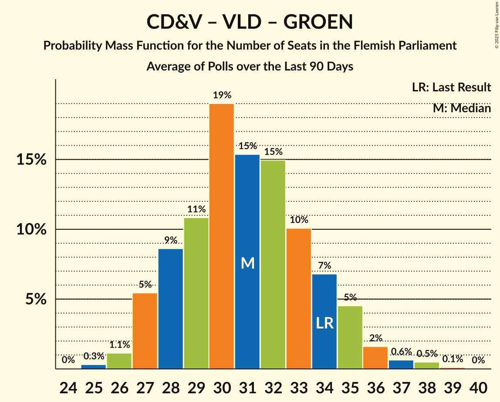

# Poll Average

<a href="#voting-intentions">Voting Intentions</a> | <a href="#seats">Seats</a> | <a href="#coalitions">Coalitions</a> | <a href="#technical-information">Technical Information</a>

## Summary

The table below lists the polls on which the average is based. They are the most recent polls (less than 90 days old) registered and analyzed so far.

| Period     | Polling firm/Commissioner(s) | N-VA | VB | CD&V | VLD | SP.A | GROEN | PVDA |
|:----------:|:----------------------------:|:--:|:--:|:--:|:--:|:--:|:--:|:--:|
| 26 May 2019 | General Election | 24.8%   35 | 18.5%   23 | 15.4%   19 | 13.1%   16 | 10.1%   12 | 10.1%   14 | 5.3%   4 |
| N/A | Poll Average | 20–25%   27–34 | 22–28%   28–36 | 10–14%   12–16 | 11–16%   15–19 | 7–10%   7–12 | 9–13%   11–18 | 5–8%   4–8 |
| [2–10 September 2019](2019-09-10-Ipsos.html) | Ipsos   Het Laatste Nieuws, Le Soir, RTL TVi and VTM | 20–25%   27–34 | 22–28%   28–36 | 10–14%   12–16 | 11–16%   15–19 | 7–10%   7–12 | 9–13%   11–18 | 5–8%   4–8 |
| 26 May 2019 | General Election | 24.8%   35 | 18.5%   23 | 15.4%   19 | 13.1%   16 | 10.1%   12 | 10.1%   14 | 5.3%   4 |

Only polls for which at least the sample size has been published are included in the table above.

**Legend:**
+ **Top half of each row:** Voting intentions (95% confidence interval)
+ **Bottom half of each row:** Seat projections for the Flemish Parliament (95% confidence interval)
+ **N-VA:** Nieuw-Vlaamse Alliantie
+ **VB:** Vlaams Belang
+ **CD&V:** Christen-Democratisch en Vlaams
+ **VLD:** Open Vlaamse Liberalen en Democraten
+ **SP.A:** Socialistische Partij Anders
+ **GROEN:** Groen
+ **PVDA:** Partij van de Arbeid van België
+ **N/A (single party):** Party not included the published results
+ **N/A (entire row):** Calculation for this opinion poll not started yet

## Voting Intentions

### Confidence Intervals

| Party | Last Result | Median | 80% Confidence Interval | 90% Confidence Interval | 95% Confidence Interval | 99% Confidence Interval |
|:-----:|:-----------:|:------:|:-----------------------:|:-----------------------:|:-----------------------:|:-----------------------:|
| <a href="#nieuw-vlaamse-alliantie">Nieuw-Vlaamse Alliantie</a> | 24.8% | 22.7% | 21.1–24.5% |20.6–25.0% | 20.2–25.4% | 19.5–26.3% |
| <a href="#vlaams-belang">Vlaams Belang</a> | 18.5% | 24.9% | 23.2–26.7% |22.7–27.2% | 22.3–27.7% | 21.5–28.6% |
| <a href="#christen-democratisch-en-vlaams">Christen-Democratisch en Vlaams</a> | 15.4% | 11.7% | 10.5–13.1% |10.1–13.5% | 9.9–13.8% | 9.3–14.5% |
| <a href="#open-vlaamse-liberalen-en-democraten">Open Vlaamse Liberalen en Democraten</a> | 13.1% | 13.3% | 12.0–14.8% |11.7–15.2% | 11.3–15.6% | 10.7–16.3% |
| <a href="#socialistische-partij-anders">Socialistische Partij Anders</a> | 10.1% | 8.5% | 7.4–9.6% |7.1–10.0% | 6.8–10.3% | 6.4–10.9% |
| <a href="#groen">Groen</a> | 10.1% | 11.1% | 9.8–12.4% |9.5–12.7% | 9.2–13.1% | 8.7–13.8% |
| <a href="#partij-van-de-arbeid-van-belgië">Partij van de Arbeid van België</a> | 5.3% | 6.3% | 5.3–7.3% |5.1–7.6% | 4.9–7.9% | 4.5–8.4% |

### Nieuw-Vlaamse Alliantie

*For a full overview of the results for this party, see the [Nieuw-Vlaamse Alliantie](party-nieuw-vlaamsealliantie.html) page.*

| Voting Intentions | Probability | Accumulated | Special Marks |
|:-----------------:|:-----------:|:-----------:|:-------------:|
| 17.5–18.5% | 0% | 100% |  |
| 18.5–19.5% | 0.6% | 100% |  |
| 19.5–20.5% | 4% | 99.4% |  |
| 20.5–21.5% | 14% | 95% |  |
| 21.5–22.5% | 26% | 82% |  |
| 22.5–23.5% | 28% | 55% | Median |
| 23.5–24.5% | 18% | 27% |  |
| 24.5–25.5% | 7% | 9% | Last Result |
| 25.5–26.5% | 2% | 2% |  |
| 26.5–27.5% | 0.2% | 0.3% |  |
| 27.5–28.5% | 0% | 0% |  |

### Vlaams Belang

*For a full overview of the results for this party, see the [Vlaams Belang](party-vlaamsbelang.html) page.*

| Voting Intentions | Probability | Accumulated | Special Marks |
|:-----------------:|:-----------:|:-----------:|:-------------:|
| 18.5–19.5% | 0% | 100% | Last Result |
| 19.5–20.5% | 0% | 100% |  |
| 20.5–21.5% | 0.5% | 100% |  |
| 21.5–22.5% | 3% | 99.5% |  |
| 22.5–23.5% | 11% | 96% |  |
| 23.5–24.5% | 24% | 85% |  |
| 24.5–25.5% | 28% | 61% | Median |
| 25.5–26.5% | 21% | 33% |  |
| 26.5–27.5% | 9% | 12% |  |
| 27.5–28.5% | 3% | 3% |  |
| 28.5–29.5% | 0.5% | 0.5% |  |
| 29.5–30.5% | 0.1% | 0.1% |  |
| 30.5–31.5% | 0% | 0% |  |

### Christen-Democratisch en Vlaams

*For a full overview of the results for this party, see the [Christen-Democratisch en Vlaams](party-christen-democratischenvlaams.html) page.*

| Voting Intentions | Probability | Accumulated | Special Marks |
|:-----------------:|:-----------:|:-----------:|:-------------:|
| 7.5–8.5% | 0% | 100% |  |
| 8.5–9.5% | 1.1% | 100% |  |
| 9.5–10.5% | 10% | 98.9% |  |
| 10.5–11.5% | 31% | 89% |  |
| 11.5–12.5% | 36% | 58% | Median |
| 12.5–13.5% | 18% | 22% |  |
| 13.5–14.5% | 4% | 4% |  |
| 14.5–15.5% | 0.4% | 0.5% | Last Result |
| 15.5–16.5% | 0% | 0% |  |

### Open Vlaamse Liberalen en Democraten

*For a full overview of the results for this party, see the [Open Vlaamse Liberalen en Democraten](party-openvlaamseliberalenendemocraten.html) page.*

| Voting Intentions | Probability | Accumulated | Special Marks |
|:-----------------:|:-----------:|:-----------:|:-------------:|
| 8.5–9.5% | 0% | 100% |  |
| 9.5–10.5% | 0.3% | 100% |  |
| 10.5–11.5% | 4% | 99.7% |  |
| 11.5–12.5% | 18% | 96% |  |
| 12.5–13.5% | 35% | 78% | Last Result, Median |
| 13.5–14.5% | 29% | 43% |  |
| 14.5–15.5% | 11% | 14% |  |
| 15.5–16.5% | 2% | 3% |  |
| 16.5–17.5% | 0.2% | 0.3% |  |
| 17.5–18.5% | 0% | 0% |  |

### Socialistische Partij Anders

*For a full overview of the results for this party, see the [Socialistische Partij Anders](party-socialistischepartijanders.html) page.*

| Voting Intentions | Probability | Accumulated | Special Marks |
|:-----------------:|:-----------:|:-----------:|:-------------:|
| 4.5–5.5% | 0% | 100% |  |
| 5.5–6.5% | 1.0% | 100% |  |
| 6.5–7.5% | 13% | 99.0% |  |
| 7.5–8.5% | 40% | 86% | Median |
| 8.5–9.5% | 34% | 46% |  |
| 9.5–10.5% | 10% | 11% | Last Result |
| 10.5–11.5% | 1.2% | 1.3% |  |
| 11.5–12.5% | 0.1% | 0.1% |  |
| 12.5–13.5% | 0% | 0% |  |

### Groen

*For a full overview of the results for this party, see the [Groen](party-groen.html) page.*

| Voting Intentions | Probability | Accumulated | Special Marks |
|:-----------------:|:-----------:|:-----------:|:-------------:|
| 6.5–7.5% | 0% | 100% |  |
| 7.5–8.5% | 0.3% | 100% |  |
| 8.5–9.5% | 5% | 99.7% |  |
| 9.5–10.5% | 25% | 94% | Last Result |
| 10.5–11.5% | 39% | 70% | Median |
| 11.5–12.5% | 24% | 31% |  |
| 12.5–13.5% | 6% | 7% |  |
| 13.5–14.5% | 0.8% | 0.9% |  |
| 14.5–15.5% | 0.1% | 0.1% |  |
| 15.5–16.5% | 0% | 0% |  |

### Partij van de Arbeid van België

*For a full overview of the results for this party, see the [Partij van de Arbeid van België](party-partijvandearbeidvanbelgië.html) page.*

| Voting Intentions | Probability | Accumulated | Special Marks |
|:-----------------:|:-----------:|:-----------:|:-------------:|
| 2.5–3.5% | 0% | 100% |  |
| 3.5–4.5% | 0.7% | 100% |  |
| 4.5–5.5% | 16% | 99.3% | Last Result |
| 5.5–6.5% | 48% | 83% | Median |
| 6.5–7.5% | 30% | 35% |  |
| 7.5–8.5% | 5% | 6% |  |
| 8.5–9.5% | 0.3% | 0.3% |  |
| 9.5–10.5% | 0% | 0% |  |

## Seats

### Confidence Intervals

| Party | Last Result | Median | 80% Confidence Interval | 90% Confidence Interval | 95% Confidence Interval | 99% Confidence Interval |
|:-----:|:-----------:|:------:|:-----------------------:|:-----------------------:|:-----------------------:|:-----------------------:|
| <a href="#nieuw-vlaamse-alliantie">Nieuw-Vlaamse Alliantie</a> | 35 | 30 | 28–33 |27–33 | 27–34 | 27–35 |
| <a href="#vlaams-belang">Vlaams Belang</a> | 23 | 33 | 30–34 |29–35 | 28–36 | 28–38 |
| <a href="#christen-democratisch-en-vlaams">Christen-Democratisch en Vlaams</a> | 19 | 14 | 12–16 |12–16 | 12–16 | 10–17 |
| <a href="#open-vlaamse-liberalen-en-democraten">Open Vlaamse Liberalen en Democraten</a> | 16 | 17 | 16–19 |15–19 | 15–19 | 13–20 |
| <a href="#socialistische-partij-anders">Socialistische Partij Anders</a> | 12 | 10 | 8–11 |7–12 | 7–12 | 4–13 |
| <a href="#groen">Groen</a> | 14 | 15 | 13–17 |11–18 | 11–18 | 11–19 |
| <a href="#partij-van-de-arbeid-van-belgië">Partij van de Arbeid van België</a> | 4 | 6 | 4–7 |4–7 | 4–8 | 2–8 |

### Nieuw-Vlaamse Alliantie

*For a full overview of the results for this party, see the [Nieuw-Vlaamse Alliantie](party-nieuw-vlaamsealliantie.html) page.*

| Number of Seats | Probability | Accumulated | Special Marks |
|:---------------:|:-----------:|:-----------:|:-------------:|
| 24 | 0% | 100% |  |
| 25 | 0% | 99.9% |  |
| 26 | 0.2% | 99.9% |  |
| 27 | 9% | 99.7% |  |
| 28 | 15% | 90% |  |
| 29 | 19% | 75% |  |
| 30 | 15% | 56% | Median |
| 31 | 11% | 41% |  |
| 32 | 13% | 30% |  |
| 33 | 14% | 17% |  |
| 34 | 2% | 3% |  |
| 35 | 0.7% | 1.0% | Last Result |
| 36 | 0.2% | 0.2% |  |
| 37 | 0% | 0.1% |  |
| 38 | 0% | 0% |  |

### Vlaams Belang

*For a full overview of the results for this party, see the [Vlaams Belang](party-vlaamsbelang.html) page.*

| Number of Seats | Probability | Accumulated | Special Marks |
|:---------------:|:-----------:|:-----------:|:-------------:|
| 23 | 0% | 100% | Last Result |
| 24 | 0% | 100% |  |
| 25 | 0% | 100% |  |
| 26 | 0.1% | 100% |  |
| 27 | 0.4% | 99.9% |  |
| 28 | 2% | 99.5% |  |
| 29 | 4% | 97% |  |
| 30 | 10% | 93% |  |
| 31 | 9% | 83% |  |
| 32 | 11% | 75% |  |
| 33 | 20% | 63% | Median |
| 34 | 37% | 43% |  |
| 35 | 3% | 6% |  |
| 36 | 2% | 3% |  |
| 37 | 0.9% | 2% |  |
| 38 | 0.4% | 0.6% |  |
| 39 | 0.2% | 0.2% |  |
| 40 | 0% | 0% |  |

### Christen-Democratisch en Vlaams

*For a full overview of the results for this party, see the [Christen-Democratisch en Vlaams](party-christen-democratischenvlaams.html) page.*

| Number of Seats | Probability | Accumulated | Special Marks |
|:---------------:|:-----------:|:-----------:|:-------------:|
| 10 | 0.6% | 100% |  |
| 11 | 2% | 99.4% |  |
| 12 | 27% | 98% |  |
| 13 | 14% | 71% |  |
| 14 | 31% | 57% | Median |
| 15 | 10% | 26% |  |
| 16 | 16% | 16% |  |
| 17 | 0.5% | 0.7% |  |
| 18 | 0.1% | 0.1% |  |
| 19 | 0% | 0.1% | Last Result |
| 20 | 0% | 0% |  |

### Open Vlaamse Liberalen en Democraten

*For a full overview of the results for this party, see the [Open Vlaamse Liberalen en Democraten](party-openvlaamseliberalenendemocraten.html) page.*

| Number of Seats | Probability | Accumulated | Special Marks |
|:---------------:|:-----------:|:-----------:|:-------------:|
| 12 | 0.1% | 100% |  |
| 13 | 0.5% | 99.8% |  |
| 14 | 1.4% | 99.4% |  |
| 15 | 4% | 98% |  |
| 16 | 35% | 94% | Last Result |
| 17 | 22% | 59% | Median |
| 18 | 12% | 37% |  |
| 19 | 23% | 25% |  |
| 20 | 1.4% | 2% |  |
| 21 | 0.3% | 0.5% |  |
| 22 | 0.1% | 0.2% |  |
| 23 | 0% | 0% |  |

### Socialistische Partij Anders

*For a full overview of the results for this party, see the [Socialistische Partij Anders](party-socialistischepartijanders.html) page.*

| Number of Seats | Probability | Accumulated | Special Marks |
|:---------------:|:-----------:|:-----------:|:-------------:|
| 4 | 0.6% | 100% |  |
| 5 | 0.9% | 99.4% |  |
| 6 | 0.6% | 98.6% |  |
| 7 | 5% | 98% |  |
| 8 | 12% | 93% |  |
| 9 | 22% | 81% |  |
| 10 | 30% | 59% | Median |
| 11 | 20% | 29% |  |
| 12 | 7% | 9% | Last Result |
| 13 | 2% | 2% |  |
| 14 | 0.4% | 0.5% |  |
| 15 | 0% | 0% |  |

### Groen

*For a full overview of the results for this party, see the [Groen](party-groen.html) page.*

| Number of Seats | Probability | Accumulated | Special Marks |
|:---------------:|:-----------:|:-----------:|:-------------:|
| 11 | 6% | 100% |  |
| 12 | 3% | 94% |  |
| 13 | 4% | 91% |  |
| 14 | 19% | 86% | Last Result |
| 15 | 28% | 67% | Median |
| 16 | 28% | 39% |  |
| 17 | 5% | 11% |  |
| 18 | 4% | 6% |  |
| 19 | 2% | 2% |  |
| 20 | 0% | 0% |  |

### Partij van de Arbeid van België

*For a full overview of the results for this party, see the [Partij van de Arbeid van België](party-partijvandearbeidvanbelgië.html) page.*

| Number of Seats | Probability | Accumulated | Special Marks |
|:---------------:|:-----------:|:-----------:|:-------------:|
| 1 | 0.2% | 100% |  |
| 2 | 0.6% | 99.8% |  |
| 3 | 0.6% | 99.3% |  |
| 4 | 23% | 98.6% | Last Result |
| 5 | 23% | 75% |  |
| 6 | 10% | 52% | Median |
| 7 | 37% | 42% |  |
| 8 | 5% | 5% |  |
| 9 | 0.2% | 0.2% |  |
| 10 | 0% | 0.1% |  |
| 11 | 0% | 0% |  |

## Coalitions

### Confidence Intervals

| Coalition | Last Result | Median | Majority? | 80% Confidence Interval | 90% Confidence Interval | 95% Confidence Interval | 99% Confidence Interval |
|:---------:|:-----------:|:------:|:---------:|:-----------------------:|:-----------------------:|:-----------------------:|:-----------------------:|
| Nieuw-Vlaamse Alliantie – Vlaams Belang | 58 | 63 | 56% | 60–66 | 58–67 | 58–67 | 56–69 |
| Nieuw-Vlaamse Alliantie – Christen-Democratisch en Vlaams – Open Vlaamse Liberalen en Democraten | 70 | 61 | 28% | 58–64 | 57–65 | 57–66 | 56–67 |
| Nieuw-Vlaamse Alliantie – Open Vlaamse Liberalen en Democraten – Socialistische Partij Anders | 63 | 57 | 0.9% | 54–60 | 53–61 | 52–62 | 51–63 |
| Christen-Democratisch en Vlaams – Open Vlaamse Liberalen en Democraten – Socialistische Partij Anders – Groen | 61 | 55 | 0.2% | 52–59 | 52–60 | 51–60 | 50–62 |
| Nieuw-Vlaamse Alliantie – Christen-Democratisch en Vlaams – Socialistische Partij Anders | 66 | 53 | 0% | 50–57 | 50–58 | 49–59 | 47–60 |
| Nieuw-Vlaamse Alliantie – Open Vlaamse Liberalen en Democraten | 51 | 47 | 0% | 45–50 | 45–50 | 44–51 | 43–52 |
| Christen-Democratisch en Vlaams – Open Vlaamse Liberalen en Democraten – Groen | 49 | 46 | 0% | 43–49 | 42–50 | 41–51 | 39–52 |
| Christen-Democratisch en Vlaams – Socialistische Partij Anders – Groen – Partij van de Arbeid van België | 49 | 44 | 0% | 41–47 | 40–48 | 40–49 | 38–50 |
| Nieuw-Vlaamse Alliantie – Christen-Democratisch en Vlaams | 54 | 44 | 0% | 41–47 | 40–48 | 40–48 | 39–50 |
| Open Vlaamse Liberalen en Democraten – Socialistische Partij Anders – Groen | 42 | 42 | 0% | 39–44 | 38–45 | 37–46 | 36–48 |
| Christen-Democratisch en Vlaams – Open Vlaamse Liberalen en Democraten – Socialistische Partij Anders | 47 | 40 | 0% | 38–44 | 37–45 | 36–45 | 35–47 |
| Christen-Democratisch en Vlaams – Socialistische Partij Anders – Groen | 45 | 38 | 0% | 36–41 | 35–42 | 35–43 | 33–44 |
| Christen-Democratisch en Vlaams – Open Vlaamse Liberalen en Democraten | 35 | 31 | 0% | 28–34 | 28–35 | 27–35 | 26–36 |
| Open Vlaamse Liberalen en Democraten – Socialistische Partij Anders | 28 | 27 | 0% | 24–29 | 23–30 | 23–31 | 21–32 |
| Christen-Democratisch en Vlaams – Socialistische Partij Anders | 31 | 23 | 0% | 21–26 | 20–26 | 20–27 | 19–28 |

### Nieuw-Vlaamse Alliantie – Vlaams Belang

| Number of Seats | Probability | Accumulated | Special Marks |
|:---------------:|:-----------:|:-----------:|:-------------:|
| 55 | 0.3% | 100% |  |
| 56 | 0.3% | 99.7% |  |
| 57 | 1.2% | 99.4% |  |
| 58 | 3% | 98% | Last Result |
| 59 | 4% | 95% |  |
| 60 | 9% | 90% |  |
| 61 | 12% | 81% |  |
| 62 | 14% | 69% |  |
| 63 | 16% | 56% | Median, Majority |
| 64 | 13% | 40% |  |
| 65 | 12% | 27% |  |
| 66 | 9% | 15% |  |
| 67 | 4% | 6% |  |
| 68 | 1.3% | 2% |  |
| 69 | 0.7% | 0.9% |  |
| 70 | 0.2% | 0.3% |  |
| 71 | 0.1% | 0.1% |  |
| 72 | 0% | 0% |  |

### Nieuw-Vlaamse Alliantie – Christen-Democratisch en Vlaams – Open Vlaamse Liberalen en Democraten

| Number of Seats | Probability | Accumulated | Special Marks |
|:---------------:|:-----------:|:-----------:|:-------------:|
| 54 | 0.1% | 100% |  |
| 55 | 0.3% | 99.9% |  |
| 56 | 1.2% | 99.6% |  |
| 57 | 3% | 98% |  |
| 58 | 10% | 95% |  |
| 59 | 15% | 85% |  |
| 60 | 16% | 70% |  |
| 61 | 11% | 53% | Median |
| 62 | 14% | 42% |  |
| 63 | 13% | 28% | Majority |
| 64 | 9% | 15% |  |
| 65 | 4% | 7% |  |
| 66 | 2% | 3% |  |
| 67 | 0.6% | 1.0% |  |
| 68 | 0.3% | 0.4% |  |
| 69 | 0% | 0.1% |  |
| 70 | 0% | 0% | Last Result |

### Nieuw-Vlaamse Alliantie – Open Vlaamse Liberalen en Democraten – Socialistische Partij Anders

| Number of Seats | Probability | Accumulated | Special Marks |
|:---------------:|:-----------:|:-----------:|:-------------:|
| 49 | 0.1% | 100% |  |
| 50 | 0.1% | 99.9% |  |
| 51 | 0.6% | 99.8% |  |
| 52 | 2% | 99.2% |  |
| 53 | 2% | 97% |  |
| 54 | 7% | 95% |  |
| 55 | 16% | 88% |  |
| 56 | 19% | 72% |  |
| 57 | 13% | 53% | Median |
| 58 | 14% | 40% |  |
| 59 | 13% | 27% |  |
| 60 | 6% | 14% |  |
| 61 | 5% | 8% |  |
| 62 | 2% | 3% |  |
| 63 | 0.6% | 0.9% | Last Result, Majority |
| 64 | 0.2% | 0.3% |  |
| 65 | 0.1% | 0.1% |  |
| 66 | 0% | 0% |  |

### Christen-Democratisch en Vlaams – Open Vlaamse Liberalen en Democraten – Socialistische Partij Anders – Groen

| Number of Seats | Probability | Accumulated | Special Marks |
|:---------------:|:-----------:|:-----------:|:-------------:|
| 47 | 0% | 100% |  |
| 48 | 0.1% | 99.9% |  |
| 49 | 0.3% | 99.8% |  |
| 50 | 0.9% | 99.5% |  |
| 51 | 3% | 98.7% |  |
| 52 | 6% | 96% |  |
| 53 | 11% | 90% |  |
| 54 | 15% | 79% |  |
| 55 | 14% | 64% |  |
| 56 | 18% | 50% | Median |
| 57 | 13% | 32% |  |
| 58 | 8% | 19% |  |
| 59 | 5% | 11% |  |
| 60 | 4% | 6% |  |
| 61 | 1.2% | 2% | Last Result |
| 62 | 0.8% | 1.0% |  |
| 63 | 0.2% | 0.2% | Majority |
| 64 | 0.1% | 0.1% |  |
| 65 | 0% | 0% |  |

### Nieuw-Vlaamse Alliantie – Christen-Democratisch en Vlaams – Socialistische Partij Anders

| Number of Seats | Probability | Accumulated | Special Marks |
|:---------------:|:-----------:|:-----------:|:-------------:|
| 46 | 0.1% | 100% |  |
| 47 | 0.4% | 99.9% |  |
| 48 | 1.4% | 99.5% |  |
| 49 | 2% | 98% |  |
| 50 | 6% | 96% |  |
| 51 | 11% | 90% |  |
| 52 | 18% | 79% |  |
| 53 | 13% | 61% |  |
| 54 | 13% | 48% | Median |
| 55 | 12% | 34% |  |
| 56 | 9% | 23% |  |
| 57 | 6% | 14% |  |
| 58 | 4% | 7% |  |
| 59 | 2% | 3% |  |
| 60 | 0.6% | 0.8% |  |
| 61 | 0.2% | 0.2% |  |
| 62 | 0% | 0% |  |
| 63 | 0% | 0% | Majority |
| 64 | 0% | 0% |  |
| 65 | 0% | 0% |  |
| 66 | 0% | 0% | Last Result |

### Nieuw-Vlaamse Alliantie – Open Vlaamse Liberalen en Democraten

| Number of Seats | Probability | Accumulated | Special Marks |
|:---------------:|:-----------:|:-----------:|:-------------:|
| 40 | 0% | 100% |  |
| 41 | 0.1% | 99.9% |  |
| 42 | 0.3% | 99.8% |  |
| 43 | 0.7% | 99.5% |  |
| 44 | 4% | 98.8% |  |
| 45 | 13% | 95% |  |
| 46 | 23% | 82% |  |
| 47 | 14% | 59% | Median |
| 48 | 16% | 45% |  |
| 49 | 14% | 28% |  |
| 50 | 11% | 15% |  |
| 51 | 3% | 4% | Last Result |
| 52 | 0.9% | 1.1% |  |
| 53 | 0.2% | 0.2% |  |
| 54 | 0% | 0% |  |

### Christen-Democratisch en Vlaams – Open Vlaamse Liberalen en Democraten – Groen

| Number of Seats | Probability | Accumulated | Special Marks |
|:---------------:|:-----------:|:-----------:|:-------------:|
| 38 | 0.1% | 100% |  |
| 39 | 0.4% | 99.9% |  |
| 40 | 0.3% | 99.5% |  |
| 41 | 2% | 99.2% |  |
| 42 | 7% | 97% |  |
| 43 | 9% | 90% |  |
| 44 | 14% | 82% |  |
| 45 | 13% | 68% |  |
| 46 | 16% | 55% | Median |
| 47 | 15% | 39% |  |
| 48 | 10% | 24% |  |
| 49 | 6% | 14% | Last Result |
| 50 | 4% | 8% |  |
| 51 | 3% | 4% |  |
| 52 | 0.4% | 0.6% |  |
| 53 | 0.1% | 0.2% |  |
| 54 | 0.1% | 0.1% |  |
| 55 | 0% | 0% |  |

### Christen-Democratisch en Vlaams – Socialistische Partij Anders – Groen – Partij van de Arbeid van België

| Number of Seats | Probability | Accumulated | Special Marks |
|:---------------:|:-----------:|:-----------:|:-------------:|
| 36 | 0.1% | 100% |  |
| 37 | 0.2% | 99.9% |  |
| 38 | 0.5% | 99.6% |  |
| 39 | 2% | 99.1% |  |
| 40 | 5% | 98% |  |
| 41 | 7% | 93% |  |
| 42 | 12% | 86% |  |
| 43 | 17% | 74% |  |
| 44 | 17% | 58% |  |
| 45 | 12% | 41% | Median |
| 46 | 14% | 29% |  |
| 47 | 7% | 16% |  |
| 48 | 5% | 8% |  |
| 49 | 2% | 3% | Last Result |
| 50 | 1.4% | 2% |  |
| 51 | 0.3% | 0.4% |  |
| 52 | 0.1% | 0.1% |  |
| 53 | 0% | 0% |  |

### Nieuw-Vlaamse Alliantie – Christen-Democratisch en Vlaams

| Number of Seats | Probability | Accumulated | Special Marks |
|:---------------:|:-----------:|:-----------:|:-------------:|
| 37 | 0.1% | 100% |  |
| 38 | 0.4% | 99.9% |  |
| 39 | 2% | 99.5% |  |
| 40 | 5% | 98% |  |
| 41 | 10% | 92% |  |
| 42 | 13% | 82% |  |
| 43 | 17% | 69% |  |
| 44 | 15% | 52% | Median |
| 45 | 10% | 37% |  |
| 46 | 10% | 27% |  |
| 47 | 11% | 17% |  |
| 48 | 4% | 6% |  |
| 49 | 1.3% | 2% |  |
| 50 | 0.3% | 0.6% |  |
| 51 | 0.2% | 0.3% |  |
| 52 | 0% | 0.1% |  |
| 53 | 0% | 0% |  |
| 54 | 0% | 0% | Last Result |

### Open Vlaamse Liberalen en Democraten – Socialistische Partij Anders – Groen

| Number of Seats | Probability | Accumulated | Special Marks |
|:---------------:|:-----------:|:-----------:|:-------------:|
| 34 | 0.1% | 100% |  |
| 35 | 0.2% | 99.9% |  |
| 36 | 0.8% | 99.7% |  |
| 37 | 2% | 98.8% |  |
| 38 | 4% | 97% |  |
| 39 | 9% | 93% |  |
| 40 | 10% | 84% |  |
| 41 | 16% | 74% |  |
| 42 | 21% | 57% | Last Result, Median |
| 43 | 14% | 36% |  |
| 44 | 12% | 22% |  |
| 45 | 5% | 10% |  |
| 46 | 3% | 5% |  |
| 47 | 1.2% | 2% |  |
| 48 | 0.4% | 0.6% |  |
| 49 | 0.2% | 0.2% |  |
| 50 | 0% | 0% |  |

### Christen-Democratisch en Vlaams – Open Vlaamse Liberalen en Democraten – Socialistische Partij Anders

| Number of Seats | Probability | Accumulated | Special Marks |
|:---------------:|:-----------:|:-----------:|:-------------:|
| 33 | 0.1% | 100% |  |
| 34 | 0.2% | 99.9% |  |
| 35 | 1.2% | 99.7% |  |
| 36 | 3% | 98% |  |
| 37 | 5% | 95% |  |
| 38 | 11% | 90% |  |
| 39 | 13% | 79% |  |
| 40 | 18% | 67% |  |
| 41 | 15% | 49% | Median |
| 42 | 13% | 34% |  |
| 43 | 9% | 21% |  |
| 44 | 6% | 12% |  |
| 45 | 4% | 6% |  |
| 46 | 1.3% | 2% |  |
| 47 | 0.4% | 0.5% | Last Result |
| 48 | 0.1% | 0.1% |  |
| 49 | 0% | 0% |  |

### Christen-Democratisch en Vlaams – Socialistische Partij Anders – Groen

| Number of Seats | Probability | Accumulated | Special Marks |
|:---------------:|:-----------:|:-----------:|:-------------:|
| 31 | 0% | 100% |  |
| 32 | 0.2% | 99.9% |  |
| 33 | 0.5% | 99.7% |  |
| 34 | 2% | 99.2% |  |
| 35 | 4% | 98% |  |
| 36 | 11% | 94% |  |
| 37 | 19% | 83% |  |
| 38 | 17% | 64% |  |
| 39 | 21% | 46% | Median |
| 40 | 12% | 26% |  |
| 41 | 7% | 14% |  |
| 42 | 3% | 6% |  |
| 43 | 2% | 3% |  |
| 44 | 0.8% | 1.1% |  |
| 45 | 0.3% | 0.3% | Last Result |
| 46 | 0% | 0.1% |  |
| 47 | 0% | 0% |  |

### Christen-Democratisch en Vlaams – Open Vlaamse Liberalen en Democraten

| Number of Seats | Probability | Accumulated | Special Marks |
|:---------------:|:-----------:|:-----------:|:-------------:|
| 24 | 0% | 100% |  |
| 25 | 0.1% | 99.9% |  |
| 26 | 0.8% | 99.8% |  |
| 27 | 2% | 99.1% |  |
| 28 | 13% | 97% |  |
| 29 | 9% | 84% |  |
| 30 | 20% | 75% |  |
| 31 | 21% | 55% | Median |
| 32 | 14% | 34% |  |
| 33 | 7% | 20% |  |
| 34 | 6% | 12% |  |
| 35 | 6% | 7% | Last Result |
| 36 | 0.5% | 0.7% |  |
| 37 | 0.2% | 0.2% |  |
| 38 | 0% | 0.1% |  |
| 39 | 0% | 0% |  |

### Open Vlaamse Liberalen en Democraten – Socialistische Partij Anders

| Number of Seats | Probability | Accumulated | Special Marks |
|:---------------:|:-----------:|:-----------:|:-------------:|
| 20 | 0.5% | 100% |  |
| 21 | 0.6% | 99.5% |  |
| 22 | 0.8% | 98.9% |  |
| 23 | 4% | 98% |  |
| 24 | 7% | 94% |  |
| 25 | 11% | 87% |  |
| 26 | 21% | 77% |  |
| 27 | 19% | 55% | Median |
| 28 | 15% | 37% | Last Result |
| 29 | 12% | 22% |  |
| 30 | 6% | 10% |  |
| 31 | 3% | 4% |  |
| 32 | 0.7% | 0.9% |  |
| 33 | 0.2% | 0.2% |  |
| 34 | 0% | 0% |  |

### Christen-Democratisch en Vlaams – Socialistische Partij Anders

| Number of Seats | Probability | Accumulated | Special Marks |
|:---------------:|:-----------:|:-----------:|:-------------:|
| 17 | 0.1% | 100% |  |
| 18 | 0.2% | 99.9% |  |
| 19 | 1.2% | 99.7% |  |
| 20 | 4% | 98% |  |
| 21 | 10% | 94% |  |
| 22 | 17% | 84% |  |
| 23 | 21% | 68% |  |
| 24 | 19% | 47% | Median |
| 25 | 14% | 28% |  |
| 26 | 9% | 13% |  |
| 27 | 3% | 4% |  |
| 28 | 0.4% | 0.7% |  |
| 29 | 0.1% | 0.2% |  |
| 30 | 0.1% | 0.1% |  |
| 31 | 0.1% | 0.1% | Last Result |
| 32 | 0% | 0% |  |

## Technical Information

+ **Number of polls included in this average:** 1
+ **Lowest number of simulations done in a poll included in this average:** 524,288
+ **Total number of simulations done in the polls included in this average:** 524,288
+ **Error estimate:** 0.73%
