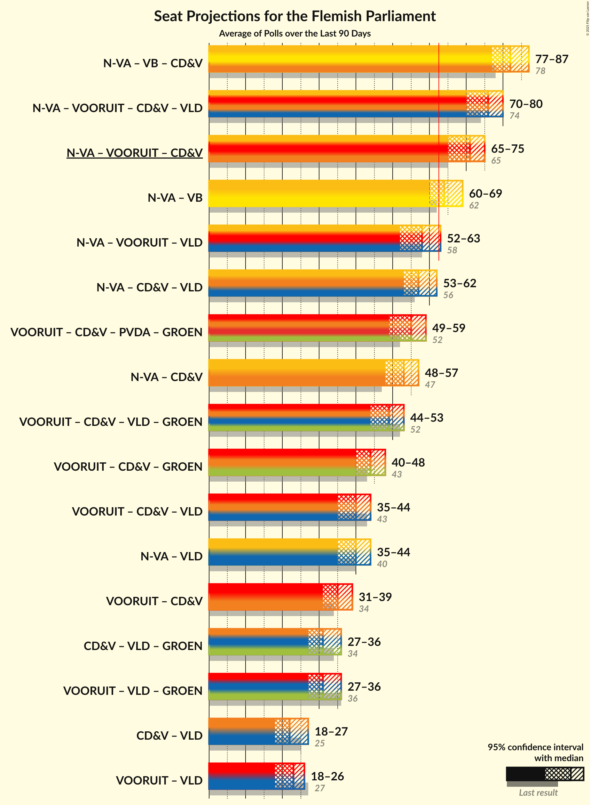

# Poll Average

<a href="#voting-intentions">Voting Intentions</a> | <a href="#seats">Seats</a> | <a href="#coalitions">Coalitions</a> | <a href="#technical-information">Technical Information</a>

## Summary

The table below lists the polls on which the average is based. They are the most recent polls (less than 90 days old) registered and analyzed so far.

| Period     | Polling firm/Commissioner(s) | N-VA | VB | CD&V | VLD | SP.A | GROEN | PVDA |
|:----------:|:----------------------------:|:--:|:--:|:--:|:--:|:--:|:--:|:--:|
| 26 May 2019 | General Election | 24.8%   35 | 18.5%   23 | 15.4%   19 | 13.1%   16 | 10.1%   12 | 10.1%   14 | 5.3%   4 |
| N/A | Poll Average | 18–22%   23–29 | 23–30%   29–40 | 10–14%   12–17 | 8–13%   11–16 | 10–14%   12–19 | 8–12%   10–16 | 6–9%   5–10 |
| [10–15 June 2020](2020-06-15-Ipsos.html) | Ipsos   Het Laatste Nieuws, Le Soir, RTL TVi and VTM | 18–23%   22–30 | 25–31%   33–41 | 10–14%   11–17 | 8–12%   10–15 | 11–15%   13–19 | 8–11%   10–15 | 6–9%   5–10 |
| [9–28 April 2020](2020-04-28-TNS.html) | TNS   De Standaard, La Libre Belgique, RTBf and VRT | 19–22%   24–29 | 23–27%   29–34 | 11–13%   12–16 | 10–13%   12–16 | 10–12%   11–15 | 10–13%   12–17 | 7–10%   7–11 |
| 26 May 2019 | General Election | 24.8%   35 | 18.5%   23 | 15.4%   19 | 13.1%   16 | 10.1%   12 | 10.1%   14 | 5.3%   4 |

Only polls for which at least the sample size has been published are included in the table above.

**Legend:**
+ **Top half of each row:** Voting intentions (95% confidence interval)
+ **Bottom half of each row:** Seat projections for the Flemish Parliament (95% confidence interval)
+ **N-VA:** Nieuw-Vlaamse Alliantie
+ **VB:** Vlaams Belang
+ **CD&V:** Christen-Democratisch en Vlaams
+ **VLD:** Open Vlaamse Liberalen en Democraten
+ **SP.A:** Socialistische Partij Anders
+ **GROEN:** Groen
+ **PVDA:** Partij van de Arbeid van België
+ **N/A (single party):** Party not included the published results
+ **N/A (entire row):** Calculation for this opinion poll not started yet

## Voting Intentions

### Confidence Intervals

| Party | Last Result | Median | 80% Confidence Interval | 90% Confidence Interval | 95% Confidence Interval | 99% Confidence Interval |
|:-----:|:-----------:|:------:|:-----------------------:|:-----------------------:|:-----------------------:|:-----------------------:|
| <a href="#nieuw-vlaamse-alliantie">Nieuw-Vlaamse Alliantie</a> | 24.8% | 20.2% | 18.7–21.6% |18.3–22.0% | 17.9–22.4% | 17.1–23.2% |
| <a href="#vlaams-belang">Vlaams Belang</a> | 18.5% | 25.8% | 23.7–28.9% |23.3–29.6% | 22.9–30.1% | 22.2–31.1% |
| <a href="#christen-democratisch-en-vlaams">Christen-Democratisch en Vlaams</a> | 15.4% | 11.9% | 10.8–13.1% |10.4–13.4% | 10.1–13.7% | 9.5–14.4% |
| <a href="#open-vlaamse-liberalen-en-democraten">Open Vlaamse Liberalen en Democraten</a> | 13.1% | 11.0% | 9.2–12.3% |8.8–12.6% | 8.5–12.9% | 7.9–13.4% |
| <a href="#socialistische-partij-anders">Socialistische Partij Anders</a> | 10.1% | 11.7% | 10.4–13.5% |10.1–14.0% | 9.8–14.4% | 9.4–15.2% |
| <a href="#groen">Groen</a> | 10.1% | 10.4% | 8.6–11.8% |8.3–12.1% | 7.9–12.4% | 7.4–12.9% |
| <a href="#partij-van-de-arbeid-van-belgië">Partij van de Arbeid van België</a> | 5.3% | 7.8% | 6.6–8.9% |6.3–9.2% | 6.0–9.4% | 5.5–9.9% |

### Nieuw-Vlaamse Alliantie

*For a full overview of the results for this party, see the [Nieuw-Vlaamse Alliantie](party-nieuw-vlaamsealliantie.html) page.*

| Voting Intentions | Probability | Accumulated | Special Marks |
|:-----------------:|:-----------:|:-----------:|:-------------:|
| 14.5–15.5% | 0% | 100% |  |
| 15.5–16.5% | 0.1% | 100% |  |
| 16.5–17.5% | 1.1% | 99.9% |  |
| 17.5–18.5% | 6% | 98.7% |  |
| 18.5–19.5% | 21% | 93% |  |
| 19.5–20.5% | 34% | 72% | Median |
| 20.5–21.5% | 26% | 37% |  |
| 21.5–22.5% | 9% | 11% |  |
| 22.5–23.5% | 2% | 2% |  |
| 23.5–24.5% | 0.2% | 0.2% |  |
| 24.5–25.5% | 0% | 0% | Last Result |

### Vlaams Belang

*For a full overview of the results for this party, see the [Vlaams Belang](party-vlaamsbelang.html) page.*

| Voting Intentions | Probability | Accumulated | Special Marks |
|:-----------------:|:-----------:|:-----------:|:-------------:|
| 18.5–19.5% | 0% | 100% | Last Result |
| 19.5–20.5% | 0% | 100% |  |
| 20.5–21.5% | 0.1% | 100% |  |
| 21.5–22.5% | 1.1% | 99.9% |  |
| 22.5–23.5% | 7% | 98.9% |  |
| 23.5–24.5% | 18% | 92% |  |
| 24.5–25.5% | 19% | 74% |  |
| 25.5–26.5% | 14% | 54% | Median |
| 26.5–27.5% | 14% | 40% |  |
| 27.5–28.5% | 13% | 27% |  |
| 28.5–29.5% | 9% | 14% |  |
| 29.5–30.5% | 4% | 5% |  |
| 30.5–31.5% | 1.1% | 1.3% |  |
| 31.5–32.5% | 0.2% | 0.2% |  |
| 32.5–33.5% | 0% | 0% |  |

### Christen-Democratisch en Vlaams

*For a full overview of the results for this party, see the [Christen-Democratisch en Vlaams](party-christen-democratischenvlaams.html) page.*

| Voting Intentions | Probability | Accumulated | Special Marks |
|:-----------------:|:-----------:|:-----------:|:-------------:|
| 7.5–8.5% | 0% | 100% |  |
| 8.5–9.5% | 0.5% | 100% |  |
| 9.5–10.5% | 6% | 99.5% |  |
| 10.5–11.5% | 29% | 93% |  |
| 11.5–12.5% | 42% | 65% | Median |
| 12.5–13.5% | 19% | 23% |  |
| 13.5–14.5% | 3% | 4% |  |
| 14.5–15.5% | 0.4% | 0.4% | Last Result |
| 15.5–16.5% | 0% | 0% |  |

### Open Vlaamse Liberalen en Democraten

*For a full overview of the results for this party, see the [Open Vlaamse Liberalen en Democraten](party-openvlaamseliberalenendemocraten.html) page.*

| Voting Intentions | Probability | Accumulated | Special Marks |
|:-----------------:|:-----------:|:-----------:|:-------------:|
| 5.5–6.5% | 0% | 100% |  |
| 6.5–7.5% | 0.1% | 100% |  |
| 7.5–8.5% | 3% | 99.9% |  |
| 8.5–9.5% | 13% | 97% |  |
| 9.5–10.5% | 23% | 85% |  |
| 10.5–11.5% | 32% | 62% | Median |
| 11.5–12.5% | 24% | 30% |  |
| 12.5–13.5% | 5% | 6% | Last Result |
| 13.5–14.5% | 0.3% | 0.3% |  |
| 14.5–15.5% | 0% | 0% |  |

### Socialistische Partij Anders

*For a full overview of the results for this party, see the [Socialistische Partij Anders](party-socialistischepartijanders.html) page.*

| Voting Intentions | Probability | Accumulated | Special Marks |
|:-----------------:|:-----------:|:-----------:|:-------------:|
| 7.5–8.5% | 0% | 100% |  |
| 8.5–9.5% | 1.0% | 100% |  |
| 9.5–10.5% | 13% | 99.0% | Last Result |
| 10.5–11.5% | 33% | 86% |  |
| 11.5–12.5% | 27% | 53% | Median |
| 12.5–13.5% | 17% | 26% |  |
| 13.5–14.5% | 7% | 9% |  |
| 14.5–15.5% | 2% | 2% |  |
| 15.5–16.5% | 0.2% | 0.2% |  |
| 16.5–17.5% | 0% | 0% |  |

### Groen

*For a full overview of the results for this party, see the [Groen](party-groen.html) page.*

| Voting Intentions | Probability | Accumulated | Special Marks |
|:-----------------:|:-----------:|:-----------:|:-------------:|
| 5.5–6.5% | 0% | 100% |  |
| 6.5–7.5% | 0.8% | 100% |  |
| 7.5–8.5% | 8% | 99.1% |  |
| 8.5–9.5% | 20% | 91% |  |
| 9.5–10.5% | 26% | 71% | Last Result, Median |
| 10.5–11.5% | 31% | 46% |  |
| 11.5–12.5% | 13% | 15% |  |
| 12.5–13.5% | 2% | 2% |  |
| 13.5–14.5% | 0% | 0% |  |
| 14.5–15.5% | 0% | 0% |  |

### Partij van de Arbeid van België

*For a full overview of the results for this party, see the [Partij van de Arbeid van België](party-partijvandearbeidvanbelgië.html) page.*

| Voting Intentions | Probability | Accumulated | Special Marks |
|:-----------------:|:-----------:|:-----------:|:-------------:|
| 3.5–4.5% | 0% | 100% |  |
| 4.5–5.5% | 0.6% | 100% | Last Result |
| 5.5–6.5% | 8% | 99.4% |  |
| 6.5–7.5% | 28% | 91% |  |
| 7.5–8.5% | 44% | 63% | Median |
| 8.5–9.5% | 18% | 19% |  |
| 9.5–10.5% | 1.4% | 1.5% |  |
| 10.5–11.5% | 0% | 0% |  |

## Seats

### Confidence Intervals

| Party | Last Result | Median | 80% Confidence Interval | 90% Confidence Interval | 95% Confidence Interval | 99% Confidence Interval |
|:-----:|:-----------:|:------:|:-----------------------:|:-----------------------:|:-----------------------:|:-----------------------:|
| <a href="#nieuw-vlaamse-alliantie">Nieuw-Vlaamse Alliantie</a> | 35 | 27 | 24–28 |23–28 | 23–29 | 22–31 |
| <a href="#vlaams-belang">Vlaams Belang</a> | 23 | 34 | 30–38 |30–39 | 29–40 | 28–41 |
| <a href="#christen-democratisch-en-vlaams">Christen-Democratisch en Vlaams</a> | 19 | 14 | 12–16 |12–16 | 12–17 | 11–17 |
| <a href="#open-vlaamse-liberalen-en-democraten">Open Vlaamse Liberalen en Democraten</a> | 16 | 13 | 11–16 |11–16 | 11–16 | 9–17 |
| <a href="#socialistische-partij-anders">Socialistische Partij Anders</a> | 12 | 14 | 13–18 |12–18 | 12–19 | 11–19 |
| <a href="#groen">Groen</a> | 14 | 14 | 11–15 |11–16 | 10–16 | 9–18 |
| <a href="#partij-van-de-arbeid-van-belgië">Partij van de Arbeid van België</a> | 4 | 8 | 7–9 |5–10 | 5–10 | 4–13 |

### Nieuw-Vlaamse Alliantie

*For a full overview of the results for this party, see the [Nieuw-Vlaamse Alliantie](party-nieuw-vlaamsealliantie.html) page.*

| Number of Seats | Probability | Accumulated | Special Marks |
|:---------------:|:-----------:|:-----------:|:-------------:|
| 21 | 0.3% | 100% |  |
| 22 | 2% | 99.7% |  |
| 23 | 5% | 98% |  |
| 24 | 4% | 93% |  |
| 25 | 6% | 88% |  |
| 26 | 11% | 82% |  |
| 27 | 56% | 72% | Median |
| 28 | 10% | 15% |  |
| 29 | 3% | 5% |  |
| 30 | 1.4% | 2% |  |
| 31 | 0.5% | 0.7% |  |
| 32 | 0.1% | 0.2% |  |
| 33 | 0.1% | 0.1% |  |
| 34 | 0% | 0% |  |
| 35 | 0% | 0% | Last Result |

### Vlaams Belang

*For a full overview of the results for this party, see the [Vlaams Belang](party-vlaamsbelang.html) page.*

| Number of Seats | Probability | Accumulated | Special Marks |
|:---------------:|:-----------:|:-----------:|:-------------:|
| 23 | 0% | 100% | Last Result |
| 24 | 0% | 100% |  |
| 25 | 0% | 100% |  |
| 26 | 0% | 100% |  |
| 27 | 0.2% | 100% |  |
| 28 | 0.5% | 99.8% |  |
| 29 | 3% | 99.4% |  |
| 30 | 6% | 96% |  |
| 31 | 8% | 90% |  |
| 32 | 9% | 82% |  |
| 33 | 10% | 73% |  |
| 34 | 24% | 64% | Median |
| 35 | 5% | 40% |  |
| 36 | 6% | 34% |  |
| 37 | 8% | 28% |  |
| 38 | 11% | 20% |  |
| 39 | 5% | 9% |  |
| 40 | 2% | 4% |  |
| 41 | 2% | 2% |  |
| 42 | 0.4% | 0.5% |  |
| 43 | 0.1% | 0.1% |  |
| 44 | 0% | 0% |  |

### Christen-Democratisch en Vlaams

*For a full overview of the results for this party, see the [Christen-Democratisch en Vlaams](party-christen-democratischenvlaams.html) page.*

| Number of Seats | Probability | Accumulated | Special Marks |
|:---------------:|:-----------:|:-----------:|:-------------:|
| 10 | 0.3% | 100% |  |
| 11 | 2% | 99.7% |  |
| 12 | 15% | 98% |  |
| 13 | 15% | 83% |  |
| 14 | 36% | 68% | Median |
| 15 | 16% | 31% |  |
| 16 | 12% | 15% |  |
| 17 | 2% | 3% |  |
| 18 | 0.3% | 0.4% |  |
| 19 | 0.1% | 0.2% | Last Result |
| 20 | 0% | 0% |  |

### Open Vlaamse Liberalen en Democraten

*For a full overview of the results for this party, see the [Open Vlaamse Liberalen en Democraten](party-openvlaamseliberalenendemocraten.html) page.*

| Number of Seats | Probability | Accumulated | Special Marks |
|:---------------:|:-----------:|:-----------:|:-------------:|
| 8 | 0.3% | 100% |  |
| 9 | 0.6% | 99.6% |  |
| 10 | 1.0% | 99.0% |  |
| 11 | 19% | 98% |  |
| 12 | 17% | 79% |  |
| 13 | 14% | 62% | Median |
| 14 | 12% | 48% |  |
| 15 | 24% | 35% |  |
| 16 | 10% | 11% | Last Result |
| 17 | 0.6% | 0.7% |  |
| 18 | 0.1% | 0.1% |  |
| 19 | 0.1% | 0.1% |  |
| 20 | 0% | 0% |  |

### Socialistische Partij Anders

*For a full overview of the results for this party, see the [Socialistische Partij Anders](party-socialistischepartijanders.html) page.*

| Number of Seats | Probability | Accumulated | Special Marks |
|:---------------:|:-----------:|:-----------:|:-------------:|
| 11 | 2% | 100% |  |
| 12 | 4% | 98% | Last Result |
| 13 | 13% | 94% |  |
| 14 | 37% | 81% | Median |
| 15 | 19% | 44% |  |
| 16 | 7% | 24% |  |
| 17 | 7% | 17% |  |
| 18 | 6% | 10% |  |
| 19 | 4% | 4% |  |
| 20 | 0.1% | 0.1% |  |
| 21 | 0% | 0% |  |

### Groen

*For a full overview of the results for this party, see the [Groen](party-groen.html) page.*

| Number of Seats | Probability | Accumulated | Special Marks |
|:---------------:|:-----------:|:-----------:|:-------------:|
| 7 | 0.1% | 100% |  |
| 8 | 0.3% | 99.9% |  |
| 9 | 0.3% | 99.6% |  |
| 10 | 2% | 99.4% |  |
| 11 | 25% | 97% |  |
| 12 | 5% | 72% |  |
| 13 | 5% | 67% |  |
| 14 | 29% | 62% | Last Result, Median |
| 15 | 26% | 33% |  |
| 16 | 5% | 8% |  |
| 17 | 2% | 2% |  |
| 18 | 0.5% | 0.7% |  |
| 19 | 0.2% | 0.2% |  |
| 20 | 0% | 0% |  |

### Partij van de Arbeid van België

*For a full overview of the results for this party, see the [Partij van de Arbeid van België](party-partijvandearbeidvanbelgië.html) page.*

| Number of Seats | Probability | Accumulated | Special Marks |
|:---------------:|:-----------:|:-----------:|:-------------:|
| 3 | 0% | 100% |  |
| 4 | 0.8% | 99.9% | Last Result |
| 5 | 5% | 99.1% |  |
| 6 | 2% | 94% |  |
| 7 | 41% | 92% |  |
| 8 | 38% | 51% | Median |
| 9 | 7% | 13% |  |
| 10 | 3% | 6% |  |
| 11 | 1.2% | 2% |  |
| 12 | 0.6% | 1.2% |  |
| 13 | 0.6% | 0.6% |  |
| 14 | 0% | 0% |  |

## Coalitions

### Confidence Intervals

| Coalition | Last Result | Median | Majority? | 80% Confidence Interval | 90% Confidence Interval | 95% Confidence Interval | 99% Confidence Interval |
|:---------:|:-----------:|:------:|:---------:|:-----------------------:|:-----------------------:|:-----------------------:|:-----------------------:|
| Nieuw-Vlaamse Alliantie – Vlaams Belang – Christen-Democratisch en Vlaams | 77 | 75 | 100% | 71–79 | 71–80 | 70–81 | 68–82 |
| Nieuw-Vlaamse Alliantie – Christen-Democratisch en Vlaams – Open Vlaamse Liberalen en Democraten – Socialistische Partij Anders | 82 | 69 | 99.5% | 66–71 | 65–72 | 64–72 | 62–74 |
| Nieuw-Vlaamse Alliantie – Vlaams Belang | 58 | 61 | 30% | 57–65 | 56–66 | 56–67 | 54–68 |
| Nieuw-Vlaamse Alliantie – Christen-Democratisch en Vlaams – Socialistische Partij Anders | 66 | 55 | 0.2% | 53–58 | 52–59 | 51–60 | 50–61 |
| Christen-Democratisch en Vlaams – Open Vlaamse Liberalen en Democraten – Socialistische Partij Anders – Groen | 61 | 56 | 0.1% | 52–59 | 51–60 | 50–60 | 48–61 |
| Nieuw-Vlaamse Alliantie – Open Vlaamse Liberalen en Democraten – Socialistische Partij Anders | 63 | 55 | 0% | 52–57 | 51–58 | 50–58 | 49–60 |
| Nieuw-Vlaamse Alliantie – Christen-Democratisch en Vlaams – Open Vlaamse Liberalen en Democraten | 70 | 54 | 0% | 50–57 | 49–58 | 49–58 | 47–59 |
| Christen-Democratisch en Vlaams – Socialistische Partij Anders – Groen – Partij van de Arbeid van België | 49 | 50 | 0% | 47–53 | 45–53 | 45–54 | 43–56 |
| Christen-Democratisch en Vlaams – Socialistische Partij Anders – Groen | 45 | 42 | 0% | 40–45 | 38–45 | 38–46 | 36–48 |
| Christen-Democratisch en Vlaams – Open Vlaamse Liberalen en Democraten – Socialistische Partij Anders | 47 | 42 | 0% | 40–45 | 39–45 | 38–46 | 37–47 |
| Open Vlaamse Liberalen en Democraten – Socialistische Partij Anders – Groen | 42 | 42 | 0% | 38–44 | 37–45 | 37–46 | 35–47 |
| Christen-Democratisch en Vlaams – Open Vlaamse Liberalen en Democraten – Groen | 49 | 41 | 0% | 36–45 | 35–45 | 34–46 | 33–47 |
| Nieuw-Vlaamse Alliantie – Christen-Democratisch en Vlaams | 54 | 41 | 0% | 38–43 | 37–43 | 36–44 | 35–46 |
| Nieuw-Vlaamse Alliantie – Open Vlaamse Liberalen en Democraten | 51 | 40 | 0% | 37–43 | 36–43 | 35–44 | 33–45 |
| Christen-Democratisch en Vlaams – Socialistische Partij Anders | 31 | 29 | 0% | 26–31 | 26–32 | 25–33 | 24–35 |
| Open Vlaamse Liberalen en Democraten – Socialistische Partij Anders | 28 | 28 | 0% | 26–30 | 25–31 | 25–31 | 23–33 |
| Christen-Democratisch en Vlaams – Open Vlaamse Liberalen en Democraten | 35 | 27 | 0% | 24–30 | 23–30 | 23–31 | 22–32 |

### Nieuw-Vlaamse Alliantie – Vlaams Belang – Christen-Democratisch en Vlaams

| Number of Seats | Probability | Accumulated | Special Marks |
|:---------------:|:-----------:|:-----------:|:-------------:|
| 67 | 0.2% | 100% |  |
| 68 | 0.3% | 99.8% |  |
| 69 | 1.0% | 99.5% |  |
| 70 | 3% | 98% |  |
| 71 | 7% | 96% |  |
| 72 | 11% | 89% |  |
| 73 | 14% | 78% |  |
| 74 | 10% | 64% |  |
| 75 | 15% | 55% | Median |
| 76 | 10% | 40% |  |
| 77 | 9% | 30% | Last Result |
| 78 | 7% | 21% |  |
| 79 | 7% | 14% |  |
| 80 | 5% | 8% |  |
| 81 | 2% | 3% |  |
| 82 | 0.6% | 0.9% |  |
| 83 | 0.2% | 0.3% |  |
| 84 | 0.1% | 0.1% |  |
| 85 | 0% | 0% |  |

### Nieuw-Vlaamse Alliantie – Christen-Democratisch en Vlaams – Open Vlaamse Liberalen en Democraten – Socialistische Partij Anders

| Number of Seats | Probability | Accumulated | Special Marks |
|:---------------:|:-----------:|:-----------:|:-------------:|
| 60 | 0% | 100% |  |
| 61 | 0.1% | 99.9% |  |
| 62 | 0.3% | 99.8% |  |
| 63 | 1.0% | 99.5% | Majority |
| 64 | 2% | 98% |  |
| 65 | 5% | 96% |  |
| 66 | 5% | 92% |  |
| 67 | 11% | 86% |  |
| 68 | 25% | 75% | Median |
| 69 | 19% | 50% |  |
| 70 | 14% | 32% |  |
| 71 | 10% | 18% |  |
| 72 | 6% | 8% |  |
| 73 | 1.5% | 2% |  |
| 74 | 0.4% | 0.6% |  |
| 75 | 0.1% | 0.2% |  |
| 76 | 0% | 0% |  |
| 77 | 0% | 0% |  |
| 78 | 0% | 0% |  |
| 79 | 0% | 0% |  |
| 80 | 0% | 0% |  |
| 81 | 0% | 0% |  |
| 82 | 0% | 0% | Last Result |

### Nieuw-Vlaamse Alliantie – Vlaams Belang

| Number of Seats | Probability | Accumulated | Special Marks |
|:---------------:|:-----------:|:-----------:|:-------------:|
| 53 | 0.2% | 100% |  |
| 54 | 0.5% | 99.8% |  |
| 55 | 1.3% | 99.3% |  |
| 56 | 3% | 98% |  |
| 57 | 7% | 95% |  |
| 58 | 9% | 88% | Last Result |
| 59 | 11% | 79% |  |
| 60 | 13% | 67% |  |
| 61 | 18% | 55% | Median |
| 62 | 7% | 37% |  |
| 63 | 7% | 30% | Majority |
| 64 | 9% | 23% |  |
| 65 | 7% | 14% |  |
| 66 | 4% | 7% |  |
| 67 | 2% | 4% |  |
| 68 | 1.4% | 2% |  |
| 69 | 0.4% | 0.5% |  |
| 70 | 0.1% | 0.1% |  |
| 71 | 0% | 0% |  |

### Nieuw-Vlaamse Alliantie – Christen-Democratisch en Vlaams – Socialistische Partij Anders

| Number of Seats | Probability | Accumulated | Special Marks |
|:---------------:|:-----------:|:-----------:|:-------------:|
| 48 | 0.1% | 100% |  |
| 49 | 0.3% | 99.9% |  |
| 50 | 0.9% | 99.6% |  |
| 51 | 2% | 98.7% |  |
| 52 | 6% | 97% |  |
| 53 | 15% | 91% |  |
| 54 | 12% | 75% |  |
| 55 | 17% | 63% | Median |
| 56 | 18% | 47% |  |
| 57 | 15% | 28% |  |
| 58 | 7% | 14% |  |
| 59 | 4% | 7% |  |
| 60 | 2% | 3% |  |
| 61 | 0.6% | 1.0% |  |
| 62 | 0.2% | 0.4% |  |
| 63 | 0.1% | 0.2% | Majority |
| 64 | 0% | 0% |  |
| 65 | 0% | 0% |  |
| 66 | 0% | 0% | Last Result |

### Christen-Democratisch en Vlaams – Open Vlaamse Liberalen en Democraten – Socialistische Partij Anders – Groen

| Number of Seats | Probability | Accumulated | Special Marks |
|:---------------:|:-----------:|:-----------:|:-------------:|
| 47 | 0.1% | 100% |  |
| 48 | 0.6% | 99.9% |  |
| 49 | 1.1% | 99.3% |  |
| 50 | 2% | 98% |  |
| 51 | 5% | 97% |  |
| 52 | 8% | 92% |  |
| 53 | 7% | 84% |  |
| 54 | 9% | 76% |  |
| 55 | 14% | 68% | Median |
| 56 | 20% | 54% |  |
| 57 | 11% | 34% |  |
| 58 | 11% | 22% |  |
| 59 | 6% | 11% |  |
| 60 | 4% | 5% |  |
| 61 | 1.3% | 2% | Last Result |
| 62 | 0.2% | 0.3% |  |
| 63 | 0.1% | 0.1% | Majority |
| 64 | 0% | 0% |  |

### Nieuw-Vlaamse Alliantie – Open Vlaamse Liberalen en Democraten – Socialistische Partij Anders

| Number of Seats | Probability | Accumulated | Special Marks |
|:---------------:|:-----------:|:-----------:|:-------------:|
| 47 | 0.1% | 100% |  |
| 48 | 0.3% | 99.9% |  |
| 49 | 1.1% | 99.6% |  |
| 50 | 2% | 98% |  |
| 51 | 4% | 96% |  |
| 52 | 7% | 93% |  |
| 53 | 15% | 86% |  |
| 54 | 18% | 71% | Median |
| 55 | 17% | 54% |  |
| 56 | 20% | 36% |  |
| 57 | 10% | 17% |  |
| 58 | 4% | 6% |  |
| 59 | 1.1% | 2% |  |
| 60 | 0.6% | 0.8% |  |
| 61 | 0.1% | 0.2% |  |
| 62 | 0% | 0% |  |
| 63 | 0% | 0% | Last Result, Majority |

### Nieuw-Vlaamse Alliantie – Christen-Democratisch en Vlaams – Open Vlaamse Liberalen en Democraten

| Number of Seats | Probability | Accumulated | Special Marks |
|:---------------:|:-----------:|:-----------:|:-------------:|
| 45 | 0.1% | 100% |  |
| 46 | 0.2% | 99.8% |  |
| 47 | 0.5% | 99.6% |  |
| 48 | 2% | 99.1% |  |
| 49 | 3% | 98% |  |
| 50 | 6% | 95% |  |
| 51 | 7% | 89% |  |
| 52 | 9% | 82% |  |
| 53 | 13% | 73% |  |
| 54 | 16% | 60% | Median |
| 55 | 15% | 44% |  |
| 56 | 15% | 29% |  |
| 57 | 9% | 14% |  |
| 58 | 4% | 5% |  |
| 59 | 0.9% | 1.2% |  |
| 60 | 0.2% | 0.3% |  |
| 61 | 0% | 0.1% |  |
| 62 | 0% | 0% |  |
| 63 | 0% | 0% | Majority |
| 64 | 0% | 0% |  |
| 65 | 0% | 0% |  |
| 66 | 0% | 0% |  |
| 67 | 0% | 0% |  |
| 68 | 0% | 0% |  |
| 69 | 0% | 0% |  |
| 70 | 0% | 0% | Last Result |

### Christen-Democratisch en Vlaams – Socialistische Partij Anders – Groen – Partij van de Arbeid van België

| Number of Seats | Probability | Accumulated | Special Marks |
|:---------------:|:-----------:|:-----------:|:-------------:|
| 42 | 0.1% | 100% |  |
| 43 | 0.4% | 99.8% |  |
| 44 | 2% | 99.5% |  |
| 45 | 3% | 98% |  |
| 46 | 3% | 95% |  |
| 47 | 7% | 92% |  |
| 48 | 16% | 85% |  |
| 49 | 17% | 69% | Last Result |
| 50 | 14% | 52% | Median |
| 51 | 16% | 38% |  |
| 52 | 12% | 22% |  |
| 53 | 7% | 11% |  |
| 54 | 2% | 4% |  |
| 55 | 1.2% | 2% |  |
| 56 | 0.3% | 0.5% |  |
| 57 | 0.2% | 0.2% |  |
| 58 | 0% | 0% |  |

### Christen-Democratisch en Vlaams – Socialistische Partij Anders – Groen

| Number of Seats | Probability | Accumulated | Special Marks |
|:---------------:|:-----------:|:-----------:|:-------------:|
| 35 | 0.1% | 100% |  |
| 36 | 0.4% | 99.9% |  |
| 37 | 2% | 99.5% |  |
| 38 | 3% | 98% |  |
| 39 | 4% | 95% |  |
| 40 | 13% | 91% |  |
| 41 | 16% | 78% |  |
| 42 | 19% | 62% | Median |
| 43 | 17% | 43% |  |
| 44 | 14% | 26% |  |
| 45 | 8% | 12% | Last Result |
| 46 | 2% | 4% |  |
| 47 | 1.0% | 2% |  |
| 48 | 0.5% | 0.7% |  |
| 49 | 0.1% | 0.2% |  |
| 50 | 0% | 0% |  |

### Christen-Democratisch en Vlaams – Open Vlaamse Liberalen en Democraten – Socialistische Partij Anders

| Number of Seats | Probability | Accumulated | Special Marks |
|:---------------:|:-----------:|:-----------:|:-------------:|
| 35 | 0.1% | 100% |  |
| 36 | 0.4% | 99.9% |  |
| 37 | 1.4% | 99.5% |  |
| 38 | 2% | 98% |  |
| 39 | 5% | 96% |  |
| 40 | 9% | 91% |  |
| 41 | 23% | 82% | Median |
| 42 | 21% | 59% |  |
| 43 | 16% | 38% |  |
| 44 | 12% | 22% |  |
| 45 | 7% | 10% |  |
| 46 | 2% | 4% |  |
| 47 | 0.9% | 1.3% | Last Result |
| 48 | 0.2% | 0.3% |  |
| 49 | 0.1% | 0.1% |  |
| 50 | 0% | 0% |  |

### Open Vlaamse Liberalen en Democraten – Socialistische Partij Anders – Groen

| Number of Seats | Probability | Accumulated | Special Marks |
|:---------------:|:-----------:|:-----------:|:-------------:|
| 33 | 0.1% | 100% |  |
| 34 | 0.2% | 99.9% |  |
| 35 | 0.4% | 99.8% |  |
| 36 | 2% | 99.3% |  |
| 37 | 6% | 98% |  |
| 38 | 6% | 92% |  |
| 39 | 8% | 85% |  |
| 40 | 12% | 78% |  |
| 41 | 13% | 65% | Median |
| 42 | 15% | 52% | Last Result |
| 43 | 14% | 38% |  |
| 44 | 14% | 24% |  |
| 45 | 7% | 10% |  |
| 46 | 2% | 3% |  |
| 47 | 0.7% | 0.9% |  |
| 48 | 0.2% | 0.2% |  |
| 49 | 0.1% | 0.1% |  |
| 50 | 0% | 0% |  |

### Christen-Democratisch en Vlaams – Open Vlaamse Liberalen en Democraten – Groen

| Number of Seats | Probability | Accumulated | Special Marks |
|:---------------:|:-----------:|:-----------:|:-------------:|
| 31 | 0% | 100% |  |
| 32 | 0.2% | 99.9% |  |
| 33 | 0.6% | 99.8% |  |
| 34 | 2% | 99.2% |  |
| 35 | 3% | 97% |  |
| 36 | 7% | 94% |  |
| 37 | 10% | 88% |  |
| 38 | 8% | 78% |  |
| 39 | 7% | 70% |  |
| 40 | 7% | 63% |  |
| 41 | 9% | 56% | Median |
| 42 | 12% | 47% |  |
| 43 | 10% | 35% |  |
| 44 | 13% | 25% |  |
| 45 | 7% | 12% |  |
| 46 | 3% | 5% |  |
| 47 | 1.1% | 1.4% |  |
| 48 | 0.3% | 0.4% |  |
| 49 | 0.1% | 0.1% | Last Result |
| 50 | 0% | 0% |  |

### Nieuw-Vlaamse Alliantie – Christen-Democratisch en Vlaams

| Number of Seats | Probability | Accumulated | Special Marks |
|:---------------:|:-----------:|:-----------:|:-------------:|
| 33 | 0% | 100% |  |
| 34 | 0.3% | 99.9% |  |
| 35 | 0.8% | 99.6% |  |
| 36 | 2% | 98.8% |  |
| 37 | 4% | 97% |  |
| 38 | 8% | 94% |  |
| 39 | 14% | 86% |  |
| 40 | 15% | 72% |  |
| 41 | 27% | 57% | Median |
| 42 | 16% | 30% |  |
| 43 | 9% | 13% |  |
| 44 | 3% | 4% |  |
| 45 | 0.9% | 1.5% |  |
| 46 | 0.4% | 0.6% |  |
| 47 | 0.1% | 0.1% |  |
| 48 | 0% | 0% |  |
| 49 | 0% | 0% |  |
| 50 | 0% | 0% |  |
| 51 | 0% | 0% |  |
| 52 | 0% | 0% |  |
| 53 | 0% | 0% |  |
| 54 | 0% | 0% | Last Result |

### Nieuw-Vlaamse Alliantie – Open Vlaamse Liberalen en Democraten

| Number of Seats | Probability | Accumulated | Special Marks |
|:---------------:|:-----------:|:-----------:|:-------------:|
| 32 | 0.1% | 100% |  |
| 33 | 0.6% | 99.9% |  |
| 34 | 1.4% | 99.3% |  |
| 35 | 3% | 98% |  |
| 36 | 4% | 95% |  |
| 37 | 6% | 91% |  |
| 38 | 12% | 86% |  |
| 39 | 14% | 73% |  |
| 40 | 16% | 59% | Median |
| 41 | 12% | 43% |  |
| 42 | 20% | 31% |  |
| 43 | 8% | 11% |  |
| 44 | 2% | 3% |  |
| 45 | 0.4% | 0.5% |  |
| 46 | 0.1% | 0.1% |  |
| 47 | 0% | 0% |  |
| 48 | 0% | 0% |  |
| 49 | 0% | 0% |  |
| 50 | 0% | 0% |  |
| 51 | 0% | 0% | Last Result |

### Christen-Democratisch en Vlaams – Socialistische Partij Anders

| Number of Seats | Probability | Accumulated | Special Marks |
|:---------------:|:-----------:|:-----------:|:-------------:|
| 23 | 0.1% | 100% |  |
| 24 | 0.4% | 99.9% |  |
| 25 | 3% | 99.5% |  |
| 26 | 13% | 96% |  |
| 27 | 12% | 84% |  |
| 28 | 19% | 71% | Median |
| 29 | 19% | 53% |  |
| 30 | 16% | 33% |  |
| 31 | 10% | 18% | Last Result |
| 32 | 4% | 8% |  |
| 33 | 2% | 4% |  |
| 34 | 1.0% | 2% |  |
| 35 | 0.4% | 0.7% |  |
| 36 | 0.2% | 0.2% |  |
| 37 | 0% | 0% |  |

### Open Vlaamse Liberalen en Democraten – Socialistische Partij Anders

| Number of Seats | Probability | Accumulated | Special Marks |
|:---------------:|:-----------:|:-----------:|:-------------:|
| 22 | 0.1% | 100% |  |
| 23 | 0.4% | 99.8% |  |
| 24 | 1.1% | 99.4% |  |
| 25 | 5% | 98% |  |
| 26 | 15% | 93% |  |
| 27 | 17% | 78% | Median |
| 28 | 17% | 61% | Last Result |
| 29 | 24% | 44% |  |
| 30 | 12% | 20% |  |
| 31 | 6% | 8% |  |
| 32 | 1.2% | 2% |  |
| 33 | 0.6% | 0.8% |  |
| 34 | 0.1% | 0.2% |  |
| 35 | 0.1% | 0.1% |  |
| 36 | 0% | 0% |  |

### Christen-Democratisch en Vlaams – Open Vlaamse Liberalen en Democraten

| Number of Seats | Probability | Accumulated | Special Marks |
|:---------------:|:-----------:|:-----------:|:-------------:|
| 20 | 0.1% | 100% |  |
| 21 | 0.2% | 99.9% |  |
| 22 | 1.2% | 99.7% |  |
| 23 | 4% | 98.6% |  |
| 24 | 6% | 95% |  |
| 25 | 11% | 89% |  |
| 26 | 13% | 78% |  |
| 27 | 16% | 65% | Median |
| 28 | 17% | 50% |  |
| 29 | 17% | 33% |  |
| 30 | 12% | 17% |  |
| 31 | 4% | 5% |  |
| 32 | 0.8% | 1.0% |  |
| 33 | 0.1% | 0.2% |  |
| 34 | 0% | 0% |  |
| 35 | 0% | 0% | Last Result |

## Technical Information

+ **Number of polls included in this average:** 2
+ **Lowest number of simulations done in a poll included in this average:** 1,048,576
+ **Total number of simulations done in the polls included in this average:** 2,097,152
+ **Error estimate:** 1.40%
