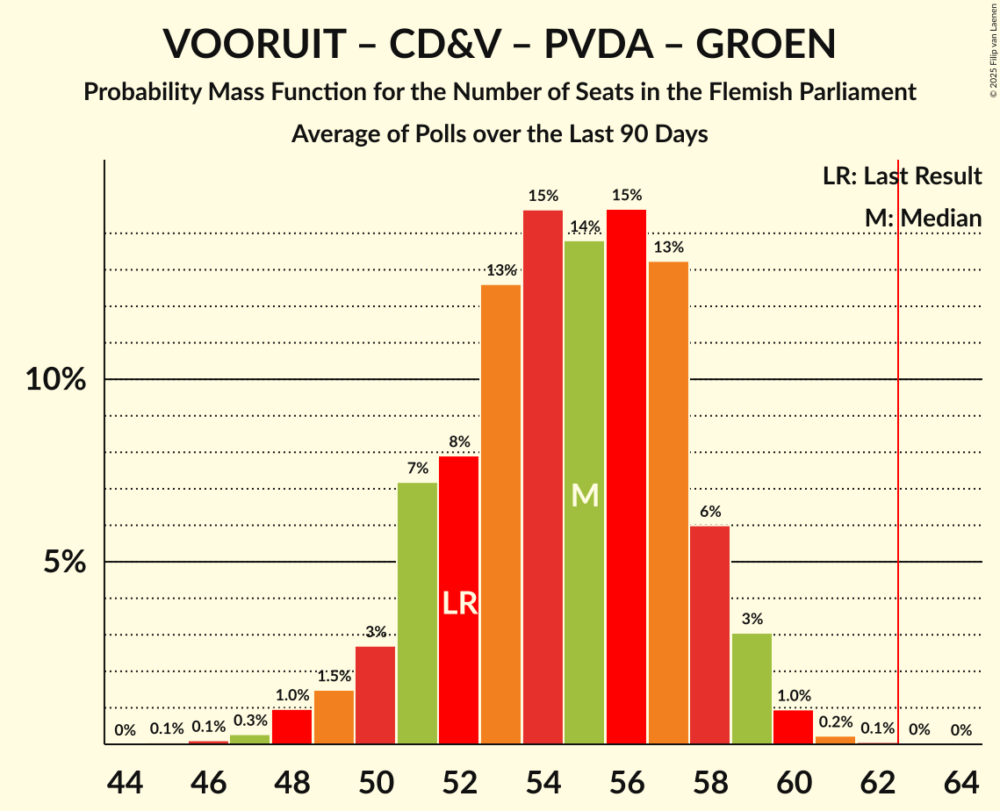

# Poll Average

<a href="#voting-intentions">Voting Intentions</a> | <a href="#seats">Seats</a> | <a href="#coalitions">Coalitions</a> | <a href="#technical-information">Technical Information</a>

## Summary

The table below lists the polls on which the average is based. They are the most recent polls (less than 90 days old) registered and analyzed so far.

| Period     | Polling firm/Commissioner(s) | N-VA | VB | VOORUIT | CD&V | VLD | PVDA | GROEN | TFA |
|:----------:|:----------------------------:|:--:|:--:|:--:|:--:|:--:|:--:|:--:|:--:|
| 9 June 2024 | General Election | 23.9%   31 | 22.7%   31 | 13.8%   18 | 13.0%   16 | 8.3%   9 | 8.3%   9 | 7.3%   9 | 0.3%   1 |
| N/A | Poll Average | 21–26%   27–35 | 24–30%   31–39 | 12–16%   14–20 | 11–16%   13–19 | 4–7%   2–7 | 8–11%   7–14 | 6–9%   6–12 | 0–1%   0–2 |
| [16–23 September 2025](2025-09-23-Ipsos.html) | Ipsos   Het Laatste Nieuws, Le Soir, RTL TVi and VTM | 21–26%   27–35 | 24–30%   31–39 | 12–16%   14–20 | 11–16%   13–19 | 4–7%   2–7 | 7–11%   7–14 | 6–9%   6–12 | 0–1%   0–2 |
| 9 June 2024 | General Election | 23.9%   31 | 22.7%   31 | 13.8%   18 | 13.0%   16 | 8.3%   9 | 8.3%   9 | 7.3%   9 | 0.3%   1 |

Only polls for which at least the sample size has been published are included in the table above.

**Legend:**
+ **Top half of each row:** Voting intentions (95% confidence interval)
+ **Bottom half of each row:** Seat projections for the Flemish Parliament (95% confidence interval)
+ **N-VA:** Nieuw-Vlaamse Alliantie
+ **VB:** Vlaams Belang
+ **VOORUIT:** Vooruit
+ **CD&V:** Christen-Democratisch en Vlaams
+ **VLD:** Open Vlaamse Liberalen en Democraten
+ **PVDA:** Partij van de Arbeid van België
+ **GROEN:** Groen
+ **TFA:** Team Fouad Ahidar
+ **N/A (single party):** Party not included the published results
+ **N/A (entire row):** Calculation for this opinion poll not started yet

## Voting Intentions

### Confidence Intervals

| Party | Last Result | Median | 80% Confidence Interval | 90% Confidence Interval | 95% Confidence Interval | 99% Confidence Interval |
|:-----:|:-----------:|:------:|:-----------------------:|:-----------------------:|:-----------------------:|:-----------------------:|
| <a href="#nieuw-vlaamse-alliantie">Nieuw-Vlaamse Alliantie</a> | 23.9% | 23.4% | 21.8–25.2% |21.3–25.7% | 20.9–26.1% | 20.1–27.0% |
| <a href="#vlaams-belang">Vlaams Belang</a> | 22.7% | 26.7% | 25.0–28.6% |24.5–29.1% | 24.1–29.5% | 23.2–30.4% |
| <a href="#vooruit">Vooruit</a> | 13.8% | 13.6% | 12.3–15.1% |11.9–15.5% | 11.6–15.9% | 11.0–16.6% |
| <a href="#christen-democratisch-en-vlaams">Christen-Democratisch en Vlaams</a> | 13.0% | 13.5% | 12.1–14.9% |11.7–15.3% | 11.4–15.7% | 10.8–16.4% |
| <a href="#open-vlaamse-liberalen-en-democraten">Open Vlaamse Liberalen en Democraten</a> | 8.3% | 5.8% | 4.9–6.7% |4.6–7.0% | 4.4–7.3% | 4.1–7.9% |
| <a href="#partij-van-de-arbeid-van-belgië">Partij van de Arbeid van België</a> | 8.3% | 9.2% | 8.0–10.4% |7.7–10.7% | 7.5–11.0% | 7.0–11.7% |
| <a href="#groen">Groen</a> | 7.3% | 7.4% | 6.3–8.5% |6.1–8.8% | 5.8–9.1% | 5.4–9.7% |
| <a href="#team-fouad-ahidar">Team Fouad Ahidar</a> | 0.3% | 0.2% | 0.1–0.4% |0.0–0.5% | 0.0–0.6% | 0.0–0.7% |

### Nieuw-Vlaamse Alliantie

*For a full overview of the results for this party, see the [Nieuw-Vlaamse Alliantie](party-nieuw-vlaamsealliantie.html) page.*

| Voting Intentions | Probability | Accumulated | Special Marks |
|:-----------------:|:-----------:|:-----------:|:-------------:|
| 17.5–18.5% | 0% | 100% |  |
| 18.5–19.5% | 0.1% | 100% |  |
| 19.5–20.5% | 1.2% | 99.9% |  |
| 20.5–21.5% | 6% | 98.7% |  |
| 21.5–22.5% | 18% | 92% |  |
| 22.5–23.5% | 28% | 75% | Median |
| 23.5–24.5% | 26% | 47% | Last Result |
| 24.5–25.5% | 14% | 20% |  |
| 25.5–26.5% | 5% | 6% |  |
| 26.5–27.5% | 1.0% | 1.2% |  |
| 27.5–28.5% | 0.1% | 0.1% |  |
| 28.5–29.5% | 0% | 0% |  |

### Vlaams Belang

*For a full overview of the results for this party, see the [Vlaams Belang](party-vlaamsbelang.html) page.*

| Voting Intentions | Probability | Accumulated | Special Marks |
|:-----------------:|:-----------:|:-----------:|:-------------:|
| 20.5–21.5% | 0% | 100% |  |
| 21.5–22.5% | 0.1% | 100% |  |
| 22.5–23.5% | 0.9% | 99.9% | Last Result |
| 23.5–24.5% | 5% | 99.0% |  |
| 24.5–25.5% | 14% | 94% |  |
| 25.5–26.5% | 25% | 80% |  |
| 26.5–27.5% | 27% | 55% | Median |
| 27.5–28.5% | 18% | 28% |  |
| 28.5–29.5% | 8% | 10% |  |
| 29.5–30.5% | 2% | 2% |  |
| 30.5–31.5% | 0.4% | 0.4% |  |
| 31.5–32.5% | 0% | 0% |  |

### Vooruit

*For a full overview of the results for this party, see the [Vooruit](party-vooruit.html) page.*

| Voting Intentions | Probability | Accumulated | Special Marks |
|:-----------------:|:-----------:|:-----------:|:-------------:|
| 8.5–9.5% | 0% | 100% |  |
| 9.5–10.5% | 0.1% | 100% |  |
| 10.5–11.5% | 2% | 99.9% |  |
| 11.5–12.5% | 13% | 98% |  |
| 12.5–13.5% | 32% | 85% |  |
| 13.5–14.5% | 33% | 54% | Last Result, Median |
| 14.5–15.5% | 16% | 21% |  |
| 15.5–16.5% | 4% | 5% |  |
| 16.5–17.5% | 0.5% | 0.6% |  |
| 17.5–18.5% | 0% | 0% |  |

### Christen-Democratisch en Vlaams

*For a full overview of the results for this party, see the [Christen-Democratisch en Vlaams](party-christen-democratischenvlaams.html) page.*

| Voting Intentions | Probability | Accumulated | Special Marks |
|:-----------------:|:-----------:|:-----------:|:-------------:|
| 8.5–9.5% | 0% | 100% |  |
| 9.5–10.5% | 0.2% | 100% |  |
| 10.5–11.5% | 3% | 99.8% |  |
| 11.5–12.5% | 16% | 97% |  |
| 12.5–13.5% | 34% | 80% | Last Result, Median |
| 13.5–14.5% | 31% | 46% |  |
| 14.5–15.5% | 13% | 16% |  |
| 15.5–16.5% | 3% | 3% |  |
| 16.5–17.5% | 0.3% | 0.3% |  |
| 17.5–18.5% | 0% | 0% |  |

### Open Vlaamse Liberalen en Democraten

*For a full overview of the results for this party, see the [Open Vlaamse Liberalen en Democraten](party-openvlaamseliberalenendemocraten.html) page.*

| Voting Intentions | Probability | Accumulated | Special Marks |
|:-----------------:|:-----------:|:-----------:|:-------------:|
| 2.5–3.5% | 0% | 100% |  |
| 3.5–4.5% | 4% | 100% |  |
| 4.5–5.5% | 35% | 96% |  |
| 5.5–6.5% | 46% | 61% | Median |
| 6.5–7.5% | 14% | 15% |  |
| 7.5–8.5% | 1.3% | 1.3% | Last Result |
| 8.5–9.5% | 0% | 0% |  |

### Partij van de Arbeid van België

*For a full overview of the results for this party, see the [Partij van de Arbeid van België](party-partijvandearbeidvanbelgië.html) page.*

| Voting Intentions | Probability | Accumulated | Special Marks |
|:-----------------:|:-----------:|:-----------:|:-------------:|
| 5.5–6.5% | 0.1% | 100% |  |
| 6.5–7.5% | 3% | 99.9% |  |
| 7.5–8.5% | 22% | 97% | Last Result |
| 8.5–9.5% | 42% | 75% | Median |
| 9.5–10.5% | 26% | 33% |  |
| 10.5–11.5% | 6% | 7% |  |
| 11.5–12.5% | 0.7% | 0.7% |  |
| 12.5–13.5% | 0% | 0% |  |

### Groen

*For a full overview of the results for this party, see the [Groen](party-groen.html) page.*

| Voting Intentions | Probability | Accumulated | Special Marks |
|:-----------------:|:-----------:|:-----------:|:-------------:|
| 3.5–4.5% | 0% | 100% |  |
| 4.5–5.5% | 0.8% | 100% |  |
| 5.5–6.5% | 15% | 99.2% |  |
| 6.5–7.5% | 43% | 84% | Last Result, Median |
| 7.5–8.5% | 33% | 41% |  |
| 8.5–9.5% | 8% | 8% |  |
| 9.5–10.5% | 0.7% | 0.7% |  |
| 10.5–11.5% | 0% | 0% |  |

### Team Fouad Ahidar

*For a full overview of the results for this party, see the [Team Fouad Ahidar](party-teamfouadahidar.html) page.*

| Voting Intentions | Probability | Accumulated | Special Marks |
|:-----------------:|:-----------:|:-----------:|:-------------:|
| 0.0–0.5% | 97% | 100% | Last Result, Median |
| 0.5–1.5% | 3% | 3% |  |
| 1.5–2.5% | 0% | 0% |  |

## Seats

### Confidence Intervals

| Party | Last Result | Median | 80% Confidence Interval | 90% Confidence Interval | 95% Confidence Interval | 99% Confidence Interval |
|:-----:|:-----------:|:------:|:-----------------------:|:-----------------------:|:-----------------------:|:-----------------------:|
| <a href="#nieuw-vlaamse-alliantie">Nieuw-Vlaamse Alliantie</a> | 31 | 31 | 29–34 |28–35 | 27–35 | 25–36 |
| <a href="#vlaams-belang">Vlaams Belang</a> | 31 | 36 | 32–38 |32–39 | 31–39 | 30–41 |
| <a href="#vooruit">Vooruit</a> | 18 | 17 | 15–19 |15–20 | 14–20 | 12–22 |
| <a href="#christen-democratisch-en-vlaams">Christen-Democratisch en Vlaams</a> | 16 | 16 | 15–18 |14–19 | 13–19 | 12–20 |
| <a href="#open-vlaamse-liberalen-en-democraten">Open Vlaamse Liberalen en Democraten</a> | 9 | 5 | 2–6 |2–7 | 2–7 | 1–9 |
| <a href="#partij-van-de-arbeid-van-belgië">Partij van de Arbeid van België</a> | 9 | 11 | 8–13 |7–14 | 7–14 | 6–14 |
| <a href="#groen">Groen</a> | 9 | 9 | 7–11 |6–12 | 6–12 | 5–13 |
| <a href="#team-fouad-ahidar">Team Fouad Ahidar</a> | 1 | 1 | 0–2 |0–2 | 0–2 | 0–3 |

### Nieuw-Vlaamse Alliantie

*For a full overview of the results for this party, see the [Nieuw-Vlaamse Alliantie](party-nieuw-vlaamsealliantie.html) page.*

| Number of Seats | Probability | Accumulated | Special Marks |
|:---------------:|:-----------:|:-----------:|:-------------:|
| 24 | 0.1% | 100% |  |
| 25 | 0.6% | 99.9% |  |
| 26 | 0.7% | 99.3% |  |
| 27 | 1.4% | 98.6% |  |
| 28 | 4% | 97% |  |
| 29 | 13% | 93% |  |
| 30 | 20% | 80% |  |
| 31 | 29% | 61% | Last Result, Median |
| 32 | 13% | 32% |  |
| 33 | 6% | 19% |  |
| 34 | 7% | 13% |  |
| 35 | 5% | 6% |  |
| 36 | 1.5% | 2% |  |
| 37 | 0.1% | 0.2% |  |
| 38 | 0% | 0.1% |  |
| 39 | 0% | 0% |  |

### Vlaams Belang

*For a full overview of the results for this party, see the [Vlaams Belang](party-vlaamsbelang.html) page.*

| Number of Seats | Probability | Accumulated | Special Marks |
|:---------------:|:-----------:|:-----------:|:-------------:|
| 29 | 0.1% | 100% |  |
| 30 | 0.7% | 99.9% |  |
| 31 | 2% | 99.2% | Last Result |
| 32 | 13% | 97% |  |
| 33 | 5% | 85% |  |
| 34 | 12% | 80% |  |
| 35 | 13% | 68% |  |
| 36 | 24% | 54% | Median |
| 37 | 20% | 31% |  |
| 38 | 5% | 11% |  |
| 39 | 3% | 6% |  |
| 40 | 2% | 2% |  |
| 41 | 0.7% | 0.8% |  |
| 42 | 0.1% | 0.1% |  |
| 43 | 0% | 0% |  |

### Vooruit

*For a full overview of the results for this party, see the [Vooruit](party-vooruit.html) page.*

| Number of Seats | Probability | Accumulated | Special Marks |
|:---------------:|:-----------:|:-----------:|:-------------:|
| 11 | 0.3% | 100% |  |
| 12 | 0.3% | 99.7% |  |
| 13 | 1.0% | 99.4% |  |
| 14 | 3% | 98% |  |
| 15 | 8% | 96% |  |
| 16 | 9% | 88% |  |
| 17 | 42% | 79% | Median |
| 18 | 27% | 37% | Last Result |
| 19 | 5% | 10% |  |
| 20 | 4% | 5% |  |
| 21 | 1.0% | 2% |  |
| 22 | 0.3% | 0.6% |  |
| 23 | 0.2% | 0.3% |  |
| 24 | 0% | 0% |  |

### Christen-Democratisch en Vlaams

*For a full overview of the results for this party, see the [Christen-Democratisch en Vlaams](party-christen-democratischenvlaams.html) page.*

| Number of Seats | Probability | Accumulated | Special Marks |
|:---------------:|:-----------:|:-----------:|:-------------:|
| 11 | 0.1% | 100% |  |
| 12 | 2% | 99.9% |  |
| 13 | 3% | 98% |  |
| 14 | 5% | 95% |  |
| 15 | 10% | 91% |  |
| 16 | 42% | 80% | Last Result, Median |
| 17 | 25% | 38% |  |
| 18 | 7% | 14% |  |
| 19 | 5% | 7% |  |
| 20 | 2% | 2% |  |
| 21 | 0.2% | 0.4% |  |
| 22 | 0.1% | 0.1% |  |
| 23 | 0% | 0% |  |

### Open Vlaamse Liberalen en Democraten

*For a full overview of the results for this party, see the [Open Vlaamse Liberalen en Democraten](party-openvlaamseliberalenendemocraten.html) page.*

| Number of Seats | Probability | Accumulated | Special Marks |
|:---------------:|:-----------:|:-----------:|:-------------:|
| 1 | 2% | 100% |  |
| 2 | 27% | 98% |  |
| 3 | 16% | 71% |  |
| 4 | 4% | 55% |  |
| 5 | 32% | 51% | Median |
| 6 | 14% | 19% |  |
| 7 | 3% | 6% |  |
| 8 | 2% | 2% |  |
| 9 | 0.4% | 0.6% | Last Result |
| 10 | 0.1% | 0.2% |  |
| 11 | 0% | 0.1% |  |
| 12 | 0% | 0% |  |

### Partij van de Arbeid van België

*For a full overview of the results for this party, see the [Partij van de Arbeid van België](party-partijvandearbeidvanbelgië.html) page.*

| Number of Seats | Probability | Accumulated | Special Marks |
|:---------------:|:-----------:|:-----------:|:-------------:|
| 6 | 0.9% | 100% |  |
| 7 | 7% | 99.1% |  |
| 8 | 4% | 92% |  |
| 9 | 2% | 88% | Last Result |
| 10 | 36% | 86% |  |
| 11 | 27% | 50% | Median |
| 12 | 11% | 23% |  |
| 13 | 5% | 12% |  |
| 14 | 6% | 6% |  |
| 15 | 0.2% | 0.2% |  |
| 16 | 0% | 0.1% |  |
| 17 | 0% | 0% |  |

### Groen

*For a full overview of the results for this party, see the [Groen](party-groen.html) page.*

| Number of Seats | Probability | Accumulated | Special Marks |
|:---------------:|:-----------:|:-----------:|:-------------:|
| 4 | 0.1% | 100% |  |
| 5 | 2% | 99.9% |  |
| 6 | 6% | 98% |  |
| 7 | 11% | 92% |  |
| 8 | 16% | 81% |  |
| 9 | 33% | 65% | Last Result, Median |
| 10 | 10% | 32% |  |
| 11 | 14% | 22% |  |
| 12 | 6% | 8% |  |
| 13 | 1.1% | 1.2% |  |
| 14 | 0% | 0.1% |  |
| 15 | 0% | 0% |  |

### Team Fouad Ahidar

*For a full overview of the results for this party, see the [Team Fouad Ahidar](party-teamfouadahidar.html) page.*

| Number of Seats | Probability | Accumulated | Special Marks |
|:---------------:|:-----------:|:-----------:|:-------------:|
| 0 | 49% | 100% |  |
| 1 | 41% | 51% | Last Result, Median |
| 2 | 9% | 11% |  |
| 3 | 2% | 2% |  |
| 4 | 0.2% | 0.2% |  |
| 5 | 0% | 0% |  |

## Coalitions

### Confidence Intervals

| Coalition | Last Result | Median | Majority? | 80% Confidence Interval | 90% Confidence Interval | 95% Confidence Interval | 99% Confidence Interval |
|:---------:|:-----------:|:------:|:---------:|:-----------------------:|:-----------------------:|:-----------------------:|:-----------------------:|
| Nieuw-Vlaamse Alliantie – Vlaams Belang – Christen-Democratisch en Vlaams | 78 | 83 | 100% | 79–86 | 79–87 | 78–87 | 76–89 |
| Nieuw-Vlaamse Alliantie – Vooruit – Christen-Democratisch en Vlaams – Open Vlaamse Liberalen en Democraten | 74 | 68 | 99.4% | 65–72 | 65–73 | 64–73 | 62–75 |
| Nieuw-Vlaamse Alliantie – Vlaams Belang | 62 | 66 | 95% | 63–69 | 63–70 | 62–71 | 60–72 |
| Nieuw-Vlaamse Alliantie – Vooruit – Christen-Democratisch en Vlaams | 65 | 64 | 78% | 61–68 | 60–69 | 60–69 | 58–71 |
| Vooruit – Christen-Democratisch en Vlaams – Partij van de Arbeid van België – Groen | 52 | 53 | 0% | 50–56 | 49–57 | 48–58 | 47–59 |
| Nieuw-Vlaamse Alliantie – Vooruit – Open Vlaamse Liberalen en Democraten | 58 | 52 | 0% | 49–56 | 48–57 | 48–57 | 46–59 |
| Nieuw-Vlaamse Alliantie – Christen-Democratisch en Vlaams – Open Vlaamse Liberalen en Democraten | 56 | 51 | 0% | 48–55 | 48–56 | 47–56 | 45–58 |
| Nieuw-Vlaamse Alliantie – Christen-Democratisch en Vlaams | 47 | 47 | 0% | 44–51 | 44–51 | 43–52 | 41–53 |
| Vooruit – Christen-Democratisch en Vlaams – Open Vlaamse Liberalen en Democraten – Groen | 52 | 46 | 0% | 44–50 | 42–51 | 42–51 | 40–53 |
| Vooruit – Christen-Democratisch en Vlaams – Groen | 43 | 42 | 0% | 39–45 | 39–46 | 38–47 | 36–49 |
| Vooruit – Christen-Democratisch en Vlaams – Open Vlaamse Liberalen en Democraten | 43 | 37 | 0% | 35–40 | 34–41 | 33–42 | 32–44 |
| Nieuw-Vlaamse Alliantie – Open Vlaamse Liberalen en Democraten | 40 | 35 | 0% | 32–39 | 31–40 | 31–40 | 29–41 |
| Vooruit – Christen-Democratisch en Vlaams | 34 | 33 | 0% | 31–36 | 30–36 | 29–37 | 28–39 |
| Vooruit – Open Vlaamse Liberalen en Democraten – Groen | 36 | 30 | 0% | 27–33 | 26–34 | 26–35 | 24–37 |
| Christen-Democratisch en Vlaams – Open Vlaamse Liberalen en Democraten – Groen | 34 | 29 | 0% | 27–33 | 26–33 | 25–34 | 23–35 |
| Vooruit – Open Vlaamse Liberalen en Democraten | 27 | 21 | 0% | 19–24 | 18–25 | 17–25 | 16–27 |
| Christen-Democratisch en Vlaams – Open Vlaamse Liberalen en Democraten | 25 | 21 | 0% | 18–23 | 18–24 | 17–24 | 15–26 |

### Nieuw-Vlaamse Alliantie – Vlaams Belang – Christen-Democratisch en Vlaams

| Number of Seats | Probability | Accumulated | Special Marks |
|:---------------:|:-----------:|:-----------:|:-------------:|
| 75 | 0.1% | 100% |  |
| 76 | 0.4% | 99.9% |  |
| 77 | 1.3% | 99.5% |  |
| 78 | 2% | 98% | Last Result |
| 79 | 7% | 96% |  |
| 80 | 7% | 89% |  |
| 81 | 13% | 82% |  |
| 82 | 16% | 69% |  |
| 83 | 19% | 53% | Median |
| 84 | 16% | 35% |  |
| 85 | 7% | 19% |  |
| 86 | 5% | 11% |  |
| 87 | 4% | 6% |  |
| 88 | 1.5% | 2% |  |
| 89 | 0.8% | 1.0% |  |
| 90 | 0.1% | 0.2% |  |
| 91 | 0% | 0% |  |

### Nieuw-Vlaamse Alliantie – Vooruit – Christen-Democratisch en Vlaams – Open Vlaamse Liberalen en Democraten

| Number of Seats | Probability | Accumulated | Special Marks |
|:---------------:|:-----------:|:-----------:|:-------------:|
| 60 | 0.1% | 100% |  |
| 61 | 0.2% | 99.9% |  |
| 62 | 0.3% | 99.7% |  |
| 63 | 1.0% | 99.4% | Majority |
| 64 | 3% | 98% |  |
| 65 | 7% | 96% |  |
| 66 | 13% | 89% |  |
| 67 | 16% | 76% |  |
| 68 | 13% | 60% |  |
| 69 | 14% | 48% | Median |
| 70 | 13% | 34% |  |
| 71 | 7% | 21% |  |
| 72 | 5% | 13% |  |
| 73 | 7% | 9% |  |
| 74 | 1.3% | 2% | Last Result |
| 75 | 0.7% | 1.0% |  |
| 76 | 0.2% | 0.3% |  |
| 77 | 0.1% | 0.1% |  |
| 78 | 0% | 0% |  |

### Nieuw-Vlaamse Alliantie – Vlaams Belang

| Number of Seats | Probability | Accumulated | Special Marks |
|:---------------:|:-----------:|:-----------:|:-------------:|
| 59 | 0.1% | 100% |  |
| 60 | 0.5% | 99.8% |  |
| 61 | 1.4% | 99.3% |  |
| 62 | 3% | 98% | Last Result |
| 63 | 8% | 95% | Majority |
| 64 | 7% | 87% |  |
| 65 | 15% | 80% |  |
| 66 | 17% | 65% |  |
| 67 | 18% | 48% | Median |
| 68 | 15% | 30% |  |
| 69 | 7% | 16% |  |
| 70 | 4% | 9% |  |
| 71 | 3% | 5% |  |
| 72 | 1.2% | 2% |  |
| 73 | 0.3% | 0.4% |  |
| 74 | 0.1% | 0.1% |  |
| 75 | 0% | 0% |  |

### Nieuw-Vlaamse Alliantie – Vooruit – Christen-Democratisch en Vlaams

| Number of Seats | Probability | Accumulated | Special Marks |
|:---------------:|:-----------:|:-----------:|:-------------:|
| 56 | 0.1% | 100% |  |
| 57 | 0.1% | 99.9% |  |
| 58 | 0.5% | 99.8% |  |
| 59 | 2% | 99.2% |  |
| 60 | 3% | 98% |  |
| 61 | 8% | 95% |  |
| 62 | 8% | 86% |  |
| 63 | 12% | 78% | Majority |
| 64 | 20% | 67% | Median |
| 65 | 16% | 47% | Last Result |
| 66 | 10% | 31% |  |
| 67 | 8% | 21% |  |
| 68 | 8% | 13% |  |
| 69 | 3% | 5% |  |
| 70 | 2% | 2% |  |
| 71 | 0.3% | 0.6% |  |
| 72 | 0.2% | 0.3% |  |
| 73 | 0% | 0.1% |  |
| 74 | 0% | 0% |  |

### Vooruit – Christen-Democratisch en Vlaams – Partij van de Arbeid van België – Groen

| Number of Seats | Probability | Accumulated | Special Marks |
|:---------------:|:-----------:|:-----------:|:-------------:|
| 44 | 0% | 100% |  |
| 45 | 0.2% | 99.9% |  |
| 46 | 0.2% | 99.8% |  |
| 47 | 0.9% | 99.5% |  |
| 48 | 2% | 98.6% |  |
| 49 | 5% | 97% |  |
| 50 | 8% | 91% |  |
| 51 | 10% | 84% |  |
| 52 | 16% | 73% | Last Result |
| 53 | 15% | 57% | Median |
| 54 | 14% | 42% |  |
| 55 | 12% | 29% |  |
| 56 | 9% | 16% |  |
| 57 | 4% | 7% |  |
| 58 | 2% | 3% |  |
| 59 | 0.9% | 1.1% |  |
| 60 | 0.2% | 0.3% |  |
| 61 | 0.1% | 0.1% |  |
| 62 | 0% | 0% |  |

### Nieuw-Vlaamse Alliantie – Vooruit – Open Vlaamse Liberalen en Democraten

| Number of Seats | Probability | Accumulated | Special Marks |
|:---------------:|:-----------:|:-----------:|:-------------:|
| 44 | 0.1% | 100% |  |
| 45 | 0.2% | 99.9% |  |
| 46 | 0.5% | 99.7% |  |
| 47 | 1.3% | 99.2% |  |
| 48 | 4% | 98% |  |
| 49 | 8% | 94% |  |
| 50 | 14% | 87% |  |
| 51 | 14% | 73% |  |
| 52 | 17% | 59% |  |
| 53 | 9% | 41% | Median |
| 54 | 13% | 32% |  |
| 55 | 7% | 19% |  |
| 56 | 6% | 12% |  |
| 57 | 4% | 5% |  |
| 58 | 0.9% | 2% | Last Result |
| 59 | 0.4% | 0.6% |  |
| 60 | 0.2% | 0.2% |  |
| 61 | 0% | 0.1% |  |
| 62 | 0% | 0% |  |

### Nieuw-Vlaamse Alliantie – Christen-Democratisch en Vlaams – Open Vlaamse Liberalen en Democraten

| Number of Seats | Probability | Accumulated | Special Marks |
|:---------------:|:-----------:|:-----------:|:-------------:|
| 43 | 0.1% | 100% |  |
| 44 | 0.2% | 99.9% |  |
| 45 | 0.4% | 99.7% |  |
| 46 | 1.0% | 99.3% |  |
| 47 | 3% | 98% |  |
| 48 | 8% | 95% |  |
| 49 | 13% | 87% |  |
| 50 | 13% | 74% |  |
| 51 | 15% | 62% |  |
| 52 | 19% | 47% | Median |
| 53 | 9% | 27% |  |
| 54 | 6% | 18% |  |
| 55 | 5% | 13% |  |
| 56 | 6% | 8% | Last Result |
| 57 | 1.0% | 2% |  |
| 58 | 0.5% | 0.8% |  |
| 59 | 0.2% | 0.3% |  |
| 60 | 0% | 0.1% |  |
| 61 | 0% | 0% |  |

### Nieuw-Vlaamse Alliantie – Christen-Democratisch en Vlaams

| Number of Seats | Probability | Accumulated | Special Marks |
|:---------------:|:-----------:|:-----------:|:-------------:|
| 39 | 0% | 100% |  |
| 40 | 0.1% | 99.9% |  |
| 41 | 0.5% | 99.8% |  |
| 42 | 1.3% | 99.3% |  |
| 43 | 3% | 98% |  |
| 44 | 6% | 95% |  |
| 45 | 7% | 90% |  |
| 46 | 18% | 82% |  |
| 47 | 26% | 64% | Last Result, Median |
| 48 | 10% | 37% |  |
| 49 | 9% | 27% |  |
| 50 | 8% | 19% |  |
| 51 | 8% | 11% |  |
| 52 | 2% | 3% |  |
| 53 | 0.8% | 1.2% |  |
| 54 | 0.3% | 0.4% |  |
| 55 | 0.1% | 0.1% |  |
| 56 | 0% | 0% |  |

### Vooruit – Christen-Democratisch en Vlaams – Open Vlaamse Liberalen en Democraten – Groen

| Number of Seats | Probability | Accumulated | Special Marks |
|:---------------:|:-----------:|:-----------:|:-------------:|
| 38 | 0.1% | 100% |  |
| 39 | 0.1% | 99.9% |  |
| 40 | 0.4% | 99.8% |  |
| 41 | 2% | 99.4% |  |
| 42 | 3% | 98% |  |
| 43 | 4% | 95% |  |
| 44 | 12% | 91% |  |
| 45 | 17% | 79% |  |
| 46 | 15% | 62% |  |
| 47 | 14% | 47% | Median |
| 48 | 12% | 33% |  |
| 49 | 9% | 21% |  |
| 50 | 6% | 12% |  |
| 51 | 4% | 6% |  |
| 52 | 1.4% | 2% | Last Result |
| 53 | 0.4% | 0.7% |  |
| 54 | 0.2% | 0.3% |  |
| 55 | 0.1% | 0.1% |  |
| 56 | 0% | 0% |  |

### Vooruit – Christen-Democratisch en Vlaams – Groen

| Number of Seats | Probability | Accumulated | Special Marks |
|:---------------:|:-----------:|:-----------:|:-------------:|
| 34 | 0% | 100% |  |
| 35 | 0.1% | 99.9% |  |
| 36 | 0.5% | 99.8% |  |
| 37 | 1.4% | 99.3% |  |
| 38 | 2% | 98% |  |
| 39 | 7% | 96% |  |
| 40 | 9% | 89% |  |
| 41 | 12% | 80% |  |
| 42 | 21% | 68% | Median |
| 43 | 16% | 47% | Last Result |
| 44 | 11% | 30% |  |
| 45 | 11% | 19% |  |
| 46 | 4% | 8% |  |
| 47 | 2% | 4% |  |
| 48 | 2% | 2% |  |
| 49 | 0.4% | 0.5% |  |
| 50 | 0.1% | 0.1% |  |
| 51 | 0% | 0.1% |  |
| 52 | 0% | 0% |  |

### Vooruit – Christen-Democratisch en Vlaams – Open Vlaamse Liberalen en Democraten

| Number of Seats | Probability | Accumulated | Special Marks |
|:---------------:|:-----------:|:-----------:|:-------------:|
| 30 | 0.1% | 100% |  |
| 31 | 0.3% | 99.8% |  |
| 32 | 1.3% | 99.5% |  |
| 33 | 2% | 98% |  |
| 34 | 4% | 96% |  |
| 35 | 12% | 93% |  |
| 36 | 17% | 81% |  |
| 37 | 16% | 64% |  |
| 38 | 16% | 48% | Median |
| 39 | 14% | 32% |  |
| 40 | 9% | 18% |  |
| 41 | 5% | 9% |  |
| 42 | 3% | 4% |  |
| 43 | 1.0% | 1.5% | Last Result |
| 44 | 0.3% | 0.5% |  |
| 45 | 0.2% | 0.2% |  |
| 46 | 0.1% | 0.1% |  |
| 47 | 0% | 0% |  |

### Nieuw-Vlaamse Alliantie – Open Vlaamse Liberalen en Democraten

| Number of Seats | Probability | Accumulated | Special Marks |
|:---------------:|:-----------:|:-----------:|:-------------:|
| 27 | 0.1% | 100% |  |
| 28 | 0.2% | 99.9% |  |
| 29 | 0.4% | 99.7% |  |
| 30 | 1.2% | 99.3% |  |
| 31 | 3% | 98% |  |
| 32 | 10% | 95% |  |
| 33 | 10% | 85% |  |
| 34 | 19% | 75% |  |
| 35 | 16% | 56% |  |
| 36 | 13% | 40% | Median |
| 37 | 12% | 27% |  |
| 38 | 5% | 15% |  |
| 39 | 5% | 10% |  |
| 40 | 4% | 5% | Last Result |
| 41 | 0.7% | 1.0% |  |
| 42 | 0.2% | 0.3% |  |
| 43 | 0.1% | 0.1% |  |
| 44 | 0% | 0% |  |

### Vooruit – Christen-Democratisch en Vlaams

| Number of Seats | Probability | Accumulated | Special Marks |
|:---------------:|:-----------:|:-----------:|:-------------:|
| 26 | 0% | 100% |  |
| 27 | 0.4% | 99.9% |  |
| 28 | 0.6% | 99.5% |  |
| 29 | 2% | 98.9% |  |
| 30 | 5% | 97% |  |
| 31 | 7% | 92% |  |
| 32 | 14% | 85% |  |
| 33 | 22% | 72% | Median |
| 34 | 23% | 49% | Last Result |
| 35 | 13% | 27% |  |
| 36 | 9% | 14% |  |
| 37 | 3% | 5% |  |
| 38 | 1.2% | 2% |  |
| 39 | 0.5% | 0.8% |  |
| 40 | 0.2% | 0.3% |  |
| 41 | 0.1% | 0.1% |  |
| 42 | 0% | 0% |  |

### Vooruit – Open Vlaamse Liberalen en Democraten – Groen

| Number of Seats | Probability | Accumulated | Special Marks |
|:---------------:|:-----------:|:-----------:|:-------------:|
| 22 | 0% | 100% |  |
| 23 | 0.1% | 99.9% |  |
| 24 | 0.4% | 99.8% |  |
| 25 | 2% | 99.5% |  |
| 26 | 4% | 98% |  |
| 27 | 6% | 94% |  |
| 28 | 13% | 88% |  |
| 29 | 16% | 75% |  |
| 30 | 17% | 59% |  |
| 31 | 11% | 42% | Median |
| 32 | 13% | 31% |  |
| 33 | 9% | 18% |  |
| 34 | 5% | 9% |  |
| 35 | 2% | 4% |  |
| 36 | 1.3% | 2% | Last Result |
| 37 | 0.7% | 0.8% |  |
| 38 | 0.1% | 0.1% |  |
| 39 | 0% | 0% |  |

### Christen-Democratisch en Vlaams – Open Vlaamse Liberalen en Democraten – Groen

| Number of Seats | Probability | Accumulated | Special Marks |
|:---------------:|:-----------:|:-----------:|:-------------:|
| 22 | 0.2% | 100% |  |
| 23 | 0.5% | 99.8% |  |
| 24 | 1.2% | 99.2% |  |
| 25 | 3% | 98% |  |
| 26 | 5% | 95% |  |
| 27 | 15% | 91% |  |
| 28 | 17% | 76% |  |
| 29 | 16% | 59% |  |
| 30 | 14% | 43% | Median |
| 31 | 9% | 30% |  |
| 32 | 7% | 20% |  |
| 33 | 10% | 13% |  |
| 34 | 2% | 3% | Last Result |
| 35 | 0.8% | 1.1% |  |
| 36 | 0.2% | 0.3% |  |
| 37 | 0.1% | 0.1% |  |
| 38 | 0% | 0% |  |

### Vooruit – Open Vlaamse Liberalen en Democraten

| Number of Seats | Probability | Accumulated | Special Marks |
|:---------------:|:-----------:|:-----------:|:-------------:|
| 14 | 0.1% | 100% |  |
| 15 | 0.2% | 99.9% |  |
| 16 | 0.7% | 99.7% |  |
| 17 | 2% | 99.0% |  |
| 18 | 5% | 97% |  |
| 19 | 14% | 92% |  |
| 20 | 17% | 78% |  |
| 21 | 16% | 61% |  |
| 22 | 18% | 45% | Median |
| 23 | 15% | 27% |  |
| 24 | 5% | 12% |  |
| 25 | 4% | 6% |  |
| 26 | 1.4% | 2% |  |
| 27 | 0.4% | 0.6% | Last Result |
| 28 | 0.1% | 0.2% |  |
| 29 | 0% | 0% |  |

### Christen-Democratisch en Vlaams – Open Vlaamse Liberalen en Democraten

| Number of Seats | Probability | Accumulated | Special Marks |
|:---------------:|:-----------:|:-----------:|:-------------:|
| 14 | 0.3% | 100% |  |
| 15 | 0.6% | 99.7% |  |
| 16 | 1.1% | 99.1% |  |
| 17 | 3% | 98% |  |
| 18 | 19% | 95% |  |
| 19 | 15% | 76% |  |
| 20 | 11% | 61% |  |
| 21 | 21% | 50% | Median |
| 22 | 16% | 29% |  |
| 23 | 7% | 13% |  |
| 24 | 3% | 5% |  |
| 25 | 2% | 2% | Last Result |
| 26 | 0.5% | 0.7% |  |
| 27 | 0.1% | 0.2% |  |
| 28 | 0.1% | 0.1% |  |
| 29 | 0% | 0% |  |

## Technical Information

+ **Number of polls included in this average:** 1
+ **Lowest number of simulations done in a poll included in this average:** 2,097,152
+ **Total number of simulations done in the polls included in this average:** 2,097,152
+ **Error estimate:** 2.50%
