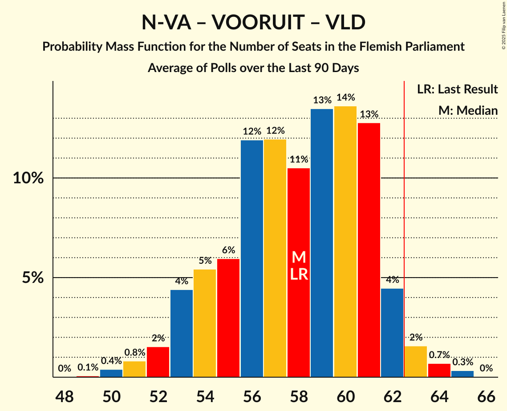
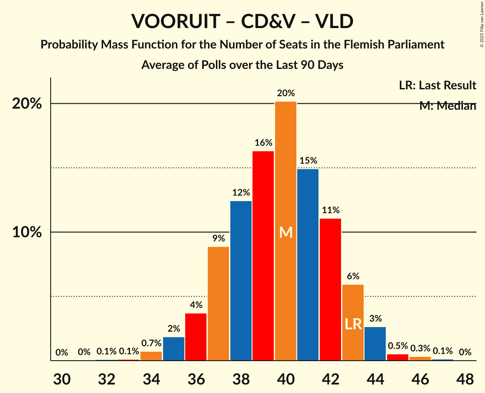

# Poll Average

<a href="#voting-intentions">Voting Intentions</a> | <a href="#seats">Seats</a> | <a href="#coalitions">Coalitions</a> | <a href="#technical-information">Technical Information</a>

## Summary

The table below lists the polls on which the average is based. They are the most recent polls (less than 90 days old) registered and analyzed so far.

| Period     | Polling firm/Commissioner(s) | N-VA | VB | VOORUIT | CD&V | VLD | PVDA | GROEN | TFA |
|:----------:|:----------------------------:|:--:|:--:|:--:|:--:|:--:|:--:|:--:|:--:|
| 9 June 2024 | General Election | 23.9%   31 | 22.7%   31 | 13.8%   18 | 13.0%   16 | 8.3%   9 | 8.3%   9 | 7.3%   9 | 0.3%   1 |
| N/A | Poll Average | 23–28%   30–38 | 23–28%   30–37 | 12–17%   15–22 | 10–14%   11–16 | 5–8%   2–8 | 8–12%   10–15 | 5–8%   4–11 | 0–1%   0–2 |
| [4–11 March 2025](2025-03-11-Ipsos.html) | Ipsos   Het Laatste Nieuws, Le Soir, RTL TVi and VTM | 23–28%   30–38 | 23–29%   30–37 | 12–17%   15–22 | 10–14%   11–16 | 5–8%   2–8 | 8–12%   10–15 | 5–8%   4–11 | 0–1%   0–2 |
| 9 June 2024 | General Election | 23.9%   31 | 22.7%   31 | 13.8%   18 | 13.0%   16 | 8.3%   9 | 8.3%   9 | 7.3%   9 | 0.3%   1 |

Only polls for which at least the sample size has been published are included in the table above.

**Legend:**
+ **Top half of each row:** Voting intentions (95% confidence interval)
+ **Bottom half of each row:** Seat projections for the Flemish Parliament (95% confidence interval)
+ **N-VA:** Nieuw-Vlaamse Alliantie
+ **VB:** Vlaams Belang
+ **VOORUIT:** Vooruit
+ **CD&V:** Christen-Democratisch en Vlaams
+ **VLD:** Open Vlaamse Liberalen en Democraten
+ **PVDA:** Partij van de Arbeid van België
+ **GROEN:** Groen
+ **TFA:** Team Fouad Ahidar
+ **N/A (single party):** Party not included the published results
+ **N/A (entire row):** Calculation for this opinion poll not started yet

## Voting Intentions

### Confidence Intervals

| Party | Last Result | Median | 80% Confidence Interval | 90% Confidence Interval | 95% Confidence Interval | 99% Confidence Interval |
|:-----:|:-----------:|:------:|:-----------------------:|:-----------------------:|:-----------------------:|:-----------------------:|
| <a href="#nieuw-vlaamse-alliantie">Nieuw-Vlaamse Alliantie</a> | 23.9% | 25.5% | 23.8–27.3% |23.3–27.8% | 22.9–28.3% | 22.1–29.2% |
| <a href="#vlaams-belang">Vlaams Belang</a> | 22.7% | 25.7% | 24.0–27.5% |23.5–28.1% | 23.1–28.5% | 22.3–29.4% |
| <a href="#vooruit">Vooruit</a> | 13.8% | 14.3% | 13.0–15.8% |12.6–16.2% | 12.3–16.6% | 11.7–17.4% |
| <a href="#christen-democratisch-en-vlaams">Christen-Democratisch en Vlaams</a> | 13.0% | 11.7% | 10.5–13.1% |10.1–13.5% | 9.9–13.8% | 9.3–14.5% |
| <a href="#open-vlaamse-liberalen-en-democraten">Open Vlaamse Liberalen en Democraten</a> | 8.3% | 6.1% | 5.1–7.1% |4.9–7.4% | 4.7–7.6% | 4.3–8.2% |
| <a href="#partij-van-de-arbeid-van-belgië">Partij van de Arbeid van België</a> | 8.3% | 10.1% | 8.9–11.3% |8.6–11.7% | 8.3–12.0% | 7.8–12.7% |
| <a href="#groen">Groen</a> | 7.3% | 6.7% | 5.7–7.7% |5.4–8.0% | 5.2–8.3% | 4.8–8.9% |
| <a href="#team-fouad-ahidar">Team Fouad Ahidar</a> | 0.3% | 0.2% | 0.1–0.4% |0.0–0.5% | 0.0–0.6% | 0.0–0.7% |

### Nieuw-Vlaamse Alliantie

*For a full overview of the results for this party, see the [Nieuw-Vlaamse Alliantie](party-nieuw-vlaamsealliantie.html) page.*

| Voting Intentions | Probability | Accumulated | Special Marks |
|:-----------------:|:-----------:|:-----------:|:-------------:|
| 19.5–20.5% | 0% | 100% |  |
| 20.5–21.5% | 0.1% | 100% |  |
| 21.5–22.5% | 1.2% | 99.9% |  |
| 22.5–23.5% | 6% | 98.7% |  |
| 23.5–24.5% | 17% | 93% | Last Result |
| 24.5–25.5% | 27% | 76% |  |
| 25.5–26.5% | 26% | 50% | Median |
| 26.5–27.5% | 16% | 23% |  |
| 27.5–28.5% | 6% | 7% |  |
| 28.5–29.5% | 1.4% | 2% |  |
| 29.5–30.5% | 0.2% | 0.2% |  |
| 30.5–31.5% | 0% | 0% |  |

### Vlaams Belang

*For a full overview of the results for this party, see the [Vlaams Belang](party-vlaamsbelang.html) page.*

| Voting Intentions | Probability | Accumulated | Special Marks |
|:-----------------:|:-----------:|:-----------:|:-------------:|
| 19.5–20.5% | 0% | 100% |  |
| 20.5–21.5% | 0.1% | 100% |  |
| 21.5–22.5% | 0.8% | 99.9% |  |
| 22.5–23.5% | 4% | 99.1% | Last Result |
| 23.5–24.5% | 14% | 95% |  |
| 24.5–25.5% | 25% | 81% |  |
| 25.5–26.5% | 28% | 55% | Median |
| 26.5–27.5% | 18% | 28% |  |
| 27.5–28.5% | 7% | 10% |  |
| 28.5–29.5% | 2% | 2% |  |
| 29.5–30.5% | 0.3% | 0.4% |  |
| 30.5–31.5% | 0% | 0% |  |

### Vooruit

*For a full overview of the results for this party, see the [Vooruit](party-vooruit.html) page.*

| Voting Intentions | Probability | Accumulated | Special Marks |
|:-----------------:|:-----------:|:-----------:|:-------------:|
| 9.5–10.5% | 0% | 100% |  |
| 10.5–11.5% | 0.4% | 100% |  |
| 11.5–12.5% | 4% | 99.6% |  |
| 12.5–13.5% | 19% | 95% |  |
| 13.5–14.5% | 34% | 77% | Last Result, Median |
| 14.5–15.5% | 28% | 43% |  |
| 15.5–16.5% | 12% | 14% |  |
| 16.5–17.5% | 2% | 3% |  |
| 17.5–18.5% | 0.3% | 0.3% |  |
| 18.5–19.5% | 0% | 0% |  |

### Christen-Democratisch en Vlaams

*For a full overview of the results for this party, see the [Christen-Democratisch en Vlaams](party-christen-democratischenvlaams.html) page.*

| Voting Intentions | Probability | Accumulated | Special Marks |
|:-----------------:|:-----------:|:-----------:|:-------------:|
| 7.5–8.5% | 0% | 100% |  |
| 8.5–9.5% | 1.1% | 100% |  |
| 9.5–10.5% | 10% | 98.9% |  |
| 10.5–11.5% | 31% | 89% |  |
| 11.5–12.5% | 36% | 58% | Median |
| 12.5–13.5% | 18% | 22% | Last Result |
| 13.5–14.5% | 4% | 4% |  |
| 14.5–15.5% | 0.4% | 0.5% |  |
| 15.5–16.5% | 0% | 0% |  |

### Open Vlaamse Liberalen en Democraten

*For a full overview of the results for this party, see the [Open Vlaamse Liberalen en Democraten](party-openvlaamseliberalenendemocraten.html) page.*

| Voting Intentions | Probability | Accumulated | Special Marks |
|:-----------------:|:-----------:|:-----------:|:-------------:|
| 2.5–3.5% | 0% | 100% |  |
| 3.5–4.5% | 1.5% | 100% |  |
| 4.5–5.5% | 23% | 98.5% |  |
| 5.5–6.5% | 50% | 76% | Median |
| 6.5–7.5% | 23% | 26% |  |
| 7.5–8.5% | 3% | 3% | Last Result |
| 8.5–9.5% | 0.1% | 0.2% |  |
| 9.5–10.5% | 0% | 0% |  |

### Partij van de Arbeid van België

*For a full overview of the results for this party, see the [Partij van de Arbeid van België](party-partijvandearbeidvanbelgië.html) page.*

| Voting Intentions | Probability | Accumulated | Special Marks |
|:-----------------:|:-----------:|:-----------:|:-------------:|
| 5.5–6.5% | 0% | 100% |  |
| 6.5–7.5% | 0.2% | 100% |  |
| 7.5–8.5% | 5% | 99.8% | Last Result |
| 8.5–9.5% | 25% | 95% |  |
| 9.5–10.5% | 40% | 70% | Median |
| 10.5–11.5% | 24% | 30% |  |
| 11.5–12.5% | 6% | 6% |  |
| 12.5–13.5% | 0.7% | 0.7% |  |
| 13.5–14.5% | 0% | 0% |  |

### Groen

*For a full overview of the results for this party, see the [Groen](party-groen.html) page.*

| Voting Intentions | Probability | Accumulated | Special Marks |
|:-----------------:|:-----------:|:-----------:|:-------------:|
| 2.5–3.5% | 0% | 100% |  |
| 3.5–4.5% | 0.1% | 100% |  |
| 4.5–5.5% | 7% | 99.9% |  |
| 5.5–6.5% | 38% | 93% |  |
| 6.5–7.5% | 41% | 55% | Last Result, Median |
| 7.5–8.5% | 13% | 14% |  |
| 8.5–9.5% | 1.3% | 1.3% |  |
| 9.5–10.5% | 0.1% | 0.1% |  |
| 10.5–11.5% | 0% | 0% |  |

### Team Fouad Ahidar

*For a full overview of the results for this party, see the [Team Fouad Ahidar](party-teamfouadahidar.html) page.*

| Voting Intentions | Probability | Accumulated | Special Marks |
|:-----------------:|:-----------:|:-----------:|:-------------:|
| 0.0–0.5% | 97% | 100% | Last Result, Median |
| 0.5–1.5% | 3% | 3% |  |
| 1.5–2.5% | 0% | 0% |  |

## Seats

### Confidence Intervals

| Party | Last Result | Median | 80% Confidence Interval | 90% Confidence Interval | 95% Confidence Interval | 99% Confidence Interval |
|:-----:|:-----------:|:------:|:-----------------------:|:-----------------------:|:-----------------------:|:-----------------------:|
| <a href="#nieuw-vlaamse-alliantie">Nieuw-Vlaamse Alliantie</a> | 31 | 34 | 31–36 |31–37 | 30–38 | 28–39 |
| <a href="#vlaams-belang">Vlaams Belang</a> | 31 | 34 | 31–36 |31–37 | 30–37 | 29–40 |
| <a href="#vooruit">Vooruit</a> | 18 | 18 | 17–20 |16–21 | 15–22 | 14–23 |
| <a href="#christen-democratisch-en-vlaams">Christen-Democratisch en Vlaams</a> | 16 | 14 | 12–16 |11–16 | 11–16 | 11–18 |
| <a href="#open-vlaamse-liberalen-en-democraten">Open Vlaamse Liberalen en Democraten</a> | 9 | 5 | 2–7 |2–7 | 2–8 | 1–10 |
| <a href="#partij-van-de-arbeid-van-belgië">Partij van de Arbeid van België</a> | 9 | 12 | 10–14 |10–14 | 10–15 | 7–16 |
| <a href="#groen">Groen</a> | 9 | 8 | 5–9 |5–10 | 4–11 | 3–12 |
| <a href="#team-fouad-ahidar">Team Fouad Ahidar</a> | 1 | 0 | 0–2 |0–2 | 0–2 | 0–3 |

### Nieuw-Vlaamse Alliantie

*For a full overview of the results for this party, see the [Nieuw-Vlaamse Alliantie](party-nieuw-vlaamsealliantie.html) page.*

| Number of Seats | Probability | Accumulated | Special Marks |
|:---------------:|:-----------:|:-----------:|:-------------:|
| 27 | 0.1% | 100% |  |
| 28 | 0.5% | 99.9% |  |
| 29 | 0.6% | 99.4% |  |
| 30 | 3% | 98.8% |  |
| 31 | 15% | 96% | Last Result |
| 32 | 14% | 81% |  |
| 33 | 11% | 67% |  |
| 34 | 12% | 56% | Median |
| 35 | 19% | 44% |  |
| 36 | 17% | 25% |  |
| 37 | 5% | 8% |  |
| 38 | 1.2% | 3% |  |
| 39 | 1.5% | 2% |  |
| 40 | 0.3% | 0.3% |  |
| 41 | 0.1% | 0.1% |  |
| 42 | 0% | 0% |  |

### Vlaams Belang

*For a full overview of the results for this party, see the [Vlaams Belang](party-vlaamsbelang.html) page.*

| Number of Seats | Probability | Accumulated | Special Marks |
|:---------------:|:-----------:|:-----------:|:-------------:|
| 27 | 0.1% | 100% |  |
| 28 | 0.2% | 99.9% |  |
| 29 | 0.7% | 99.7% |  |
| 30 | 2% | 99.0% |  |
| 31 | 11% | 97% | Last Result |
| 32 | 18% | 86% |  |
| 33 | 8% | 67% |  |
| 34 | 18% | 59% | Median |
| 35 | 21% | 42% |  |
| 36 | 12% | 21% |  |
| 37 | 6% | 9% |  |
| 38 | 1.2% | 2% |  |
| 39 | 0.7% | 1.2% |  |
| 40 | 0.4% | 0.6% |  |
| 41 | 0.1% | 0.1% |  |
| 42 | 0% | 0% |  |

### Vooruit

*For a full overview of the results for this party, see the [Vooruit](party-vooruit.html) page.*

| Number of Seats | Probability | Accumulated | Special Marks |
|:---------------:|:-----------:|:-----------:|:-------------:|
| 11 | 0.1% | 100% |  |
| 12 | 0.1% | 99.9% |  |
| 13 | 0.1% | 99.8% |  |
| 14 | 0.6% | 99.7% |  |
| 15 | 4% | 99.1% |  |
| 16 | 4% | 95% |  |
| 17 | 30% | 91% |  |
| 18 | 30% | 61% | Last Result, Median |
| 19 | 18% | 32% |  |
| 20 | 7% | 14% |  |
| 21 | 3% | 6% |  |
| 22 | 2% | 3% |  |
| 23 | 1.2% | 1.2% |  |
| 24 | 0% | 0% |  |

### Christen-Democratisch en Vlaams

*For a full overview of the results for this party, see the [Christen-Democratisch en Vlaams](party-christen-democratischenvlaams.html) page.*

| Number of Seats | Probability | Accumulated | Special Marks |
|:---------------:|:-----------:|:-----------:|:-------------:|
| 10 | 0.1% | 100% |  |
| 11 | 8% | 99.9% |  |
| 12 | 26% | 92% |  |
| 13 | 12% | 66% |  |
| 14 | 15% | 54% | Median |
| 15 | 14% | 39% |  |
| 16 | 24% | 26% | Last Result |
| 17 | 1.4% | 2% |  |
| 18 | 0.6% | 0.9% |  |
| 19 | 0.2% | 0.2% |  |
| 20 | 0% | 0% |  |

### Open Vlaamse Liberalen en Democraten

*For a full overview of the results for this party, see the [Open Vlaamse Liberalen en Democraten](party-openvlaamseliberalenendemocraten.html) page.*

| Number of Seats | Probability | Accumulated | Special Marks |
|:---------------:|:-----------:|:-----------:|:-------------:|
| 1 | 0.6% | 100% |  |
| 2 | 14% | 99.4% |  |
| 3 | 15% | 85% |  |
| 4 | 5% | 70% |  |
| 5 | 36% | 65% | Median |
| 6 | 18% | 29% |  |
| 7 | 7% | 11% |  |
| 8 | 2% | 4% |  |
| 9 | 1.4% | 2% | Last Result |
| 10 | 0.4% | 0.6% |  |
| 11 | 0.1% | 0.2% |  |
| 12 | 0.1% | 0.1% |  |
| 13 | 0% | 0% |  |

### Partij van de Arbeid van België

*For a full overview of the results for this party, see the [Partij van de Arbeid van België](party-partijvandearbeidvanbelgië.html) page.*

| Number of Seats | Probability | Accumulated | Special Marks |
|:---------------:|:-----------:|:-----------:|:-------------:|
| 6 | 0.1% | 100% |  |
| 7 | 0.8% | 99.9% |  |
| 8 | 0.5% | 99.2% |  |
| 9 | 1.2% | 98.7% | Last Result |
| 10 | 19% | 98% |  |
| 11 | 24% | 78% |  |
| 12 | 26% | 54% | Median |
| 13 | 10% | 28% |  |
| 14 | 15% | 19% |  |
| 15 | 3% | 4% |  |
| 16 | 0.6% | 1.0% |  |
| 17 | 0.4% | 0.4% |  |
| 18 | 0% | 0% |  |

### Groen

*For a full overview of the results for this party, see the [Groen](party-groen.html) page.*

| Number of Seats | Probability | Accumulated | Special Marks |
|:---------------:|:-----------:|:-----------:|:-------------:|
| 1 | 0.1% | 100% |  |
| 2 | 0.2% | 99.9% |  |
| 3 | 0.8% | 99.7% |  |
| 4 | 2% | 98.9% |  |
| 5 | 10% | 97% |  |
| 6 | 19% | 86% |  |
| 7 | 15% | 67% |  |
| 8 | 21% | 53% | Median |
| 9 | 24% | 32% | Last Result |
| 10 | 2% | 7% |  |
| 11 | 4% | 5% |  |
| 12 | 0.6% | 0.7% |  |
| 13 | 0.1% | 0.1% |  |
| 14 | 0% | 0% |  |

### Team Fouad Ahidar

*For a full overview of the results for this party, see the [Team Fouad Ahidar](party-teamfouadahidar.html) page.*

| Number of Seats | Probability | Accumulated | Special Marks |
|:---------------:|:-----------:|:-----------:|:-------------:|
| 0 | 52% | 100% | Median |
| 1 | 37% | 48% | Last Result |
| 2 | 10% | 12% |  |
| 3 | 2% | 2% |  |
| 4 | 0.2% | 0.2% |  |
| 5 | 0% | 0% |  |

## Coalitions

### Confidence Intervals

| Coalition | Last Result | Median | Majority? | 80% Confidence Interval | 90% Confidence Interval | 95% Confidence Interval | 99% Confidence Interval |
|:---------:|:-----------:|:------:|:---------:|:-----------------------:|:-----------------------:|:-----------------------:|:-----------------------:|
| Nieuw-Vlaamse Alliantie – Vlaams Belang – Christen-Democratisch en Vlaams | 78 | 82 | 100% | 78–85 | 77–85 | 76–86 | 75–87 |
| Nieuw-Vlaamse Alliantie – Vooruit – Christen-Democratisch en Vlaams – Open Vlaamse Liberalen en Democraten | 74 | 70 | 99.9% | 67–74 | 66–75 | 65–76 | 63–77 |
| Nieuw-Vlaamse Alliantie – Vlaams Belang | 62 | 68 | 98.6% | 64–71 | 63–72 | 63–73 | 61–74 |
| Nieuw-Vlaamse Alliantie – Vooruit – Christen-Democratisch en Vlaams | 65 | 66 | 91% | 63–69 | 61–70 | 60–71 | 59–72 |
| Nieuw-Vlaamse Alliantie – Vooruit – Open Vlaamse Liberalen en Democraten | 58 | 57 | 2% | 53–60 | 52–61 | 51–62 | 50–63 |
| Nieuw-Vlaamse Alliantie – Christen-Democratisch en Vlaams – Open Vlaamse Liberalen en Democraten | 56 | 52 | 0% | 49–56 | 48–57 | 47–58 | 46–58 |
| Vooruit – Christen-Democratisch en Vlaams – Partij van de Arbeid van België – Groen | 52 | 51 | 0% | 48–55 | 47–56 | 46–57 | 44–58 |
| Nieuw-Vlaamse Alliantie – Christen-Democratisch en Vlaams | 47 | 47 | 0% | 45–51 | 44–52 | 43–52 | 42–54 |
| Vooruit – Christen-Democratisch en Vlaams – Open Vlaamse Liberalen en Democraten – Groen | 52 | 44 | 0% | 41–47 | 40–48 | 39–49 | 37–50 |
| Vooruit – Christen-Democratisch en Vlaams – Groen | 43 | 39 | 0% | 36–43 | 35–43 | 35–45 | 32–46 |
| Nieuw-Vlaamse Alliantie – Open Vlaamse Liberalen en Democraten | 40 | 39 | 0% | 35–41 | 34–43 | 34–43 | 33–45 |
| Vooruit – Christen-Democratisch en Vlaams – Open Vlaamse Liberalen en Democraten | 43 | 37 | 0% | 33–40 | 33–41 | 32–41 | 30–42 |
| Vooruit – Christen-Democratisch en Vlaams | 34 | 32 | 0% | 29–35 | 28–36 | 28–36 | 27–37 |
| Vooruit – Open Vlaamse Liberalen en Democraten – Groen | 36 | 30 | 0% | 27–33 | 26–34 | 25–35 | 24–37 |
| Christen-Democratisch en Vlaams – Open Vlaamse Liberalen en Democraten – Groen | 34 | 26 | 0% | 23–29 | 22–30 | 21–31 | 19–33 |
| Vooruit – Open Vlaamse Liberalen en Democraten | 27 | 23 | 0% | 20–25 | 19–26 | 18–27 | 17–29 |
| Christen-Democratisch en Vlaams – Open Vlaamse Liberalen en Democraten | 25 | 18 | 0% | 15–21 | 15–22 | 14–23 | 13–25 |

### Nieuw-Vlaamse Alliantie – Vlaams Belang – Christen-Democratisch en Vlaams

| Number of Seats | Probability | Accumulated | Special Marks |
|:---------------:|:-----------:|:-----------:|:-------------:|
| 73 | 0.2% | 100% |  |
| 74 | 0.2% | 99.8% |  |
| 75 | 0.5% | 99.6% |  |
| 76 | 2% | 99.2% |  |
| 77 | 2% | 97% |  |
| 78 | 7% | 95% | Last Result |
| 79 | 12% | 88% |  |
| 80 | 13% | 76% |  |
| 81 | 12% | 63% |  |
| 82 | 13% | 51% | Median |
| 83 | 21% | 38% |  |
| 84 | 5% | 17% |  |
| 85 | 8% | 12% |  |
| 86 | 2% | 4% |  |
| 87 | 2% | 2% |  |
| 88 | 0.3% | 0.4% |  |
| 89 | 0.1% | 0.2% |  |
| 90 | 0% | 0% |  |

### Nieuw-Vlaamse Alliantie – Vooruit – Christen-Democratisch en Vlaams – Open Vlaamse Liberalen en Democraten

| Number of Seats | Probability | Accumulated | Special Marks |
|:---------------:|:-----------:|:-----------:|:-------------:|
| 61 | 0% | 100% |  |
| 62 | 0.1% | 99.9% |  |
| 63 | 0.4% | 99.9% | Majority |
| 64 | 0.8% | 99.5% |  |
| 65 | 2% | 98.7% |  |
| 66 | 4% | 97% |  |
| 67 | 6% | 94% |  |
| 68 | 9% | 88% |  |
| 69 | 18% | 79% |  |
| 70 | 17% | 61% |  |
| 71 | 15% | 44% | Median |
| 72 | 10% | 29% |  |
| 73 | 8% | 18% |  |
| 74 | 3% | 10% | Last Result |
| 75 | 4% | 8% |  |
| 76 | 2% | 3% |  |
| 77 | 0.6% | 0.7% |  |
| 78 | 0.1% | 0.1% |  |
| 79 | 0% | 0% |  |

### Nieuw-Vlaamse Alliantie – Vlaams Belang

| Number of Seats | Probability | Accumulated | Special Marks |
|:---------------:|:-----------:|:-----------:|:-------------:|
| 59 | 0.1% | 100% |  |
| 60 | 0.1% | 99.9% |  |
| 61 | 0.6% | 99.8% |  |
| 62 | 0.7% | 99.2% | Last Result |
| 63 | 5% | 98.6% | Majority |
| 64 | 7% | 94% |  |
| 65 | 9% | 86% |  |
| 66 | 6% | 77% |  |
| 67 | 17% | 71% |  |
| 68 | 18% | 54% | Median |
| 69 | 9% | 36% |  |
| 70 | 13% | 26% |  |
| 71 | 8% | 13% |  |
| 72 | 3% | 5% |  |
| 73 | 2% | 3% |  |
| 74 | 0.8% | 1.0% |  |
| 75 | 0.1% | 0.2% |  |
| 76 | 0.1% | 0.1% |  |
| 77 | 0% | 0% |  |

### Nieuw-Vlaamse Alliantie – Vooruit – Christen-Democratisch en Vlaams

| Number of Seats | Probability | Accumulated | Special Marks |
|:---------------:|:-----------:|:-----------:|:-------------:|
| 58 | 0.2% | 100% |  |
| 59 | 0.8% | 99.8% |  |
| 60 | 2% | 99.0% |  |
| 61 | 3% | 97% |  |
| 62 | 3% | 94% |  |
| 63 | 9% | 91% | Majority |
| 64 | 14% | 81% |  |
| 65 | 14% | 67% | Last Result |
| 66 | 18% | 52% | Median |
| 67 | 13% | 34% |  |
| 68 | 8% | 22% |  |
| 69 | 7% | 14% |  |
| 70 | 5% | 7% |  |
| 71 | 2% | 3% |  |
| 72 | 0.9% | 1.1% |  |
| 73 | 0.1% | 0.2% |  |
| 74 | 0% | 0.1% |  |
| 75 | 0% | 0% |  |

### Nieuw-Vlaamse Alliantie – Vooruit – Open Vlaamse Liberalen en Democraten

| Number of Seats | Probability | Accumulated | Special Marks |
|:---------------:|:-----------:|:-----------:|:-------------:|
| 48 | 0.1% | 100% |  |
| 49 | 0.3% | 99.9% |  |
| 50 | 0.5% | 99.7% |  |
| 51 | 2% | 99.2% |  |
| 52 | 5% | 97% |  |
| 53 | 4% | 93% |  |
| 54 | 13% | 88% |  |
| 55 | 9% | 75% |  |
| 56 | 11% | 66% |  |
| 57 | 25% | 55% | Median |
| 58 | 9% | 31% | Last Result |
| 59 | 10% | 21% |  |
| 60 | 4% | 11% |  |
| 61 | 3% | 7% |  |
| 62 | 0.8% | 3% |  |
| 63 | 2% | 2% | Majority |
| 64 | 0.3% | 0.4% |  |
| 65 | 0.1% | 0.1% |  |
| 66 | 0% | 0% |  |

### Nieuw-Vlaamse Alliantie – Christen-Democratisch en Vlaams – Open Vlaamse Liberalen en Democraten

| Number of Seats | Probability | Accumulated | Special Marks |
|:---------------:|:-----------:|:-----------:|:-------------:|
| 44 | 0.1% | 100% |  |
| 45 | 0.3% | 99.9% |  |
| 46 | 0.5% | 99.6% |  |
| 47 | 3% | 99.2% |  |
| 48 | 3% | 96% |  |
| 49 | 4% | 93% |  |
| 50 | 14% | 89% |  |
| 51 | 14% | 75% |  |
| 52 | 15% | 60% |  |
| 53 | 16% | 46% | Median |
| 54 | 11% | 30% |  |
| 55 | 7% | 19% |  |
| 56 | 6% | 11% | Last Result |
| 57 | 3% | 6% |  |
| 58 | 2% | 3% |  |
| 59 | 0.3% | 0.5% |  |
| 60 | 0.1% | 0.1% |  |
| 61 | 0% | 0% |  |

### Vooruit – Christen-Democratisch en Vlaams – Partij van de Arbeid van België – Groen

| Number of Seats | Probability | Accumulated | Special Marks |
|:---------------:|:-----------:|:-----------:|:-------------:|
| 42 | 0% | 100% |  |
| 43 | 0.1% | 99.9% |  |
| 44 | 0.6% | 99.9% |  |
| 45 | 1.0% | 99.3% |  |
| 46 | 3% | 98% |  |
| 47 | 3% | 96% |  |
| 48 | 12% | 93% |  |
| 49 | 8% | 81% |  |
| 50 | 12% | 72% |  |
| 51 | 19% | 60% |  |
| 52 | 10% | 41% | Last Result, Median |
| 53 | 14% | 31% |  |
| 54 | 6% | 17% |  |
| 55 | 5% | 10% |  |
| 56 | 2% | 5% |  |
| 57 | 3% | 4% |  |
| 58 | 0.5% | 0.9% |  |
| 59 | 0.2% | 0.3% |  |
| 60 | 0.1% | 0.1% |  |
| 61 | 0% | 0% |  |

### Nieuw-Vlaamse Alliantie – Christen-Democratisch en Vlaams

| Number of Seats | Probability | Accumulated | Special Marks |
|:---------------:|:-----------:|:-----------:|:-------------:|
| 40 | 0.1% | 100% |  |
| 41 | 0.2% | 99.9% |  |
| 42 | 2% | 99.7% |  |
| 43 | 3% | 98% |  |
| 44 | 5% | 95% |  |
| 45 | 10% | 91% |  |
| 46 | 10% | 80% |  |
| 47 | 22% | 71% | Last Result |
| 48 | 19% | 49% | Median |
| 49 | 7% | 30% |  |
| 50 | 8% | 23% |  |
| 51 | 10% | 15% |  |
| 52 | 4% | 5% |  |
| 53 | 1.0% | 2% |  |
| 54 | 0.5% | 0.7% |  |
| 55 | 0.1% | 0.2% |  |
| 56 | 0% | 0% |  |

### Vooruit – Christen-Democratisch en Vlaams – Open Vlaamse Liberalen en Democraten – Groen

| Number of Seats | Probability | Accumulated | Special Marks |
|:---------------:|:-----------:|:-----------:|:-------------:|
| 35 | 0% | 100% |  |
| 36 | 0.2% | 99.9% |  |
| 37 | 0.5% | 99.7% |  |
| 38 | 2% | 99.2% |  |
| 39 | 2% | 98% |  |
| 40 | 4% | 96% |  |
| 41 | 8% | 92% |  |
| 42 | 17% | 84% |  |
| 43 | 14% | 66% |  |
| 44 | 7% | 52% |  |
| 45 | 14% | 46% | Median |
| 46 | 17% | 32% |  |
| 47 | 5% | 15% |  |
| 48 | 5% | 10% |  |
| 49 | 3% | 5% |  |
| 50 | 0.9% | 1.3% |  |
| 51 | 0.2% | 0.4% |  |
| 52 | 0.1% | 0.2% | Last Result |
| 53 | 0% | 0.1% |  |
| 54 | 0% | 0% |  |

### Vooruit – Christen-Democratisch en Vlaams – Groen

| Number of Seats | Probability | Accumulated | Special Marks |
|:---------------:|:-----------:|:-----------:|:-------------:|
| 31 | 0.1% | 100% |  |
| 32 | 0.4% | 99.9% |  |
| 33 | 0.4% | 99.5% |  |
| 34 | 1.4% | 99.1% |  |
| 35 | 4% | 98% |  |
| 36 | 9% | 93% |  |
| 37 | 7% | 84% |  |
| 38 | 14% | 77% |  |
| 39 | 17% | 63% |  |
| 40 | 17% | 46% | Median |
| 41 | 12% | 29% |  |
| 42 | 7% | 18% |  |
| 43 | 6% | 11% | Last Result |
| 44 | 1.4% | 5% |  |
| 45 | 3% | 3% |  |
| 46 | 0.4% | 0.6% |  |
| 47 | 0.1% | 0.2% |  |
| 48 | 0% | 0% |  |

### Nieuw-Vlaamse Alliantie – Open Vlaamse Liberalen en Democraten

| Number of Seats | Probability | Accumulated | Special Marks |
|:---------------:|:-----------:|:-----------:|:-------------:|
| 30 | 0.1% | 100% |  |
| 31 | 0.1% | 99.9% |  |
| 32 | 0.2% | 99.9% |  |
| 33 | 1.2% | 99.6% |  |
| 34 | 4% | 98% |  |
| 35 | 5% | 94% |  |
| 36 | 13% | 89% |  |
| 37 | 11% | 77% |  |
| 38 | 16% | 66% |  |
| 39 | 15% | 50% | Median |
| 40 | 15% | 35% | Last Result |
| 41 | 11% | 20% |  |
| 42 | 4% | 10% |  |
| 43 | 4% | 6% |  |
| 44 | 1.4% | 2% |  |
| 45 | 0.4% | 0.6% |  |
| 46 | 0.2% | 0.2% |  |
| 47 | 0% | 0.1% |  |
| 48 | 0% | 0% |  |

### Vooruit – Christen-Democratisch en Vlaams – Open Vlaamse Liberalen en Democraten

| Number of Seats | Probability | Accumulated | Special Marks |
|:---------------:|:-----------:|:-----------:|:-------------:|
| 29 | 0.1% | 100% |  |
| 30 | 0.6% | 99.8% |  |
| 31 | 0.9% | 99.2% |  |
| 32 | 2% | 98% |  |
| 33 | 10% | 96% |  |
| 34 | 11% | 86% |  |
| 35 | 8% | 75% |  |
| 36 | 14% | 67% |  |
| 37 | 19% | 52% | Median |
| 38 | 11% | 33% |  |
| 39 | 9% | 22% |  |
| 40 | 8% | 13% |  |
| 41 | 4% | 6% |  |
| 42 | 1.3% | 2% |  |
| 43 | 0.3% | 0.5% | Last Result |
| 44 | 0.1% | 0.2% |  |
| 45 | 0.1% | 0.1% |  |
| 46 | 0% | 0% |  |

### Vooruit – Christen-Democratisch en Vlaams

| Number of Seats | Probability | Accumulated | Special Marks |
|:---------------:|:-----------:|:-----------:|:-------------:|
| 25 | 0.1% | 100% |  |
| 26 | 0.4% | 99.9% |  |
| 27 | 1.3% | 99.5% |  |
| 28 | 3% | 98% |  |
| 29 | 6% | 95% |  |
| 30 | 16% | 89% |  |
| 31 | 22% | 73% |  |
| 32 | 16% | 51% | Median |
| 33 | 12% | 34% |  |
| 34 | 9% | 22% | Last Result |
| 35 | 8% | 14% |  |
| 36 | 5% | 6% |  |
| 37 | 0.6% | 0.9% |  |
| 38 | 0.2% | 0.3% |  |
| 39 | 0.1% | 0.1% |  |
| 40 | 0% | 0% |  |

### Vooruit – Open Vlaamse Liberalen en Democraten – Groen

| Number of Seats | Probability | Accumulated | Special Marks |
|:---------------:|:-----------:|:-----------:|:-------------:|
| 22 | 0% | 100% |  |
| 23 | 0.1% | 99.9% |  |
| 24 | 0.8% | 99.8% |  |
| 25 | 3% | 99.1% |  |
| 26 | 4% | 96% |  |
| 27 | 4% | 92% |  |
| 28 | 12% | 88% |  |
| 29 | 13% | 76% |  |
| 30 | 23% | 63% |  |
| 31 | 12% | 40% | Median |
| 32 | 10% | 28% |  |
| 33 | 9% | 18% |  |
| 34 | 5% | 9% |  |
| 35 | 2% | 4% |  |
| 36 | 1.0% | 2% | Last Result |
| 37 | 0.5% | 0.6% |  |
| 38 | 0.1% | 0.1% |  |
| 39 | 0% | 0% |  |

### Christen-Democratisch en Vlaams – Open Vlaamse Liberalen en Democraten – Groen

| Number of Seats | Probability | Accumulated | Special Marks |
|:---------------:|:-----------:|:-----------:|:-------------:|
| 18 | 0.2% | 100% |  |
| 19 | 0.4% | 99.8% |  |
| 20 | 0.8% | 99.4% |  |
| 21 | 3% | 98.6% |  |
| 22 | 6% | 96% |  |
| 23 | 9% | 90% |  |
| 24 | 11% | 81% |  |
| 25 | 13% | 69% |  |
| 26 | 12% | 56% |  |
| 27 | 14% | 44% | Median |
| 28 | 14% | 30% |  |
| 29 | 9% | 16% |  |
| 30 | 3% | 7% |  |
| 31 | 2% | 3% |  |
| 32 | 0.7% | 1.3% |  |
| 33 | 0.6% | 0.7% |  |
| 34 | 0% | 0.1% | Last Result |
| 35 | 0% | 0% |  |

### Vooruit – Open Vlaamse Liberalen en Democraten

| Number of Seats | Probability | Accumulated | Special Marks |
|:---------------:|:-----------:|:-----------:|:-------------:|
| 16 | 0.1% | 100% |  |
| 17 | 0.8% | 99.9% |  |
| 18 | 2% | 99.1% |  |
| 19 | 6% | 97% |  |
| 20 | 6% | 92% |  |
| 21 | 11% | 86% |  |
| 22 | 22% | 75% |  |
| 23 | 20% | 53% | Median |
| 24 | 12% | 33% |  |
| 25 | 12% | 21% |  |
| 26 | 5% | 9% |  |
| 27 | 2% | 4% | Last Result |
| 28 | 1.1% | 2% |  |
| 29 | 0.5% | 0.6% |  |
| 30 | 0.1% | 0.1% |  |
| 31 | 0% | 0% |  |

### Christen-Democratisch en Vlaams – Open Vlaamse Liberalen en Democraten

| Number of Seats | Probability | Accumulated | Special Marks |
|:---------------:|:-----------:|:-----------:|:-------------:|
| 12 | 0.1% | 100% |  |
| 13 | 1.1% | 99.9% |  |
| 14 | 2% | 98.8% |  |
| 15 | 11% | 97% |  |
| 16 | 7% | 86% |  |
| 17 | 13% | 79% |  |
| 18 | 17% | 66% |  |
| 19 | 14% | 49% | Median |
| 20 | 11% | 35% |  |
| 21 | 18% | 24% |  |
| 22 | 4% | 7% |  |
| 23 | 2% | 3% |  |
| 24 | 0.9% | 2% |  |
| 25 | 0.5% | 0.6% | Last Result |
| 26 | 0% | 0.1% |  |
| 27 | 0% | 0% |  |

## Technical Information

+ **Number of polls included in this average:** 1
+ **Lowest number of simulations done in a poll included in this average:** 2,097,152
+ **Total number of simulations done in the polls included in this average:** 2,097,152
+ **Error estimate:** 1.55%
