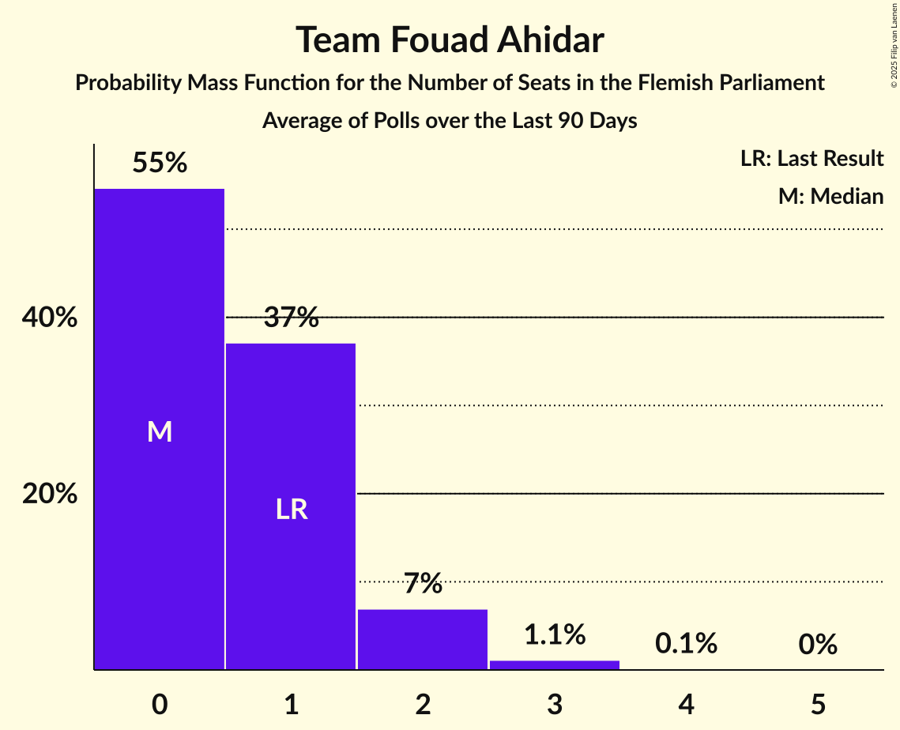
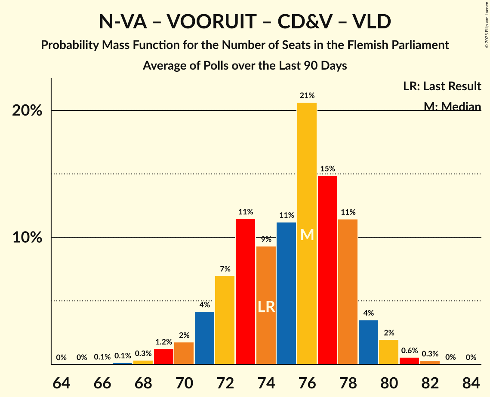
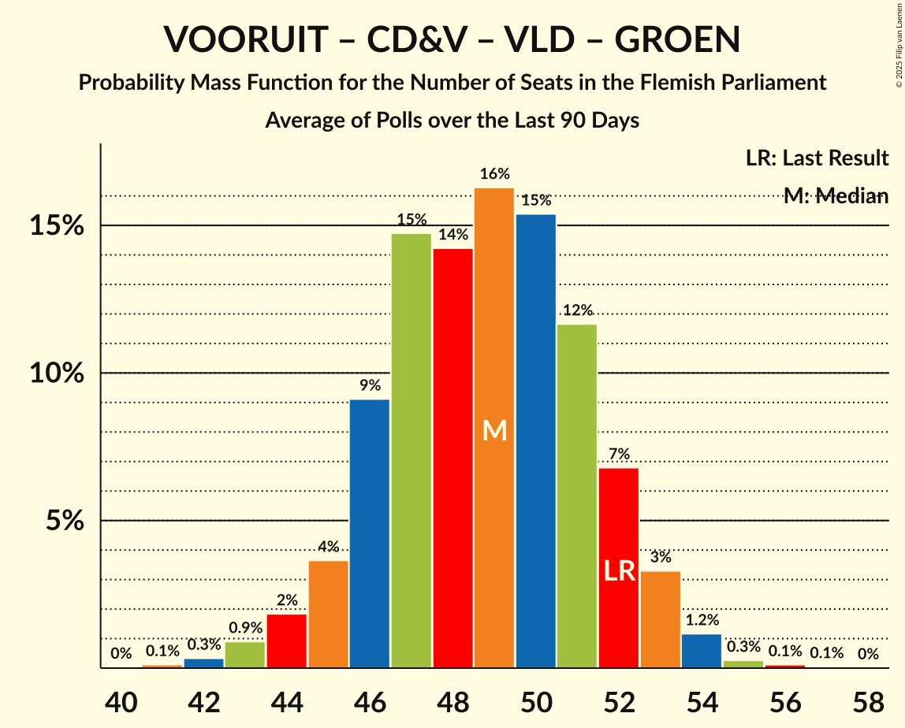

# Poll Average

<a href="#voting-intentions">Voting Intentions</a> | <a href="#seats">Seats</a> | <a href="#coalitions">Coalitions</a> | <a href="#technical-information">Technical Information</a>

## Summary

The table below lists the polls on which the average is based. They are the most recent polls (less than 90 days old) registered and analyzed so far.

| Period     | Polling firm/Commissioner(s) | N-VA | VB | VOORUIT | CD&V | VLD | PVDA | GROEN | TFA |
|:----------:|:----------------------------:|:--:|:--:|:--:|:--:|:--:|:--:|:--:|:--:|
| 9 June 2024 | General Election | 23.9%   31 | 22.7%   31 | 13.8%   18 | 13.0%   16 | 8.3%   9 | 8.3%   9 | 7.3%   9 | 0.3%   1 |
| N/A | Poll Average | 24–30%   32–40 | 21–26%   27–35 | 13–17%   16–23 | 10–13%   11–16 | 5–8%   3–11 | 7–11%   7–14 | 5–8%   4–11 | N/A   N/A |
| [11–17 September 2024](2024-09-17-Ipsos.html) | Ipsos   Het Laatste Nieuws, Le Soir, RTL TVi and VTM | 24–30%   32–40 | 21–26%   27–35 | 13–17%   16–23 | 9–13%   11–16 | 5–9%   3–11 | 7–11%   7–14 | 5–8%   4–11 | N/A   N/A |
| 9 June 2024 | General Election | 23.9%   31 | 22.7%   31 | 13.8%   18 | 13.0%   16 | 8.3%   9 | 8.3%   9 | 7.3%   9 | 0.3%   1 |

Only polls for which at least the sample size has been published are included in the table above.

**Legend:**
+ **Top half of each row:** Voting intentions (95% confidence interval)
+ **Bottom half of each row:** Seat projections for the Flemish Parliament (95% confidence interval)
+ **N-VA:** Nieuw-Vlaamse Alliantie
+ **VB:** Vlaams Belang
+ **VOORUIT:** Vooruit
+ **CD&V:** Christen-Democratisch en Vlaams
+ **VLD:** Open Vlaamse Liberalen en Democraten
+ **PVDA:** Partij van de Arbeid van België
+ **GROEN:** Groen
+ **TFA:** Team Fouad Ahidar
+ **N/A (single party):** Party not included the published results
+ **N/A (entire row):** Calculation for this opinion poll not started yet

## Voting Intentions

### Confidence Intervals

| Party | Last Result | Median | 80% Confidence Interval | 90% Confidence Interval | 95% Confidence Interval | 99% Confidence Interval |
|:-----:|:-----------:|:------:|:-----------------------:|:-----------------------:|:-----------------------:|:-----------------------:|
| <a href="#nieuw-vlaamse-alliantie">Nieuw-Vlaamse Alliantie</a> | 23.9% | 26.7% | 25.0–28.6% |24.5–29.1% | 24.1–29.5% | 23.2–30.4% |
| <a href="#vlaams-belang">Vlaams Belang</a> | 22.7% | 23.2% | 21.6–25.0% |21.1–25.5% | 20.7–25.9% | 19.9–26.8% |
| <a href="#vooruit">Vooruit</a> | 13.8% | 14.9% | 13.5–16.3% |13.1–16.8% | 12.7–17.1% | 12.1–17.9% |
| <a href="#christen-democratisch-en-vlaams">Christen-Democratisch en Vlaams</a> | 13.0% | 11.3% | 10.1–12.7% |9.8–13.1% | 9.5–13.4% | 8.9–14.1% |
| <a href="#open-vlaamse-liberalen-en-democraten">Open Vlaamse Liberalen en Democraten</a> | 8.3% | 6.9% | 5.9–7.9% |5.6–8.3% | 5.4–8.5% | 5.0–9.1% |
| <a href="#partij-van-de-arbeid-van-belgië">Partij van de Arbeid van België</a> | 8.3% | 9.0% | 7.8–10.2% |7.6–10.5% | 7.3–10.8% | 6.8–11.5% |
| <a href="#groen">Groen</a> | 7.3% | 6.6% | 5.6–7.6% |5.3–7.9% | 5.1–8.2% | 4.7–8.8% |
| <a href="#team-fouad-ahidar">Team Fouad Ahidar</a> | 0.3% | N/A | N/A |N/A | N/A | N/A |

### Nieuw-Vlaamse Alliantie

*For a full overview of the results for this party, see the [Nieuw-Vlaamse Alliantie](party-nieuw-vlaamsealliantie.html) page.*

| Voting Intentions | Probability | Accumulated | Special Marks |
|:-----------------:|:-----------:|:-----------:|:-------------:|
| 20.5–21.5% | 0% | 100% |  |
| 21.5–22.5% | 0.1% | 100% |  |
| 22.5–23.5% | 0.9% | 99.9% |  |
| 23.5–24.5% | 5% | 99.0% | Last Result |
| 24.5–25.5% | 14% | 94% |  |
| 25.5–26.5% | 25% | 80% |  |
| 26.5–27.5% | 27% | 55% | Median |
| 27.5–28.5% | 18% | 28% |  |
| 28.5–29.5% | 8% | 10% |  |
| 29.5–30.5% | 2% | 2% |  |
| 30.5–31.5% | 0.4% | 0.4% |  |
| 31.5–32.5% | 0% | 0% |  |

### Vlaams Belang

*For a full overview of the results for this party, see the [Vlaams Belang](party-vlaamsbelang.html) page.*

| Voting Intentions | Probability | Accumulated | Special Marks |
|:-----------------:|:-----------:|:-----------:|:-------------:|
| 17.5–18.5% | 0% | 100% |  |
| 18.5–19.5% | 0.2% | 100% |  |
| 19.5–20.5% | 2% | 99.8% |  |
| 20.5–21.5% | 8% | 98% |  |
| 21.5–22.5% | 20% | 90% |  |
| 22.5–23.5% | 29% | 70% | Last Result, Median |
| 23.5–24.5% | 24% | 41% |  |
| 24.5–25.5% | 12% | 16% |  |
| 25.5–26.5% | 4% | 5% |  |
| 26.5–27.5% | 0.7% | 0.8% |  |
| 27.5–28.5% | 0.1% | 0.1% |  |
| 28.5–29.5% | 0% | 0% |  |

### Vooruit

*For a full overview of the results for this party, see the [Vooruit](party-vooruit.html) page.*

| Voting Intentions | Probability | Accumulated | Special Marks |
|:-----------------:|:-----------:|:-----------:|:-------------:|
| 9.5–10.5% | 0% | 100% |  |
| 10.5–11.5% | 0.1% | 100% |  |
| 11.5–12.5% | 2% | 99.9% |  |
| 12.5–13.5% | 10% | 98% |  |
| 13.5–14.5% | 28% | 88% | Last Result |
| 14.5–15.5% | 33% | 60% | Median |
| 15.5–16.5% | 20% | 27% |  |
| 16.5–17.5% | 6% | 7% |  |
| 17.5–18.5% | 1.0% | 1.1% |  |
| 18.5–19.5% | 0.1% | 0.1% |  |
| 19.5–20.5% | 0% | 0% |  |

### Christen-Democratisch en Vlaams

*For a full overview of the results for this party, see the [Christen-Democratisch en Vlaams](party-christen-democratischenvlaams.html) page.*

| Voting Intentions | Probability | Accumulated | Special Marks |
|:-----------------:|:-----------:|:-----------:|:-------------:|
| 6.5–7.5% | 0% | 100% |  |
| 7.5–8.5% | 0.1% | 100% |  |
| 8.5–9.5% | 3% | 99.9% |  |
| 9.5–10.5% | 18% | 97% |  |
| 10.5–11.5% | 37% | 79% | Median |
| 11.5–12.5% | 30% | 42% |  |
| 12.5–13.5% | 11% | 12% | Last Result |
| 13.5–14.5% | 2% | 2% |  |
| 14.5–15.5% | 0.1% | 0.1% |  |
| 15.5–16.5% | 0% | 0% |  |

### Open Vlaamse Liberalen en Democraten

*For a full overview of the results for this party, see the [Open Vlaamse Liberalen en Democraten](party-openvlaamseliberalenendemocraten.html) page.*

| Voting Intentions | Probability | Accumulated | Special Marks |
|:-----------------:|:-----------:|:-----------:|:-------------:|
| 3.5–4.5% | 0.1% | 100% |  |
| 4.5–5.5% | 4% | 99.9% |  |
| 5.5–6.5% | 31% | 96% |  |
| 6.5–7.5% | 45% | 65% | Median |
| 7.5–8.5% | 18% | 20% | Last Result |
| 8.5–9.5% | 2% | 2% |  |
| 9.5–10.5% | 0.1% | 0.1% |  |
| 10.5–11.5% | 0% | 0% |  |

### Partij van de Arbeid van België

*For a full overview of the results for this party, see the [Partij van de Arbeid van België](party-partijvandearbeidvanbelgië.html) page.*

| Voting Intentions | Probability | Accumulated | Special Marks |
|:-----------------:|:-----------:|:-----------:|:-------------:|
| 4.5–5.5% | 0% | 100% |  |
| 5.5–6.5% | 0.2% | 100% |  |
| 6.5–7.5% | 5% | 99.8% |  |
| 7.5–8.5% | 27% | 95% | Last Result |
| 8.5–9.5% | 42% | 68% | Median |
| 9.5–10.5% | 21% | 26% |  |
| 10.5–11.5% | 4% | 5% |  |
| 11.5–12.5% | 0.4% | 0.4% |  |
| 12.5–13.5% | 0% | 0% |  |

### Groen

*For a full overview of the results for this party, see the [Groen](party-groen.html) page.*

| Voting Intentions | Probability | Accumulated | Special Marks |
|:-----------------:|:-----------:|:-----------:|:-------------:|
| 2.5–3.5% | 0% | 100% |  |
| 3.5–4.5% | 0.2% | 100% |  |
| 4.5–5.5% | 8% | 99.8% |  |
| 5.5–6.5% | 41% | 91% |  |
| 6.5–7.5% | 39% | 50% | Last Result, Median |
| 7.5–8.5% | 10% | 11% |  |
| 8.5–9.5% | 0.9% | 1.0% |  |
| 9.5–10.5% | 0% | 0% |  |

## Seats

### Confidence Intervals

| Party | Last Result | Median | 80% Confidence Interval | 90% Confidence Interval | 95% Confidence Interval | 99% Confidence Interval |
|:-----:|:-----------:|:------:|:-----------------------:|:-----------------------:|:-----------------------:|:-----------------------:|
| <a href="#nieuw-vlaamse-alliantie">Nieuw-Vlaamse Alliantie</a> | 31 | 36 | 33–39 |32–39 | 32–40 | 31–41 |
| <a href="#vlaams-belang">Vlaams Belang</a> | 31 | 31 | 28–34 |28–34 | 27–35 | 25–36 |
| <a href="#vooruit">Vooruit</a> | 18 | 18 | 17–21 |17–22 | 16–23 | 15–23 |
| <a href="#christen-democratisch-en-vlaams">Christen-Democratisch en Vlaams</a> | 16 | 13 | 11–16 |11–16 | 11–16 | 11–17 |
| <a href="#open-vlaamse-liberalen-en-democraten">Open Vlaamse Liberalen en Democraten</a> | 9 | 6 | 5–9 |4–10 | 3–11 | 2–12 |
| <a href="#partij-van-de-arbeid-van-belgië">Partij van de Arbeid van België</a> | 9 | 10 | 7–12 |7–13 | 7–14 | 6–14 |
| <a href="#groen">Groen</a> | 9 | 8 | 5–9 |5–10 | 4–11 | 3–11 |
| <a href="#team-fouad-ahidar">Team Fouad Ahidar</a> | 1 | N/A | N/A |N/A | N/A | N/A |

### Nieuw-Vlaamse Alliantie

*For a full overview of the results for this party, see the [Nieuw-Vlaamse Alliantie](party-nieuw-vlaamsealliantie.html) page.*

| Number of Seats | Probability | Accumulated | Special Marks |
|:---------------:|:-----------:|:-----------:|:-------------:|
| 29 | 0% | 100% |  |
| 30 | 0.3% | 99.9% |  |
| 31 | 1.4% | 99.6% | Last Result |
| 32 | 4% | 98% |  |
| 33 | 5% | 95% |  |
| 34 | 8% | 90% |  |
| 35 | 19% | 82% |  |
| 36 | 27% | 63% | Median |
| 37 | 12% | 36% |  |
| 38 | 13% | 24% |  |
| 39 | 7% | 11% |  |
| 40 | 3% | 5% |  |
| 41 | 1.0% | 1.4% |  |
| 42 | 0.2% | 0.3% |  |
| 43 | 0.1% | 0.1% |  |
| 44 | 0% | 0% |  |

### Vlaams Belang

*For a full overview of the results for this party, see the [Vlaams Belang](party-vlaamsbelang.html) page.*

| Number of Seats | Probability | Accumulated | Special Marks |
|:---------------:|:-----------:|:-----------:|:-------------:|
| 24 | 0.1% | 100% |  |
| 25 | 0.6% | 99.9% |  |
| 26 | 2% | 99.3% |  |
| 27 | 3% | 98% |  |
| 28 | 6% | 95% |  |
| 29 | 12% | 89% |  |
| 30 | 18% | 77% |  |
| 31 | 23% | 59% | Last Result, Median |
| 32 | 17% | 36% |  |
| 33 | 9% | 19% |  |
| 34 | 6% | 10% |  |
| 35 | 2% | 4% |  |
| 36 | 0.9% | 1.3% |  |
| 37 | 0.3% | 0.4% |  |
| 38 | 0.1% | 0.1% |  |
| 39 | 0% | 0% |  |

### Vooruit

*For a full overview of the results for this party, see the [Vooruit](party-vooruit.html) page.*

| Number of Seats | Probability | Accumulated | Special Marks |
|:---------------:|:-----------:|:-----------:|:-------------:|
| 13 | 0% | 100% |  |
| 14 | 0.3% | 99.9% |  |
| 15 | 0.7% | 99.7% |  |
| 16 | 2% | 99.0% |  |
| 17 | 18% | 97% |  |
| 18 | 30% | 80% | Last Result, Median |
| 19 | 18% | 49% |  |
| 20 | 16% | 31% |  |
| 21 | 7% | 15% |  |
| 22 | 4% | 8% |  |
| 23 | 4% | 4% |  |
| 24 | 0.2% | 0.3% |  |
| 25 | 0.1% | 0.1% |  |
| 26 | 0% | 0% |  |

### Christen-Democratisch en Vlaams

*For a full overview of the results for this party, see the [Christen-Democratisch en Vlaams](party-christen-democratischenvlaams.html) page.*

| Number of Seats | Probability | Accumulated | Special Marks |
|:---------------:|:-----------:|:-----------:|:-------------:|
| 10 | 0.2% | 100% |  |
| 11 | 15% | 99.8% |  |
| 12 | 25% | 84% |  |
| 13 | 17% | 59% | Median |
| 14 | 15% | 42% |  |
| 15 | 10% | 28% |  |
| 16 | 17% | 18% | Last Result |
| 17 | 1.2% | 2% |  |
| 18 | 0.3% | 0.3% |  |
| 19 | 0% | 0% |  |

### Open Vlaamse Liberalen en Democraten

*For a full overview of the results for this party, see the [Open Vlaamse Liberalen en Democraten](party-openvlaamseliberalenendemocraten.html) page.*

| Number of Seats | Probability | Accumulated | Special Marks |
|:---------------:|:-----------:|:-----------:|:-------------:|
| 2 | 1.3% | 100% |  |
| 3 | 3% | 98.7% |  |
| 4 | 1.4% | 96% |  |
| 5 | 17% | 94% |  |
| 6 | 47% | 78% | Median |
| 7 | 11% | 31% |  |
| 8 | 9% | 20% |  |
| 9 | 4% | 11% | Last Result |
| 10 | 5% | 8% |  |
| 11 | 2% | 3% |  |
| 12 | 1.3% | 1.3% |  |
| 13 | 0% | 0% |  |

### Partij van de Arbeid van België

*For a full overview of the results for this party, see the [Partij van de Arbeid van België](party-partijvandearbeidvanbelgië.html) page.*

| Number of Seats | Probability | Accumulated | Special Marks |
|:---------------:|:-----------:|:-----------:|:-------------:|
| 6 | 1.4% | 100% |  |
| 7 | 9% | 98.6% |  |
| 8 | 3% | 90% |  |
| 9 | 7% | 86% | Last Result |
| 10 | 50% | 79% | Median |
| 11 | 16% | 29% |  |
| 12 | 7% | 14% |  |
| 13 | 3% | 7% |  |
| 14 | 3% | 4% |  |
| 15 | 0.2% | 0.3% |  |
| 16 | 0% | 0.1% |  |
| 17 | 0% | 0% |  |

### Groen

*For a full overview of the results for this party, see the [Groen](party-groen.html) page.*

| Number of Seats | Probability | Accumulated | Special Marks |
|:---------------:|:-----------:|:-----------:|:-------------:|
| 1 | 0.2% | 100% |  |
| 2 | 0.2% | 99.8% |  |
| 3 | 0.9% | 99.7% |  |
| 4 | 2% | 98.8% |  |
| 5 | 17% | 97% |  |
| 6 | 12% | 80% |  |
| 7 | 15% | 67% |  |
| 8 | 22% | 52% | Median |
| 9 | 23% | 31% | Last Result |
| 10 | 3% | 8% |  |
| 11 | 4% | 4% |  |
| 12 | 0.2% | 0.2% |  |
| 13 | 0% | 0% |  |

### Team Fouad Ahidar

*For a full overview of the results for this party, see the [Team Fouad Ahidar](party-teamfouadahidar.html) page.*

## Coalitions

### Confidence Intervals

| Coalition | Last Result | Median | Majority? | 80% Confidence Interval | 90% Confidence Interval | 95% Confidence Interval | 99% Confidence Interval |
|:---------:|:-----------:|:------:|:---------:|:-----------------------:|:-----------------------:|:-----------------------:|:-----------------------:|
| Nieuw-Vlaamse Alliantie – Vlaams Belang – Christen-Democratisch en Vlaams | 78 | 80 | 100% | 77–83 | 76–84 | 75–85 | 73–87 |
| Nieuw-Vlaamse Alliantie – Vooruit – Christen-Democratisch en Vlaams – Open Vlaamse Liberalen en Democraten | 74 | 75 | 100% | 72–78 | 71–79 | 70–80 | 68–82 |
| Nieuw-Vlaamse Alliantie – Vooruit – Christen-Democratisch en Vlaams | 65 | 68 | 99.0% | 65–71 | 64–72 | 63–73 | 62–75 |
| Nieuw-Vlaamse Alliantie – Vlaams Belang | 62 | 67 | 96% | 64–70 | 63–71 | 62–72 | 60–73 |
| Nieuw-Vlaamse Alliantie – Vooruit – Open Vlaamse Liberalen en Democraten | 58 | 61 | 30% | 58–65 | 57–66 | 57–66 | 55–68 |
| Nieuw-Vlaamse Alliantie – Christen-Democratisch en Vlaams – Open Vlaamse Liberalen en Democraten | 56 | 56 | 0.6% | 52–59 | 52–60 | 51–61 | 49–63 |
| Vooruit – Christen-Democratisch en Vlaams – Partij van de Arbeid van België – Groen | 52 | 50 | 0% | 46–53 | 45–54 | 44–55 | 43–56 |
| Nieuw-Vlaamse Alliantie – Christen-Democratisch en Vlaams | 47 | 49 | 0% | 46–52 | 46–53 | 45–54 | 43–55 |
| Vooruit – Christen-Democratisch en Vlaams – Open Vlaamse Liberalen en Democraten – Groen | 52 | 46 | 0% | 43–49 | 42–50 | 41–51 | 39–53 |
| Nieuw-Vlaamse Alliantie – Open Vlaamse Liberalen en Democraten | 40 | 42 | 0% | 39–45 | 39–46 | 38–47 | 36–49 |
| Vooruit – Christen-Democratisch en Vlaams – Groen | 43 | 40 | 0% | 36–43 | 35–44 | 35–44 | 33–46 |
| Vooruit – Christen-Democratisch en Vlaams – Open Vlaamse Liberalen en Democraten | 43 | 38 | 0% | 36–42 | 35–43 | 34–44 | 33–46 |
| Vooruit – Open Vlaamse Liberalen en Democraten – Groen | 36 | 33 | 0% | 29–36 | 29–37 | 28–38 | 26–40 |
| Vooruit – Christen-Democratisch en Vlaams | 34 | 32 | 0% | 29–35 | 29–36 | 28–37 | 27–38 |
| Christen-Democratisch en Vlaams – Open Vlaamse Liberalen en Democraten – Groen | 34 | 27 | 0% | 24–30 | 23–31 | 22–32 | 21–34 |
| Vooruit – Open Vlaamse Liberalen en Democraten | 27 | 25 | 0% | 23–28 | 22–29 | 22–30 | 20–32 |
| Christen-Democratisch en Vlaams – Open Vlaamse Liberalen en Democraten | 25 | 19 | 0% | 17–23 | 17–24 | 16–24 | 14–26 |

### Nieuw-Vlaamse Alliantie – Vlaams Belang – Christen-Democratisch en Vlaams

| Number of Seats | Probability | Accumulated | Special Marks |
|:---------------:|:-----------:|:-----------:|:-------------:|
| 71 | 0% | 100% |  |
| 72 | 0.1% | 99.9% |  |
| 73 | 0.4% | 99.8% |  |
| 74 | 1.0% | 99.4% |  |
| 75 | 1.5% | 98% |  |
| 76 | 3% | 97% |  |
| 77 | 6% | 94% |  |
| 78 | 12% | 87% | Last Result |
| 79 | 12% | 76% |  |
| 80 | 19% | 64% | Median |
| 81 | 14% | 45% |  |
| 82 | 13% | 31% |  |
| 83 | 10% | 19% |  |
| 84 | 5% | 8% |  |
| 85 | 2% | 4% |  |
| 86 | 0.7% | 1.4% |  |
| 87 | 0.6% | 0.7% |  |
| 88 | 0.1% | 0.2% |  |
| 89 | 0% | 0% |  |

### Nieuw-Vlaamse Alliantie – Vooruit – Christen-Democratisch en Vlaams – Open Vlaamse Liberalen en Democraten

| Number of Seats | Probability | Accumulated | Special Marks |
|:---------------:|:-----------:|:-----------:|:-------------:|
| 66 | 0% | 100% |  |
| 67 | 0.2% | 99.9% |  |
| 68 | 0.4% | 99.8% |  |
| 69 | 1.0% | 99.4% |  |
| 70 | 3% | 98% |  |
| 71 | 5% | 96% |  |
| 72 | 11% | 90% |  |
| 73 | 14% | 79% | Median |
| 74 | 15% | 65% | Last Result |
| 75 | 13% | 50% |  |
| 76 | 15% | 37% |  |
| 77 | 9% | 22% |  |
| 78 | 6% | 13% |  |
| 79 | 3% | 6% |  |
| 80 | 1.4% | 3% |  |
| 81 | 1.2% | 2% |  |
| 82 | 0.4% | 0.5% |  |
| 83 | 0.1% | 0.2% |  |
| 84 | 0% | 0% |  |

### Nieuw-Vlaamse Alliantie – Vooruit – Christen-Democratisch en Vlaams

| Number of Seats | Probability | Accumulated | Special Marks |
|:---------------:|:-----------:|:-----------:|:-------------:|
| 60 | 0.1% | 100% |  |
| 61 | 0.3% | 99.9% |  |
| 62 | 0.6% | 99.6% |  |
| 63 | 2% | 99.0% | Majority |
| 64 | 3% | 97% |  |
| 65 | 7% | 94% | Last Result |
| 66 | 13% | 87% |  |
| 67 | 13% | 74% | Median |
| 68 | 17% | 61% |  |
| 69 | 13% | 44% |  |
| 70 | 14% | 31% |  |
| 71 | 10% | 18% |  |
| 72 | 4% | 8% |  |
| 73 | 2% | 4% |  |
| 74 | 1.2% | 2% |  |
| 75 | 0.6% | 0.9% |  |
| 76 | 0.1% | 0.2% |  |
| 77 | 0.1% | 0.1% |  |
| 78 | 0% | 0% |  |

### Nieuw-Vlaamse Alliantie – Vlaams Belang

| Number of Seats | Probability | Accumulated | Special Marks |
|:---------------:|:-----------:|:-----------:|:-------------:|
| 58 | 0.1% | 100% |  |
| 59 | 0.2% | 99.9% |  |
| 60 | 0.4% | 99.7% |  |
| 61 | 1.0% | 99.3% |  |
| 62 | 2% | 98% | Last Result |
| 63 | 4% | 96% | Majority |
| 64 | 9% | 92% |  |
| 65 | 11% | 83% |  |
| 66 | 15% | 72% |  |
| 67 | 17% | 58% | Median |
| 68 | 13% | 41% |  |
| 69 | 13% | 28% |  |
| 70 | 9% | 15% |  |
| 71 | 3% | 6% |  |
| 72 | 2% | 3% |  |
| 73 | 0.9% | 1.2% |  |
| 74 | 0.2% | 0.3% |  |
| 75 | 0.1% | 0.1% |  |
| 76 | 0% | 0% |  |

### Nieuw-Vlaamse Alliantie – Vooruit – Open Vlaamse Liberalen en Democraten

| Number of Seats | Probability | Accumulated | Special Marks |
|:---------------:|:-----------:|:-----------:|:-------------:|
| 53 | 0.1% | 100% |  |
| 54 | 0.2% | 99.9% |  |
| 55 | 0.6% | 99.7% |  |
| 56 | 2% | 99.0% |  |
| 57 | 4% | 98% |  |
| 58 | 8% | 94% | Last Result |
| 59 | 10% | 86% |  |
| 60 | 12% | 76% | Median |
| 61 | 17% | 63% |  |
| 62 | 17% | 47% |  |
| 63 | 12% | 30% | Majority |
| 64 | 7% | 18% |  |
| 65 | 6% | 11% |  |
| 66 | 3% | 5% |  |
| 67 | 1.3% | 2% |  |
| 68 | 0.5% | 1.0% |  |
| 69 | 0.3% | 0.5% |  |
| 70 | 0.1% | 0.1% |  |
| 71 | 0% | 0% |  |

### Nieuw-Vlaamse Alliantie – Christen-Democratisch en Vlaams – Open Vlaamse Liberalen en Democraten

| Number of Seats | Probability | Accumulated | Special Marks |
|:---------------:|:-----------:|:-----------:|:-------------:|
| 48 | 0.1% | 100% |  |
| 49 | 0.4% | 99.8% |  |
| 50 | 1.2% | 99.5% |  |
| 51 | 2% | 98% |  |
| 52 | 6% | 96% |  |
| 53 | 9% | 90% |  |
| 54 | 11% | 81% |  |
| 55 | 16% | 69% | Median |
| 56 | 16% | 54% | Last Result |
| 57 | 11% | 38% |  |
| 58 | 13% | 26% |  |
| 59 | 6% | 14% |  |
| 60 | 3% | 7% |  |
| 61 | 2% | 4% |  |
| 62 | 0.8% | 1.4% |  |
| 63 | 0.4% | 0.6% | Majority |
| 64 | 0.2% | 0.2% |  |
| 65 | 0% | 0.1% |  |
| 66 | 0% | 0% |  |

### Vooruit – Christen-Democratisch en Vlaams – Partij van de Arbeid van België – Groen

| Number of Seats | Probability | Accumulated | Special Marks |
|:---------------:|:-----------:|:-----------:|:-------------:|
| 41 | 0.1% | 100% |  |
| 42 | 0.3% | 99.9% |  |
| 43 | 0.6% | 99.6% |  |
| 44 | 2% | 98.9% |  |
| 45 | 3% | 97% |  |
| 46 | 4% | 94% |  |
| 47 | 11% | 90% |  |
| 48 | 12% | 79% |  |
| 49 | 14% | 67% | Median |
| 50 | 16% | 53% |  |
| 51 | 13% | 37% |  |
| 52 | 11% | 24% | Last Result |
| 53 | 6% | 13% |  |
| 54 | 4% | 7% |  |
| 55 | 2% | 3% |  |
| 56 | 0.7% | 1.1% |  |
| 57 | 0.2% | 0.4% |  |
| 58 | 0.1% | 0.2% |  |
| 59 | 0% | 0.1% |  |
| 60 | 0% | 0% |  |

### Nieuw-Vlaamse Alliantie – Christen-Democratisch en Vlaams

| Number of Seats | Probability | Accumulated | Special Marks |
|:---------------:|:-----------:|:-----------:|:-------------:|
| 42 | 0.2% | 100% |  |
| 43 | 0.4% | 99.8% |  |
| 44 | 1.3% | 99.4% |  |
| 45 | 3% | 98% |  |
| 46 | 7% | 95% |  |
| 47 | 10% | 89% | Last Result |
| 48 | 14% | 79% |  |
| 49 | 16% | 64% | Median |
| 50 | 18% | 49% |  |
| 51 | 11% | 31% |  |
| 52 | 11% | 20% |  |
| 53 | 6% | 9% |  |
| 54 | 2% | 4% |  |
| 55 | 1.1% | 2% |  |
| 56 | 0.3% | 0.5% |  |
| 57 | 0.1% | 0.2% |  |
| 58 | 0% | 0% |  |

### Vooruit – Christen-Democratisch en Vlaams – Open Vlaamse Liberalen en Democraten – Groen

| Number of Seats | Probability | Accumulated | Special Marks |
|:---------------:|:-----------:|:-----------:|:-------------:|
| 38 | 0.1% | 100% |  |
| 39 | 0.4% | 99.8% |  |
| 40 | 1.1% | 99.4% |  |
| 41 | 3% | 98% |  |
| 42 | 5% | 95% |  |
| 43 | 8% | 91% |  |
| 44 | 11% | 82% |  |
| 45 | 14% | 71% | Median |
| 46 | 16% | 57% |  |
| 47 | 13% | 41% |  |
| 48 | 12% | 28% |  |
| 49 | 7% | 16% |  |
| 50 | 4% | 9% |  |
| 51 | 3% | 4% |  |
| 52 | 1.1% | 2% | Last Result |
| 53 | 0.4% | 0.8% |  |
| 54 | 0.3% | 0.4% |  |
| 55 | 0.1% | 0.1% |  |
| 56 | 0% | 0% |  |

### Nieuw-Vlaamse Alliantie – Open Vlaamse Liberalen en Democraten

| Number of Seats | Probability | Accumulated | Special Marks |
|:---------------:|:-----------:|:-----------:|:-------------:|
| 35 | 0.1% | 100% |  |
| 36 | 0.5% | 99.8% |  |
| 37 | 1.0% | 99.3% |  |
| 38 | 3% | 98% |  |
| 39 | 7% | 96% |  |
| 40 | 9% | 89% | Last Result |
| 41 | 15% | 80% |  |
| 42 | 19% | 65% | Median |
| 43 | 12% | 46% |  |
| 44 | 14% | 34% |  |
| 45 | 9% | 19% |  |
| 46 | 5% | 10% |  |
| 47 | 3% | 5% |  |
| 48 | 1.2% | 2% |  |
| 49 | 0.4% | 0.8% |  |
| 50 | 0.3% | 0.4% |  |
| 51 | 0.1% | 0.1% |  |
| 52 | 0% | 0% |  |

### Vooruit – Christen-Democratisch en Vlaams – Groen

| Number of Seats | Probability | Accumulated | Special Marks |
|:---------------:|:-----------:|:-----------:|:-------------:|
| 32 | 0.1% | 100% |  |
| 33 | 0.4% | 99.9% |  |
| 34 | 1.5% | 99.4% |  |
| 35 | 3% | 98% |  |
| 36 | 6% | 95% |  |
| 37 | 11% | 89% |  |
| 38 | 12% | 78% |  |
| 39 | 15% | 66% | Median |
| 40 | 17% | 51% |  |
| 41 | 11% | 34% |  |
| 42 | 10% | 24% |  |
| 43 | 7% | 13% | Last Result |
| 44 | 3% | 6% |  |
| 45 | 1.5% | 2% |  |
| 46 | 0.6% | 1.0% |  |
| 47 | 0.2% | 0.3% |  |
| 48 | 0.1% | 0.1% |  |
| 49 | 0% | 0% |  |

### Vooruit – Christen-Democratisch en Vlaams – Open Vlaamse Liberalen en Democraten

| Number of Seats | Probability | Accumulated | Special Marks |
|:---------------:|:-----------:|:-----------:|:-------------:|
| 31 | 0.1% | 100% |  |
| 32 | 0.3% | 99.9% |  |
| 33 | 0.7% | 99.6% |  |
| 34 | 3% | 98.8% |  |
| 35 | 5% | 96% |  |
| 36 | 14% | 91% |  |
| 37 | 16% | 78% | Median |
| 38 | 15% | 62% |  |
| 39 | 12% | 47% |  |
| 40 | 11% | 35% |  |
| 41 | 10% | 24% |  |
| 42 | 7% | 14% |  |
| 43 | 4% | 7% | Last Result |
| 44 | 2% | 3% |  |
| 45 | 0.8% | 1.5% |  |
| 46 | 0.4% | 0.7% |  |
| 47 | 0.1% | 0.2% |  |
| 48 | 0.1% | 0.1% |  |
| 49 | 0% | 0% |  |

### Vooruit – Open Vlaamse Liberalen en Democraten – Groen

| Number of Seats | Probability | Accumulated | Special Marks |
|:---------------:|:-----------:|:-----------:|:-------------:|
| 25 | 0.1% | 100% |  |
| 26 | 0.3% | 99.8% |  |
| 27 | 1.2% | 99.5% |  |
| 28 | 3% | 98% |  |
| 29 | 7% | 96% |  |
| 30 | 10% | 88% |  |
| 31 | 10% | 78% |  |
| 32 | 14% | 68% | Median |
| 33 | 20% | 54% |  |
| 34 | 13% | 35% |  |
| 35 | 11% | 22% |  |
| 36 | 6% | 12% | Last Result |
| 37 | 3% | 5% |  |
| 38 | 1.2% | 3% |  |
| 39 | 0.9% | 1.4% |  |
| 40 | 0.3% | 0.5% |  |
| 41 | 0.1% | 0.2% |  |
| 42 | 0% | 0.1% |  |
| 43 | 0% | 0% |  |

### Vooruit – Christen-Democratisch en Vlaams

| Number of Seats | Probability | Accumulated | Special Marks |
|:---------------:|:-----------:|:-----------:|:-------------:|
| 25 | 0.1% | 100% |  |
| 26 | 0.1% | 99.9% |  |
| 27 | 0.6% | 99.8% |  |
| 28 | 2% | 99.3% |  |
| 29 | 7% | 97% |  |
| 30 | 15% | 90% |  |
| 31 | 18% | 75% | Median |
| 32 | 16% | 57% |  |
| 33 | 12% | 41% |  |
| 34 | 12% | 29% | Last Result |
| 35 | 9% | 17% |  |
| 36 | 5% | 8% |  |
| 37 | 2% | 3% |  |
| 38 | 0.6% | 0.9% |  |
| 39 | 0.2% | 0.3% |  |
| 40 | 0.1% | 0.1% |  |
| 41 | 0% | 0% |  |

### Christen-Democratisch en Vlaams – Open Vlaamse Liberalen en Democraten – Groen

| Number of Seats | Probability | Accumulated | Special Marks |
|:---------------:|:-----------:|:-----------:|:-------------:|
| 19 | 0.1% | 100% |  |
| 20 | 0.2% | 99.9% |  |
| 21 | 0.9% | 99.7% |  |
| 22 | 2% | 98.7% |  |
| 23 | 4% | 97% |  |
| 24 | 8% | 93% |  |
| 25 | 9% | 84% |  |
| 26 | 14% | 75% |  |
| 27 | 19% | 61% | Median |
| 28 | 15% | 42% |  |
| 29 | 10% | 27% |  |
| 30 | 8% | 18% |  |
| 31 | 5% | 10% |  |
| 32 | 2% | 4% |  |
| 33 | 1.1% | 2% |  |
| 34 | 0.6% | 0.8% | Last Result |
| 35 | 0.2% | 0.3% |  |
| 36 | 0.1% | 0.1% |  |
| 37 | 0% | 0% |  |

### Vooruit – Open Vlaamse Liberalen en Democraten

| Number of Seats | Probability | Accumulated | Special Marks |
|:---------------:|:-----------:|:-----------:|:-------------:|
| 18 | 0% | 100% |  |
| 19 | 0.2% | 99.9% |  |
| 20 | 0.7% | 99.8% |  |
| 21 | 2% | 99.1% |  |
| 22 | 6% | 98% |  |
| 23 | 14% | 92% |  |
| 24 | 19% | 77% | Median |
| 25 | 16% | 58% |  |
| 26 | 16% | 42% |  |
| 27 | 11% | 27% | Last Result |
| 28 | 7% | 16% |  |
| 29 | 5% | 9% |  |
| 30 | 2% | 4% |  |
| 31 | 1.1% | 2% |  |
| 32 | 0.5% | 0.8% |  |
| 33 | 0.2% | 0.3% |  |
| 34 | 0.1% | 0.1% |  |
| 35 | 0% | 0% |  |

### Christen-Democratisch en Vlaams – Open Vlaamse Liberalen en Democraten

| Number of Seats | Probability | Accumulated | Special Marks |
|:---------------:|:-----------:|:-----------:|:-------------:|
| 13 | 0.2% | 100% |  |
| 14 | 0.5% | 99.8% |  |
| 15 | 0.6% | 99.3% |  |
| 16 | 3% | 98.6% |  |
| 17 | 10% | 96% |  |
| 18 | 22% | 86% |  |
| 19 | 16% | 64% | Median |
| 20 | 12% | 47% |  |
| 21 | 13% | 36% |  |
| 22 | 10% | 23% |  |
| 23 | 6% | 13% |  |
| 24 | 4% | 7% |  |
| 25 | 1.5% | 2% | Last Result |
| 26 | 0.6% | 1.0% |  |
| 27 | 0.3% | 0.4% |  |
| 28 | 0.1% | 0.1% |  |
| 29 | 0% | 0% |  |

## Technical Information

+ **Number of polls included in this average:** 1
+ **Lowest number of simulations done in a poll included in this average:** 1,048,576
+ **Total number of simulations done in the polls included in this average:** 1,048,576
+ **Error estimate:** 1.39%
