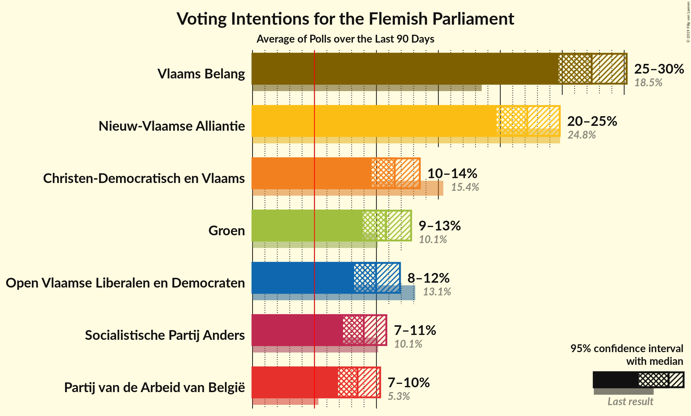
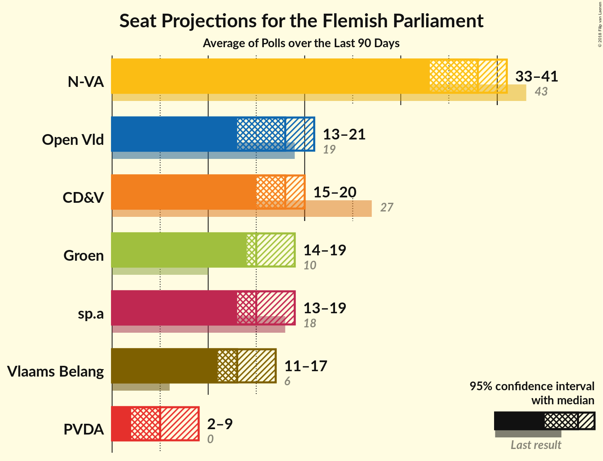
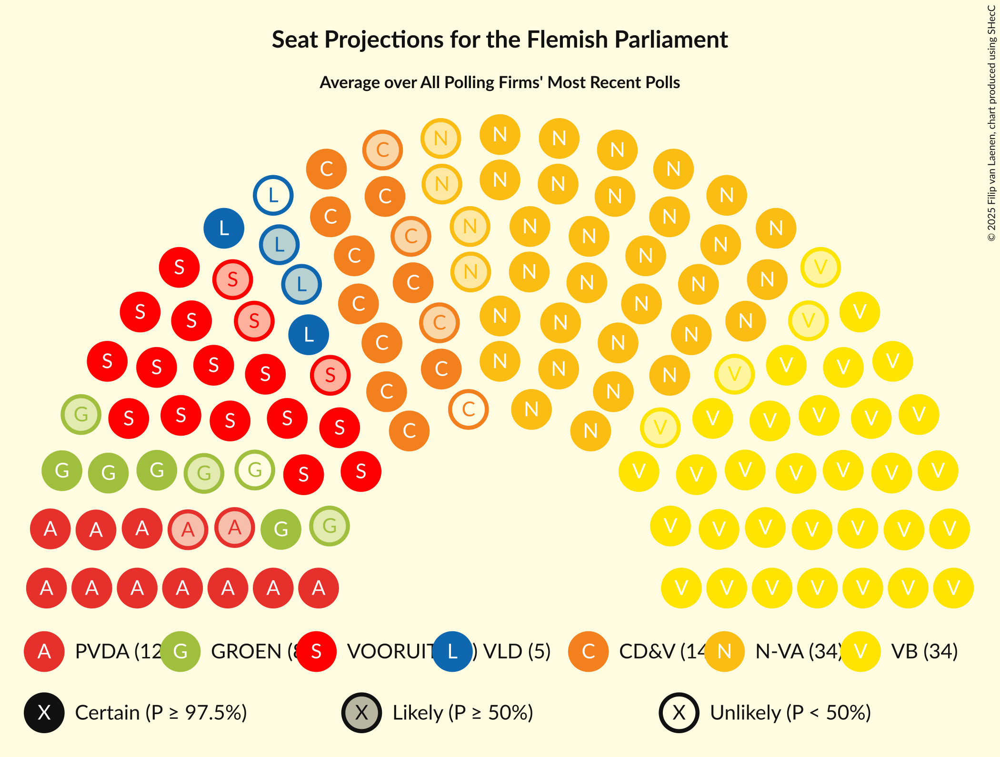
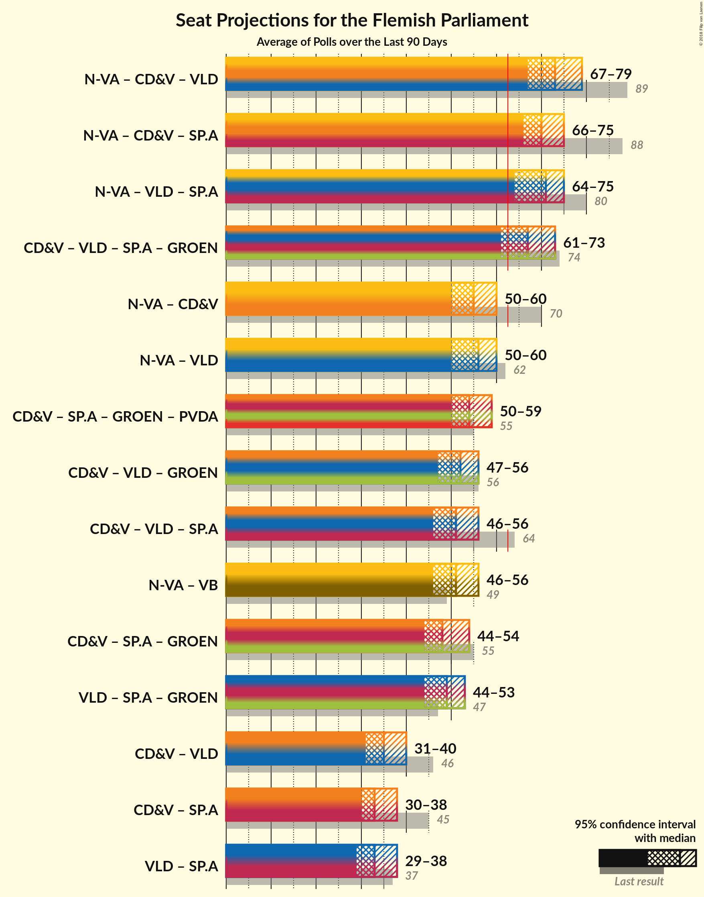

# Overview

The table below lists the most recent polls (less than 90 days old) registered and analyzed so far.

| Period     | Polling firm/Commissioner(s) | N-VA | VB | CD&V | VLD | VOORUIT | GROEN | PVDA |
|:----------:|:----------------------------:|:--:|:--:|:--:|:--:|:--:|:--:|:--:|
| 26 May 2019 | General Election | 24.8%   35 | 18.5%   23 | 15.4%   19 | 13.1%   16 | 10.1%   12 | 10.1%   14 | 5.3%   4 |
| N/A | [Poll Average](average.html) | 19–24%   26–33 | 21–26%   27–35 | 8–12%   9–15 | 7–10%   8–13 | 15–19%   19–26 | 4–9%   2–11 | 8–12%   8–15 |
| [29 May–6 June 2023](2023-06-06-Ipsos.html) | Ipsos   Het Laatste Nieuws, Le Soir, RTL TVi and VTM | 19–24%   26–34 | 20–25%   26–35 | 9–13%   11–16 | 7–10%   7–13 | 15–19%   19–26 | 4–7%   1–7 | 9–12%   10–16 |
| [13–23 March 2023](2023-03-23-TNS.html) | TNS   De Standaard and VRT | 19–23%   26–30 | 23–26%   29–35 | 8–11%   9–11 | 8–11%   8–13 | 15–19%   19–25 | 7–9%   7–11 | 8–11%   8–13 |
| 26 May 2019 | General Election | 24.8%   35 | 18.5%   23 | 15.4%   19 | 13.1%   16 | 10.1%   12 | 10.1%   14 | 5.3%   4 |

Only polls for which at least the sample size has been published are included in the table above.

**Legend:**
+ **Top half of each row:** Voting intentions (95% confidence interval)
+ **Bottom half of each row:** Seat projections for the Flemish Parliament (95% confidence interval)
+ **N-VA:** Nieuw-Vlaamse Alliantie
+ **VB:** Vlaams Belang
+ **CD&V:** Christen-Democratisch en Vlaams
+ **VLD:** Open Vlaamse Liberalen en Democraten
+ **VOORUIT:** Vooruit
+ **GROEN:** Groen
+ **PVDA:** Partij van de Arbeid van België
+ **N/A (single party):** Party not included the published results
+ **N/A (entire row):** Calculation for this opinion poll not started yet

