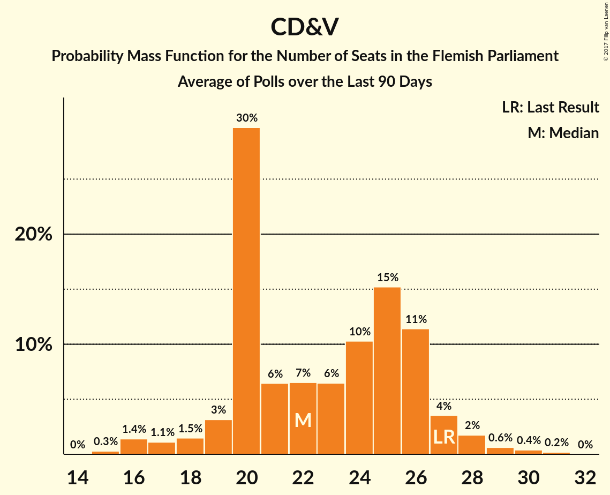

# CD&V

<a href="#voting-intentions">Voting Intentions</a> | <a href="#seats">Seats</a>

## Voting Intentions

Last result: **20.5%** (General Election of 25 May 2014)

### Confidence Intervals

| Period     | Polling firm/Commissioner(s) | Median | 80% Confidence Interval | 90% Confidence Interval | 95% Confidence Interval | 99% Confidence Interval |
|:----------:|:----------------:|:-----------:|:-----------------------:|:-----------------------:|:-----------------------:|:-----------------------:|
| N/A | [Poll Average](average.html) | 14.7% | 13.3–16.1% | 12.9–16.6% | 12.6–17.0% | 12.0–17.7% |
| [27 November–3 December 2018](2018-12-03-Ipsos.html) | Ipsos   Het Laatste Nieuws, Le Soir, RTL TVi and VTM | 14.6% | 13.3–16.2% | 12.9–16.6% | 12.6–17.0% | 11.9–17.7% |
| [20–27 September 2018](2018-09-27-Ipsos.html) | Ipsos   Het Laatste Nieuws, Le Soir, RTL TVi and VTM | 17.2% | 15.7–18.8% | 15.3–19.3% | 15.0–19.7% | 14.3–20.5% |
| [29 May–6 June 2018](2018-06-06-Ipsos.html) | Ipsos   Het Laatste Nieuws, Le Soir, RTL TVi and VTM | 15.3% | 13.9–16.9% | 13.5–17.3% | 13.2–17.7% | 12.6–18.4% |
| [26 February–17 March 2018](2018-03-17-TNS.html) | TNS   De Standaard–VRT–RTBf–La Libre Belgique | 16.4% | 14.9–17.9% | 14.5–18.4% | 14.2–18.8% | 13.5–19.6% |
| [27 February–6 March 2018](2018-03-06-Ipsos.html) | Ipsos   RTL TVi–Le Soir–VTM–Het Laatste Nieuws | 15.1% | 13.7–16.7% | 13.3–17.1% | 13.0–17.5% | 12.4–18.3% |
| [27 November–4 December 2017](2017-12-04-Ipsos.html) | Ipsos   RTL TVi–Le Soir–VTM–Het Laatste Nieuws | 14.1% | 12.7–15.6% | 12.4–16.0% | 12.0–16.4% | 11.4–17.1% |
| [11 September–5 October 2017](2017-10-05-TNS.html) | TNS   De Standaard–VRT–RTBf–La Libre Belgique | 19.4% | 17.9–21.1% | 17.5–21.5% | 17.1–21.9% | 16.4–22.8% |
| [25 August–3 September 2017](2017-09-03-Ipsos.html) | Ipsos   RTL TVi–Le Soir–VTM–Het Laatste Nieuws | 16.1% | 14.6–17.7% | 14.2–18.1% | 13.9–18.5% | 13.2–19.3% |
| [23–27 June 2017](2017-06-27-Dedicated.html) | Dedicated   MR | 17.0% | 15.2–19.0% | 14.6–19.6% | 14.2–20.1% | 13.4–21.1% |
| [27 March–11 April 2017](2017-04-11-TNS.html) | TNS   De Standaard–VRT | 18.6% | 17.1–20.3% | 16.7–20.7% | 16.4–21.1% | 15.7–21.9% |
| [16–20 March 2017](2017-03-20-Dedicated.html) | Dedicated   RTBf–La Libre Belgique | 15.3% | 13.8–17.1% | 13.4–17.6% | 13.0–18.0% | 12.3–18.9% |
| [10–17 January 2017](2017-01-17-Ipsos.html) | Ipsos   RTL TVi–Le Soir–VTM–Het Laatste Nieuws | 14.9% | 13.5–16.5% | 13.2–16.9% | 12.8–17.3% | 12.2–18.1% |
| [24–28 November 2016](2016-11-28-Dedicated.html) | Dedicated   RTBf–La Libre Belgique | 16.5% | 14.9–18.4% | 14.4–18.9% | 14.0–19.4% | 13.3–20.3% |
| [14 September–3 October 2016](2016-10-03-TNS.html) | TNS   De Standaard–VRT | 16.8% | 15.3–18.4% | 15.0–18.8% | 14.6–19.2% | 13.9–20.0% |
| [19–25 September 2016](2016-09-25-Ipsos.html) | Ipsos   RTL TVi–Le Soir–VTM–Het Laatste Nieuws | 17.6% | 16.1–19.3% | 15.7–19.7% | 15.3–20.1% | 14.7–20.9% |
| [2–6 September 2016](2016-09-06-Dedicated.html) | Dedicated   RTBf–La Libre Belgique | 15.6% | 14.0–17.4% | 13.6–17.9% | 13.2–18.4% | 12.5–19.2% |
| [6–12 May 2016](2016-05-12-Ipsos.html) | Ipsos   RTL TVi–Le Soir–VTM–Het Laatste Nieuws | 13.8% | 12.5–15.2% | 12.1–15.7% | 11.8–16.0% | 11.2–16.7% |
| [31 March–4 April 2016](2016-04-04-Dedicated.html) | Dedicated   RTBf–La Libre Belgique | 15.8% | 14.2–17.6% | 13.7–18.1% | 13.4–18.5% | 12.6–19.4% |
| [22 February–9 March 2016](2016-03-09-TNS.html) | TNS   De Standaard–VRT | 19.1% | 17.6–20.8% | 17.2–21.2% | 16.8–21.7% | 16.1–22.5% |
| [15–20 January 2016](2016-01-20-Ipsos.html) | Ipsos   RTL TVi–Le Soir–VTM–Het Laatste Nieuws | 16.0% | 14.6–17.6% | 14.2–18.0% | 13.9–18.4% | 13.3–19.1% |
| [3–7 December 2015](2015-12-07-Dedicated.html) | Dedicated   RTBf–La Libre Belgique | 15.1% | 13.7–16.6% | 13.3–17.0% | 13.0–17.4% | 12.3–18.2% |
| [28 September–4 October 2015](2015-10-04-Ipsos.html) | Ipsos   RTL TVi–Le Soir–VTM–Het Laatste Nieuws | 17.8% | 16.3–19.4% | 15.9–19.8% | 15.5–20.2% | 14.9–21.0% |
| [22 September–2 October 2015](2015-10-02-TNS.html) | TNS   De Standaard–VRT | 18.4% | 16.9–20.0% | 16.4–20.5% | 16.1–20.9% | 15.4–21.7% |
| [9–14 September 2015](2015-09-14-Dedicated.html) | Dedicated   RTBf–La Libre Belgique | 16.0% | 14.4–17.8% | 13.9–18.3% | 13.5–18.8% | 12.8–19.7% |
| [12–18 May 2015](2015-05-18-Dedicated.html) | Dedicated   RTBf–La Libre Belgique | 17.2% | 15.6–19.1% | 15.1–19.6% | 14.7–20.1% | 13.9–21.0% |
| [20 April–3 May 2015](2015-05-03-TNS.html) | TNS   De Standaard–VRT | 21.2% | 19.6–22.9% | 19.2–23.4% | 18.8–23.8% | 18.1–24.7% |
| [20–24 April 2015](2015-04-24-Ipsos.html) | Ipsos   RTL TVi–Le Soir–VTM–Het Laatste Nieuws | 15.8% | 14.4–17.4% | 14.0–17.8% | 13.6–18.2% | 13.0–19.0% |
| [5–9 March 2015](2015-03-09-Dedicated.html) | Dedicated   RTBf–La Libre Belgique | 16.6% | 14.9–18.6% | 14.4–19.1% | 14.1–19.6% | 13.3–20.6% |
| [23–28 January 2015](2015-01-28-Ipsos.html) | Ipsos   RTL TVi–Le Soir–VTM–Het Laatste Nieuws | 17.1% | 15.7–18.7% | 15.3–19.1% | 14.9–19.5% | 14.3–20.3% |
| [5–11 January 2015](2015-01-11-Ipsos.html) | Ipsos   RTL TVi–Le Soir–VTM–Het Laatste Nieuws | 18.3% | 16.8–19.9% | 16.4–20.4% | 16.1–20.8% | 15.4–21.6% |
| [4–5 December 2014](2014-12-05-AQRate.html) | AQ Rate   Het Laatste Nieuws | 17.0% | 15.4–18.8% | 14.9–19.3% | 14.5–19.8% | 13.8–20.7% |
| [27 November–1 December 2014](2014-12-01-Dedicated.html) | Dedicated   RTBf–La Libre Belgique | 18.2% | 16.6–20.1% | 16.1–20.7% | 15.7–21.1% | 14.9–22.1% |
| [9–10 October 2014](2014-10-10-AQRate.html) | AQ Rate   Het Laatste Nieuws | 14.0% | 12.5–15.7% | 12.1–16.1% | 11.8–16.6% | 11.1–17.4% |
| [22 September–3 October 2014](2014-10-03-TNS.html) | TNS   De Standaard–VRT | 20.0% | 18.5–21.7% | 18.1–22.2% | 17.7–22.6% | 17.0–23.4% |
| [5–9 September 2014](2014-09-09-Dedicated.html) | Dedicated   RTBf–La Libre Belgique | 17.7% | 16.0–19.5% | 15.6–20.0% | 15.2–20.5% | 14.4–21.4% |
| [1–31 July 2014](2014-07-31-AQRate.html) | AQ Rate   Het Laatste Nieuws | 17.7% | 16.2–19.5% | 15.7–20.0% | 15.3–20.4% | 14.6–21.3% |

### Probability Mass Function

The following table shows the probability mass function per percentage block of voting intentions for the [poll average](average.html) for CD&V.

| Voting Intentions | Probability | Accumulated | Special Marks |
|:-----------------:|:-----------:|:-----------:|:-------------:|
| 9.5–10.5% | 0% | 100% |  |
| 10.5–11.5% | 0.1% | 100% |  |
| 11.5–12.5% | 2% | 99.9% |  |
| 12.5–13.5% | 13% | 98% |  |
| 13.5–14.5% | 31% | 85% |  |
| 14.5–15.5% | 32% | 54% | Median |
| 15.5–16.5% | 17% | 22% |  |
| 16.5–17.5% | 5% | 5% |  |
| 17.5–18.5% | 0.7% | 0.7% |  |
| 18.5–19.5% | 0.1% | 0.1% |  |
| 19.5–20.5% | 0% | 0% |  |
| 20.5–21.5% | 0% | 0% | Last Result |

## Seats

Last result: **27** seats (General Election of 25 May 2014)

### Confidence Intervals

| Period     | Polling firm/Commissioner(s) | Median | 80% Confidence Interval | 90% Confidence Interval | 95% Confidence Interval | 99% Confidence Interval |
|:----------:|:----------------:|:------:|:-----------------------:|:-----------------------:|:-----------------------:|:-----------------------:|
| N/A | [Poll Average](average.html) | 18 | 15–20 | 15–20 | 15–20 | 15–22 |
| [27 November–3 December 2018](2018-12-03-Ipsos.html) | Ipsos   Het Laatste Nieuws, Le Soir, RTL TVi and VTM | 18 | 15–20 | 15–20 | 15–20 | 15–22 |
| [20–27 September 2018](2018-09-27-Ipsos.html) | Ipsos   Het Laatste Nieuws, Le Soir, RTL TVi and VTM | 21 | 20–24 | 20–25 | 19–26 | 18–27 |
| [29 May–6 June 2018](2018-06-06-Ipsos.html) | Ipsos   Het Laatste Nieuws, Le Soir, RTL TVi and VTM | 20 | 17–21 | 16–22 | 16–23 | 15–24 |
| [26 February–17 March 2018](2018-03-17-TNS.html) | TNS   De Standaard–VRT–RTBf–La Libre Belgique | 20 | 19–22 | 18–24 | 17–24 | 16–26 |
| [27 February–6 March 2018](2018-03-06-Ipsos.html) | Ipsos   RTL TVi–Le Soir–VTM–Het Laatste Nieuws | 20 | 16–20 | 15–21 | 15–22 | 15–24 |
| [27 November–4 December 2017](2017-12-04-Ipsos.html) | Ipsos   RTL TVi–Le Soir–VTM–Het Laatste Nieuws | 18 | 15–20 | 15–20 | 15–20 | 14–22 |
| [11 September–5 October 2017](2017-10-05-TNS.html) | TNS   De Standaard–VRT–RTBf–La Libre Belgique | 25 | 22–27 | 21–28 | 20–29 | 20–30 |
| [25 August–3 September 2017](2017-09-03-Ipsos.html) | Ipsos   RTL TVi–Le Soir–VTM–Het Laatste Nieuws | 20 | 19–23 | 17–24 | 16–25 | 15–26 |
| [23–27 June 2017](2017-06-27-Dedicated.html) | Dedicated   MR | 20 | 20–25 | 18–25 | 16–26 | 16–28 |
| [27 March–11 April 2017](2017-04-11-TNS.html) | TNS   De Standaard–VRT | 24 | 21–26 | 20–27 | 20–27 | 20–29 |
| [16–20 March 2017](2017-03-20-Dedicated.html) | Dedicated   RTBf–La Libre Belgique | 20 | 16–21 | 15–21 | 15–23 | 15–25 |
| [10–17 January 2017](2017-01-17-Ipsos.html) | Ipsos   RTL TVi–Le Soir–VTM–Het Laatste Nieuws | 20 | 16–20 | 15–21 | 15–22 | 15–24 |
| [24–28 November 2016](2016-11-28-Dedicated.html) | Dedicated   RTBf–La Libre Belgique | 20 | 19–24 | 18–25 | 17–25 | 16–27 |
| [14 September–3 October 2016](2016-10-03-TNS.html) | TNS   De Standaard–VRT | 21 | 19–23 | 19–25 | 18–25 | 16–27 |
| [19–25 September 2016](2016-09-25-Ipsos.html) | Ipsos   RTL TVi–Le Soir–VTM–Het Laatste Nieuws | 22 | 20–26 | 20–27 | 20–27 | 19–28 |
| [2–6 September 2016](2016-09-06-Dedicated.html) | Dedicated   RTBf–La Libre Belgique | 20 | 16–21 | 15–22 | 15–23 | 15–25 |
| [6–12 May 2016](2016-05-12-Ipsos.html) | Ipsos   RTL TVi–Le Soir–VTM–Het Laatste Nieuws | 17 | 15–20 | 15–20 | 14–20 | 13–21 |
| [31 March–4 April 2016](2016-04-04-Dedicated.html) | Dedicated   RTBf–La Libre Belgique | 20 | 17–22 | 16–22 | 15–24 | 15–25 |
| [22 February–9 March 2016](2016-03-09-TNS.html) | TNS   De Standaard–VRT | 25 | 22–27 | 21–27 | 20–28 | 20–30 |
| [15–20 January 2016](2016-01-20-Ipsos.html) | Ipsos   RTL TVi–Le Soir–VTM–Het Laatste Nieuws | 20 | 18–21 | 17–22 | 16–24 | 15–25 |
| [3–7 December 2015](2015-12-07-Dedicated.html) | Dedicated   RTBf–La Libre Belgique | 19 | 16–20 | 16–21 | 15–21 | 15–23 |
| [28 September–4 October 2015](2015-10-04-Ipsos.html) | Ipsos   RTL TVi–Le Soir–VTM–Het Laatste Nieuws | 22 | 20–26 | 20–27 | 20–27 | 19–28 |
| [22 September–2 October 2015](2015-10-02-TNS.html) | TNS   De Standaard–VRT | 23 | 20–27 | 20–27 | 20–27 | 19–28 |
| [9–14 September 2015](2015-09-14-Dedicated.html) | Dedicated   RTBf–La Libre Belgique | 20 | 18–22 | 17–23 | 16–25 | 15–26 |
| [12–18 May 2015](2015-05-18-Dedicated.html) | Dedicated   RTBf–La Libre Belgique | 21 | 20–25 | 19–26 | 19–27 | 17–27 |
| [20 April–3 May 2015](2015-05-03-TNS.html) | TNS   De Standaard–VRT | 26 | 25–30 | 24–31 | 23–31 | 21–33 |
| [20–24 April 2015](2015-04-24-Ipsos.html) | Ipsos   RTL TVi–Le Soir–VTM–Het Laatste Nieuws | 20 | 18–22 | 17–23 | 17–24 | 15–26 |
| [5–9 March 2015](2015-03-09-Dedicated.html) | Dedicated   RTBf–La Libre Belgique | 21 | 19–24 | 18–25 | 17–26 | 15–27 |
| [23–28 January 2015](2015-01-28-Ipsos.html) | Ipsos   RTL TVi–Le Soir–VTM–Het Laatste Nieuws | 21 | 20–24 | 19–25 | 19–26 | 17–27 |
| [5–11 January 2015](2015-01-11-Ipsos.html) | Ipsos   RTL TVi–Le Soir–VTM–Het Laatste Nieuws | 23 | 21–27 | 20–27 | 20–27 | 20–29 |
| [4–5 December 2014](2014-12-05-AQRate.html) | AQ Rate   Het Laatste Nieuws | 21 | 20–25 | 19–26 | 18–27 | 17–27 |
| [27 November–1 December 2014](2014-12-01-Dedicated.html) | Dedicated   RTBf–La Libre Belgique | 23 | 20–27 | 20–27 | 20–28 | 19–29 |
| [9–10 October 2014](2014-10-10-AQRate.html) | AQ Rate   Het Laatste Nieuws | 17 | 15–20 | 14–20 | 14–21 | 14–21 |
| [22 September–3 October 2014](2014-10-03-TNS.html) | TNS   De Standaard–VRT | 27 | 23–28 | 21–29 | 21–30 | 21–31 |
| [5–9 September 2014](2014-09-09-Dedicated.html) | Dedicated   RTBf–La Libre Belgique | 21 | 20–26 | 20–27 | 19–27 | 18–28 |
| [1–31 July 2014](2014-07-31-AQRate.html) | AQ Rate   Het Laatste Nieuws | 22 | 20–26 | 20–27 | 19–27 | 18–28 |

### Probability Mass Function

The following table shows the probability mass function per seat for the [poll average](average.html) for CD&V.

| Number of Seats | Probability | Accumulated | Special Marks |
|:---------------:|:-----------:|:-----------:|:-------------:|
| 13 | 0.1% | 100% |  |
| 14 | 0.3% | 99.9% |  |
| 15 | 15% | 99.6% |  |
| 16 | 22% | 84% |  |
| 17 | 9% | 62% |  |
| 18 | 6% | 54% | Median |
| 19 | 11% | 48% |  |
| 20 | 36% | 37% |  |
| 21 | 0.9% | 1.5% |  |
| 22 | 0.3% | 0.6% |  |
| 23 | 0.1% | 0.3% |  |
| 24 | 0.1% | 0.1% |  |
| 25 | 0% | 0% |  |
| 26 | 0% | 0% |  |
| 27 | 0% | 0% | Last Result |

