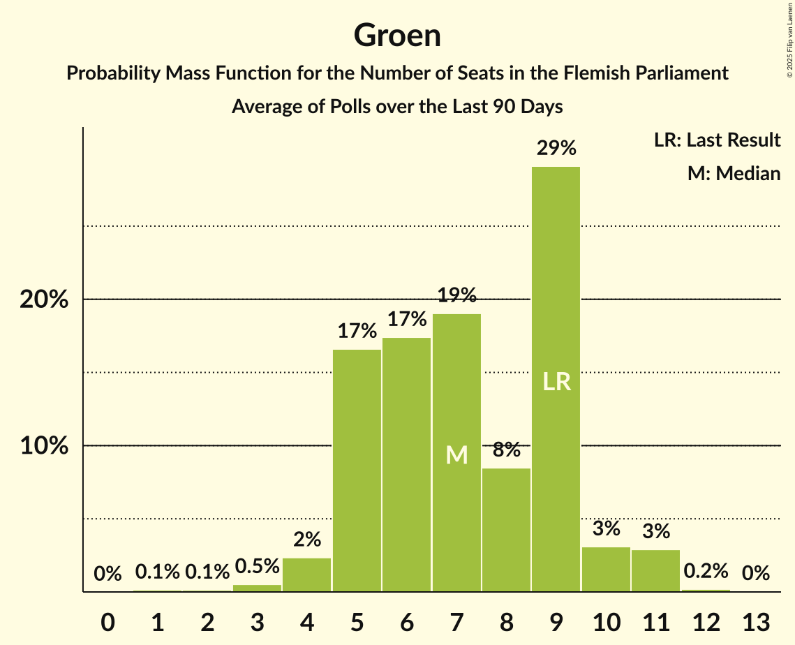

# Groen

<a href="#voting-intentions">Voting Intentions</a> | <a href="#seats">Seats</a>

## Voting Intentions

Last result: **10.1%** (General Election of 26 May 2019)

### Confidence Intervals

| Period     | Polling firm/Commissioner(s) | Median | 80% Confidence Interval | 90% Confidence Interval | 95% Confidence Interval | 99% Confidence Interval |
|:----------:|:----------------:|:-----------:|:-----------------------:|:-----------------------:|:-----------------------:|:-----------------------:|
| N/A | [Poll Average](average.html) | 10.8% | 9.5–12.1% | 9.2–12.4% | 8.9–12.8% | 8.4–13.5% |
| [29 November–6 December 2019](2019-12-06-Ipsos.html) | Ipsos   Het Laatste Nieuws, Le Soir, RTL TVi and VTM | 10.7% | 9.5–12.1% | 9.2–12.5% | 8.9–12.8% | 8.4–13.5% |
| [2–10 September 2019](2019-09-10-Ipsos.html) | Ipsos   Het Laatste Nieuws, Le Soir, RTL TVi and VTM | 11.0% | 9.8–12.4% | 9.5–12.8% | 9.2–13.1% | 8.7–13.8% |

### Probability Mass Function

The following table shows the probability mass function per percentage block of voting intentions for the [poll average](average.html) for Groen.

| Voting Intentions | Probability | Accumulated | Special Marks |
|:-----------------:|:-----------:|:-----------:|:-------------:|
| 6.5–7.5% | 0% | 100% |  |
| 7.5–8.5% | 0.8% | 100% |  |
| 8.5–9.5% | 9% | 99.2% |  |
| 9.5–10.5% | 31% | 90% | Last Result |
| 10.5–11.5% | 37% | 59% | Median |
| 11.5–12.5% | 17% | 21% |  |
| 12.5–13.5% | 4% | 4% |  |
| 13.5–14.5% | 0.4% | 0.4% |  |
| 14.5–15.5% | 0% | 0% |  |

## Seats

Last result: **14** seats (General Election of 26 May 2019)

### Confidence Intervals

| Period     | Polling firm/Commissioner(s) | Median | 80% Confidence Interval | 90% Confidence Interval | 95% Confidence Interval | 99% Confidence Interval |
|:----------:|:----------------:|:------:|:-----------------------:|:-----------------------:|:-----------------------:|:-----------------------:|
| N/A | [Poll Average](average.html) | 14 | 11–16 | 11–16 | 11–18 | 11–19 |
| [29 November–6 December 2019](2019-12-06-Ipsos.html) | Ipsos   Het Laatste Nieuws, Le Soir, RTL TVi and VTM | 14 | 11–16 | 11–16 | 11–18 | 11–19 |
| [2–10 September 2019](2019-09-10-Ipsos.html) | Ipsos   Het Laatste Nieuws, Le Soir, RTL TVi and VTM | 15 | 13–17 | 11–18 | 11–18 | 11–19 |

### Probability Mass Function

The following table shows the probability mass function per seat for the [poll average](average.html) for Groen.

| Number of Seats | Probability | Accumulated | Special Marks |
|:---------------:|:-----------:|:-----------:|:-------------:|
| 10 | 0.1% | 100% |  |
| 11 | 10% | 99.9% |  |
| 12 | 6% | 90% |  |
| 13 | 9% | 84% |  |
| 14 | 31% | 75% | Last Result, Median |
| 15 | 31% | 44% |  |
| 16 | 10% | 14% |  |
| 17 | 1.1% | 4% |  |
| 18 | 1.1% | 3% |  |
| 19 | 1.4% | 1.4% |  |
| 20 | 0% | 0% |  |

