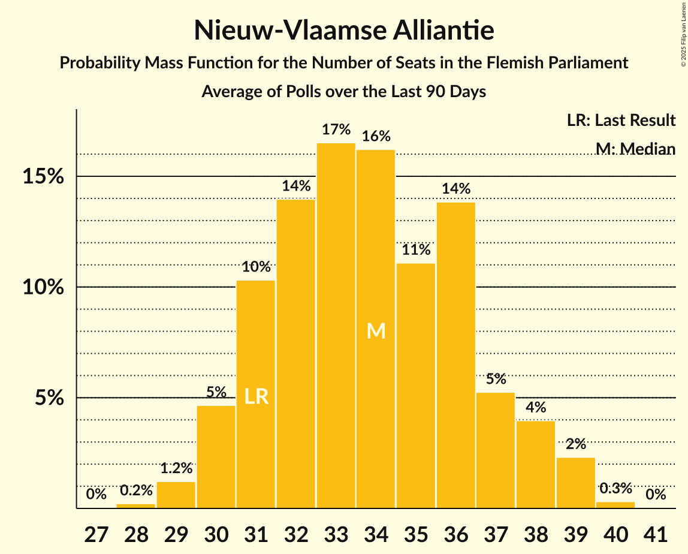

# Nieuw-Vlaamse Alliantie

<a href="#voting-intentions">Voting Intentions</a> | <a href="#seats">Seats</a>

## Voting Intentions

Last result: **24.8%** (General Election of 26 May 2019)

### Confidence Intervals

| Period     | Polling firm/Commissioner(s) | Median | 80% Confidence Interval | 90% Confidence Interval | 95% Confidence Interval | 99% Confidence Interval |
|:----------:|:----------------:|:-----------:|:-----------------------:|:-----------------------:|:-----------------------:|:-----------------------:|
| N/A | [Poll Average](average.html) | 21.0% | 19.6–22.5% | 19.2–22.9% | 18.8–23.3% | 18.1–24.1% |
| [14–20 May 2024](2024-05-20-Ipsos.html) | Ipsos   Het Laatste Nieuws, Le Soir, RTL TVi and VTM | 20.6% | 19.5–21.8% | 19.2–22.1% | 18.9–22.4% | 18.4–23.0% |
| [23 April–3 May 2024](2024-05-03-iVOX.html) | iVOX   Overlegcentrum van Vlaamse Verenigingen | 21.4% | 20.1–22.8% | 19.8–23.2% | 19.4–23.5% | 18.9–24.2% |
| [8–18 April 2024](2024-04-18-Kantar.html) | Kantar   La Libre Belgique and RTBf | 20.9% | 19.3–22.6% | 18.9–23.1% | 18.5–23.5% | 17.7–24.3% |
| [11–18 March 2024](2024-03-18-Ipsos.html) | Ipsos   Het Laatste Nieuws, Le Soir, RTL TVi and VTM | 20.4% | 18.8–22.1% | 18.4–22.6% | 18.0–23.0% | 17.3–23.9% |
| [22 January–8 February 2024](2024-02-08-Kantar.html) | Kantar   Knack and Le Vif | 20.6% | 19.1–22.3% | 18.7–22.7% | 18.3–23.1% | 17.6–23.9% |
| [9–22 January 2024](2024-01-22-iVOX.html) | iVOX   Vlaams & Neutraal Ziekenfonds | 22.7% | 21.5–23.9% | 21.2–24.3% | 20.9–24.6% | 20.4–25.2% |
| [8–22 January 2024](2024-01-22-KantarandUniversiteitAntwerpen.html) | Kantar and Universiteit Antwerpen   De Standaard and VRT | 18.9% | 17.8–20.1% | 17.5–20.5% | 17.2–20.8% | 16.7–21.4% |
| [4–11 December 2023](2023-12-11-Ipsos.html) | Ipsos   Het Laatste Nieuws, Le Soir, RTL TVi and VTM | 22.0% | 20.4–23.7% | 19.9–24.2% | 19.5–24.7% | 18.8–25.5% |
| [23–28 November 2023](2023-11-28-iVOX.html) | iVOX   Gazet van Antwerpen | 22.0% | 19.7–23.0% | 19.3–23.5% | 18.9–24.0% | 18.1–24.8% |
| [10 September–9 October 2023](2023-10-09-Kantar.html) | Kantar   La Libre Belgique and RTBf | 20.3% | 18.3–22.6% | 17.7–23.3% | 17.2–23.8% | 16.3–25.0% |
| [18–25 September 2023](2023-09-25-Ipsos.html) | Ipsos   Het Laatste Nieuws, Le Soir, RTL TVi and VTM | 20.2% | 18.6–21.9% | 18.2–22.4% | 17.8–22.8% | 17.1–23.6% |
| [29 May–6 June 2023](2023-06-06-Ipsos.html) | Ipsos   Het Laatste Nieuws, Le Soir, RTL TVi and VTM | 21.8% | 20.2–23.5% | 19.7–24.0% | 19.3–24.5% | 18.6–25.3% |
| [20–27 March 2023](2023-03-27-Ipsos.html) | Ipsos   Het Laatste Nieuws, Le Soir, RTL TVi and VTM | 21.6% | 20.0–23.4% | 19.5–23.8% | 19.2–24.3% | 18.4–25.1% |
| [13–23 March 2023](2023-03-23-TNSandUniversiteitAntwerpen.html) | TNS and Universiteit Antwerpen   De Standaard and VRT | 21.0% | N/A | N/A | N/A | N/A |
| [16–29 January 2023](2023-01-29-Kantar.html) | Kantar   La Libre Belgique and RTBf | 21.4% | 19.2–23.9% | 18.6–24.6% | 18.1–25.2% | 17.1–26.4% |
| [21–29 November 2022](2022-11-29-Ipsos.html) | Ipsos   Het Laatste Nieuws, Le Soir, RTL TVi and VTM | 22.0% | 20.4–23.7% | 19.9–24.2% | 19.5–24.7% | 18.8–25.5% |
| [7–13 September 2022](2022-09-13-Ipsos.html) | Ipsos   Het Laatste Nieuws, Le Soir, RTL TVi and VTM | 21.5% | 19.9–23.2% | 19.4–23.7% | 19.1–24.2% | 18.3–25.0% |
| [6–14 June 2022](2022-06-14-Ipsos.html) | Ipsos   Het Laatste Nieuws, Le Soir, RTL TVi and VTM | 24.9% | 23.2–26.7% | 22.7–27.2% | 22.3–27.7% | 21.5–28.5% |
| [14–31 March 2022](2022-03-31-TNSandUniversiteitAntwerpen.html) | TNS and Universiteit Antwerpen   De Standaard and VRT | 22.4% | N/A | N/A | N/A | N/A |
| [15–22 March 2022](2022-03-22-Ipsos.html) | Ipsos   Het Laatste Nieuws, Le Soir, RTL TVi and VTM | 23.4% | 21.8–25.2% | 21.3–25.7% | 20.9–26.2% | 20.1–27.0% |
| [1–8 December 2021](2021-12-08-Ipsos.html) | Ipsos   Het Laatste Nieuws, Le Soir, RTL TVi and VTM | 21.6% | 20.0–23.3% | 19.5–23.8% | 19.1–24.2% | 18.4–25.1% |
| [7–14 September 2021](2021-09-14-Ipsos.html) | Ipsos   Het Laatste Nieuws, Le Soir, RTL TVi and VTM | 21.2% | 19.6–22.9% | 19.2–23.4% | 18.8–23.9% | 18.0–24.7% |
| [25 May–1 June 2021](2021-06-01-Ipsos.html) | Ipsos   Het Laatste Nieuws, Le Soir, RTL TVi and VTM | 21.8% | 20.1–23.5% | 19.7–24.0% | 19.3–24.4% | 18.6–25.3% |
| [29 March–19 April 2021](2021-04-19-TNSandUniversiteitAntwerpen.html) | TNS and Universiteit Antwerpen   De Standaard and VRT | 21.5% | N/A | N/A | N/A | N/A |
| [4–9 March 2021](2021-03-09-Ipsos.html) | Ipsos   Het Laatste Nieuws, Le Soir, RTL TVi and VTM | 20.0% | 18.4–21.7% | 18.0–22.1% | 17.6–22.6% | 16.9–23.4% |
| [2–8 December 2020](2020-12-08-Ipsos.html) | Ipsos   Het Laatste Nieuws, Le Soir, RTL TVi and VTM | 19.9% | 18.3–21.6% | 17.9–22.0% | 17.5–22.5% | 16.8–23.3% |
| [2–8 October 2020](2020-10-08-Ipsos.html) | Ipsos   Het Laatste Nieuws, Le Soir, RTL TVi and VTM | 22.2% | 20.6–23.9% | 20.1–24.4% | 19.7–24.9% | 18.9–25.7% |
| [28 August–1 September 2020](2020-09-01-Dedicated.html) | Dedicated   Soirmag | 23.2% | 21.1–25.6% | 20.5–26.2% | 20.0–26.8% | 19.1–27.9% |
| [10–15 June 2020](2020-06-15-Ipsos.html) | Ipsos   Het Laatste Nieuws, Le Soir, RTL TVi and VTM | 20.0% | 18.4–21.7% | 17.9–22.2% | 17.6–22.6% | 16.8–23.5% |
| [9–28 April 2020](2020-04-28-TNSandUniversiteitAntwerpen.html) | TNS and Universiteit Antwerpen   De Standaard, La Libre Belgique, RTBf and VRT | 20.3% | N/A | N/A | N/A | N/A |
| [4–9 March 2020](2020-03-09-Ipsos.html) | Ipsos   Het Laatste Nieuws, Le Soir, RTL TVi and VTM | 20.7% | 19.1–22.4% | 18.6–22.9% | 18.2–23.4% | 17.5–24.2% |
| [29 November–6 December 2019](2019-12-06-Ipsos.html) | Ipsos   Het Laatste Nieuws, Le Soir, RTL TVi and VTM | 22.1% | 20.5–23.9% | 20.0–24.4% | 19.6–24.8% | 18.9–25.7% |
| [2–10 September 2019](2019-09-10-Ipsos.html) | Ipsos   Het Laatste Nieuws, Le Soir, RTL TVi and VTM | 22.7% | 21.1–24.5% | 20.6–25.0% | 20.2–25.4% | 19.4–26.3% |

### Probability Mass Function

The following table shows the probability mass function per percentage block of voting intentions for the [poll average](average.html) for Nieuw-Vlaamse Alliantie.

| Voting Intentions | Probability | Accumulated | Special Marks |
|:-----------------:|:-----------:|:-----------:|:-------------:|
| 15.5–16.5% | 0% | 100% |  |
| 16.5–17.5% | 0.1% | 100% |  |
| 17.5–18.5% | 1.2% | 99.9% |  |
| 18.5–19.5% | 8% | 98.7% |  |
| 19.5–20.5% | 25% | 90% |  |
| 20.5–21.5% | 35% | 65% | Median |
| 21.5–22.5% | 22% | 30% |  |
| 22.5–23.5% | 7% | 9% |  |
| 23.5–24.5% | 1.4% | 2% |  |
| 24.5–25.5% | 0.1% | 0.2% | Last Result |
| 25.5–26.5% | 0% | 0% |  |

## Seats

Last result: **35** seats (General Election of 26 May 2019)

### Confidence Intervals

| Period     | Polling firm/Commissioner(s) | Median | 80% Confidence Interval | 90% Confidence Interval | 95% Confidence Interval | 99% Confidence Interval |
|:----------:|:----------------:|:------:|:-----------------------:|:-----------------------:|:-----------------------:|:-----------------------:|
| N/A | [Poll Average](average.html) | 27 | 26–30 | 25–30 | 25–31 | 24–32 |
| [14–20 May 2024](2024-05-20-Ipsos.html) | Ipsos   Het Laatste Nieuws, Le Soir, RTL TVi and VTM | 27 | 26–29 | 26–30 | 25–30 | 24–31 |
| [23 April–3 May 2024](2024-05-03-iVOX.html) | iVOX   Overlegcentrum van Vlaamse Verenigingen | 28 | 26–30 | 26–30 | 26–31 | 25–32 |
| [8–18 April 2024](2024-04-18-Kantar.html) | Kantar   La Libre Belgique and RTBf | 27 | 25–30 | 25–31 | 24–31 | 23–32 |
| [11–18 March 2024](2024-03-18-Ipsos.html) | Ipsos   Het Laatste Nieuws, Le Soir, RTL TVi and VTM | 27 | 25–29 | 24–30 | 23–30 | 22–32 |
| [22 January–8 February 2024](2024-02-08-Kantar.html) | Kantar   Knack and Le Vif | 27 | 25–30 | 24–30 | 23–30 | 22–31 |
| [9–22 January 2024](2024-01-22-iVOX.html) | iVOX   Vlaams & Neutraal Ziekenfonds | 30 | 28–31 | 27–32 | 27–33 | 26–34 |
| [8–22 January 2024](2024-01-22-KantarandUniversiteitAntwerpen.html) | Kantar and Universiteit Antwerpen   De Standaard and VRT | 25 | 22–26 | 22–27 | 21–27 | 21–27 |
| [4–11 December 2023](2023-12-11-Ipsos.html) | Ipsos   Het Laatste Nieuws, Le Soir, RTL TVi and VTM | 29 | 27–31 | 26–32 | 26–32 | 24–35 |
| [23–28 November 2023](2023-11-28-iVOX.html) | iVOX   Gazet van Antwerpen | 28 | 26–30 | 26–31 | 25–32 | 23–33 |
| [10 September–9 October 2023](2023-10-09-Kantar.html) | Kantar   La Libre Belgique and RTBf | 26 | 24–30 | 22–31 | 22–31 | 21–33 |
| [18–25 September 2023](2023-09-25-Ipsos.html) | Ipsos   Het Laatste Nieuws, Le Soir, RTL TVi and VTM | 27 | 25–30 | 24–30 | 23–30 | 22–32 |
| [29 May–6 June 2023](2023-06-06-Ipsos.html) | Ipsos   Het Laatste Nieuws, Le Soir, RTL TVi and VTM | 29 | 26–31 | 26–32 | 26–32 | 24–34 |
| [20–27 March 2023](2023-03-27-Ipsos.html) | Ipsos   Het Laatste Nieuws, Le Soir, RTL TVi and VTM | 29 | 26–31 | 26–32 | 26–32 | 24–34 |
| [13–23 March 2023](2023-03-23-TNSandUniversiteitAntwerpen.html) | TNS and Universiteit Antwerpen   De Standaard and VRT |  |  |  |  |  |
| [16–29 January 2023](2023-01-29-Kantar.html) | Kantar   La Libre Belgique and RTBf | 28 | 26–31 | 24–32 | 22–33 | 22–36 |
| [21–29 November 2022](2022-11-29-Ipsos.html) | Ipsos   Het Laatste Nieuws, Le Soir, RTL TVi and VTM | 29 | 27–31 | 26–32 | 26–33 | 25–34 |
| [7–13 September 2022](2022-09-13-Ipsos.html) | Ipsos   Het Laatste Nieuws, Le Soir, RTL TVi and VTM | 28 | 27–31 | 26–32 | 25–33 | 23–33 |
| [6–14 June 2022](2022-06-14-Ipsos.html) | Ipsos   Het Laatste Nieuws, Le Soir, RTL TVi and VTM | 33 | 30–36 | 30–37 | 29–37 | 28–39 |
| [14–31 March 2022](2022-03-31-TNSandUniversiteitAntwerpen.html) | TNS and Universiteit Antwerpen   De Standaard and VRT |  |  |  |  |  |
| [15–22 March 2022](2022-03-22-Ipsos.html) | Ipsos   Het Laatste Nieuws, Le Soir, RTL TVi and VTM | 31 | 28–33 | 27–34 | 27–35 | 27–37 |
| [1–8 December 2021](2021-12-08-Ipsos.html) | Ipsos   Het Laatste Nieuws, Le Soir, RTL TVi and VTM | 28 | 27–31 | 26–32 | 25–33 | 23–33 |
| [7–14 September 2021](2021-09-14-Ipsos.html) | Ipsos   Het Laatste Nieuws, Le Soir, RTL TVi and VTM | 28 | 27–30 | 26–31 | 24–32 | 22–33 |
| [25 May–1 June 2021](2021-06-01-Ipsos.html) | Ipsos   Het Laatste Nieuws, Le Soir, RTL TVi and VTM | 28 | 27–32 | 27–33 | 26–33 | 24–34 |
| [29 March–19 April 2021](2021-04-19-TNSandUniversiteitAntwerpen.html) | TNS and Universiteit Antwerpen   De Standaard and VRT |  |  |  |  |  |
| [4–9 March 2021](2021-03-09-Ipsos.html) | Ipsos   Het Laatste Nieuws, Le Soir, RTL TVi and VTM | 27 | 24–28 | 23–29 | 22–30 | 22–31 |
| [2–8 December 2020](2020-12-08-Ipsos.html) | Ipsos   Het Laatste Nieuws, Le Soir, RTL TVi and VTM | 27 | 23–28 | 22–29 | 22–29 | 22–30 |
| [2–8 October 2020](2020-10-08-Ipsos.html) | Ipsos   Het Laatste Nieuws, Le Soir, RTL TVi and VTM | 29 | 27–32 | 27–33 | 27–34 | 25–35 |
| [28 August–1 September 2020](2020-09-01-Dedicated.html) | Dedicated   Soirmag | 31 | 28–34 | 27–35 | 26–36 | 25–38 |
| [10–15 June 2020](2020-06-15-Ipsos.html) | Ipsos   Het Laatste Nieuws, Le Soir, RTL TVi and VTM | 27 | 23–28 | 23–29 | 22–30 | 21–31 |
| [9–28 April 2020](2020-04-28-TNSandUniversiteitAntwerpen.html) | TNS and Universiteit Antwerpen   De Standaard, La Libre Belgique, RTBf and VRT |  |  |  |  |  |
| [4–9 March 2020](2020-03-09-Ipsos.html) | Ipsos   Het Laatste Nieuws, Le Soir, RTL TVi and VTM | 27 | 25–29 | 24–30 | 23–31 | 22–33 |
| [29 November–6 December 2019](2019-12-06-Ipsos.html) | Ipsos   Het Laatste Nieuws, Le Soir, RTL TVi and VTM | 28 | 27–32 | 27–33 | 26–33 | 24–34 |
| [2–10 September 2019](2019-09-10-Ipsos.html) | Ipsos   Het Laatste Nieuws, Le Soir, RTL TVi and VTM | 30 | 28–33 | 27–33 | 27–34 | 27–35 |

### Probability Mass Function

The following table shows the probability mass function per seat for the [poll average](average.html) for Nieuw-Vlaamse Alliantie.

| Number of Seats | Probability | Accumulated | Special Marks |
|:---------------:|:-----------:|:-----------:|:-------------:|
| 22 | 0.1% | 100% |  |
| 23 | 0.3% | 99.9% |  |
| 24 | 1.2% | 99.6% |  |
| 25 | 4% | 98% |  |
| 26 | 19% | 95% |  |
| 27 | 29% | 76% | Median |
| 28 | 16% | 46% |  |
| 29 | 11% | 30% |  |
| 30 | 14% | 19% |  |
| 31 | 3% | 4% |  |
| 32 | 0.8% | 1.0% |  |
| 33 | 0.1% | 0.2% |  |
| 34 | 0.1% | 0.1% |  |
| 35 | 0% | 0% | Last Result |

