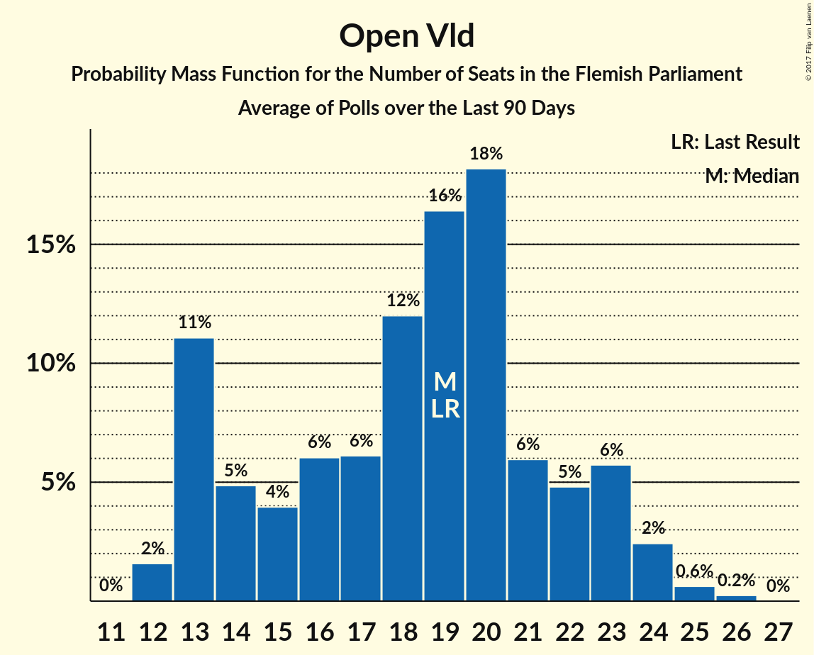

# Open Vld

<a href="#voting-intentions">Voting Intentions</a> | <a href="#seats">Seats</a>

## Voting Intentions

Last result: **14.1%** (General Election of 25 May 2014)

### Confidence Intervals

| Period     | Polling firm/Commissioner(s) | Median | 80% Confidence Interval | 90% Confidence Interval | 95% Confidence Interval | 99% Confidence Interval |
|:----------:|:----------------:|:-----------:|:-----------------------:|:-----------------------:|:-----------------------:|:-----------------------:|
| N/A | [Poll Average](average.html) | 12.9% | 11.5–14.2% | 11.2–14.7% | 10.9–15.0% | 10.3–15.7% |
| [20–27 September 2018](2018-09-27-Ipsos.html) | Ipsos   Het Laatste Nieuws, Le Soir, RTL TVi and VTM | 12.8% | 11.5–14.3% | 11.2–14.7% | 10.9–15.0% | 10.3–15.7% |
| [29 May–6 June 2018](2018-06-06-Ipsos.html) | Ipsos   Het Laatste Nieuws, Le Soir, RTL TVi and VTM | 13.9% | 12.6–15.4% | 12.2–15.8% | 11.9–16.2% | 11.3–16.9% |
| [26 February–17 March 2018](2018-03-17-TNS.html) | TNS   De Standaard–VRT–RTBf–La Libre Belgique | 14.7% | 13.3–16.2% | 12.9–16.6% | 12.6–17.0% | 12.0–17.7% |
| [27 February–6 March 2018](2018-03-06-Ipsos.html) | Ipsos   RTL TVi–Le Soir–VTM–Het Laatste Nieuws | 12.7% | 11.5–14.2% | 11.1–14.6% | 10.8–15.0% | 10.2–15.7% |
| [27 November–4 December 2017](2017-12-04-Ipsos.html) | Ipsos   RTL TVi–Le Soir–VTM–Het Laatste Nieuws | 12.2% | 10.9–13.6% | 10.6–14.0% | 10.3–14.3% | 9.7–15.1% |
| [11 September–5 October 2017](2017-10-05-TNS.html) | TNS   De Standaard–VRT–RTBf–La Libre Belgique | 15.5% | 14.1–17.0% | 13.8–17.5% | 13.4–17.8% | 12.8–18.6% |
| [25 August–3 September 2017](2017-09-03-Ipsos.html) | Ipsos   RTL TVi–Le Soir–VTM–Het Laatste Nieuws | 12.1% | 10.8–13.5% | 10.5–14.0% | 10.2–14.3% | 9.6–15.0% |
| [23–27 June 2017](2017-06-27-Dedicated.html) | Dedicated   MR | 12.6% | 11.1–14.5% | 10.6–15.0% | 10.3–15.5% | 9.6–16.4% |
| [27 March–11 April 2017](2017-04-11-TNS.html) | TNS   De Standaard–VRT | 14.4% | 13.0–15.9% | 12.7–16.3% | 12.4–16.7% | 11.8–17.4% |
| [16–20 March 2017](2017-03-20-Dedicated.html) | Dedicated   RTBf–La Libre Belgique | 13.0% | 11.6–14.7% | 11.2–15.2% | 10.9–15.6% | 10.2–16.4% |
| [10–17 January 2017](2017-01-17-Ipsos.html) | Ipsos   RTL TVi–Le Soir–VTM–Het Laatste Nieuws | 12.9% | 11.6–14.3% | 11.2–14.8% | 10.9–15.1% | 10.3–15.9% |
| [24–28 November 2016](2016-11-28-Dedicated.html) | Dedicated   RTBf–La Libre Belgique | 12.3% | 10.9–13.9% | 10.4–14.4% | 10.1–14.8% | 9.5–15.7% |
| [14 September–3 October 2016](2016-10-03-TNS.html) | TNS   De Standaard–VRT | 13.6% | 12.3–15.1% | 11.9–15.5% | 11.6–15.9% | 11.1–16.6% |
| [19–25 September 2016](2016-09-25-Ipsos.html) | Ipsos   RTL TVi–Le Soir–VTM–Het Laatste Nieuws | 12.5% | 11.2–14.0% | 10.9–14.4% | 10.6–14.7% | 10.0–15.5% |
| [2–6 September 2016](2016-09-06-Dedicated.html) | Dedicated   RTBf–La Libre Belgique | 14.0% | 12.5–15.8% | 12.1–16.2% | 11.7–16.7% | 11.1–17.5% |
| [6–12 May 2016](2016-05-12-Ipsos.html) | Ipsos   RTL TVi–Le Soir–VTM–Het Laatste Nieuws | 13.2% | 11.9–14.6% | 11.6–15.0% | 11.3–15.4% | 10.7–16.1% |
| [31 March–4 April 2016](2016-04-04-Dedicated.html) | Dedicated   RTBf–La Libre Belgique | 13.7% | 12.2–15.4% | 11.8–15.9% | 11.4–16.3% | 10.7–17.1% |
| [22 February–9 March 2016](2016-03-09-TNS.html) | TNS   De Standaard–VRT | 14.1% | 12.8–15.6% | 12.4–16.0% | 12.1–16.4% | 11.5–17.2% |
| [15–20 January 2016](2016-01-20-Ipsos.html) | Ipsos   RTL TVi–Le Soir–VTM–Het Laatste Nieuws | 12.5% | 11.2–13.9% | 10.9–14.3% | 10.6–14.6% | 10.0–15.3% |
| [3–7 December 2015](2015-12-07-Dedicated.html) | Dedicated   RTBf–La Libre Belgique | 12.6% | 11.4–14.1% | 11.0–14.5% | 10.7–14.8% | 10.1–15.6% |
| [28 September–4 October 2015](2015-10-04-Ipsos.html) | Ipsos   RTL TVi–Le Soir–VTM–Het Laatste Nieuws | 12.5% | 11.3–13.9% | 10.9–14.3% | 10.6–14.7% | 10.1–15.4% |
| [22 September–2 October 2015](2015-10-02-TNS.html) | TNS   De Standaard–VRT | 14.9% | 13.6–16.4% | 13.2–16.9% | 12.8–17.2% | 12.2–18.0% |
| [9–14 September 2015](2015-09-14-Dedicated.html) | Dedicated   RTBf–La Libre Belgique | 14.4% | 12.8–16.1% | 12.4–16.6% | 12.0–17.1% | 11.3–18.0% |
| [12–18 May 2015](2015-05-18-Dedicated.html) | Dedicated   RTBf–La Libre Belgique | 15.4% | 13.8–17.2% | 13.4–17.7% | 13.0–18.1% | 12.3–19.0% |
| [20 April–3 May 2015](2015-05-03-TNS.html) | TNS   De Standaard–VRT | 16.1% | 14.7–17.6% | 14.3–18.1% | 14.0–18.5% | 13.3–19.2% |
| [20–24 April 2015](2015-04-24-Ipsos.html) | Ipsos   RTL TVi–Le Soir–VTM–Het Laatste Nieuws | 14.0% | 12.7–15.5% | 12.3–16.0% | 12.0–16.4% | 11.3–17.1% |
| [5–9 March 2015](2015-03-09-Dedicated.html) | Dedicated   RTBf–La Libre Belgique | 15.3% | 13.7–17.2% | 13.2–17.8% | 12.8–18.2% | 12.1–19.2% |
| [23–28 January 2015](2015-01-28-Ipsos.html) | Ipsos   RTL TVi–Le Soir–VTM–Het Laatste Nieuws | 14.9% | 13.5–16.4% | 13.2–16.8% | 12.8–17.2% | 12.2–17.9% |
| [5–11 January 2015](2015-01-11-Ipsos.html) | Ipsos   RTL TVi–Le Soir–VTM–Het Laatste Nieuws | 14.3% | 13.0–15.8% | 12.6–16.2% | 12.3–16.6% | 11.7–17.3% |
| [4–5 December 2014](2014-12-05-AQRate.html) | AQ Rate   Het Laatste Nieuws | 12.0% | 10.6–13.6% | 10.2–14.0% | 9.9–14.4% | 9.3–15.2% |
| [27 November–1 December 2014](2014-12-01-Dedicated.html) | Dedicated   RTBf–La Libre Belgique | 13.3% | 11.9–15.0% | 11.5–15.5% | 11.1–15.9% | 10.4–16.8% |
| [9–10 October 2014](2014-10-10-AQRate.html) | AQ Rate   Het Laatste Nieuws | 16.0% | 14.4–17.8% | 14.0–18.2% | 13.6–18.7% | 12.9–19.6% |
| [22 September–3 October 2014](2014-10-03-TNS.html) | TNS   De Standaard–VRT | 14.4% | 13.0–15.9% | 12.7–16.3% | 12.3–16.7% | 11.7–17.4% |
| [5–9 September 2014](2014-09-09-Dedicated.html) | Dedicated   RTBf–La Libre Belgique | 15.4% | 13.9–17.2% | 13.4–17.7% | 13.0–18.1% | 12.3–19.0% |
| [1–31 July 2014](2014-07-31-AQRate.html) | AQ Rate   Het Laatste Nieuws | 15.5% | 14.0–17.1% | 13.6–17.6% | 13.2–18.0% | 12.5–18.8% |

### Probability Mass Function

The following table shows the probability mass function per percentage block of voting intentions for the [poll average](average.html) for Open Vld.

| Voting Intentions | Probability | Accumulated | Special Marks |
|:-----------------:|:-----------:|:-----------:|:-------------:|
| 8.5–9.5% | 0% | 100% |  |
| 9.5–10.5% | 1.0% | 100% |  |
| 10.5–11.5% | 9% | 98.9% |  |
| 11.5–12.5% | 28% | 90% |  |
| 12.5–13.5% | 36% | 61% | Median |
| 13.5–14.5% | 20% | 26% | Last Result |
| 14.5–15.5% | 5% | 6% |  |
| 15.5–16.5% | 0.7% | 0.8% |  |
| 16.5–17.5% | 0.1% | 0.1% |  |
| 17.5–18.5% | 0% | 0% |  |

## Seats

Last result: **19** seats (General Election of 25 May 2014)

### Confidence Intervals

| Period     | Polling firm/Commissioner(s) | Median | 80% Confidence Interval | 90% Confidence Interval | 95% Confidence Interval | 99% Confidence Interval |
|:----------:|:----------------:|:------:|:-----------------------:|:-----------------------:|:-----------------------:|:-----------------------:|
| N/A | [Poll Average](average.html) | 17 | 14–19 | 13–19 | 13–20 | 12–21 |
| [20–27 September 2018](2018-09-27-Ipsos.html) | Ipsos   Het Laatste Nieuws, Le Soir, RTL TVi and VTM | 17 | 14–19 | 13–19 | 13–20 | 12–21 |
| [29 May–6 June 2018](2018-06-06-Ipsos.html) | Ipsos   Het Laatste Nieuws, Le Soir, RTL TVi and VTM | 19 | 17–21 | 17–22 | 16–23 | 14–23 |
| [26 February–17 March 2018](2018-03-17-TNS.html) | TNS   De Standaard–VRT–RTBf–La Libre Belgique | 19 | 18–22 | 18–23 | 17–23 | 15–24 |
| [27 February–6 March 2018](2018-03-06-Ipsos.html) | Ipsos   RTL TVi–Le Soir–VTM–Het Laatste Nieuws | 18 | 14–19 | 13–19 | 13–20 | 12–21 |
| [27 November–4 December 2017](2017-12-04-Ipsos.html) | Ipsos   RTL TVi–Le Soir–VTM–Het Laatste Nieuws | 17 | 13–19 | 13–19 | 12–19 | 12–20 |
| [11 September–5 October 2017](2017-10-05-TNS.html) | TNS   De Standaard–VRT–RTBf–La Libre Belgique | 20 | 19–23 | 18–24 | 18–24 | 17–25 |
| [25 August–3 September 2017](2017-09-03-Ipsos.html) | Ipsos   RTL TVi–Le Soir–VTM–Het Laatste Nieuws | 16 | 13–19 | 13–19 | 12–19 | 12–20 |
| [23–27 June 2017](2017-06-27-Dedicated.html) | Dedicated   MR | 17 | 13–19 | 13–20 | 12–20 | 12–22 |
| [27 March–11 April 2017](2017-04-11-TNS.html) | TNS   De Standaard–VRT | 19 | 17–20 | 16–21 | 15–22 | 13–24 |
| [16–20 March 2017](2017-03-20-Dedicated.html) | Dedicated   RTBf–La Libre Belgique | 18 | 14–19 | 13–20 | 13–20 | 12–23 |
| [10–17 January 2017](2017-01-17-Ipsos.html) | Ipsos   RTL TVi–Le Soir–VTM–Het Laatste Nieuws | 18 | 14–19 | 13–20 | 13–20 | 12–22 |
| [24–28 November 2016](2016-11-28-Dedicated.html) | Dedicated   RTBf–La Libre Belgique | 16 | 13–19 | 13–19 | 12–20 | 12–21 |
| [14 September–3 October 2016](2016-10-03-TNS.html) | TNS   De Standaard–VRT | 19 | 16–20 | 15–20 | 14–21 | 13–23 |
| [19–25 September 2016](2016-09-25-Ipsos.html) | Ipsos   RTL TVi–Le Soir–VTM–Het Laatste Nieuws | 17 | 13–19 | 13–19 | 13–19 | 12–20 |
| [2–6 September 2016](2016-09-06-Dedicated.html) | Dedicated   RTBf–La Libre Belgique | 19 | 16–21 | 15–22 | 14–23 | 13–24 |
| [6–12 May 2016](2016-05-12-Ipsos.html) | Ipsos   RTL TVi–Le Soir–VTM–Het Laatste Nieuws | 18 | 16–19 | 14–20 | 13–20 | 13–23 |
| [31 March–4 April 2016](2016-04-04-Dedicated.html) | Dedicated   RTBf–La Libre Belgique | 19 | 16–20 | 14–21 | 13–22 | 13–23 |
| [22 February–9 March 2016](2016-03-09-TNS.html) | TNS   De Standaard–VRT | 19 | 17–20 | 16–21 | 15–22 | 13–23 |
| [15–20 January 2016](2016-01-20-Ipsos.html) | Ipsos   RTL TVi–Le Soir–VTM–Het Laatste Nieuws | 17 | 13–19 | 13–19 | 13–19 | 12–20 |
| [3–7 December 2015](2015-12-07-Dedicated.html) | Dedicated   RTBf–La Libre Belgique | 17 | 13–19 | 13–19 | 13–19 | 12–20 |
| [28 September–4 October 2015](2015-10-04-Ipsos.html) | Ipsos   RTL TVi–Le Soir–VTM–Het Laatste Nieuws | 17 | 13–19 | 13–19 | 13–19 | 12–20 |
| [22 September–2 October 2015](2015-10-02-TNS.html) | TNS   De Standaard–VRT | 20 | 19–22 | 18–23 | 17–23 | 15–24 |
| [9–14 September 2015](2015-09-14-Dedicated.html) | Dedicated   RTBf–La Libre Belgique | 19 | 18–22 | 16–23 | 15–23 | 13–25 |
| [12–18 May 2015](2015-05-18-Dedicated.html) | Dedicated   RTBf–La Libre Belgique | 20 | 19–23 | 19–24 | 18–25 | 16–26 |
| [20 April–3 May 2015](2015-05-03-TNS.html) | TNS   De Standaard–VRT | 21 | 19–23 | 18–24 | 18–24 | 17–26 |
| [20–24 April 2015](2015-04-24-Ipsos.html) | Ipsos   RTL TVi–Le Soir–VTM–Het Laatste Nieuws | 19 | 18–21 | 17–22 | 16–23 | 13–24 |
| [5–9 March 2015](2015-03-09-Dedicated.html) | Dedicated   RTBf–La Libre Belgique | 20 | 19–23 | 18–24 | 18–25 | 15–27 |
| [23–28 January 2015](2015-01-28-Ipsos.html) | Ipsos   RTL TVi–Le Soir–VTM–Het Laatste Nieuws | 20 | 19–22 | 18–23 | 18–23 | 15–24 |
| [5–11 January 2015](2015-01-11-Ipsos.html) | Ipsos   RTL TVi–Le Soir–VTM–Het Laatste Nieuws | 19 | 18–21 | 17–22 | 16–23 | 14–24 |
| [4–5 December 2014](2014-12-05-AQRate.html) | AQ Rate   Het Laatste Nieuws | 16 | 13–19 | 12–19 | 12–19 | 12–20 |
| [27 November–1 December 2014](2014-12-01-Dedicated.html) | Dedicated   RTBf–La Libre Belgique | 19 | 15–20 | 13–21 | 13–22 | 13–23 |
| [9–10 October 2014](2014-10-10-AQRate.html) | AQ Rate   Het Laatste Nieuws | 22 | 19–24 | 19–25 | 18–26 | 17–27 |
| [22 September–3 October 2014](2014-10-03-TNS.html) | TNS   De Standaard–VRT | 19 | 17–21 | 16–22 | 15–22 | 13–23 |
| [5–9 September 2014](2014-09-09-Dedicated.html) | Dedicated   RTBf–La Libre Belgique | 21 | 19–23 | 19–24 | 18–25 | 16–26 |
| [1–31 July 2014](2014-07-31-AQRate.html) | AQ Rate   Het Laatste Nieuws | 20 | 19–23 | 19–24 | 18–24 | 16–26 |

### Probability Mass Function

The following table shows the probability mass function per seat for the [poll average](average.html) for Open Vld.

| Number of Seats | Probability | Accumulated | Special Marks |
|:---------------:|:-----------:|:-----------:|:-------------:|
| 12 | 0.7% | 100% |  |
| 13 | 7% | 99.3% |  |
| 14 | 6% | 92% |  |
| 15 | 10% | 86% |  |
| 16 | 10% | 76% |  |
| 17 | 17% | 66% | Median |
| 18 | 24% | 49% |  |
| 19 | 22% | 25% | Last Result |
| 20 | 2% | 3% |  |
| 21 | 0.4% | 0.8% |  |
| 22 | 0.3% | 0.4% |  |
| 23 | 0.1% | 0.1% |  |
| 24 | 0% | 0% |  |

