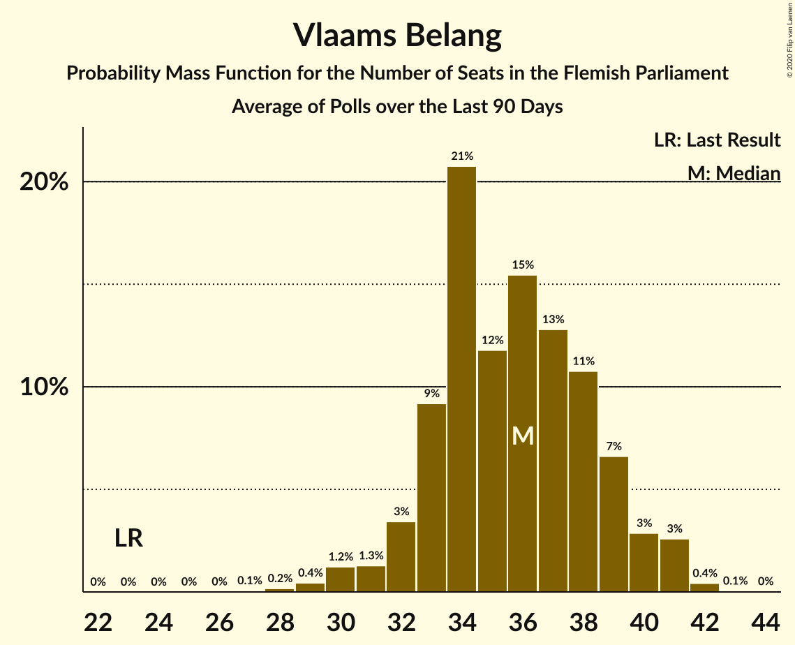

# Vlaams Belang

<a href="#voting-intentions">Voting Intentions</a> | <a href="#seats">Seats</a>

## Voting Intentions

Last result: **5.9%** (General Election of 25 May 2014)

### Confidence Intervals

| Period     | Polling firm/Commissioner(s) | Median | 80% Confidence Interval | 90% Confidence Interval | 95% Confidence Interval | 99% Confidence Interval |
|:----------:|:----------------:|:-----------:|:-----------------------:|:-----------------------:|:-----------------------:|:-----------------------:|
| N/A | [Poll Average](average.html) | 8.4% | 5.9–11.2% | 5.6–11.7% | 5.4–12.1% | 4.9–12.8% |
| [27 November–4 December 2017](2017-12-04-Ipsos.html) | Ipsos   RTL TVi–Le Soir–VTM–Het Laatste Nieuws | 10.4% | 9.2–11.7% | 8.9–12.1% | 8.6–12.4% | 8.1–13.1% |
| [11 September–5 October 2017](2017-10-05-TNS.html) | TNS   De Standaard–VRT–RTBf–La Libre Belgique | 6.5% | 5.6–7.6% | 5.4–7.9% | 5.2–8.2% | 4.8–8.7% |
| [25 August–3 September 2017](2017-09-03-Ipsos.html) | Ipsos   RTL TVi–Le Soir–VTM–Het Laatste Nieuws | 7.9% | 6.9–9.2% | 6.6–9.5% | 6.4–9.8% | 5.9–10.4% |
| [23–27 June 2017](2017-06-27-Dedicated.html) | Dedicated   MR | 11.7% | 10.2–13.5% | 9.8–14.0% | 9.4–14.4% | 8.7–15.3% |
| [27 March–11 April 2017](2017-04-11-TNS.html) | TNS   De Standaard–VRT | 7.8% | 6.8–8.9% | 6.5–9.3% | 6.3–9.6% | 5.8–10.2% |
| [16–20 March 2017](2017-03-20-Dedicated.html) | Dedicated   RTBf–La Libre Belgique | 11.9% | 10.5–13.5% | 10.1–14.0% | 9.8–14.4% | 9.2–15.2% |
| [10–17 January 2017](2017-01-17-Ipsos.html) | Ipsos   RTL TVi–Le Soir–VTM–Het Laatste Nieuws | 10.3% | 9.1–11.6% | 8.8–12.0% | 8.5–12.4% | 8.0–13.0% |
| [24–28 November 2016](2016-11-28-Dedicated.html) | Dedicated   RTBf–La Libre Belgique | 12.3% | 10.9–13.9% | 10.4–14.4% | 10.1–14.8% | 9.5–15.7% |
| [14 September–3 October 2016](2016-10-03-TNS.html) | TNS   De Standaard–VRT | 8.1% | 7.1–9.3% | 6.8–9.6% | 6.6–10.0% | 6.1–10.5% |
| [19–25 September 2016](2016-09-25-Ipsos.html) | Ipsos   RTL TVi–Le Soir–VTM–Het Laatste Nieuws | 12.0% | 10.8–13.4% | 10.4–13.8% | 10.1–14.2% | 9.5–14.9% |
| [2–6 September 2016](2016-09-06-Dedicated.html) | Dedicated   RTBf–La Libre Belgique | 13.1% | 11.6–14.8% | 11.2–15.3% | 10.9–15.7% | 10.2–16.5% |
| [6–12 May 2016](2016-05-12-Ipsos.html) | Ipsos   RTL TVi–Le Soir–VTM–Het Laatste Nieuws | 13.9% | 12.6–15.3% | 12.2–15.7% | 11.9–16.1% | 11.3–16.8% |
| [31 March–4 April 2016](2016-04-04-Dedicated.html) | Dedicated   RTBf–La Libre Belgique | 13.2% | 11.7–14.8% | 11.3–15.3% | 10.9–15.7% | 10.3–16.6% |
| [22 February–9 March 2016](2016-03-09-TNS.html) | TNS   De Standaard–VRT | 8.1% | 7.1–9.3% | 6.8–9.6% | 6.5–9.9% | 6.1–10.5% |
| [15–20 January 2016](2016-01-20-Ipsos.html) | Ipsos   RTL TVi–Le Soir–VTM–Het Laatste Nieuws | 11.6% | 10.4–13.0% | 10.1–13.4% | 9.8–13.7% | 9.3–14.4% |
| [3–7 December 2015](2015-12-07-Dedicated.html) | Dedicated   RTBf–La Libre Belgique | 11.9% | 10.7–13.3% | 10.3–13.7% | 10.0–14.1% | 9.5–14.8% |
| [28 September–4 October 2015](2015-10-04-Ipsos.html) | Ipsos   RTL TVi–Le Soir–VTM–Het Laatste Nieuws | 10.5% | 9.3–11.8% | 9.0–12.2% | 8.7–12.5% | 8.2–13.2% |
| [22 September–2 October 2015](2015-10-02-TNS.html) | TNS   De Standaard–VRT | 7.0% | 6.0–8.1% | 5.8–8.4% | 5.6–8.7% | 5.1–9.3% |
| [9–14 September 2015](2015-09-14-Dedicated.html) | Dedicated   RTBf–La Libre Belgique | 9.7% | 8.4–11.2% | 8.0–11.6% | 7.7–12.0% | 7.2–12.8% |
| [12–18 May 2015](2015-05-18-Dedicated.html) | Dedicated   RTBf–La Libre Belgique | 7.9% | 6.8–9.3% | 6.4–9.7% | 6.2–10.0% | 5.7–10.7% |
| [20 April–3 May 2015](2015-05-03-TNS.html) | TNS   De Standaard–VRT | 5.8% | 5.0–6.9% | 4.7–7.2% | 4.5–7.4% | 4.2–8.0% |
| [20–24 April 2015](2015-04-24-Ipsos.html) | Ipsos   RTL TVi–Le Soir–VTM–Het Laatste Nieuws | 8.0% | 7.0–9.2% | 6.7–9.6% | 6.4–9.9% | 6.0–10.5% |
| [5–9 March 2015](2015-03-09-Dedicated.html) | Dedicated   RTBf–La Libre Belgique | 7.4% | 6.2–8.8% | 5.9–9.2% | 5.7–9.6% | 5.2–10.3% |
| [23–28 January 2015](2015-01-28-Ipsos.html) | Ipsos   RTL TVi–Le Soir–VTM–Het Laatste Nieuws | 7.6% | 6.7–8.8% | 6.4–9.1% | 6.2–9.4% | 5.7–10.0% |
| [5–11 January 2015](2015-01-11-Ipsos.html) | Ipsos   RTL TVi–Le Soir–VTM–Het Laatste Nieuws | 6.8% | 5.9–7.9% | 5.6–8.2% | 5.4–8.5% | 5.0–9.1% |
| [4–5 December 2014](2014-12-05-AQRate.html) | AQ Rate   Het Laatste Nieuws | 6.0% | 5.1–7.3% | 4.8–7.6% | 4.6–7.9% | 4.2–8.6% |
| [27 November–1 December 2014](2014-12-01-Dedicated.html) | Dedicated   RTBf–La Libre Belgique | 5.7% | 4.8–6.9% | 4.5–7.3% | 4.3–7.6% | 3.9–8.2% |
| [9–10 October 2014](2014-10-10-AQRate.html) | AQ Rate   Het Laatste Nieuws | 8.0% | 6.9–9.4% | 6.6–9.7% | 6.3–10.1% | 5.8–10.8% |
| [22 September–3 October 2014](2014-10-03-TNS.html) | TNS   De Standaard–VRT | 6.5% | 5.6–7.5% | 5.3–7.9% | 5.1–8.1% | 4.7–8.7% |
| [5–9 September 2014](2014-09-09-Dedicated.html) | Dedicated   RTBf–La Libre Belgique | 5.6% | 4.6–6.8% | 4.4–7.1% | 4.2–7.4% | 3.8–8.0% |
| [1–31 July 2014](2014-07-31-AQRate.html) | AQ Rate   Het Laatste Nieuws | 5.8% | 4.9–6.9% | 4.6–7.3% | 4.4–7.5% | 4.0–8.1% |

### Probability Mass Function

The following table shows the probability mass function per percentage block of voting intentions for the [poll average](average.html) for Vlaams Belang.

| Voting Intentions | Probability | Accumulated | Special Marks |
|:-----------------:|:-----------:|:-----------:|:-------------:|
| 3.5–4.5% | 0.1% | 100% |  |
| 4.5–5.5% | 4% | 99.9% |  |
| 5.5–6.5% | 21% | 96% | Last Result |
| 6.5–7.5% | 20% | 75% |  |
| 7.5–8.5% | 6% | 55% | Median |
| 8.5–9.5% | 9% | 49% |  |
| 9.5–10.5% | 19% | 41% |  |
| 10.5–11.5% | 16% | 22% |  |
| 11.5–12.5% | 5% | 6% |  |
| 12.5–13.5% | 0.8% | 0.9% |  |
| 13.5–14.5% | 0.1% | 0.1% |  |
| 14.5–15.5% | 0% | 0% |  |

## Seats

Last result: **6** seats (General Election of 25 May 2014)

### Confidence Intervals

| Period     | Polling firm/Commissioner(s) | Median | 80% Confidence Interval | 90% Confidence Interval | 95% Confidence Interval | 99% Confidence Interval |
|:----------:|:----------------:|:------:|:-----------------------:|:-----------------------:|:-----------------------:|:-----------------------:|
| N/A | [Poll Average](average.html) | 8 | 5–14 | 4–15 | 4–16 | 3–17 |
| [27 November–4 December 2017](2017-12-04-Ipsos.html) | Ipsos   RTL TVi–Le Soir–VTM–Het Laatste Nieuws | 12 | 10–15 | 10–16 | 9–16 | 8–17 |
| [11 September–5 October 2017](2017-10-05-TNS.html) | TNS   De Standaard–VRT–RTBf–La Libre Belgique | 6 | 4–8 | 4–8 | 4–8 | 3–8 |
| [25 August–3 September 2017](2017-09-03-Ipsos.html) | Ipsos   RTL TVi–Le Soir–VTM–Het Laatste Nieuws | 8 | 7–10 | 6–11 | 6–11 | 6–12 |
| [23–27 June 2017](2017-06-27-Dedicated.html) | Dedicated   MR | 14 | 12–17 | 11–17 | 10–18 | 9–20 |
| [27 March–11 April 2017](2017-04-11-TNS.html) | TNS   De Standaard–VRT | 8 | 6–9 | 6–10 | 6–11 | 4–12 |
| [16–20 March 2017](2017-03-20-Dedicated.html) | Dedicated   RTBf–La Libre Belgique | 15 | 12–17 | 11–17 | 11–18 | 10–19 |
| [10–17 January 2017](2017-01-17-Ipsos.html) | Ipsos   RTL TVi–Le Soir–VTM–Het Laatste Nieuws | 12 | 10–15 | 9–16 | 8–16 | 8–17 |
| [24–28 November 2016](2016-11-28-Dedicated.html) | Dedicated   RTBf–La Libre Belgique | 16 | 13–18 | 12–18 | 12–19 | 11–20 |
| [14 September–3 October 2016](2016-10-03-TNS.html) | TNS   De Standaard–VRT | 8 | 8–11 | 7–11 | 6–11 | 6–12 |
| [19–25 September 2016](2016-09-25-Ipsos.html) | Ipsos   RTL TVi–Le Soir–VTM–Het Laatste Nieuws | 15 | 12–17 | 12–18 | 12–18 | 11–20 |
| [2–6 September 2016](2016-09-06-Dedicated.html) | Dedicated   RTBf–La Libre Belgique | 17 | 14–19 | 13–19 | 13–20 | 11–22 |
| [6–12 May 2016](2016-05-12-Ipsos.html) | Ipsos   RTL TVi–Le Soir–VTM–Het Laatste Nieuws | 18 | 16–20 | 16–20 | 15–21 | 13–22 |
| [31 March–4 April 2016](2016-04-04-Dedicated.html) | Dedicated   RTBf–La Libre Belgique | 16 | 14–19 | 13–19 | 13–20 | 12–22 |
| [22 February–9 March 2016](2016-03-09-TNS.html) | TNS   De Standaard–VRT | 8 | 8–10 | 6–11 | 6–11 | 6–12 |
| [15–20 January 2016](2016-01-20-Ipsos.html) | Ipsos   RTL TVi–Le Soir–VTM–Het Laatste Nieuws | 15 | 12–16 | 11–17 | 11–17 | 10–18 |
| [3–7 December 2015](2015-12-07-Dedicated.html) | Dedicated   RTBf–La Libre Belgique | 16 | 13–16 | 12–17 | 12–18 | 11–19 |
| [28 September–4 October 2015](2015-10-04-Ipsos.html) | Ipsos   RTL TVi–Le Soir–VTM–Het Laatste Nieuws | 12 | 11–16 | 10–16 | 9–16 | 8–17 |
| [22 September–2 October 2015](2015-10-02-TNS.html) | TNS   De Standaard–VRT | 8 | 6–8 | 4–8 | 4–8 | 3–11 |
| [9–14 September 2015](2015-09-14-Dedicated.html) | Dedicated   RTBf–La Libre Belgique | 11 | 8–13 | 8–14 | 8–15 | 8–16 |
| [12–18 May 2015](2015-05-18-Dedicated.html) | Dedicated   RTBf–La Libre Belgique | 8 | 7–11 | 6–11 | 6–12 | 4–13 |
| [20 April–3 May 2015](2015-05-03-TNS.html) | TNS   De Standaard–VRT | 4 | 3–7 | 3–8 | 2–8 | 0–8 |
| [20–24 April 2015](2015-04-24-Ipsos.html) | Ipsos   RTL TVi–Le Soir–VTM–Het Laatste Nieuws | 8 | 8–11 | 7–11 | 6–12 | 6–12 |
| [5–9 March 2015](2015-03-09-Dedicated.html) | Dedicated   RTBf–La Libre Belgique | 8 | 6–9 | 6–11 | 4–11 | 4–12 |
| [23–28 January 2015](2015-01-28-Ipsos.html) | Ipsos   RTL TVi–Le Soir–VTM–Het Laatste Nieuws | 8 | 6–8 | 6–10 | 6–11 | 4–11 |
| [5–11 January 2015](2015-01-11-Ipsos.html) | Ipsos   RTL TVi–Le Soir–VTM–Het Laatste Nieuws | 8 | 6–8 | 4–8 | 4–8 | 3–10 |
| [4–5 December 2014](2014-12-05-AQRate.html) | AQ Rate   Het Laatste Nieuws | 6 | 4–8 | 3–8 | 3–8 | 1–8 |
| [27 November–1 December 2014](2014-12-01-Dedicated.html) | Dedicated   RTBf–La Libre Belgique | 4 | 3–7 | 1–8 | 0–8 | 0–8 |
| [9–10 October 2014](2014-10-10-AQRate.html) | AQ Rate   Het Laatste Nieuws | 8 | 8–11 | 6–11 | 6–11 | 4–12 |
| [22 September–3 October 2014](2014-10-03-TNS.html) | TNS   De Standaard–VRT | 6 | 4–8 | 4–8 | 3–8 | 2–8 |
| [5–9 September 2014](2014-09-09-Dedicated.html) | Dedicated   RTBf–La Libre Belgique | 4 | 2–7 | 1–8 | 0–8 | 0–8 |
| [1–31 July 2014](2014-07-31-AQRate.html) | AQ Rate   Het Laatste Nieuws | 5 | 3–8 | 2–8 | 1–8 | 0–8 |

### Probability Mass Function

The following table shows the probability mass function per seat for the [poll average](average.html) for Vlaams Belang.

| Number of Seats | Probability | Accumulated | Special Marks |
|:---------------:|:-----------:|:-----------:|:-------------:|
| 1 | 0.1% | 100% |  |
| 2 | 0.1% | 99.9% |  |
| 3 | 0.6% | 99.8% |  |
| 4 | 9% | 99.2% |  |
| 5 | 2% | 90% |  |
| 6 | 21% | 88% | Last Result |
| 7 | 6% | 67% |  |
| 8 | 12% | 61% | Median |
| 9 | 1.4% | 49% |  |
| 10 | 4% | 48% |  |
| 11 | 9% | 44% |  |
| 12 | 14% | 36% |  |
| 13 | 8% | 21% |  |
| 14 | 7% | 13% |  |
| 15 | 2% | 6% |  |
| 16 | 3% | 5% |  |
| 17 | 1.2% | 1.2% |  |
| 18 | 0% | 0% |  |

