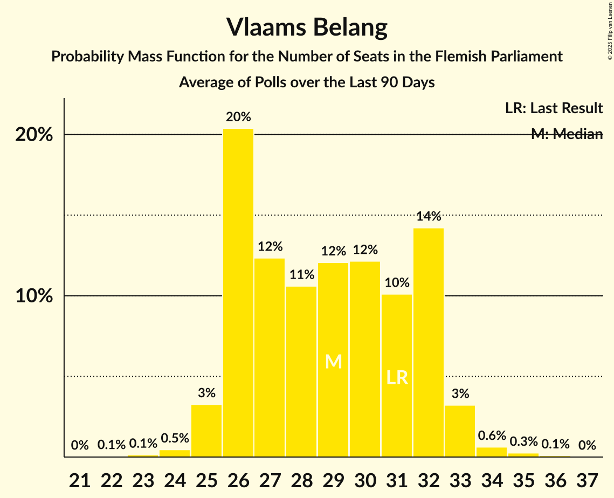

# Vlaams Belang

<a href="#voting-intentions">Voting Intentions</a> | <a href="#seats">Seats</a>

## Voting Intentions

Last result: **22.7%** (General Election of 9 June 2024)

### Confidence Intervals

| Period     | Polling firm/Commissioner(s) | Median | 80% Confidence Interval | 90% Confidence Interval | 95% Confidence Interval | 99% Confidence Interval |
|:----------:|:----------------:|:-----------:|:-----------------------:|:-----------------------:|:-----------------------:|:-----------------------:|
| N/A | [Poll Average](average.html) | 23.2% | 21.6–25.0% | 21.1–25.5% | 20.7–25.9% | 19.9–26.8% |
| [11–17 September 2024](2024-09-17-Ipsos.html) | Ipsos   Het Laatste Nieuws, Le Soir, RTL TVi and VTM | 23.2% | 21.6–25.0% | 21.1–25.5% | 20.7–25.9% | 19.9–26.8% |

### Probability Mass Function

The following table shows the probability mass function per percentage block of voting intentions for the [poll average](average.html) for Vlaams Belang.

| Voting Intentions | Probability | Accumulated | Special Marks |
|:-----------------:|:-----------:|:-----------:|:-------------:|
| 17.5–18.5% | 0% | 100% |  |
| 18.5–19.5% | 0.2% | 100% |  |
| 19.5–20.5% | 2% | 99.8% |  |
| 20.5–21.5% | 8% | 98% |  |
| 21.5–22.5% | 20% | 90% |  |
| 22.5–23.5% | 29% | 70% | Last Result, Median |
| 23.5–24.5% | 24% | 41% |  |
| 24.5–25.5% | 12% | 16% |  |
| 25.5–26.5% | 4% | 5% |  |
| 26.5–27.5% | 0.7% | 0.8% |  |
| 27.5–28.5% | 0.1% | 0.1% |  |
| 28.5–29.5% | 0% | 0% |  |

## Seats

Last result: **31** seats (General Election of 9 June 2024)

### Confidence Intervals

| Period     | Polling firm/Commissioner(s) | Median | 80% Confidence Interval | 90% Confidence Interval | 95% Confidence Interval | 99% Confidence Interval |
|:----------:|:----------------:|:------:|:-----------------------:|:-----------------------:|:-----------------------:|:-----------------------:|
| N/A | [Poll Average](average.html) | 31 | 28–33 | 27–34 | 27–35 | 25–36 |
| [11–17 September 2024](2024-09-17-Ipsos.html) | Ipsos   Het Laatste Nieuws, Le Soir, RTL TVi and VTM | 31 | 28–33 | 27–34 | 27–35 | 25–36 |

### Probability Mass Function

The following table shows the probability mass function per seat for the [poll average](average.html) for Vlaams Belang.

| Number of Seats | Probability | Accumulated | Special Marks |
|:---------------:|:-----------:|:-----------:|:-------------:|
| 24 | 0.1% | 100% |  |
| 25 | 0.6% | 99.9% |  |
| 26 | 2% | 99.3% |  |
| 27 | 3% | 98% |  |
| 28 | 6% | 95% |  |
| 29 | 13% | 89% |  |
| 30 | 16% | 76% |  |
| 31 | 23% | 60% | Last Result, Median |
| 32 | 20% | 37% |  |
| 33 | 8% | 17% |  |
| 34 | 5% | 9% |  |
| 35 | 3% | 4% |  |
| 36 | 1.1% | 1.5% |  |
| 37 | 0.3% | 0.4% |  |
| 38 | 0.1% | 0.1% |  |
| 39 | 0% | 0% |  |

